# Arduino

## Raspberry Pi Pico和Arduino IDE

### 第1小节 Raspberry Pi Pico简介

2021年1月底的时候，树莓派基金会发布了一个重磅消息，推出了进军微控制器领域的树莓派Pico。功能强劲，价格便宜的特性让Pico受到了全世界创客们的关注，下面就来给大家介绍一下Pico这个小玩意儿。

Pico是一块小小的板子，大小和Arduino Nano差不多，为21mm × 51mm。

Raspberry Pi Pico是具有灵活数字接口的低成本高性能微控制器板。它集成了Raspberry Pi自己的RP2040微控制器芯片，运行速度高达133 MHz的双核Arm Cortex M0
+处理器，嵌入式264KB SRAM和2MB板载闪存以及26个多功能GPIO引脚。对于软件开发，可以使用Raspberry Pi的C/C++SDK或MicroPython，这个教程中我们使用MicroPython。

裸板不带针脚，需要自己焊。这是一块做工精良的电路板，也可以作为SMD元件，直接焊接到印刷电路板上。

板上最主要的功能是一端的microUSB连接器。它既用于通信，也用于给Pico供电。

在microUSB连接器旁边安装了一个板载LED，它内部连接到GPIO针脚25，这是整个Pico板上唯一的LED。

开机按钮安装在离LED稍低一点的地方，它可以让你改变Pico的启动模式，这样你就可以在上面加载MicroPython，进行拖拽式编程。

在板子的底部，你会看到三个连接点，这些连接点是用于串行Debug选项的，我们今天是入门，暂时不探讨这个问题，高级开发者会比较感兴趣。

在板子的中央是整个板子的“大脑”——RP2040 MCU，RP2040能够支持高达16MB的片外闪存，不过在Pico中只有4MB。

– 双核32位ARM Cortex -M0+处理器  
– 运行在48MHz，但可以超频到133MHz。  
– 30个GPIO引脚(26个暴露)  
– 可支持USB主机或设备模式  
– 8 可编程I/O（PIO）状态机

Pico是一个3.3V的逻辑器件，但由于内置了电压转换器和稳压器，它可以用一系列电源供电。

GND–––地线，8个地线加上3针Debug连接器上的一个附加地线，是方形的，而不是像其他连接的圆形。

VBUS–––这是来自 microUSB 总线的电源，5 V。如果Pico不是由microUSB连接器供电，那么这里将没有输出。  
VSYS–––这是输入电压，范围为 2 至 5 V。板载电压转换器将为 Pico
将其改为 3.3 V。  
3V3–––这是 Pico 内部调节器的 3.3 伏输出。只要将负载保持在 300ma
以下，它就可用于为其他组件供电。

3V3_EN–––你可以使用此输入禁用 Pico 的内部电压调节器，从而关闭 Pico
和由其供电的任何组件。  
RUN–––可以启用或禁用 RP2040 微控制器，也可以将其复位。

树莓派
Pico板上有26个裸露的GPIO连接，它们的排列顺序很好，在GP22和GP26之间有“空隙”（这些“缺失”的引脚在内部使用）。这些引脚都有多种功能，你可以为PWM配置多达16个引脚。有两个I2C总线，两个UART和两个SPI总线，这些可以配置使用多种GPIO引脚。

Pico有三个模数转换器分别为ADC0-GP26、ADC1-GP27、ADC2-GP28还有一个内部用于板载温度传感器的转换器ADC-VREF。注意：ADC的分辨率为12位。但MicroPython把范围映射到16位，也就是从0到65535，微处理器的工作电压是3.3V，也就是说0对应着0V，65535对应着3.3V。

你也可以在ADC_VREF引脚上提供一个外部精密电压参考。其中一个接地点，即33脚上的ADC_GND被用作该参考点的接地点。

|树莓派 PICO配置|
|-|
|双核 Arm Cortex-M0 + @ 133MHz|
|2 个 UART、2 个 SPI 控制器和 2 个 I2C 控制器|
|芯片内置 264KB SRAM 和 2MB 的板载闪存|
|16 个 PWM 通道|
|通过专用 QSPI 总线支持最高 16MB 的片外闪存|
|USB 1.1 主机和设备支持|
|DMA 控制器|
|8 个树莓派可编程 I/O（PIO）状态机，用于自定义外围设备支持|
|30 个 GPIO 引脚，其中 4 个可用作模拟输入|
|支持 UF2 的 USB 大容量存储启动模式，用于拖放式编程|

完整引脚图：

树莓派也在官网发布了一大堆技术文档，还有一本名为《Get Started with MicroPython on Raspberry Pi Pico》的说明书。它有纸质版，也有PDF版下载。

更多详情请了解树莓派官方网站：

https://www.raspberrypi.com/products/raspberry-pi-pico/

### 第2小节 Arduino IDE下载方法

我们先到arduino
官方的网站<https://www.arduino.cc/>下载最新版本的arduino开发软件,进入网站之后点击界面上的SOFTWARE,选择DOWNLOADS进入下载页面，如下图：

Arduino 软件有很多版本，有wodows,mac linux系统的（如下图），而且还有过去老的版本，你只需要下载一个适合系统的版本。

这里我们以WINDOWS系统的为例给大家介绍一下下载和安装的步骤。

WINDOWS系统的也有两个版本，一个版本是安装版的，一个是下载版的不用安装，直接下载文件到电脑，解压缩就可以用了。

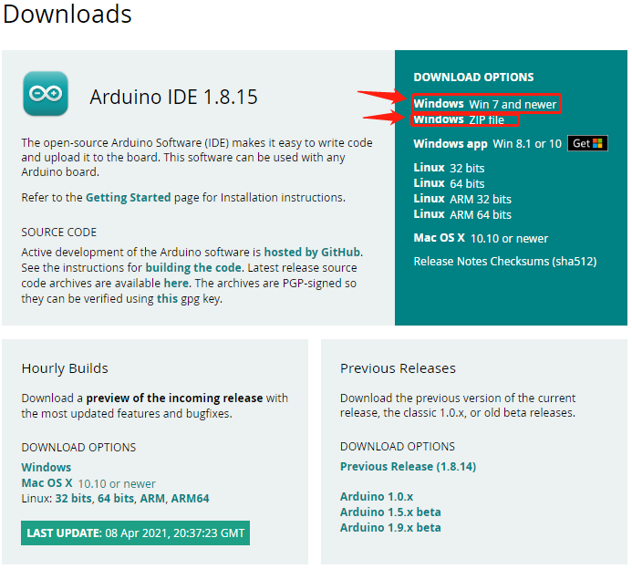

两个版本都可以正常使用，看你自己的喜好了。选择一个版本，然后将Arduino
开发软件下载到我们的电脑。

一般情况下，我们点击JUST DOWNLOAD就可以下载了，当然如果你愿意，你可以选择小小的赞助，以帮助伟大的ARDUINO开源事业。

### 第3小节 Arduino IDE设置和工具栏介绍

我们下面了解Arduino开发软件的使用了，首先我们点击电脑桌面上的图标，打开Arduino IDE。

我们的程序上传到板之前，我们必须演示Arduino IDE工具栏中出现的每个符号的功能。

A - 用于检查是否存在任何编译错误。

B - 用于将程序上传到Arduino板。

C - 用于创建新草图的快捷方式。

D - 用于直接打开示例草图之一。

E - 用于保存草图。

F - 用于从板接收串行数据并将串行数据发送到板的串行监视器。

设置pico环境：(相关资讯：https://github.com/earlephilhower/arduino-pico)

首先选择(File) → (Preferences)

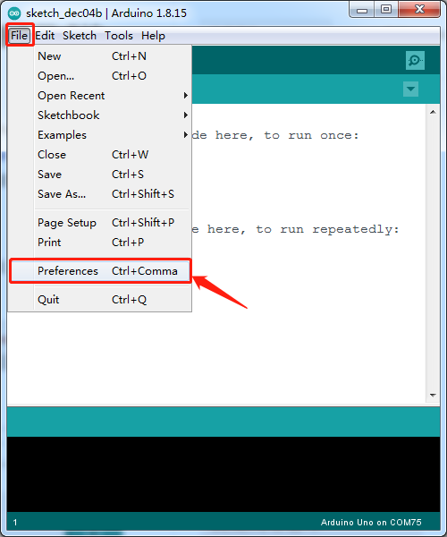

在「Additional Boards Manager URLs」输入以下这行URL：

<https://github.com/earlephilhower/arduino-pico/releases/download/global/package_rp2040_index.json>

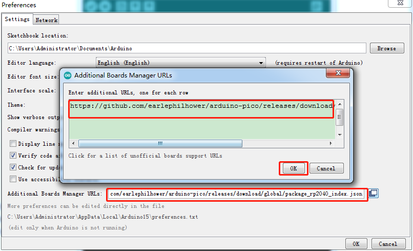

然后点击OK

回到主页面，选择(Tools)→ (Board) → (Board Manager)

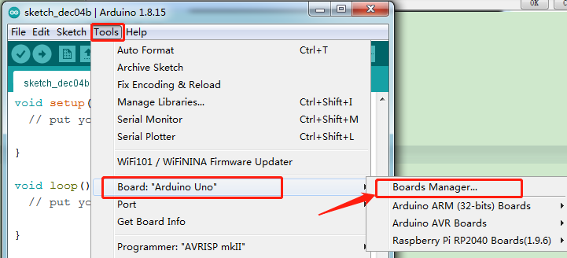

在搜索的地方輸入pico，出现如下图的画面，再点击(Install)进行安装。

我的IDE这里已经安装好了。

等待安裝完成后，回到主界面选择(Tools)→ (Board) → Raspberry Pi RP2040 Boards(1.9.6) → Raspberry Pi Pico。

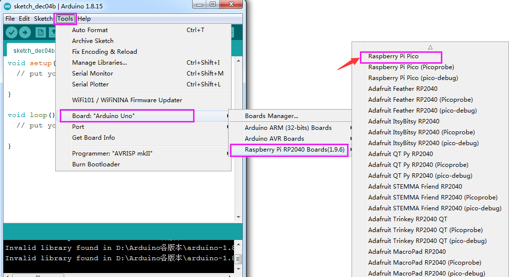

选择好开发板后，再选择 Pico 连接的 Port。这样就完成环境的设定了。

下面我们就用内部的示例代码让板载LED灯呈现明暗的变化：

选择(File)→ (Examples)→ rp2040→ Fade。

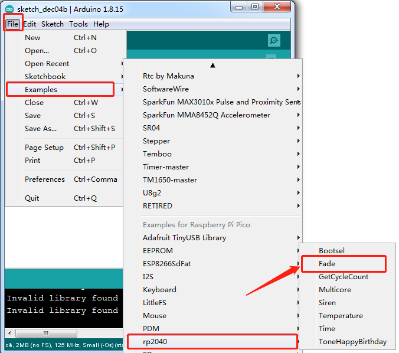

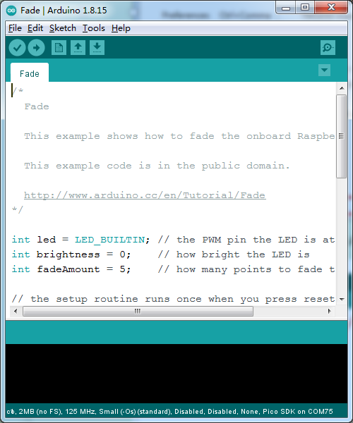

打开示例代码后，编译前，要特別注意操作的顺序：   (1) 先断开 Pi Pico USB电源   (2) 按住开发板上白色 BOOTSEL 按鍵，然后插上USB电源   (3) 点击Arduino IDE下的上传，进行编译并上传开发板   (4) 等到编译“Compiling sketch...”，下面提示信息出现上传中“Uploading...”，再松开BOOTSEL按键   (5) 等待至上传完毕“Done uploading.”才算完成  
第一次上传过程中一定要注意这个顺序，不然则导致上传失败，后面上传选择对应的port直接点击上传即可。上传完成后，就可以看到开发板上的LED从暗到亮、又从亮到暗，一直重复，有点像是LED在呼吸，我们在后面课程中会详细讲到。

### 第4小节 库文件的添加

首先找到arduino库文件夹：

然后把所要用到的库文件复制在这个文件夹下就行了。

### 第5小节 Keyes raspberry pico IO 扩展板

1.概述

Keyes raspberry pico IO 扩展板是专为Raspberry Pi Pico开发的扩展板，无需焊接，全引脚引出。为方便接线，扩展板上接口都带有丝印。3pin接口丝印一般为G V
S，其中扩展板上所有的G代表GND，V代表VCC（3.3V）接口，S代表接口上方的数字口/模拟口。4pin/6pin接口左面都有对应接口丝印。扩展板上自带间距为2.54mm的排母接口，接线顺序和Pico板的排母接口的线序一致。同时扩展板上自带一个复位按键，1个电源指示灯PWR。同时扩展板自带4个标准乐高定位孔。

该扩展板提供各种通信接口包括2 x I2C、2 x UART、2 x SPI、3 x 模拟IO和13 x
数字IO，并提供6.5-12V的电源接口为原型开发提供最简单的连接方式。

2.规格参数：

输出电流：≦500mA

DC输入电压：6.5 - 12V

输出电压：DC3.3V\5V

推荐环境温度：-10°C ~ 50°C

产品尺寸：45.339MM \*83.617MM

排针间距：2.54mm

3.原理图

4.接口说明

5.使用方法

将Raspberry Pi Pico堆叠在扩展板上即可使用，如下图

## 单个传感器/模块实验课程

拿到套件后，我们可以看到套件中有24款传感器，有对应的Raspberry Pi Pico板、Raspberry Pi Pico扩展板和连接线。这里，我们将24款传感器利用我们套件中的连接线，单独连接在Raspberry Pi Pico板和Raspberry Pi Pico扩展板。然后运行对应的测试代码，单独测试各个传感器的功能。我们下面的课程是先从简单到复杂学习单个模块/传感器的原理，后面再学习一些传感器的扩展应用以巩固加深我们对该套件的理解。

特别注意：实验种模块/传感器连接线材时，必须按照资料里的接线方法及位置，电源与信号引脚不能错接，否则可能会没有实验现象或损坏模块/传感器。

### 实验一 点亮LED

实验说明

在我们前面的准备工作中，知道我们Pico板上有个板载LED，而且我们已经知道这个LED是连接在Pico的GP25的，我们还让这个LED明暗变化了。下面我们就用同样的方法点亮一个外接的LED模块。

在这个套件中，我们有一个Keyes DIY电子积木
白色LED模块。它的控制方法非常简单，要想点亮LED，只要让它两端有一定的电压就可以。

实验中，我们通过编程控制信号端S的高低电平，从而控制LED的亮灭。我们提供两个测试代码，分别控制LED模块上实现点亮和闪烁的效果。

实验原理

下面附了两个电路原理图，左边我们直接把LED串联一个电阻，负极接地，正极接到单片机的IO口，理论上来说当我们把信号端S输出高电平(3.3V)，LED两端就会有电压，LED就会被点亮，那么我们为什么说这么接不合理呢？原因就是我们Pico IO口输出电流的能力有限(最大12mA)，虽然输出了高电平，但是可能达不到控制LED的电流，此时LED可能比较暗。

右边的接法：控制时，GND和VCC上电后，如果信号端S为高电平，那么三极管Q1就会导通，则LED有电流流过，LED即会亮起(注意：此时电流是由VCC电源端流经LED和电阻R3到GND，而不是直接从单片机IO口输出，此时输出电流的能力就比较强)，S端为低电平时三极管Q1截止，那么就没有电流流过LED，那么LED就会熄灭。也就是说，我们这里的三极管Q1相当于一个开关作用，而电阻R1,R3都是一个限流电阻，顾名思义就是限制电流的大小，以免烧坏电子元器件。

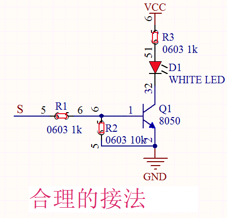

实验器材

|||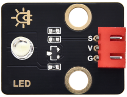|||
|-|-|-|-|-|
|Raspberry Pi Pico板*1|Raspberry Pi Pico扩展板*1|Keyes DIY电子积木 白色LED模块*1|防反插3Pin*1|MicroUSB线*1|

接线图

测试代码

代码1：

/\*

\* Keyes Starter Kit for Raspberry Pi Pico

\* lesson 1.1

\* LED

\*/

void setup() {

pinMode(0, OUTPUT);//设置GP0引脚模式为输出

digitalWrite(0, HIGH); //输出高电平，点亮

}

void loop() {

}

代码2：

/\*

\* Keyes Starter Kit for Raspberry Pi Pico

\* lesson 1.2

\* Blink

\*/

int ledPin = 0; //定义LED管脚接GP0

void setup() {

pinMode(ledPin, OUTPUT);//设置模式为输出

}

void loop() {

digitalWrite(ledPin, HIGH); //输出高电平，点亮

delay(1000);//延迟1000毫秒

digitalWrite(ledPin, LOW); //输出低电平，熄灭

delay(1000);//延迟1000毫秒

}

代码说明

代码1说明：

1.  pinMode(pin,mode)；pin是用于设置模式的pico     GPIO引脚号；mode为模式，可选：输入模式INPUT，输出模式OUTPUT或输入上拉INPUT_PULLUP，在这里我们设置了管脚0为输出模式。

2.  digitalWrite(pin,     value)；pin是单片机GPIO管脚，在这里我们定义了GP0；value是你将要输出的数字电平（HIGH/LOW）；如果使用pinMode()将引脚配置为OUTPUT，则其电压将设置为相应的值：3.3V为HIGH，低电平为0V（接地）。如果没有把pinMode()设置为OUTPUT，而是将LED连接到引脚，则在调用digitalWrite（HIGH）时，LED可能会变暗。因为此时digitalWrite()将启用内部上拉电阻，其作用类似于一个大限流电阻。

    代码2说明：

1.  Setup()中代码是只执行一次，而loop()函数里面的代码是一直循环执行。delay(ms)；延时函数，ms为暂停的毫秒数，数据类型：unsigned     long（范围 0~ 4,294,967,295 (2^32 - 1)）。

2.  通过整合前面知识。我们再来看代码就清楚明了了，代码中第一条我们把模块信号端接到ledpin也就是GP0，设置为高电平，就是点亮模块上LED；第二条延迟1000毫秒，就是让模块上LED点亮1秒。同样第三条第四条代码表示让模块上LED熄灭1秒。代码默认循环，也就是控制模块上LED，循环亮1秒，灭1秒，实现闪烁效果。通过代码设置，我们可以更改模块上LED亮灭的延迟时间，从而使模块上LED实现不同的闪烁效果。

3.  更多arduino语法解释与详情请了解官网https://www.arduino.cc/reference/en/

测试结果

代码一：运行代码一成功后，模块上白色LED点亮

代码二：运行代码二成功后，白色LED亮1秒灭一秒，循环交替闪烁。

### 实验二 交通灯模块

实验说明

我想大家都看见过交通灯，就是马路上十字路口的红绿灯。如果您开过车，我想您一定仔细观察过交通灯，如果您还没有驾驶过车，您是否仔细观察过交通灯呢？在我们这个套件中，就包含一个交通灯模块。我们经常会用红绿黄3个LED外接电路来模拟路边的红绿黄灯闪烁。因此我们特别设计了这款模块，模块上自带了红黄绿3个LED灯，我们这个实验就做一个模拟交通灯。

实验原理

前面第一课我们就学习了如何控制一个LED，由原理图容易得知，控制这个模块就好比分别控制3个独立的LED灯，给对应颜色灯高电平就亮起对应的颜色。比如，我们给信号“R”输出高电平，也就是3.3V，则红色LED点亮。

实验器材

|||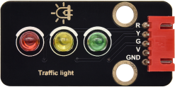|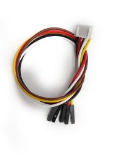||
|-|-|-|-|-|
|Raspberry Pi Pico板*1|Raspberry Pi Pico扩展板*1|keyes DIY电子积木 交通灯模块*1|防反插5Pin*1|MicroUSB线*1|

接线图

测试代码

/\*

\* Keyes Starter Kit for Raspberry Pi Pico

\* lesson 2

\* Traffic_Light

\*/

int greenPin = 12; //绿色LED接GP12

int yellowPin = 13; //黄色LED接GP13

int redPin = 14; //红色LED接GP14

void setup() {

//LED接口都设置为输出模式

pinMode(greenPin, OUTPUT);

pinMode(yellowPin, OUTPUT);

pinMode(redPin, OUTPUT);

}

void loop() {

digitalWrite(greenPin, HIGH); //点亮绿色LED

delay(5000); //延时5秒

digitalWrite(greenPin, LOW); //关闭绿色LED

for (int i = 1; i \<= 3; i = i + 1) { //运行三次

digitalWrite(yellowPin, HIGH); //点亮黄色LED

delay(500); //延时0.5秒

digitalWrite(yellowPin, LOW); //关闭黄色LED

delay(500); //延时0.5秒

}

digitalWrite(redPin, HIGH); //点亮红色LED

delay(5000); //延时5s

digitalWrite(redPin, LOW); //关闭红色LED

}

代码说明

1.  定义管脚接口，设置引脚模式，延时函数，输出高低电平参考实验一说明，这里就不多说了。

2.  这里我们还用到了for()循环：最简单形式为for( ; ;
    )，我们在此实验中用到for (int i = 1; i \<= 3; i = i +
    1)；表示变量i从1到3，每次自加1，知道不满足 i \<=
    3这个判断表达式，否则一直执行大括号里的代码，即一共执行3次大括号里的代码；同理：如果是for     (int i = 255; i \>= 0; i = i - 1)；i每次自减1，当不满足i\>=
    0时，跳出该for()循环，一共执行256次。

测试结果

上传测试代码成功，上电后，模块上绿色LED亮5秒然后熄灭，黄色LED闪烁3秒然后熄灭，再然后红色LED亮5秒，然后熄灭，模块上3个LED自动模拟交通灯循环运行。

### 实验三 按键传感器检测实验

实验说明

在这个套件中，有一个Keyes DIY电子积木
单路按键模块，它主要采用1个轻触开关，自带1个黄色按键帽。前面我们学习了怎么让我们单片机的引脚输出一个高电平或者低电平，这节实验我们就来学习怎么读取引脚是高电平（3.3V）还是低电平（0V）。

实验中，我们通过读取传感器上S端高低电平，判断传感器上按键是否按下；并且，我们在串口监视器上显示测试结果。

实验原理

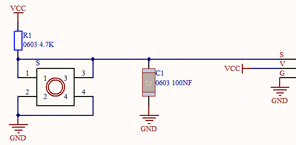附原理图，按键有四个引脚，其中1和3是相连的，2和4是相连的，在我们未按下按键时，13与24是断开的，信号端S读取的是被4.7K的上拉电阻R1所拉高的高电平，而当我们按下按键时，13和24连通。信号端S连接到了GND，此时读取到的电平为低电平，即按下按键，传感器信号端为低电平；松开按键时，信号端为高电平。

实验器材

||||||
|-|-|-|-|-|
|Raspberry Pi Pico板*1|Raspberry Pi Pico扩展板*1|keyes DIY电子积木 单路按键模块*1|防反插3Pin*1|MicroUSB线*1|

接线图

测试代码

/\*

\* Keyes Starter Kit for Raspberry Pi Pico

\* lesson 3

\* button

\*/

int val = 0; //用来存放按键值

int button = 15; //按键的管脚接GP15

void setup() {

Serial.begin(9600); //启动串口监视器并设置波特率为9600

pinMode(button, INPUT); //设置按键管脚为输入模式

}

void loop() {

val = digitalRead(button); //读取按键的值并赋给变量val

Serial.print(val); //串口上打印出来

if (val == 0) { //按下按键则读取到低电平，打印按下相关信息

Serial.print(" ");

Serial.println("Press the botton");

delay(100);

}

else { //打印松开按键相关信息

Serial.print(" ");

Serial.println("Loosen the botton");

delay(100);

}

}

代码说明

1.  pinMode(button, INPUT);
    由前面学过的知识我们知道，在这里我们定义按键管脚为GP15，设置为输入模式。通过pinMode()配置为INPUT必须使用上拉或下拉电阻（我们的模块已经使用上拉电阻R1）。该电阻的目的是在开关断开时将引脚拉至已知状态。通常选择一个4.7K/10     K欧姆的电阻，因为它的阻值足够低，可以可靠地防止输入悬空，同时，该阻值也要足够高，以使开关闭合时不会消耗太多电流。如果使用下拉电阻，则当开关断开时，输入引脚将为低电平；当开关闭合时，输入引脚将为高电平。如果使用上拉电阻，则当开关断开时，输入引脚将为高电平；当开关闭合时，输入引脚将为低电平。

    2\. Serial.begin(9600)；初始化串口通信，并设置波特率为9600.

    3\.     digitalRead(button)；读取按键的数字电平，高HIGH或者低LOW。如果该引脚未连接任何东西，则digitalRead()可以返回HIGH或LOW（并且可以随机更改）。

4\. if..else..语句：当if后面()的逻辑判断为真时，执行大括号里的代码；否则执行else后面{}里的代码。

5\.
代码逻辑是传感器感应到按键按下时，信号端为低电平，GP15为低电平，即val为

0。这时我们在串口监视器显示对应的数字值和字符；否则（传感器感应到按键松开时），val为1，窗口监视器显示1和另外的字符。

测试结果

上传测试代码成功，利用USB线上电后，打开串口监视器，设置波特率为9600。串口监视器显示对应数据和字符。实验中，当传感器按下按键时，val为0，串口监视器显示“Press the button”字符；松开按键时，val为1，串口监视器显示“Loosen the button”字符，如下图。

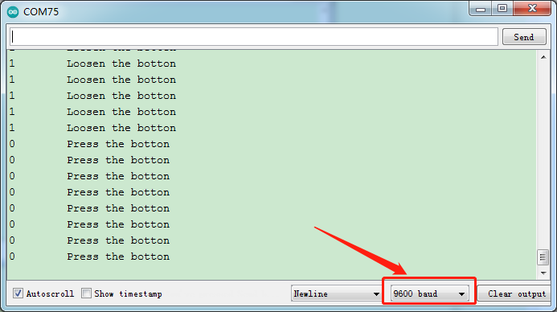

### 实验四 避障传感器检测障碍物

实验说明

在这个套件中，有一个Keyes DIY电子积木
避障传感器，它主要采用一对红外线发射与接收管元件。实验中，我们通过读取传感器上S端高低电平，判断是否存在障碍物；并且，我们在串口监视器上显示测试结果。

实验原理

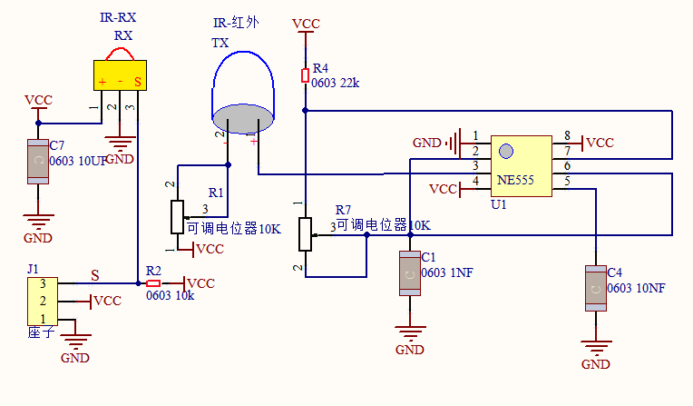原理就是发射管TX发射出一定频率的红外信号，红外信号会随着传送距离的加大逐渐衰减，如果遇到障碍物，就会形成红外反射。当检测方向RX遇到反射回来的信号比较弱时，接收检测引脚输出高电平，说明障碍物比较远；当反射回来的信号比较强，接收检测引脚输出低电平，说明障碍物比较近了，接收检测引脚输出低电平，此时指示灯亮起。传感器上有两个电位器，一个用于调节发送功率，一个用于调节接收频率，通过调节2个电位器，我们可以调节它的有效距离。

实验器材

||||||
|-|-|-|-|-|
|Raspberry Pi Pico板*1|Raspberry Pi Pico扩展板*1|keyes DIY电子积木 避障传感器*1|防反插3Pin*1|MicroUSB线*1|

接线图

测试代码

/\*

\* Keyes Starter Kit for Raspberry Pi Pico

\* lesson 4

\* obstacle avoidance sensor

\*/

int val = 0;

void setup() {

Serial.begin(9600);//设置波特率为9600

pinMode(16, INPUT);//设置引脚GP16为输入模式

}

void loop() {

val = digitalRead(16);//读取数字电平

Serial.print(val);//打印读取的电平信号

if (val == 0) {//检测到障碍物

Serial.print(" ");

Serial.println("There are obstacles");

delay(100);

}

else {//没检测到障碍物

Serial.print(" ");

Serial.println("All going well");

delay(100);

}

}

代码说明

我们这里只使用一款传感器，所以没有定义管脚名称变量了，直接使用引脚“16”，其它设置方法和实验三类似，这里就不多做介绍了。

特别注意

烧录好测试代码，按照接线图连接好线，上电后，我们开始调节两个电位器调节感应距

离。

1.调节发射功率调节电位器，先将电位器顺时针到尽头，然后回调一些，使传感器上

P LED介于不亮与亮之间的零界点。

2.调节接收频率调节电位器，顺时针调节时，频率增大。调节使它产生38KHz频率的方波，调节时，也观察传感器上S LED，使它介于不亮与亮之间的零界点。

测试结果

上传测试代码成功，利用USB线上电后，打开串口监视器，设置波特率为9600。串口监视器显示对应数据和字符。实验中，当传感器检测到障碍物时，val为0，串口监视器显示“There are obstacles”字符；没有检测到障碍物时，val为1，串口监视器显示“All going well”字符，如下图。

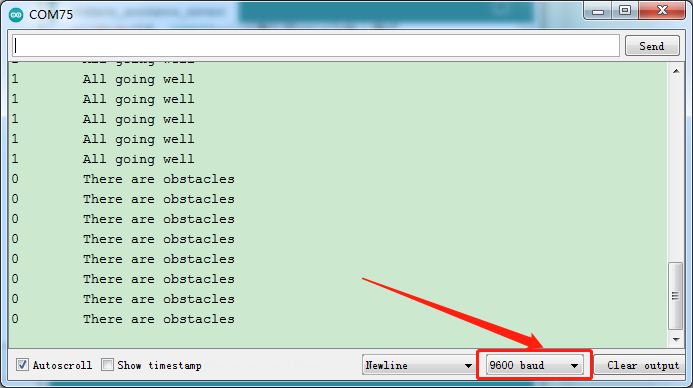

### 实验五 倾斜模块的原理

实验说明

在这个套件中，有一个Keyes DIY电子积木
倾斜传感器，倾斜开关可以依据模块是否倾斜而输出不同电平信号。其内部带有一颗滚珠，因此可以监测倾斜情况。当开关高于水平位置倾斜时开关导通，低于水平位置时开关断开。倾斜模块可用于倾斜检测、报警器制作或者其他检测。

实验中我们用串口监视器打印出信号端检测到的数字电平信号。

实验原理

它的原理非常简单，附原理图，主要是利用滚珠在开关内随不同倾斜角度的发化使滚珠开关P1的引脚1和2导通或者不导通，当1和2导通时，因为1教接GND，所以信号端S为低电平，此时红色LED形成回路，将会点亮；当1和2不导通时，引脚2被4.7K的上拉电阻R1拉高而使信号端S为高电平，模块上的LED将熄灭。

实验器材

||||||
|-|-|-|-|-|
|Raspberry Pi Pico板*1|Raspberry Pi Pico扩展板*1|keyes DIY电子积木 倾斜传感器*1|防反插3Pin*1|MicroUSB线*1|

接线图

测试代码

/\*

\* Keyes Starter Kit for Raspberry Pi Pico

\* lesson 5

\* Tilt switch

\*/

int val; //存放倾斜传感器输出的电平值

void setup() {

Serial.begin(9600);

pinMode(17, INPUT); //倾斜传感器管脚接GP17，设置GP17为输入模式

}

void loop() {

val = digitalRead(17); //读取模块的电平信号

Serial.println(val); //换行打印出来

delay(100); //延时100毫秒

}

代码说明

代码设置与实验三相同，详情请看代码注释与实验三代码说明。

测试结果

上传测试代码成功，利用USB线上电后，打开串口监视器，设置波特率为9600。将倾斜模块倾斜一边，
模块上的红色LED不亮，串口监视器打印数字电平信号“1”；将倾斜模块倾斜另一边，
模块上的红色LED点亮，串口监视器打印数字电平信号“0”。

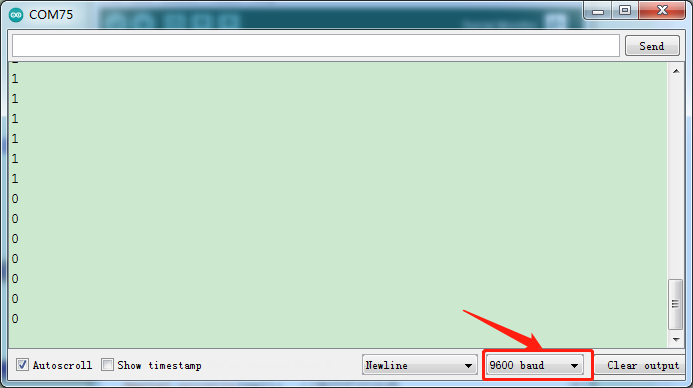

### 实验六 干簧管检测附近磁场

实验说明

在这个套件中，有一个Keyes DIY电子积木 干簧管模块，它主要采用MKA10110
绿色磁簧元件元件。簧管是干式舌簧管的简称，是一种有触点的无源电子开关元件，具有结构简单，体积小便于控制等优点。它的外壳是一根密封的玻璃管，管中装有两个铁质的弹性簧片电板，还灌有一种惰性气体，干簧管传感器用于检测附近有无磁场。

实验中，我们通过读取模块上S端高低电平，判断模块附近是否存在磁场；并且，我们在串口监视器上显示测试结果。

实验原理

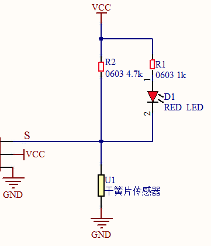平时状态下，玻璃管中的两个由特殊材料制成的簧片是分开的，此时信号端S被R2拉为高电平，LED熄灭。当有磁性物质靠近玻璃管时，在磁场磁力线的作用下，管内的两个簧片被磁化而互相吸引接触，簧片就会吸合在一起，使结点所接的电路连通，即信号端S连通GND，此时LED点亮。外磁力消失后，两个簧片由于本身的弹性而分开，线路也就断开了。该传感器就是利用元件这一特性，搭建电路将磁场信号转换为高低电平变换信号。

实验器材

<table >

|||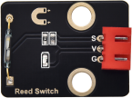|||
|-|-|-|-|-|
|Raspberry Pi Pico板*1|Raspberry Pi Pico扩展板*1|keyes DIY电子积木 干簧管模块*1|防反插3Pin*1|MicroUSB线*1|

接线图

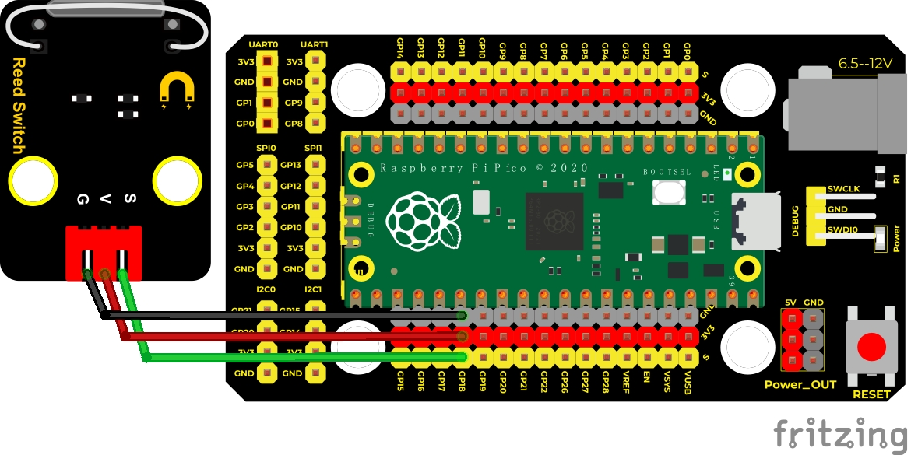

测试代码

/\*

\* Keyes Starter Kit for Raspberry Pi Pico

\* lesson 6

\* Reed Switch

\*/

int val = 0;

int reedPin = 18; //定义干簧管模块信号管脚接GP18

void setup() {

Serial.begin(9600);//设置波特率为9600

pinMode(reedPin, INPUT);//设置模式为输入

}

void loop() {

val = digitalRead(reedPin);//读取数字电平

Serial.print(val);//串口显示出来

if (val == 0) {//附近存在磁场

Serial.print(" ");

Serial.println("A magnetic field");

delay(100);

}

else {//无磁场

Serial.print(" ");

Serial.println("There is no magnetic field");

delay(100);

}

}

代码说明

设置方法和前面实验类似，需要区分的是，这里是检测磁场。

测试结果

上传测试代码成功，利用USB线上电后，打开串口监视器，设置波特率为9600。串口监视器显示对应数据和字符。实验中，当传感器检测到磁场时，val为0且模块红色LED点亮，串口监视器显示“A magnetic field”字符；没有检测到磁场时，val为1，模块上LED熄灭，串口监视器显示“There is no magnetic field”字符，如下图。

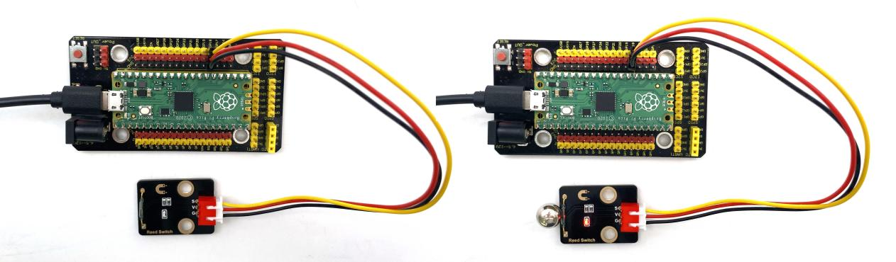

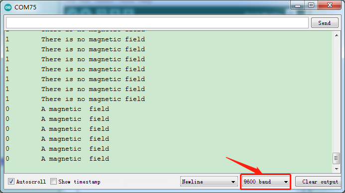

### 实验七 附近有人吗

实验说明

在这个套件中，有一个Keyes DIY电子积木
人体红外热释传感器，它主要采用RE200B-P传感器元件。它是一款基于热释电效应的人体热释运动传感器，能检测到人体或动物身上发出的红外线，配合菲涅尔透镜能使传感器探测范围更远更广。

实验中，我们通过读取模块上S端高低电平，判断附近是否有人在运动；并且，我们在串口监视器上显示测试结果。

实验原理

这个原理图可能较前面的模块稍复杂，我们一个个来看。左上角那部分是电压转换，VCC转3.3V，因为我们模块上用到的传感器工作电压为3.3V，不能直接用5V供电，所以需要一个电压转换电路，所以这个模块我们也兼容5V单片机，如Arduino。当传感器附近没有检测到人即没有接收到红外信号时，传感器1脚输出低电平，此时模块上LED两端有电压就会点亮，此时MOS管Q1导通，信号端S检测到低电平。当传感器附近检测到人即接收到红外信号时，传感器1脚输出高电平，此时模块上LED两端没有电压就会熄灭，此时MOS管Q1不导通，信号端S则检测到被10K上拉电阻R5拉高的高电平。

实验器材

||||||
|-|-|-|-|-|
|Raspberry Pi Pico板*1|Raspberry Pi Pico扩展板*1|keyes DIY电子积木 人体红外热释传感器*1|防反插3Pin*1|MicroUSB线*1|

接线图

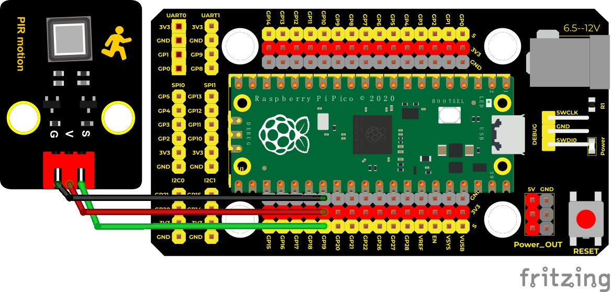

测试代码

/\*

\* Keyes Starter Kit for Raspberry Pi Pico

\* lesson 7

\* PIR motion

\*/

int val = 0;

int pirPin = 19; //定义人体红外传感器管脚为GP19

void setup() {

Serial.begin(9600); //设置波特率为9600

pinMode(pirPin, INPUT); //设置传感器为输入模式

}

void loop() {

val = digitalRead(pirPin); //读取传感器的值

Serial.print(val);//打印val值

if (val == 1) {//附近有人运动,输出高电平

Serial.print(" ");

Serial.println("Some body is in this area!");

delay(100);

}

else {//没检测到人体运动，则输出低电平

Serial.print(" ");

Serial.println("No one!");

delay(100);

}

}

代码说明

设置方法和实验三类似，这里就不多做介绍了。

测试结果

上传测试代码成功，利用USB线上电后，打开串口监视器，设置波特率为9600。

串口监视器显示对应数据和字符。实验中，传感器检测到附近有人在运动时，val为1，模块上LED熄灭，串口监视器显示“Somebody is in this area!”字符；没有检测到人运动时，item为0，模块上LED点亮，串口监视器显示“No one!”字符，如下图。

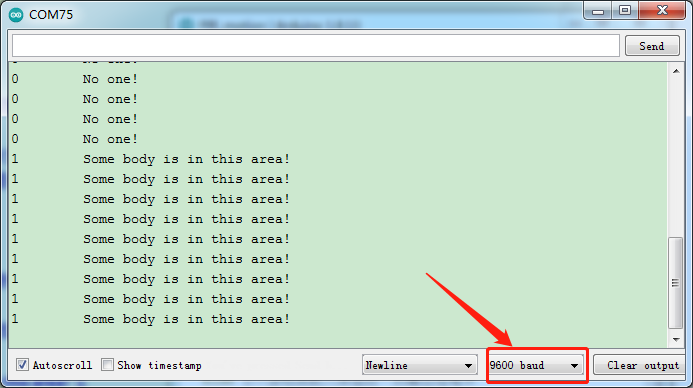

### 实验八 有源蜂鸣器模块播放声音

实验说明

在这个套件中，包含一个有源蜂鸣器模块，一个功放模块（相当于无源蜂鸣器模块）。这个实验中，我们控制有源蜂鸣器发出声音。有源蜂鸣器元件内部自带震荡电路，控制时，我们只需要给蜂鸣器元件足够的电压，蜂鸣器就自动响起。

实验中，我们只是控制这个模块上有源蜂鸣器的循环响起声音。

实验原理

从原理图中可以看出来在，蜂鸣器一端通过串联一个电阻R2连接到电压正极，另一端通过一个NPN三极管Q1连接到GND，所以只要导通这个三极管，让蜂鸣器一端连通GND，有缘蜂鸣器就会响起来。三极管控制端基极也就是连接到R1电阻一端为高电平，三极管Q1就导通了，三极管基极被下拉电阻R3拉低，所以常态为不导通，当我们用单片机IO口输出一个高电平到基极三极管就导通了。

即S信号端设置为高电平时，三极管导通，模块上蜂鸣器响起；设置为低电平时，三极管不导通，模块上蜂鸣器没有声音。

实验器材

|||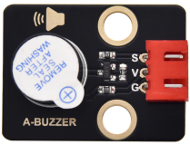|||
|-|-|-|-|-|
|Raspberry Pi Pico板*1|Raspberry Pi Pico扩展板*1|keyes DIY电子积木 有源蜂鸣器模块*1|防反插3Pin*1|MicroUSB线*1|

接线图

测试代码

/\*

\* Keyes Starter Kit for Raspberry Pi Pico

\* lesson 8

\* Active buzzer

\*/

int buzzer = 20; //定义蜂鸣器接管脚GP20

void setup() {

pinMode(buzzer, OUTPUT);//设置输出模式

}

void loop() {

digitalWrite(buzzer, HIGH); //发声

delay(1000);

digitalWrite(buzzer, LOW); //停止发声

delay(1000);

}

代码说明

在实验中，我们把管脚号设置为20，设置为高时，模块上有源蜂鸣器响起；设置为低时，模块上有源蜂鸣器关闭声音。

测试结果

上传测试代码成功，上电后，模块上有源蜂鸣器响起1秒，关闭1秒，循环交替。

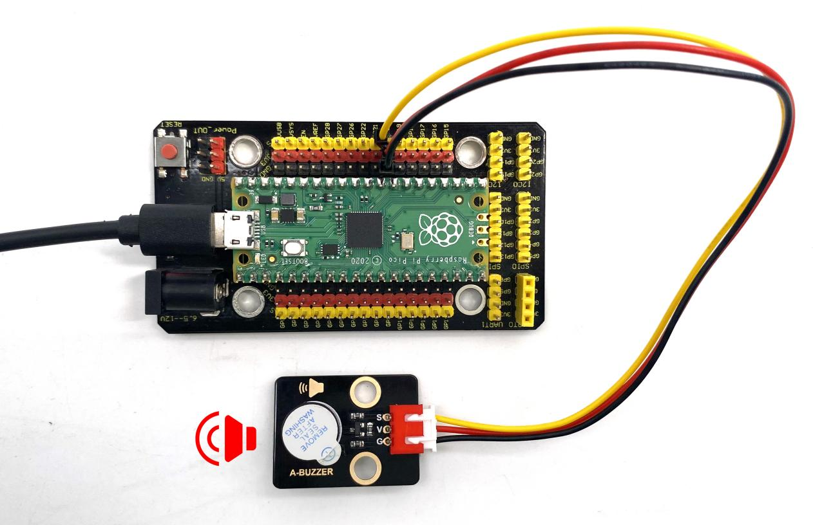

### 实验九 8002b功放 喇叭模块

实验说明

在这个套件中，有一个Keyes DIY电子积木 8002b功放
喇叭模块，这个模块主要的元件有一个可调电位器，一个喇叭，一个音频放大芯片；前面课程中我们介绍了套件中的有源蜂鸣器模块的使用方法。在这里我们介绍下套件中的8002b功放
喇叭模块，这个模块主要功能是：可以对输出的小音频信号进行放大，大概放大倍数为8.5倍，并且可以通过自带的小功率喇叭播放出来，也可以用来播放音乐，作为一些音乐播放设备的外接扩音设备。

实验中，我们利用8002b功放 喇叭模块上发出各种频率的声音。

实验原理

其实它就类似于于一个无源蜂鸣器，前面我们介绍过，有缘蜂鸣器自带振荡源，只要我们给它足够的电压就能响起来，而无源蜂鸣器元件内部不带震荡电路，控制时我们需要在元件正极输入不同频率的方波（电压3.3V/5V），负极接地，从而控制蜂鸣器响起不同频率的声音。

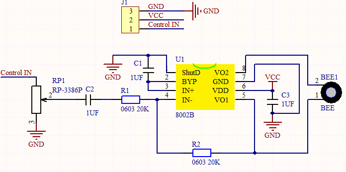

实验器材

||||||
|-|-|-|-|-|
|Raspberry Pi Pico板*1|Raspberry Pi Pico扩展板*1|keyes DIY电子积木 8002b功放 喇叭模块*1|防反插3Pin*1|MicroUSB线*1|

接线图

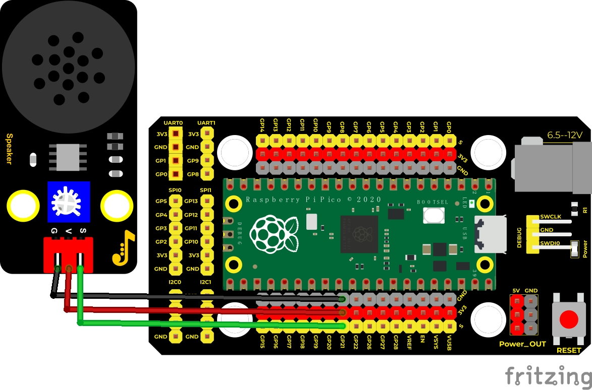

测试代码

/\*

\* Keyes Starter Kit for Raspberry Pi Pico

\* lesson 9

\* Passive buzzer

\*/

int beeppin = 21; //定义喇叭引脚为GP21

void setup() {

pinMode(beeppin, OUTPUT);//定义功放喇叭模块数字口为输出模式

}

void loop() {

tone(beeppin, 262);//DO播放1000ms

delay(1000);

tone(beeppin, 294);//Re播放750ms

delay(750);

tone(beeppin, 330);//Mi播放625ms

delay(625);

tone(beeppin, 349);//Fa播放500ms

delay(500);

tone(beeppin, 392);//So播放375ms

delay(375);

tone(beeppin, 440);//La播放250ms

delay(250);

tone(beeppin, 494);//Si播放125ms

delay(125);

noTone(beeppin);//停止播放一秒

delay(1000);

}

代码说明

在本实验中，我们用到了函数tone()。tone(pin, frequency)；pin为生成音调的单片机引脚,我们设置了21；frequency为音调频率，单位为Hz,数据类型为unsigned int（范围0 ~ 65,535 ((2^16) -
1))。tone函数在引脚上生成指定频率（和50％占空比）的方波。
直到调用noTone()（停止生成音调）为止。

测试结果

当我们上传测试代码成功，上电后，功放喇叭模块循环播放对应频率对应节拍的声音：DO一拍，Re0.75拍，Mi0.625拍，Fa半拍，So0.375拍，La四分之一拍，Si0.125拍。

### 实验十 插件RGB模块调节LED颜色

实验说明

在这个套件中，有一个Keyes DIY电子积木
共阴RGB模块，它采用F10-全彩RGB雾状共阴LED元件。控制时，我们需要将模块R G B连接单片机PWM口，剩下那个管脚接GND（共阳RGB的话剩下那个管脚接VCC）。

实验中，我们通过测试代码，控制RGB模块显示几个常见的颜色。

实验原理

那么什么是PWM呢？PWM是使用数字手段来控制模拟输出的一种手段。使用数字控制产生占空比不同的方波（一个不停在高电平与低电平之间切换的信号)来控制模拟输出。一般来说端口的输入电压只有两个0V与3.3V，也就是低电平和高电平。如果想要改变灯的亮度怎么办呢个？有同学说串联电阻，对，这个方法是正确的。但是，如果想要得到不同的亮度，且在不同亮度之间来回变动怎么办呢？不可能不停地切换电阻吧。这种情况下就需要使用PWM了，那它是怎么控制的呢？

数字端口电压输出只有LOW与HIGH两个，对应的就是0V与3.3V的电压输出，可以把LOW定义为0，HIGH定义为1，1秒内让单片机输出500个0或者1的信号。如果这500个全部为1，那就是完整的3.3V，如果全部为0，那就是0V。如果010101010101这样输出，刚好一半，端口输出的平均电压就为1.65V了。这个和放映电影是一个道理，咱们所看的电影并不是完全连续的，它其实是每秒输出25张图片。在这种情况下，人的肉眼是分辨不出来的，看上去就是连续的了。PWM也是同样的道理，如果想要不同的电压，就控制0与1的输出比例控制就可以了。当然这和真实的连续输出还是有差别的，单位时间内输出的0,1信号越多，控制的就越精确。

那么我们这个实验就是要通过调节3个PWM值，控制LED元件显示红光、绿光和蓝光的比例，从而控制RGB模块上LED显示不同颜色灯光。当设置的PWM值越大，对应显示的颜色比例越重。理论上来说，通过调节这3中颜色光的混合比例，可以模拟出所有颜色的灯光。

实验器材

<table >

|||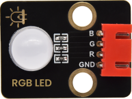|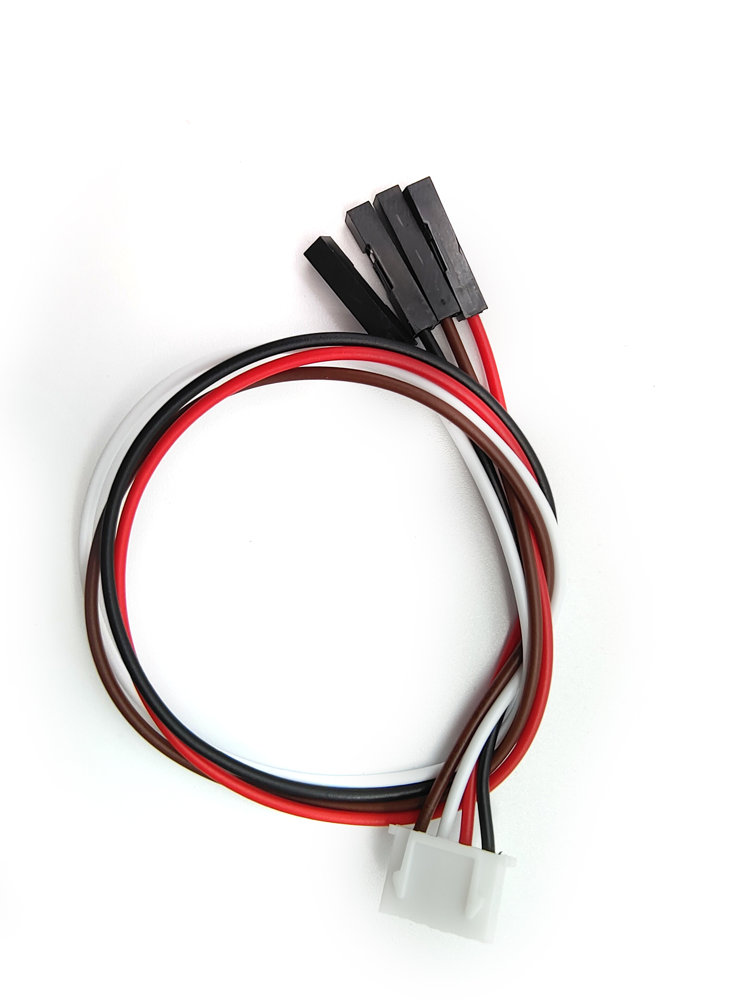||
|-|-|-|-|-|
|Raspberry Pi Pico板*1|Raspberry Pi Pico扩展板*1|keyes DIY电子积木 共阴RGB模块*1|防反插4Pin*1|MicroUSB线*1|

接线图

测试代码

代码1：

/\*

\* Keyes Starter Kit for Raspberry Pi Pico

\* lesson 10.1

\* rgb_1

\*/

int redPin = 9; //定义红色接GP9

int greenPin = 10; //定义绿色接GP10

int bluePin = 11; //定义蓝色接GP11

void setup(){

//输出口都设置为输出模式

pinMode(redPin, OUTPUT);

pinMode(greenPin, OUTPUT);

pinMode(bluePin, OUTPUT);

}

void loop(){

//红色

digitalWrite(redPin,HIGH);

digitalWrite(greenPin,LOW);

digitalWrite(bluePin,LOW);

delay(1000);

//绿色

digitalWrite(redPin,LOW);

digitalWrite(greenPin,HIGH);

digitalWrite(bluePin,LOW);

delay(1000);

//蓝色

digitalWrite(redPin,LOW);

digitalWrite(greenPin,LOW);

digitalWrite(bluePin,HIGH);

delay(1000);

}

代码2：

/\*

\* Keyes Starter Kit for Raspberry Pi Pico

\* lesson 10.2

\* rgb_2

\*/

int redPin = 9; //定义红色接GP9

int greenPin = 10; //定义绿色接GP10

int bluePin = 11; //定义蓝色接GP11

void setup() {

pinMode(redPin, OUTPUT);

pinMode(greenPin, OUTPUT);

pinMode(bluePin, OUTPUT);

}

void loop() {

//红色(255, 0, 0)

analogWrite(9, 255);

analogWrite(10, 0);

analogWrite(11, 0);

delay(1000);

//橙色(255, 97, 0)

analogWrite(9, 255);

analogWrite(10, 97);

analogWrite(11, 0);

delay(1000);

//黄色(255, 255, 0)

analogWrite(9, 255);

analogWrite(10, 255);

analogWrite(11, 0);

delay(1000);

//绿色(0, 255, 0)

analogWrite(9, 0);

analogWrite(10, 255);

analogWrite(11, 0);

delay(1000);

//蓝色(0, 0, 255)

analogWrite(9, 0);

analogWrite(10, 0);

analogWrite(11, 255);

delay(1000);

//青色(0, 255, 255)

analogWrite(9, 0);

analogWrite(10, 255);

analogWrite(11, 255);

delay(1000);

//紫色(160, 32, 240)

analogWrite(9, 160);

analogWrite(10, 32);

analogWrite(11, 240);

delay(1000);

}

代码说明

代码1说明：

1.  代码1中，R G B代表控制模块上
    LED对应的红绿蓝3种颜色对应的端口，根据接线图我们接到了GP9 GP10     GP11，设置为9 10 11，后面设置对应高低，设置GRB     LED中红绿蓝3个灯是否会亮，设置为高（对应数字口为高电平），对应的颜色就亮。

2.  现在观察代码，这个代码非常简单，只是简单的控制模块上RGB     LED显示红色1秒、

    绿色1秒、蓝色1秒，循环交替。

    代码2说明：

    1.代码2中，我们使用到了PWM输出，根据接线图我们接到了GP9 GP10     GP11，设置为9 10 11。后面设置数据代表设置模块上LED     红绿蓝颜色的比例，设置的数据越大（对应的PWM值越大），设置该颜色的比例越大。(注意：pico的PWM输出正常为0~65535，这里我们使用arduino     IDE调到了0~255)。

    2.实验中我们通过设置对应数值，调节RGB     LED上红绿蓝颜色比例，从而控制RGB     LED显示对应颜色。所以理论上来说可以设置的颜色有256\*256\*256种（详细可参考下面常用RGB颜色表）。

常用RGB颜色表

| |R|G|B| |R|G|B| |R|G|B|
|-|-|-|-|-|-|-|-|-|-|-|-|
|黑色|0|0|0|黄色|255|255|0|浅灰蓝色|176|224|230|
|象牙黑|41|36|33|香蕉色|227|207|87|品蓝|65|105|225|
|灰色|192|192|192|镉黄|255|153|18|石板蓝|106|90|205|
|冷灰|128|138|135|dougello|235|124|85|天蓝|135|206|235|
|石板灰|112|128|105|forum gold|255|227|132|||||
|暖灰色|128|128|105|金黄色|255|215|0|青色|0|255|255|
|||||黄花色|218|165|105|绿土|56|94|15|
|白色|255|255|255|瓜色|227|168|105|靛青|8|46|84|
|古董白|250|235|215|橙色|255|97|0|碧绿色|127|255|212|
|天蓝色|240|255|255|镉橙|255|97|3|青绿色|64|224|208|
|白烟|245|245|245|胡萝卜色|237|145|33|绿色|0|255|0|
|白杏仁|255|235|205|桔黄|255|128|0|黄绿色|127|255|0|
|cornsilk|255|248|220|淡黄色|245|222|179|钴绿色|61|145|64|
|蛋壳色|252|230|201|||||翠绿色|0|201|87|
|花白|255|250|240|棕色|128|24|24|森林绿|34|139|34|
|gainsboro|220|220|220|米色|163|148|128|草地绿|124|252|0|
|ghostWhite|248|248|255|锻浓黄土色|138|54|15|酸橙绿|50|205|50|
|蜜露橙|240|255|240|锻棕土色|135|51|36|薄荷色|189|252|201|
|象牙白|250|255|240|巧克力色|210|105|30|草绿色|107|124|35|
|亚麻色|250|240|230|肉色|255|125|64|暗绿色|48|128|20|
|navajoWhite|255|222|173|黄褐色|240|230|140|海绿色|46|139|87|
|old lace|253|245|230|玫瑰红|188|143|143|嫩绿色|0|255|127|
|海贝壳色|255|245|238|肖贡土色|199|97|20|||||
|雪白|255|250|250|标土棕|115|74|18|紫色|160|32|240|
|||||乌贼墨棕|94|38|18|紫罗蓝色|138|43|226|
|红色|255|0|0|赫色|160|82|45|jasoa|160|102|211|
|砖红|156|102|31|马棕色|139|69|19|湖紫色|153|51|250|
|镉红|227|23|13|沙棕色|244|164|96|淡紫色|218|112|214|
|珊瑚色|255|127|80|棕褐色|210|180|140|梅红色|221|160|221|
|耐火砖红|178|34|34||||| ||||
|印度红|176|23|31|蓝色|0|0|255| ||||
|栗色|176|48|96|钴色|61|89|171| ||||
|粉红|255|192|203|dodger blue|30|144|255| ||||
|草莓色|135|38|87|jackie blue|11|23|70| ||||
|橙红色|250|128|114|锰蓝|3|168|158| ||||
|蕃茄红|255|99|71|深蓝色|25|25|112| ||||
|桔红|255|69|0|孔雀蓝|51|161|201| ||||
|深红色|255|0|255|土耳其玉色|0|199|140|||||

测试结果

上传测试代码1成功，上电后，模块上RGB LED循环显示红绿蓝3种颜色，间隔时间为1秒。上传测试代码2成功，上电后，模块上RGB LED显示红橙黄绿蓝青紫白7种颜色，循环不止，间隔时间为1秒。

### 实验十一 旋转电位器传感器读取模拟值

实验说明

前面我们学习过的传感器，都是数字传感器，在这个套件中，有一个Keyes DIY电子积木
旋转电位器传感器，它与我们前面学到的传感器不同，它是一个模拟传感器，意思是例如我们前面学习的按键模块，当按键没有按下去时，我们读取到高电平（3.3V），当按键按下去时，我们读取到低电平（0V），而在0~3.3V中间的电压值，我们数字IO口无法读取到，当然按键模块也只能输出高低电平。而模拟传感器就可以通过我们pico板上的ADC模拟口（GP26~GP28）读取。

实验中，我们利用这个模块测试对应的模拟值；并且，我们在串口监视器显示测试结果。

实验原理

我们学过滑动变阻器的就很好理解，随着滑动变阻器上的滑片移动，滑片上的电压随着改变。我们的旋转电位器原理也是如此，它主要采用一个10K可调电阻。通过旋转电位器，我们可以改变电阻大小，信号端S检测到电压变化（0~3.3V），而这个电压变化是一个连续变化的模拟量，也就是在0~3.3V内可以取任意值，我们必须先对这个模拟量进行ADC采集，来测量连续的这些模拟量，A/D
是模拟量到数字量的转换，依靠的是模数转换器(Analog to Digital Converter)，简称ADC。我们的pico板已经集成了ADC采集，我们直接使用就可以。

我们pico板ADC位数是12位，一个n位的ADC表示这个ADC共有2的n次方个刻度。16位的ADC，输出的是从0～4095一共4096个数字量，也就是
2 的 12
次方个数据刻度，那么每个刻度就是3.3V/4096=0.0008V，这个也叫分辨率。

实验器材

|||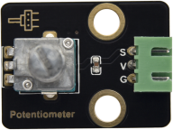|||
|-|-|-|-|-|
|Raspberry Pi Pico板*1|Raspberry Pi Pico扩展板*1|keyes DIY电子积木 旋转电位器传感器*1|防反插3Pin*1|MicroUSB线*1|

接线图

测试代码

/\*

\* Keyes Starter Kit for Raspberry Pi Pico

\* lesson 11

\* Rotary potentiometer

\*/

int analogVal = 0;

int resPin = 26; //电位器器接ADC0

void setup() {

Serial.begin(9600);//设置波特率为9600

}

void loop() {

analogVal = analogRead(resPin);//读取电位器的值

Serial.println(analogVal);//打印模拟值

delay(100);//延时100毫秒

}

代码说明

1.  在实验中，我们定义管脚变量名为analogVal，意思就是模拟值，前面我们又是用到数字传感器，我们这个实验用到的旋转电位器，它输出的是模拟值（0~4095），所以我们把管脚设置为模拟口，这里我们接ADC0即GP26。

2.  实验三，我们讲到digitalRead()函数，我们这里讲讲analogRead()函数。analogRead(pin)这个函数从指定的模拟引脚pin读取值。
    pico板包含一个多通道、12位模数转换器。 这意味着它会将 0     和工作电压（5V 或
    3.3V我们这里是3.3V）之间的输入电压映射为0和4095之间的整数值。例如，在pico上，这会产生以下读数之间的分辨率：3.3V/4096单位即每单位
    0.0008V。

3.  pin：要读取的模拟输入引脚的名称（我们pico板上的GP26到GP28，GP29测量VSYS电压，而ADC4测量的是内部温度）。设置1个整数变量item，将所测结果赋值给item。函数返回值为引脚上的模拟读数。虽然它受限于模数转换器的分辨率（0-4095为12位）。数据类型：int。

4.  串口监视器显示analogVal     的值，显示前需设置波特率（我们默认设置为9600，可更改）。

测试结果

上传测试代码成功，利用USB线上电后，打开串口监视器，设置波特率为9600。串口监视器显示对应模拟值。实验中，顺时针旋转电位器，模拟值增大，逆时针旋转电位器，模拟值减小，范围为0-4095，如下图。

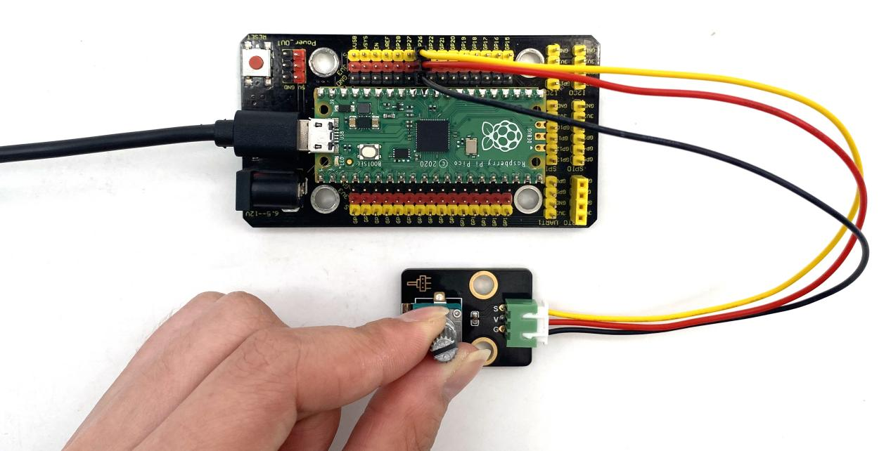

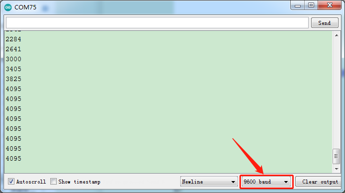

### 实验十二 声音传感器检测声量

实验说明

在这个套件中，有一个Keyes DIY电子积木
声音传感器，实验中，我们利用这个传感器测试当前环境中的声音大小对应的模拟值，声音越大，模拟值越大；并且，我们在串口监视器上显示测试结果。

实验原理

它主要采用一个高感度麦克风元件和LM386芯片。高感度麦克风元件用于检测外界的声音。利用LM386芯片搭建合适的电路，我们对高感度麦克风检测到的声音进行放大，最大倍数为200倍。使用时我们可以通过旋转传感器上电位器，调节声音的放大倍数。调节时，顺时针调节电位器到尽头，放大倍数最大。

实验器材

|||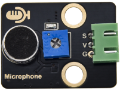|||
|-|-|-|-|-|
|Raspberry Pi Pico板*1|Raspberry Pi Pico扩展板*1|keyes DIY电子积木 声音传感器*1|防反插3Pin*1|MicroUSB线*1|

接线图

测试代码

/\*

\* Keyes Starter Kit for Raspberry Pi Pico

\* lesson 12

\* MicroPhone

\*/

int val = 0;

int Microphone = 27; //麦克风传感器接ADC1

void setup() {

Serial.begin(9600);//设置波特率9600

}

void loop() {

val = analogRead(Microphone); //读取传感器的值赋给变量val

Serial.println(val); //换行打印传感器输出的模拟值

delay(100); //加延时100MS

}

代码说明

设置方法和实验十一类似，这里就不多做介绍了。

测试结果

上传测试代码成功，利用USB线上电后，打开串口监视器，设置波特率为9600。串口监视器显示对应模拟值。实验中，我们顺时针旋转电位器和对准MIC头大声说话，可以看到模拟值数据变大，如下图。

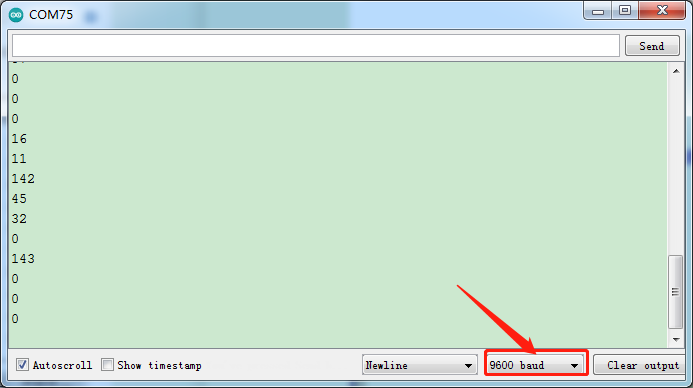

### 实验十三 光敏电阻传感器

实验说明

在这个套件中，有一个Keyes DIY电子积木
光敏电阻传感器，这是一个常用的光敏电阻传感器，它主要采用光敏电阻元件。该电阻元件电阻大小随着光照强度的变化而变化，该传感器就是利用光敏电阻元件这一特性，搭建电路将电阻变化转换为电压变化。光敏电阻传感器可以模拟人对环境光线的强度的判断，从而方便做出与人友好互动的应用。

接线时，我们将传感器信号端(S端)输入到pico模拟口，感知模拟值的变化，并在串口监视器上显示出对应的模拟值。

实验原理

当没有亮光时，电阻大小为0.2MΩ，信号端（2点）检测的电压接近0，当随着光照抢度增大，光线传感器的电阻值越来越小，所以信号端检测的电压越来越小。

实验器材

|||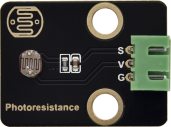|||
|-|-|-|-|-|
|Raspberry Pi Pico板*1|Raspberry Pi Pico扩展板*1|keyes DIY电子积木 光敏电阻传感器*1|防反插3Pin*1|MicroUSB线*1|

接线图

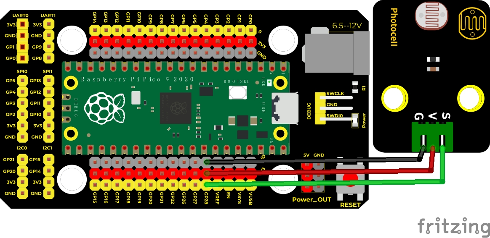

测试代码

/\*

\* Keyes Starter Kit for Raspberry Pi Pico

\* lesson 13

\* Photoresistance

\*/

int val = 0;

int photoPin = 28; //光敏电阻传感器接模拟口ADC2

void setup() {

Serial.begin(9600);//设置波特率9600

}

void loop() {

val = analogRead(photoPin);//读取传感器器的值

Serial.println(val);//打印值

delay(100);//延时100MS

}

代码说明

设置方法和实验十一类似，这里就不多做介绍了。

测试结果

烧录好测试代码，按照接线图连接好线，利用USB线上电后，打开软件串口监视器，设置波特率为9600，我们可以看到对应光照强度的模拟值，光照越强，模拟值越大，如下图。

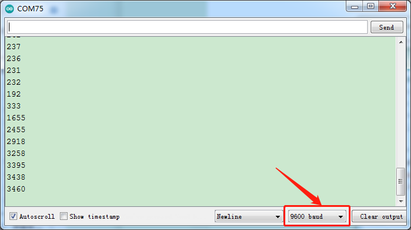

### 实验十四 NTC-MF52AT模拟温度传感器

实验说明

在这个套件中，有一个Keyes DIY电子积木
NTC-MF52AT模拟温度传感器，它的原理像光敏电阻传感器，只是感应的器件不同，实验中，我们将传感器信号端接到Pi Pico板模拟口，读出对应的模拟值。我们可以利用模拟值，通过特定公式，计算出当前环境的温度。由于温度计算公式比较复杂，这里就不多介绍了。实验中，我们只是读取对应的模拟值。

实验原理

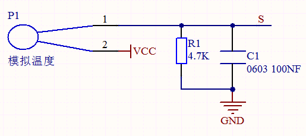这个模块主要采用NTC-MF52AT热敏电阻元件。NTC-MF52AT热敏电阻元件能够时感知周边环境温度的变化，电阻大小随着温度的变化而变化，从而引起信号端S的电压变化。该传感器就是利用NTC-MF52AT热敏电阻元件这一特性，搭建电路将电阻变化转换为电压变化。

实验器材

|||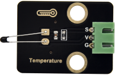|||
|-|-|-|-|-|
|Raspberry Pi Pico板*1|Raspberry Pi Pico扩展板*1|keyes DIY电子积NTC-MF52AT模拟温度传感器*1|防反插3Pin*1|MicroUSB线*1|

接线图

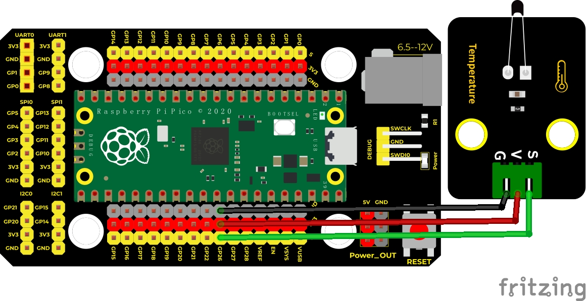

测试代码

/\*

\* Keyes Starter Kit for Raspberry Pi Pico

\* lesson 14

\* Temperature sensor

\*/

int val;

int ntcPin = 26; //设置NTC-MF52AT模拟温度传感器接ADC0

void setup() {

Serial.begin(9600);//设置波特率为9600

}

void loop() {

val = analogRead(ntcPin); //读取温度模拟值

Serial.println(val); //读取并打印热敏电阻模拟值

delay(100);//延时100毫秒

}

代码说明

设置方法和实验十一类似，这里就不多做介绍了。

测试结果

上传测试代码成功，利用USB线上电后，打开串口监视器，设置波特率为9600。串口监视器显示对应的模拟值，温度越高，模拟值越大。

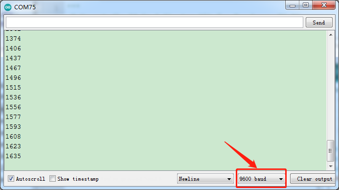

### 实验十五 薄膜压力传感器

实验说明

在这个套件中，有一个Keyes DIY电子积木
薄膜压力传感器，薄膜压力传感器是基于新型纳米压敏材料辅以舒适杨式模量的超薄薄膜衬底一次性贴片而成，兼具防水和压敏双重功能。

实验中，我们通过采集模块上S端模拟信号，判断压力大小，模拟值越小，压力越大；并且，我们在串口监视器上显示测试结果。

实验原理

当传感器感知到外界压力时，传感器电阻值发生变化，我们采用电路将传感器感知压力变化的压力信号转换成相应变化强度的电信号输出。这样我们就可以通过检测电压信号变化就可以得到压力变化情况。

实验器材

||||||
|-|-|-|-|-|
|Raspberry Pi Pico板*1|Raspberry Pi Pico扩展板*1|keyes DIY电子积木 薄膜压力传感器*1|防反插3Pin*1|MicroUSB线*1|

接线图

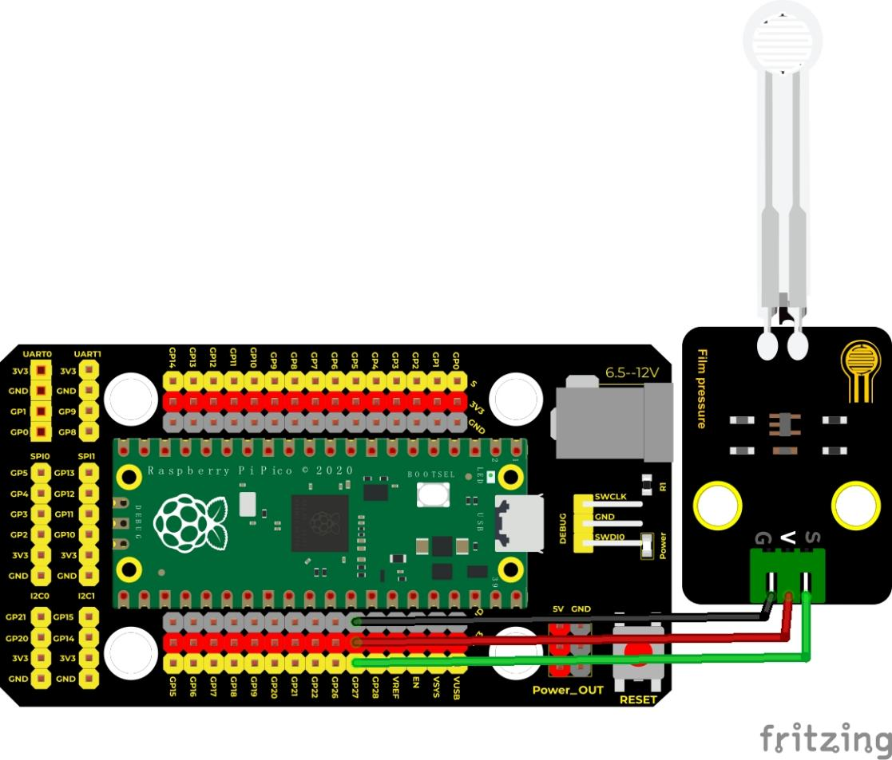

测试代码

/\*

\* Keyes Starter Kit for Raspberry Pi Pico

\* lesson 15

\* Film pressure sensor

\*/

int val = 0;

int Film = 27; //薄膜压力传感器接ADC1

void setup() {

Serial.begin(9600);//设置波特率为9600

}

void loop() {

val = analogRead(Film);//读取模拟值

Serial.println(val);//打印模拟值

delay(100);//延时100MS

}

代码说明

设置方法和实验十一类似，这里就不多做介绍了。

测试结果

上传测试代码成功，利用USB线上电后，打开串口监视器，设置波特率为9600。当我们用手挤压薄膜时，可以看到我们在串口监视器打印的模拟值变小，如下图。

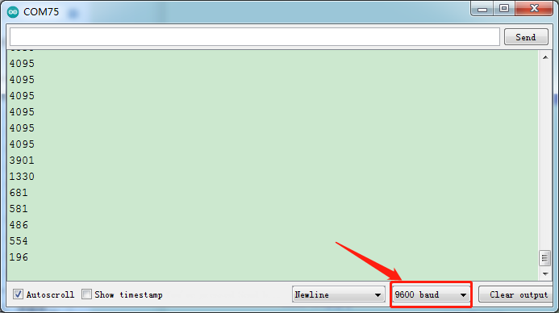

### 实验十六 摇杆模块

实验说明

大家都应该看过游戏手柄，有些游戏手柄上除了按键，还有摇杆，那摇杆是什么工作原理呢？那么在我们这个套件中，就有一个Keyes DIY电子积木 摇杆模块，它主要采用PS2手柄摇杆元件。控制时，我们需要将模块X Y端口连接单片机模拟口，B端口连接单片机数字口，VCC接单片机电源输出端（3.3-5V），GND接单片机GND。我们可以读取两个模拟值和一个数字口）的高低电平情况，判断模块上摇杆的工作状态。

实验中，我们将读取两个模拟值（X轴Y轴）和一个数字值（Z轴，并在shell显示测试结果。

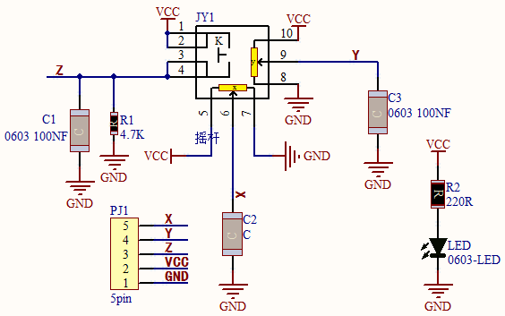实验原理

其实它的原理非常简单，内部相当于两个可调电位器（左右和上下）和一个按键，这个按键没被按下时被R1下拉为低电平，按下时接通VCC即为高电平，与我们前面学习过的按键模块是相反的，我们摇动摇杆时内部的电位器就会调节从而输出不同的电压，我们就可以读取到模拟值。

实验器材

||||||
|-|-|-|-|-|
|Raspberry Pi Pico板*1|Raspberry Pi Pico扩展板*1|keyes DIY电子积木 摇杆模块*1|防反插5Pin*1|MicroUSB线*1|

接线图

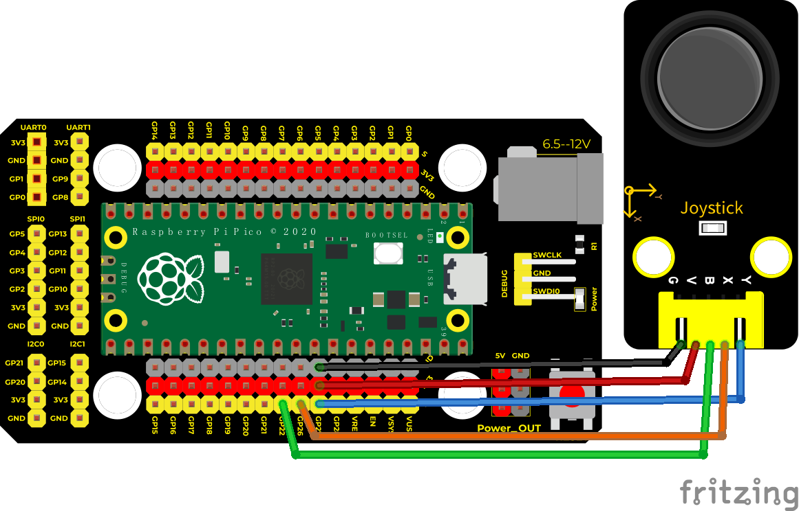

测试代码

/\*

\* Keyes Starter Kit for Raspberry Pi Pico

\* lesson 16

\* Joystick

\*/

int X = 0;

int Y = 0;

int Button = 0;

void setup() {

Serial.begin(9600);

pinMode(22, INPUT); //定义遥感按钮的PIN为GP22

}

void loop() {

X = analogRead(26); //遥感的X轴引脚接ADC0

Y = analogRead(27); //遥感的Y轴引脚接ADC1

Button = digitalRead(22); //读取按钮的状态，并在下方打印出来

Serial.write("X:");

Serial.print(X);

Serial.write(" Y:");

Serial.print(Y);

Serial.write(" B:");

Serial.println(Button);

delay(100);

}

代码说明

在实验中，根据接线，x管脚设置为GP26，y管脚设置为GP27，摇杆按钮管脚设置为GP22，串口监视器显示测试数据，显示前需设置波特率（我们默认设置为9600，可更改）。

测试结果

上传测试代码成功，利用USB线上电后，打开串口监视器，设置波特率为9600。串口监视器显示对应数值。摇动摇杆，x轴和y轴对应的模拟值发生改变，按下按钮，读取到的数字值为1，否则为0，如下图。

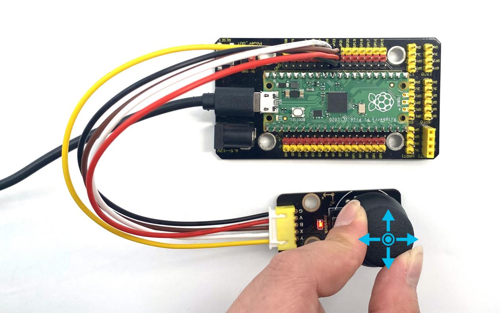

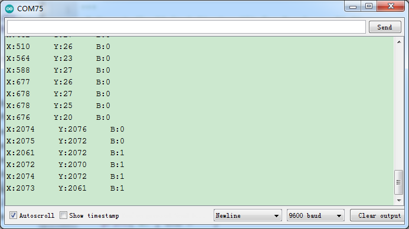

### 实验十七 SK6812 RGB模块

实验说明

前面我们学习了插件RGB模块，利用PWM信号对模块的三个引脚进行调色。我们这个套价中，还有一个Keyes DIY电子积木 6812 RGB模块，但是这个SK6812 RGB
模块驱动原理不与我们前面学习过的插件RGB模块相同，而且只需要一个引脚就能控制，这是一个集控制电路与发光电路于一体的智能外控LED光源。每个LED原件其外型与一个5050LED灯珠相同，每个元件即为一个像素点，我们这个模块上有四个灯珠即四个像素，

实验中，我们分别使不同的灯亮出不同的颜色。

实验原理

从原理图中我们可以看出，这四个像素点灯珠都是串联起来的，其实不论多少个，我们都可以用一个引脚控制任一一个灯，并且让它显示任一种颜色。像素点内部包含了智能数字接口数据锁存信号整形放大驱动电路，还包含有高精度的内部振荡器和12V高压可编程定电流控制部分，有效保证了像素点光的颜色高度一致。

数据协议采用单线归零码的通讯方式，像素点在上电复位以后，S端接受从控制器传输过来的数据，首先送过来的24bit数据被第一个像素点提取后，送到像素点内部的数据锁存器。这个6812RGB通讯协议与驱动已经在底层封装好了，我们直接调用函数的接口就可以使用。

实验器材

|||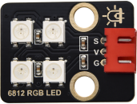|||
|-|-|-|-|-|
|Raspberry Pi Pico板*1|Raspberry Pi Pico扩展板*1|keyes DIY电子积木 6812 RGB模块*1|防反插3Pin*1|MicroUSB线*1|

接线图

测试代码

/\*

\* Keyes Starter Kit for Raspberry Pi Pico

\* lesson 17

\* 6812 RGB LED

\*/

\#include"rgb.h"

RGB rgb(16,4); //rgb(pin, num); num = 0-100

///////////////////////////////////////////////////////////////////////////////////

void setup() {

rgb.setBrightness(100); //rgb.setBrightness(0-255);

delay(10);

rgb.clear(); //Turn off all leds

delay(10);

}

///////////////////////////////////////////////////////////////////////////////////

void loop() {

while(1){

rgb.setPixelColor(0,255,0,0); //rgb.setPixelColor(num,r,g,b); num =
0-100

rgb.setPixelColor(1,0,255,0); //rgb.setPixelColor(num,r,g,b); num =
0-100

rgb.setPixelColor(2,0,0,255); //rgb.setPixelColor(num,r,g,b); num =
0-100

rgb.setPixelColor(3,255,255,255); //rgb.setPixelColor(num,r,g,b); num
= 0-100

rgb.show();

delay(1000);

}

}

代码说明

这里使用到库函数，库函数的添加方法请查看第三章第四小节。

我们介绍下主要的几个函数接口及功能：

RGB rgb(16,4);这个函数用来初始化6812RGB，16为引脚号，4为灯珠数

rgb.setBrightness(100);这个函数用来设置6812RGB显示的亮度，范围是（0~255），值越大，灯珠越亮，如果我们没有设置亮度，那么默认255，也就是最亮。

rgb.clear();这个函数用来清除显示

rgb.setPixelColor(uint16_t n, uint8_t r, uint8_t g, uint8_t b);这个函数用来设置6812RGB的灯珠号也就是位置，及每颗灯珠的颜色。

rgb.show();这个函数用来设置显示6812RGB，是必要的，如果没有这条语句，灯珠将不刷新显示

测试结果

烧录好测试代码，按照接线图连接好线，上电后，我们可以看到模块上的四个灯珠分别亮红绿蓝白色，如下图所示。

### 实验十八 旋转编码器模块计数

实验说明

在这个套件中，有一个Keyes DIY电子积木
旋转编码器模块，也叫开关编码器、旋转编码器。此款编码器有做20脉冲20定位点、15脉冲30定位点两种。编码器主要用于汽车电子、多媒体音响、仪器仪表、家用电器、智能家居、计算机周边、医疗器械等领域。主要用于频率调节、亮度调节、温度调节、音量调节的参数控制等。

实验中，我们利用Keyes DIY电子积木
旋转编码器模块用于计数，当我们顺时针旋转编码器时，设置数据减1；逆时针旋转编码器时，设置数据加1；按下编码器中间按键时，打印编码器的值；将测试结果在串口监视器上显示。

实验原理

增量式编码器是将位移转换成周期性的电信号，再把这个电信号转变成计数脉冲，用脉冲的个数表明位移的巨细。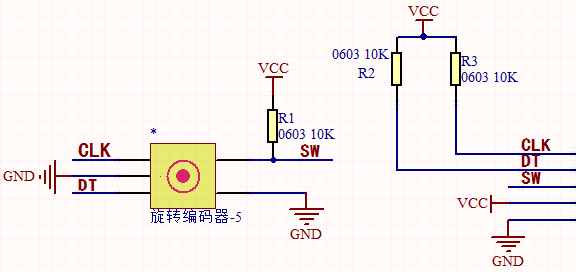这个模块主要采用20脉冲旋转编码器元件。它可通过旋转计数正方向和反方向转动过程中输出脉冲的次数，这种转动计数是没有限制的，复位到初始状态，即从0开始计数。

实验器材

||||||
|-|-|-|-|-|
|Raspberry Pi Pico板*1|Raspberry Pi Pico扩展板*1|keyes DIY电子积木 旋转编码器模块*1|防反插5Pin*1|MicroUSB线*1|

接线图

测试代码

/\*

Keyes Starter Kit for Raspberry Pi Pico

lesson 18

Encoder

\*/

//Interfacing Rotary Encoder with Arduino

//Encoder Switch -\> pin 20

//Encoder DT -\> pin 19

//Encoder CLK -\> pin 18

int Encoder_DT = 19;

int Encoder_CLK = 18;

int Encoder_Switch = 20;

int Previous_Output;

int Encoder_Count;

void setup() {

Serial.begin(9600);

//pin Mode declaration

pinMode (Encoder_DT, INPUT);

pinMode (Encoder_CLK, INPUT);

pinMode (Encoder_Switch, INPUT);

Previous_Output = digitalRead(Encoder_DT); //Read the inital value of Output A

}

void loop() {

//aVal = digitalRead(pinA);

if (digitalRead(Encoder_DT) != Previous_Output)

{

if (digitalRead(Encoder_CLK) != Previous_Output)

{

Encoder_Count ++;

Serial.println(Encoder_Count);

}

else

{

Encoder_Count--;

Serial.println(Encoder_Count);

}

}

Previous_Output = digitalRead(Encoder_DT);

if (digitalRead(Encoder_Switch) == 0)

{

delay(5);

if (digitalRead(Encoder_Switch) == 0) {

Serial.println("Switch pressed");

while (digitalRead(Encoder_Switch) == 0);

}

}

}

代码说明

1.我们把CLK设置为GP18、DAT设置为GP19。该代码在库文件中设置好了，它的意思是（CLK）下降后，读取数字口（DAT）电压，当DAT电压为高电平时，旋转编码器的值加1；当DAT电压为低电平时，转编码器的值减1。

2.  然后循环程序中设置按钮管脚（GP20）为低电平时，打印出来。

测试结果

上传测试代码成功，利用USB线上电后，打开串口监视器，设置波特率为9600。顺时针旋转编码器，显示数据减小；逆时针旋转编码器，显示数据增加；按下编码器中间按键，显示“Switch pressed”，如下图。

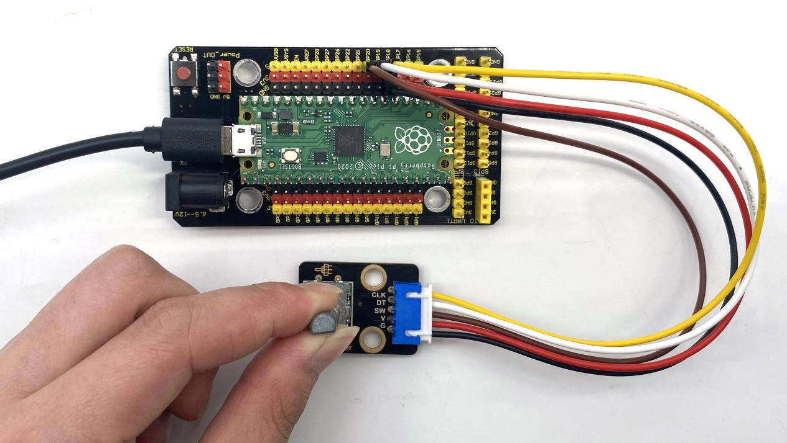

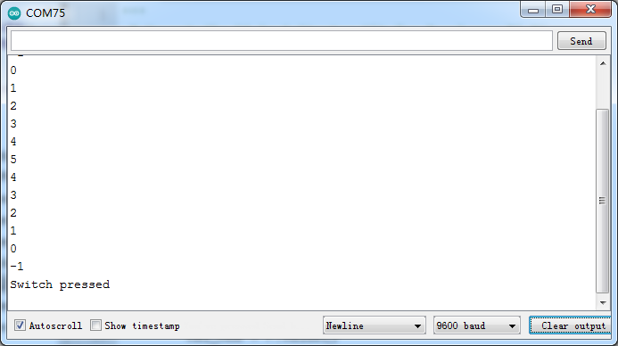

### 实验十九 舵机的控制原理

实验说明

舵机是一种位置伺服的驱动器，主要是由外壳、电路板、无核心马达、齿轮与位置检测

器所构成。舵机有很多规格，但所有的舵机都有外接三根线，分别用棕、红、橙三种颜色进行区分，由于舵机品牌不同，颜色也会有所差异，棕色为接地线，红色为电源正极线，橙色为信号线。

舵机的用途很广泛，特别是用于机器人行业，例如人形机器人，多足机器人。这一课我们就学习舵机的原理及基本的控制方法。舵机是一种位置伺服的驱动器，主要是由外壳、电路板、无核心马达、齿轮与位置检测器所构成。舵机有很多规格，有360°舵机、180°舵机和90度舵机，我们这款舵机为90度舵机，但是它转动的角度接近于180度，所以我们也可把它当做180度舵机使用，控制原理都是一样的。所有的舵机都有外接三根线，分别用棕、红、橙三种颜色进行区分，由于舵机品牌不同，颜色也会有所差异，棕色为接地线，红色为电源正极线，橙色为信号线。

实验原理

舵机的转动的角度是通过调节PWM（脉冲宽度调制）信号的占空比来实现的，标准PWM

（脉冲宽度调制）信号的周期固定为20ms（50Hz），理论上脉宽分布应在1ms到2ms

之间，但是，事实上脉宽可由0.5ms 到2.5ms 之间，脉宽和舵机的转角0°～180°相

对应。有一点值得注意的地方，由于舵机牌子不同，对于同一信号，不同牌子的舵机旋

转的角度也会有所不同。

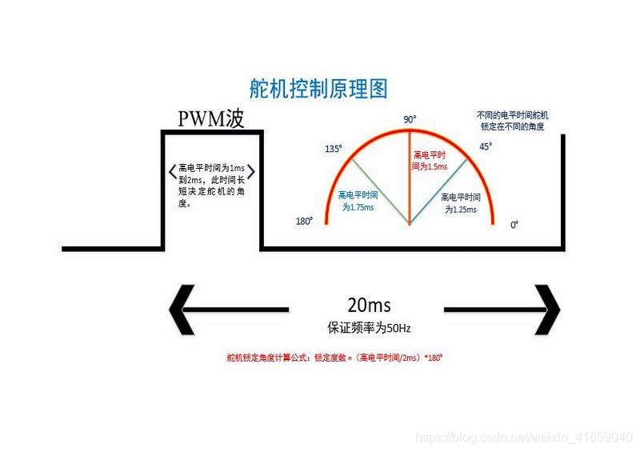

实验器材

|||||
|-|-|-|-|
|Raspberry Pi Pico板*1|Raspberry Pi Pico扩展板*1|伺服舵机*1|MicroUSB线*1|

接线图

测试代码

//代码1：

/\*

Keyes Starter Kit for Raspberry Pi Pico

lesson 19.1

servo_1

\*/

int servoPin = 0;//舵机的PIN

void setup() {

pinMode(servoPin, OUTPUT);//舵机引脚设置为输出

}

void loop() {

servopulse(servoPin, 0);//转动到0度

delay(1000);//延时1秒

servopulse(servoPin, 90);//转动到90度

delay(1000);

servopulse(servoPin, 180);//转动到180度

delay(1000);

}

void servopulse(int pin, int myangle) { //脉冲函数

int pulsewidth = map(myangle, 0, 180, 500, 2500); //将角度映射到脉宽

for (int i = 0; i \< 10; i++) { //多输出几次脉冲

digitalWrite(pin, HIGH);//将舵机接口电平至高

delayMicroseconds(pulsewidth);//延时脉宽值的微秒数

digitalWrite(pin, LOW);//将舵机接口电平至低

delay(20 - pulsewidth / 1000);

}

}

代码2：

/\*

Keyes Starter Kit for Raspberry Pi Pico

lesson 19.2

servo_2

\*/

\#include \<Servo.h\> //舵机库

Servo myservo;

void setup() {

myservo.attach(0);//舵机连接GP0

}

void loop() {

for (int pos = 0; pos \< 180; pos++) {

myservo.write(pos); //转动到pos角度

delay(15); //加延时转慢一点

}

for (int pos = 180; pos \> 0; pos--) {

myservo.write(pos);

delay(15);

}

delay(2000);//等待2秒

}

代码说明

代码1说明：

1.  map(value, fromLow, fromHigh, toLow,     toHigh)；value为我们要映射的值；fromLow,     fromHigh为当前值的下限和上限；toLow,     toHigh为我们要映射到的目标范围的下限和上限。比如我们在实验中map(myangle,     0, 180, 500,     2500)的意思就是我们传进来一个需要转动的角度值为myangle，然后这个值的范围是0度到180度，我们要映射的范围为500us到2500us，即把0到180转到了500到2500然后被返回了，返回的数据类型为整型，余数会被截断，不进行四舍五入或平均。

    2\.     之后我们调用我们定义的的函数servopulse()就能让舵机转动了，代码中我们设置了让舵机从0度转动到90度再转动到180度，再转动到0度，中间暂停一秒，反复循环。

代码2说明：

1.  舵机库IDE已经自动下载了，点击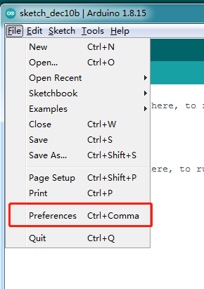点击，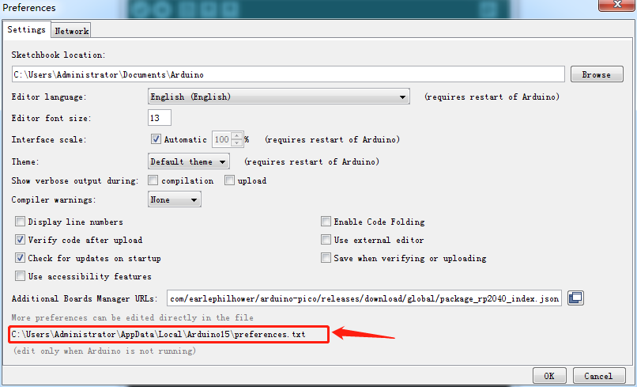找到路径就可以看到自带库文件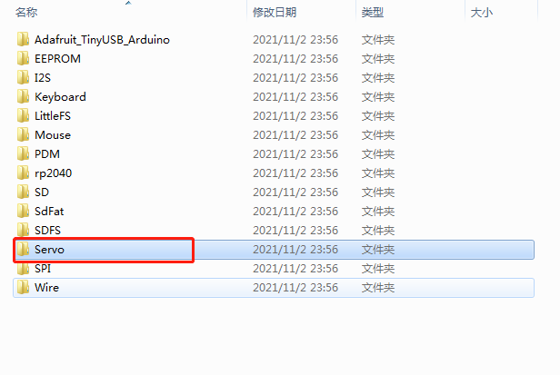。

2.  这个库的方法.attach()方法是连接舵机引脚，我们连到其他引脚也可以。

3.  myservo.write(pos)为转动到pos角度值。myservo.read()是读取舵机当前角度值。

4.  其他设置请参照前面相关的代码注释。

测试结果

实验1
结果：上传测试代码成功，利用USB线上电后，舵机由0度，90度，180度三个角度循环转动。

实验2
结果：上传测试代码成功，利用USB线上电后，舵机由0~180度来回转动，并且每15ms转动一度。

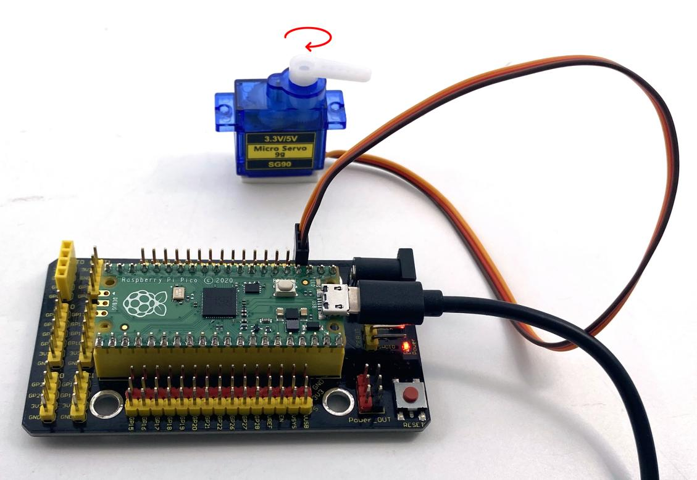

### 实验二十 超声波传感器的原理

蝙蝠和某些海洋动物都能够利用高频率的声音进行回声定位或信息交流。它们能通过口腔或鼻腔把从喉部产生的超声波发射出去，利用折回的声波来定向，并判定附近物体的位置、大小以及是否在移动。超声波是一种频率高于20000赫兹的声波，它的方向性好，穿透能力强，易于获得较集中的声能，在水中传播距离远，可用于测距、测速、清洗、焊接、碎石、杀菌消毒等。在医学、军事、工业、农业上有很多的应用。超声波因其频率下限大于人的听觉上限而得名。科学家们将每秒钟振动的次数称为声音的频率，它的单位是赫兹(Hz)。

实验说明

在这个套件中，有一个keyes HC-SR04超声波传感器，它可以检测前方是否存在障碍物，并且检测出传感器与障碍物的详细距离。它的原理和蝙蝠飞行的原理一样，就是超声波模块发送出一种频率很高的超声波信号，通常正常人耳朵的听力的声波范围是20Hz~20kHz，人类无法听到。这些超声波的信号若是碰到障碍物，就会立刻反射回来，在接收到返回的信息之后，通过判断发射信号和接收信号的时间差，计算出传感器和障碍物的距离。

实验中，我们利用传感器检测传感器和障碍物之间的距离，将测试结果在串口监视器上显示。

实验原理

最常用的超声测距的方法是回声探测法，如图，超声波发射器向某一方向发射超声波，在发射时刻的同时计数器开始计时，超声波在空气中传播，途中碰到障碍物面阻挡就立即反射回来，超声波接收器收到反射回的超声波就立即停止计时。超声波也是一种声波，其声速V与温度有关。一般情况下超声波在空气中的传播速度为340m/s，根据计时器记录的时间t，就可以计算出发射点距障碍物面的距离s，即：s=340t/2

HC-SR04超声波测距模块可提供2cm-400cm的非接触式距离感测功能，
测距精度可达高到3mm；模块包括超声波发射器、接收器与控制电路。基本工作原理：

(1)采用IO口TRIG触发测距，给至少10us的高电平信号;

(2)模块自动发送8个40khz的方波，自动检测是否有信号返回；

(3)有信号返回，通过IO口ECHO输出一个高电平，高电平持续的时间就是超声波从发射到返回的时间。

实验器材

||||||
|-|-|-|-|-|
|Raspberry Pi Pico板*1|Raspberry Pi Pico扩展板*1|keyes SR01超声波模块*1|杜邦线4Pin*1|MicroUSB线*1|

接线图

测试代码

/\*

Keyes Starter Kit for Raspberry Pi Pico

lesson 20

Ultrasonic

\*/

int distance = 0; //定义一个用来接收距离的变量

int EchoPin = 13; //Echo引脚接GP13

int TrigPin = 14; //Trig引脚接GP14

float checkdistance() { //获取距离

// 预先给出一个短的低电平，以确保一个干净的高脉冲:

digitalWrite(TrigPin, LOW);

delayMicroseconds(2);

// 传感器由10微秒或更长时间的高脉冲触发

digitalWrite(TrigPin, HIGH);

delayMicroseconds(10);

digitalWrite(TrigPin, LOW);

// 读取来自传感器的信号:一个高电平脉冲，

//其持续时间是指从发送ping命令到接收物体回波的时间(以微秒计)。

float distance = pulseIn(EchoPin, HIGH) / 58.00; //换算成距离

delay(10);

return distance;

}

void setup() {

Serial.begin(9600);//设置波特率为9600

pinMode(TrigPin, OUTPUT);//Trig引脚为输出

pinMode(EchoPin, INPUT); //Echo引脚为输入

}

void loop() {

distance = checkdistance();

if (distance \< 2 || distance \>= 400) { //在范围外打印"-1"

Serial.println("-1");

delay(100);

}

else { //打印距离，单位厘米

Serial.print("distance:");

Serial.print(distance);

Serial.println("cm");

delay(100);

}

}

代码说明

HC-SR04超声波传感器最大测试距离为3-4m，最小测试距离为2cm。设置代码当检测距离小于2cm或者大于等于400cm时，串口监视器显示-1。我们在电脑的串口监视器中显示出传感器和障碍物之间的距离。

测试结果

上传测试代码成功，利用USB线上电后，打开串口监视器，设置波特率为9600。如果障碍物在测试范围外，串口监视器显示“-1”；否则，串口监视器显示超声波传感器和前方障碍物之间的距离，单位为cm，如下图。

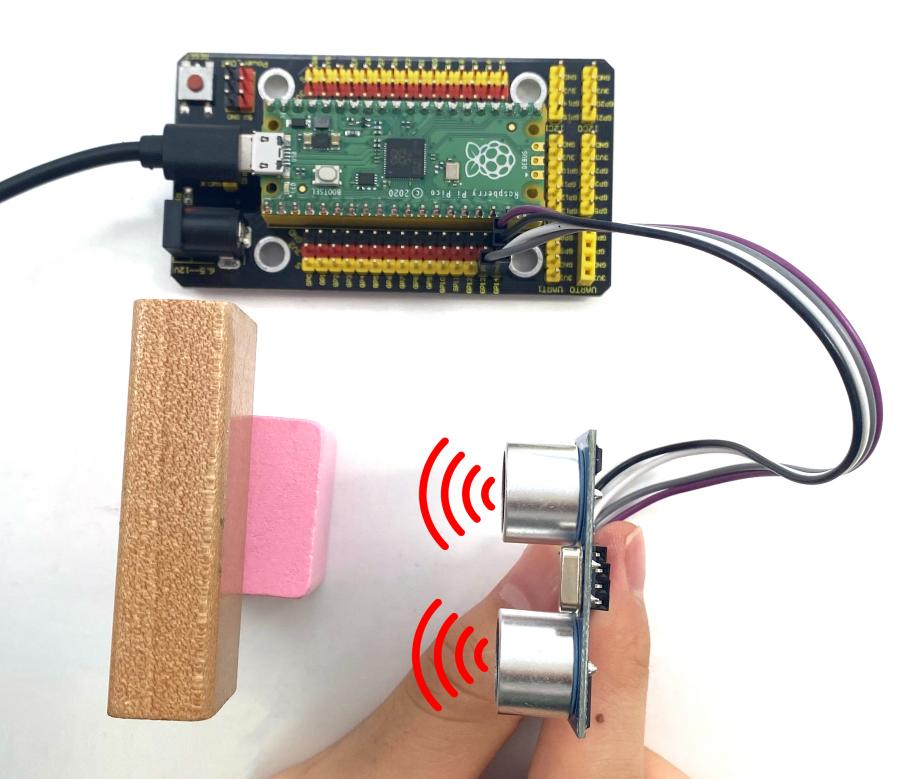

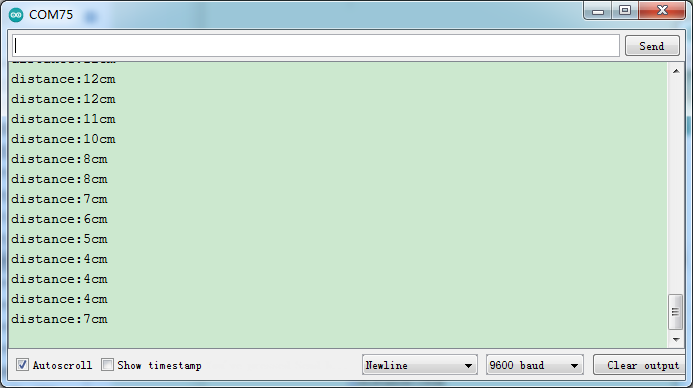

### 实验二十一 红外遥控与接收

实验说明

红外线遥控是目前使用最广泛的一种通信和遥控手段。由于红外线遥控装置具有体积小、功耗低、功能强、成本低等特点，因而，继彩电、录像机之后，在录音机、音响设备、空凋机以及玩具等其它小型电器装置上也纷纷采用红外线遥控。红外遥控的发射电路是采用红外发光二极管来发出经过调制的红外光波；红外接收电路由红外接收二极管、三极管或硅光电池组成，它们将红外发射器发射的红外光转换为相应的电信号，再送后置放大器。

这一实验中，我们了解下红外接收传感器的使用方法。红外接收传感器主要采用VS1838B红外接收传感器元件。该元件是集接收、放大、解调一体的器件，内部IC就已经完成了解调，输出的就是数字信号。它可接收标准38KHz调制的遥控器信号。

实验中，我们利用红外接收传感器接收外部红外发射设备发射的红外信号，并将接收信号在串口监视器上显示。

实验原理

红外遥控系统的主要部分为调制、发射和接收。红外遥控是以调制的方式发射数据，就是把数据和一定频率的载波进行“与”操作，这样既可以提高发射效率又可以降低电源功耗。调制载波频率一般在30khz到60khz之间，大多数使用的是38kHz，占空比1/3的方波。在红外接收的信号端加上了4.7K的上拉电阻R3，大家在下面看代码时可以发现，首先等待检测低电平，因为接收到信号，信号端立即由高电平转为低电平。

实验器材

|||||||
|-|-|-|-|-|-|
|Raspberry Pi Pico板*1|Raspberry Pi Pico扩展板*1|keyes DIY电子积木 红外接收模块*1|防反插3Pin*1|MicroUSB线*1|遥控器*1|

接线图

测试代码

/\*

Keyes Starter Kit for Raspberry Pi Pico

lesson 21

IR Receiver

\*/

\#include"ir.h"

IR IRreceive(16);

////////////////////

void setup() {

Serial.begin(9600);

delay(1000);

}

////////////////////

void loop() {

Serial.println("IR receive");

while(1){

int key = IRreceive.getKey();

if(key != -1)

Serial.println(key);

}

}

代码说明

编译上传之前我们先导入库文件，导入方法请看前面库文件的添加方法。

下图是红外遥控的键值：

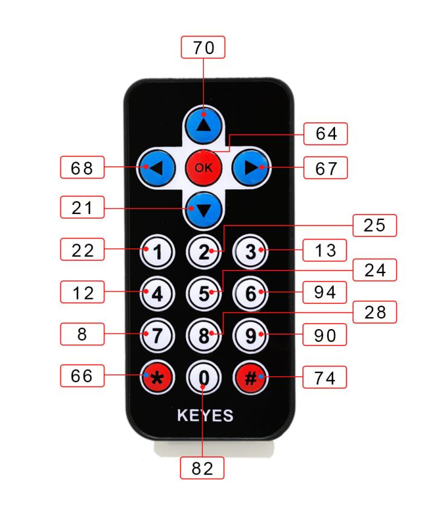

测试结果

按照接线图接线，上传测试代码成功，利用USB线上电后，打开串口监视器，里面就会显示红外接收传感器接收到的数据。

找到红外遥控器，拔出绝缘片，对准红外接收传感器的接收头按下按键。接收到信号后，红外接收传感器上的LED也开始闪烁，串口监视器显示如下图。

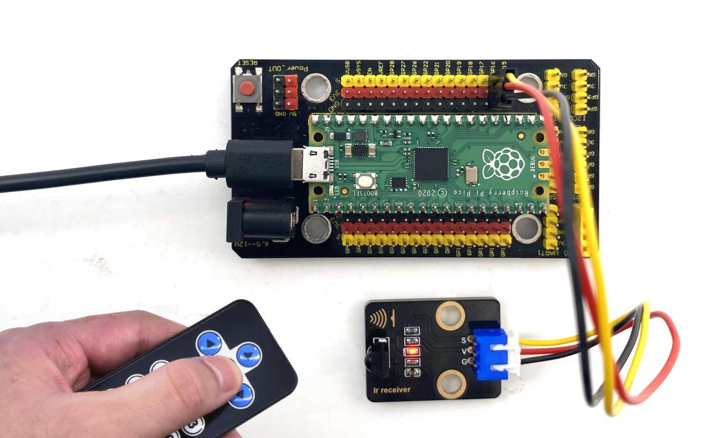

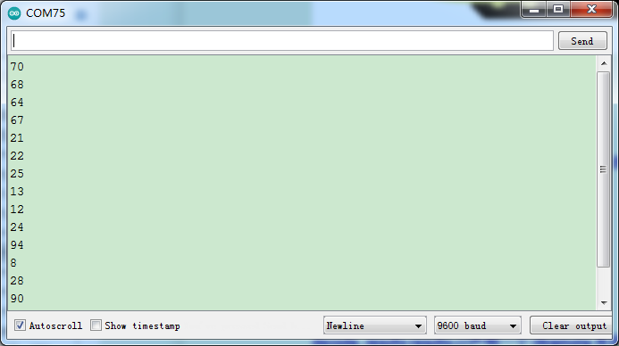

### 实验二十二 DS1307时钟模块

实验说明

这个模块主要用到实时时钟芯片DS1307。是美国DALLAS公司推出的I2C总线接口实时时钟芯片，它可独立于CPU工作，不受CPU主晶振及其电容的影响，且计时准确，月累积误差一般小于10秒。芯片还具有主电源掉电情况下的时钟保护电路，DS1307的时钟靠后备电池维持工作，拒绝CPU对其读出和写入访问。同时还具有备用电源自动切换控制电路，因而可在主电源掉电和其它一些恶劣环境场合中保证系统时钟的定时准确性。DS1307具有产生秒、分、时、日、月、年等功能，且具有闰年自动调整功能。同时，DS1307芯片内部还集成有一定容量、具有掉电保护特性的静态RAM，可用于保存一些关键数据。

实验中，我们利用DS1307时钟模块获取系统时间，将测试结果在串口监视器上显示出来。

实验原理

DS1307 把8 个寄存器和56 字节的RAM
进行了统一编址，记录年、月、日、时、分、秒及星期; AM、PM
分别表示上午和下午; 56 个字节的NVRAM存放数据; 2线串口;
可编程的方波输出;电源故障检测及自动切换电路;电池电流小于500nA。

主要引脚定义如下：

X1、32.768kHz 晶振接入端;

VBAT:X2：+3V 电池电压输入;

SDA：串行数据;

SCL：串行时钟;

SQW/OUT：方波/输出驱动器。

实验器材

|||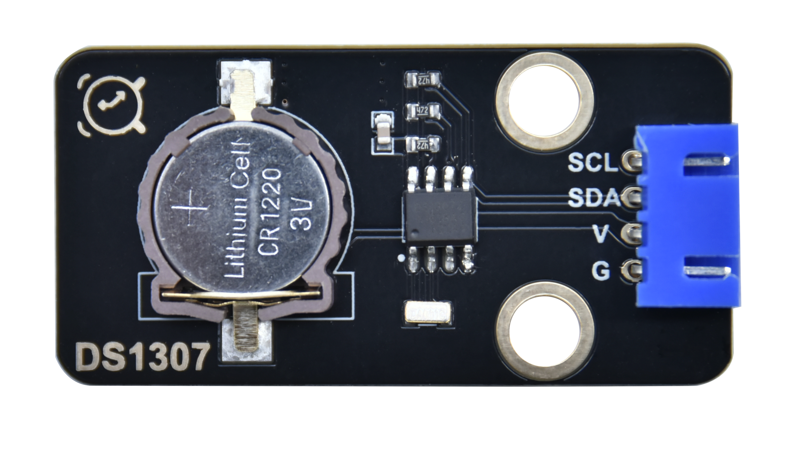|||
|-|-|-|-|-|
|Raspberry Pi Pico板*1|Raspberry Pi Pico扩展板*1|keyes DIY电子积木DS1307传感器模块*1|防反插4Pin*1|MicroUSB线*1|

接线图

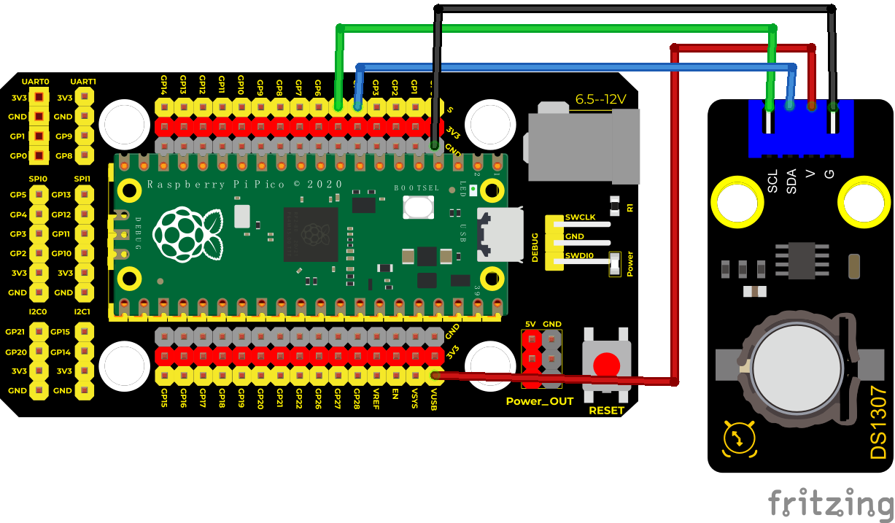

我们前面介绍了，VUSB为5V，所以我们这里的电源接到了VUSB。

测试代码

/\*

Keyes Starter Kit for Raspberry Pi Pico

lesson 22

DS1307 Real Time Clock

\*/

\#include \<Wire.h\>

\#include "RtcDS1307.h" //DS1307时钟模块的库

RtcDS1307\<TwoWire\> Rtc(Wire);//i2c接口

void setup(){

Serial.begin(57600);//设置波特率为57600

Rtc.Begin();

Rtc.SetIsRunning(true);

Rtc.SetDateTime(RtcDateTime(\_\_DATE\_\_, \_\_TIME\_\_));

}

void loop(){

//打印年/月/日/时/分/秒/星期

Serial.print(Rtc.GetDateTime().Year());

Serial.print("/");

Serial.print(Rtc.GetDateTime().Month());

Serial.print("/");

Serial.print(Rtc.GetDateTime().Day());

Serial.print(" ");

Serial.print(Rtc.GetDateTime().Hour());

Serial.print(":");

Serial.print(Rtc.GetDateTime().Minute());

Serial.print(":");

Serial.print(Rtc.GetDateTime().Second());

Serial.print(" ");

Serial.println(Rtc.GetDateTime().DayOfWeek());

delay(1000);//延时1秒

}

代码说明

在实验中，我们需要先导入这个时钟模块的库。Rtc.GetDateTime()为获取当前系统的时间和日期。

Rtc.Begin();启动DS1307实时时钟

Rtc.SetIsRunning(true);运行DS1307实时时钟，如果true改为false则时间暂停

Rtc.SetDateTime()；设置时间

Rtc.GetDateTime().Year() 返回年份

Rtc.GetDateTime().Month() 返回月份

Rtc.GetDateTime().Day()返回日期

Rtc.GetDateTime().Hour()返回时

Rtc.GetDateTime().Minute()返回分

Rtc.GetDateTime().Second()返回秒

Rtc.GetDateTime().DayOfWeek()返回星期

测试结果

烧录好测试代码，按照接线图连接好线；利用USB接口上电后，进入串口监视器，设置波特率为9600。我们可在软件串口监视器中看到设置时间日期（年、月、日、时、分、秒、周），如下图。

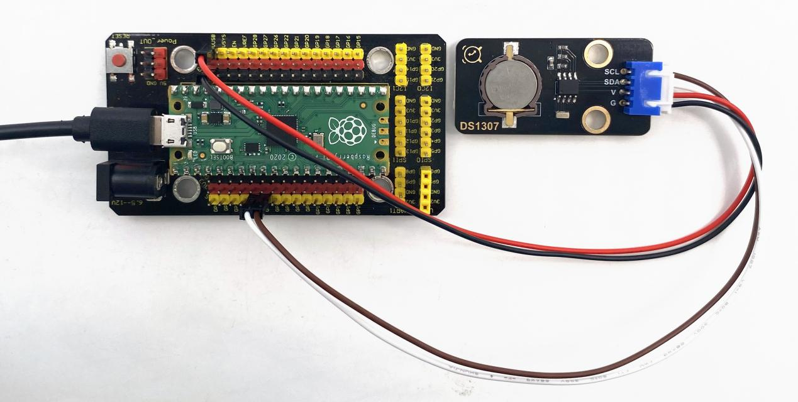

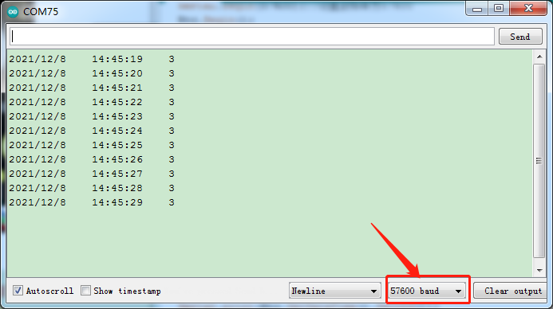

### 实验二十三 TM1650四位数码管模块

实验说明

这个模块主要由一个0.36英寸红色共阳4位数码管组成，它的驱动芯片是TM1650。使用时，我们只需要2根信号线即可使单片机控制4位数码管，大大节约了控制板IO口资源。TM1650是一种带键盘扫描接口的LED驱动控制专用电路。内部集成有MCU输入输出控制数字接口、数据锁存器、LED
驱动、键盘扫描等电路。TM1650性能稳定、质量可靠、抗干扰能力强，可适用于24小时长期连续工作的应用场合。TM1650采用两线串行传输协议通讯（注意该数据传输协议不是标准的I2C协议）。该芯片只需要通过两个引脚与MCU通讯就可以完成数码管的驱动，可以节省MCU引脚资源。

实验中，我们利用四位数码管从0到9999累加显示出来，并刷新时间为0.01秒。

实验原理

TM1650采用的是IIC协议。使用SDA、SCL两条总线。

我们使用封装好的库函数直接驱动，当然大家有兴趣也可以去了解底层的库函数是如何实现的。

数据命令设置：0x48，这个是告诉TM1650，我们要用点亮数码管的功能，而不是按键扫描的功能

显示命令设置：

这里实际是一个字节数据，只是不同位部分代表不同功能。   bit\[6:4\]：设置数码管亮度，注意，000是最亮。   bit\[3\]：设置要不要显示小数点   bit\[0\]：是不是要开启数码管的显示

实验器材

||||||
|-|-|-|-|-|
|Raspberry Pi Pico板*1|Raspberry Pi Pico扩展板*1|keyes DIY子积木 TM1650四位数码管模块*1|防反插4Pin*1|MicroUSB线*1|

接线图

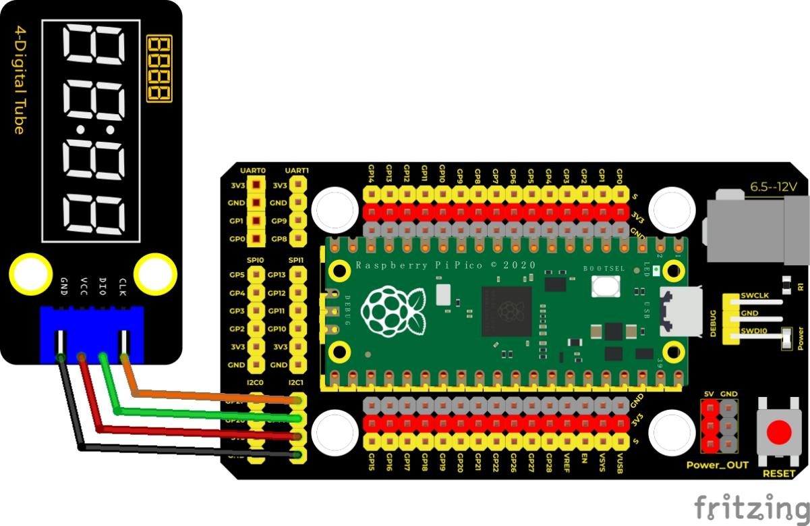

测试代码

/\*

Keyes Starter Kit for Raspberry Pi Pico

lesson 23

TM1650 Four digital tube

\*/

\#include "KETM1650.h" //导入TM1650的库文件

int item = 0; //要显示的值

//两线接口为GP14, GP15

\#define DIO 15

\#define CLK 14

KETM1650 tm_4display(CLK, DIO);

void setup() {

tm_4display.init(); //初始化

tm_4display.setBrightness(3); //设置 亮度为3，范围（1~8）

}

void loop() {

tm_4display.displayString(item);//四位数码管显示item值

item = item + 1; //自加一

if (item \> 9999) { //加到超过9999时，清零

item = 0;

}

delay(100); //延时100毫秒

}

代码说明

同样我们需要先导入TM1650模块的库文件，下面介绍一些常用的函数接口：

.init();初始化TM1650

.clear();清除数码管显示

.displayString(char
\*aString);显示字符串，\*aString指向aString的字符串内容

.displayString(String sString);显示字符串，sString为字符串

.displayString(float value);显示小数，内容为float型

.displayString(double value);显示小数，内容为double型

.displayString(int value);显示整数，内容为int型

.displayOn();打开数码管显示

.displayOff();关闭数码管显示，与.clear方法不同的是，一旦关闭必须调用.displayOn();才能重新显示。

.setDot(unsigned int aPos, bool aState);显示小数点，aPos为小数点的位置（0~3）对应（1~4），aState为显示状态：1（true）点亮，2（false）熄灭。

.setBrightness(unsigned int iBrightness);设置数码管的亮度，iBrightness为亮度值（1~8），类型为unsigned int，当设置小于1时自动设置1，当设置大于8时自动设置为8。

细节请看代码注释。

测试结果

烧录好测试代码，按照接线图连接好线,上电后，4位数码管从0开始显示的数字每10毫秒加1，直到大于9999又从0开始。

### 实验二十四 HT16K33_8X8点阵模块

实验说明

什么是点阵？我们用之前的方法一个IO口只能控制一个led，如果需要用更少的IO口控制更多的led怎么办呢，于是就有了点阵。

8X8点阵共由64个发光二极管组成，且每个发光二极管是放置在行线和列线的交叉点上，当对应的某一行置1电平，某一列置0电平，则相应的二极管就亮；如要将第一个点点亮，则1脚接高电平a脚接低电平，则第一个点就亮了。实验中我们用点阵显示一些字符图案图案。

实验原理

如原理图所示，我们如果想要点亮第一行第一列的那个LED灯，只需要把C1置高电平，R1置电平它就亮了，如果我们想让第一行led全部点亮，那么我们让R1为低电平，C1~C8全部为高电平就可以了，原理非常简单。但是这样的话我们总共需要用到16个IO口，这样就极大的浪费单片机资源。为此，我们特别设计了这个模块，利用HT16K33芯片驱动1个8\*8点阵，只需要利用单片机的I2C通信端口控制点阵，大大的节约了单片机资源。

有些模块上自带3个拨码开关，可以让你随意拨动开关，这是用来设置I2C通信地址的。设置方法如下表格。我们的这个模块中，模块已经固定了通信地址，A0，A1，A2全部接地，即地址为0x70.

|A0（1）|A1（2）|A2（3）|A0（1）|A1（2）|A2（3）|A0（1）|A1（2）|A2（3）|
|-|-|-|-|-|-|-|-|-|
|0（OFF）|0（OFF）|0（OFF）|1（ON）|0（OFF）|0（OFF）|0（OFF）|1（ON）|0（OFF）|
|OX70|OX71|OX72||
|A0（1）|A1（2）|A2（3）|A0（1）|A1（2）|A2（3）|A0（1）|A1（2）|A2（3）|
|1（ON）|1（ON）|0（OFF）|0（OFF）|0（OFF）|1（ON）|1（ON）|0（OFF）|1（ON）|
|OX73|OX74|OX75||
|A0（1）|A1（2）|A2（3）|A0（1）|A1（2）|A2（3）||
|0（OFF）|1（ON）|1（ON）|1（ON）|1（ON）|1（ON）|
|OX76|OX77|

实验器材

|||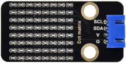|||
|-|-|-|-|-|
|Raspberry Pi Pico板*1|Raspberry Pi Pico扩展板*1|keyes DIY电 积木 HT16K33_8X8点阵模块*1|防反插4Pin*1|MicroUSB线*1|

接线图

测试代码

/\*

Keyes Starter Kit for Raspberry Pi Pico

lesson 24

HT16K33 8\*8 dot matrix

\*/

\#include \<Matrix.h\>//点阵的库

Matrix myMatrix(20, 21);

uint8_t LEDArray\[8\];

const uint8_t LedArray1\[8\] PROGMEM = {0x00, 0x18, 0x3c, 0x7e, 0xff, 0xff, 0x66, 0x00};//心形图案

void setup() {

myMatrix.begin(0x70);//iic地址

myMatrix.clear();//清除显示

myMatrix.setBrightness(5);//亮度5,范围0~15

}

void loop() {

memcpy_P(&LEDArray, &LedArray1, 8);

for (int i = 0; i \< 8; i++)

{

for (int j = 0; j \< 8; j++)

{

if ((LEDArray\[i\] & 0x01))

myMatrix.drawPixel(j, i, 1);

else

myMatrix.drawPixel(j, i, 0);

LEDArray\[i\] = LEDArray\[i\] \>\> 1;

}

}

myMatrix.write(); //显示

}

代码说明

1.  首先我们需要先导入库文件

2.  我们代码中的图案是一个字节数据类型的数组构成，我们在下面的表格上表示出来。

    我们将{0x00, 0x18, 0x3c, 0x7e, 0xff, 0xff, 0x66,     0x00}转化为二进制，填入下面的8\*8表格就清晰了。其中1表示亮，0表示灭，我们可以看到是一个心形。

|0|0|0|0|0|0|0|0|
|-|-|-|-|-|-|-|-|
|0|0|0|1|1|0|0|0|
|0|0|1|1|1|1|0|0|
|0|1|1|1|1|1|1|0|
|1|1|1|1|1|1|1|1|
|1|1|1|1|1|1|1|1|
|0|1|1|0|0|1|1|0|
|0|0|0|0|0|0|0|0|

测试结果

烧录好测试代码，按照接线图连接好线；上电后，点阵显示一个心形图案。

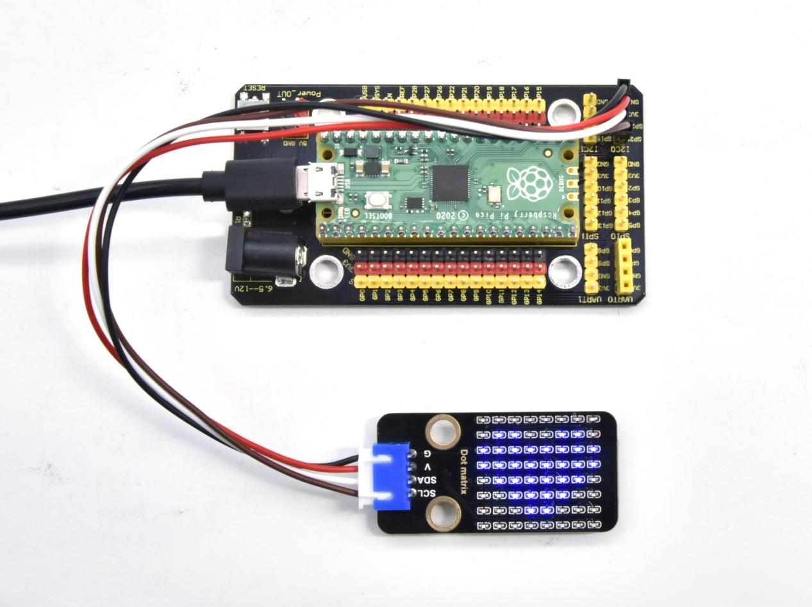

## 传感器/模块组合实验课程

前面课程中，我们单独测试了传感器/模块的功能，功能比较单一。在此，我们可以将多个传感器/模块搭配使用，组合出各种各样的功能。传感器/模块种类比较多，我们只是选择几款比较经典的组合实验。你们也可以根据自己的想法，自己设置代码，组合出你想要的特别的功能。

### 实验二十五 呼吸灯

实验说明

在第一课我们学习了如何点亮LED灯及让LED闪烁。但是LED的玩法远不仅如此，例如有时候我们看到灯光的慢慢变亮或者慢慢变暗，这个就叫呼吸灯，在前面第三章第三小节我们上传了一个示例代码，让我们的板载LED明暗变化，这个其实就是一个呼吸灯效果。所谓呼吸灯，就是控制LED首先逐渐变亮，然后逐渐变暗，循环交替，如人体呼吸一样。我们前面是直接用高电平点亮LED，用低电平熄灭LED，如果要让LED不那么亮但又不完全熄灭，那怎么办呢?这个也很简单，我们控制流过LED的电流就可以，电流小了，LED自然就暗了，也就是LED两端的电压小了LED就暗了。如何控制电压呢？前面我们已经学习的插件RGB就是利用PWM原理进行调色，所以我们使用PWM就可以了。

实验器材

<table >

||||||
|-|-|-|-|-|
|Raspberry Pi Pico板*1|Raspberry Pi Pico扩展板*1|keyes DIY电子积木 白色LED模块*1|防反插3Pin*1|MicroUSB线*1|

接线图

测试代码

/\*

\* Keyes Starter Kit for Raspberry Pi Pico

\* lesson 25

\* Breath

\*/

int LED = 15; //LED管脚接GP15

void setup() {

pinMode(LED, OUTPUT); //设置LED引脚为输出模式

}

void loop() {

for (int i = 0; i \<= 255; i++) { //从0到255，每次加1

analogWrite(LED, i);

delay(10);//延时10ms

}

for (int i = 255; i \>= 0; i--) { //从255到0，每次减1

analogWrite(LED, i);

delay(10);//延时10ms

}

}

代码说明

我们在此实验中用到for (int i = 0; i \<= 255; i = i +
1)；表示变量i从0到255，每次自加1，直到不满足 i \<=
255这个判断表达式，否则一直执行大括号里的代码，即一共执行256次大括号里的代码；同理for (int i = 255; i \>= 0; i = i - 1)；i每次自减1，当不满足i\>=
0时，跳出该for()循环，一共执行256次。

代码中，我们通过设置PWM值，控制模块上LED亮度。实验中，我们将模块信号端接在GPIO15脚。设置时我们设置PWM数值越小，模块上LED越暗，数值越大，模块上LED越亮，范围为0-255。analogWrite（pin，value），pin为PWM口，value是要输出的PWM值（0~255）。

通过整合前面知识，我们再来看代码，就清楚多了。将GP15的PWM输出值设置为i，i刚开始由0增加到255，每次加1，每加一次延迟10毫秒，模块上LED逐渐变亮。PWM为255后，i开始由255减小到0，每次减1，每减一次延迟10毫秒，模块上LED逐渐变暗。然后又逐渐变亮，循环交替，如人体呼吸一样。

如果我们感觉逐渐变亮
或者逐渐变暗的时间过长，我们可以更改代码设置。有两种方法，一种是将每次加1减1的延迟时间降低；另一种是更改步长，注意这个步长必须能被255整除，如3 5。步长改为3 -3代表i每次增加3或减小3。

测试结果

上传测试代码成功，上电后，模块上LED逐渐变暗。然后又逐渐变亮，循环交替，如人体呼吸一样。

### 实验二十六 按键控制LED灯

实验说明

从前面的实验课程中我们了解到按键模块按下我们的单片机读取到低电平，松开读取到高电平。在这一实验课程中，我们利用按键和LED做一个扩展，如果当按键按下时即读取到低电平时我们点亮LED，松开按键时即读取到高电平时我们熄灭LED，这样就可以通过一个模块控制另一个模块了，但是这样似乎过于简单，所以我们在这里使用中断，按下按键LED点亮，再次按下按键LED熄灭，再次按下再次点亮...。

实验器材

|||||||
|-|-|-|-|-|-|
|Raspberry Pi Pico板*1|Raspberry Pi Pico扩展板*1|keyes DIY电子积木 白色LED模块*1|keyes DIY电子积木 单路按键模块*1|防反插3Pin*2|MicroUSB线*1|

接线图

测试代码

/\*

\* Keyes Starter Kit for Raspberry Pi Pico

\* lesson 26

\* button control LED

\*/

int button = 16;//按键的管脚接数字口16

int led = 15;//LED的管脚接GP15

bool led_flag;

void setup() {

pinMode(button, INPUT); //按键的管脚设置为输入模式

pinMode(led, OUTPUT); //LED的管脚设置为输出模式

attachInterrupt(digitalPinToInterrupt(button), toggle_handle, FALLING); //外部中断0，下降沿触发

}

void loop() {

digitalWrite(led, led_flag);//按下按键点亮LED或者熄灭LED

delay(100);

}

void toggle_handle(){//切换LED状态

led_flag = !led_flag;

}

代码说明

1.  我们需要跟前面学习的课程一样，根据接线设置传感器/模块连接的IO口，然后配置引脚模式。

2.  attachInterrupt(digitalPinToInterrupt(button), toggle_handle,     FALLING)触发模式为下降沿触发也就是高电平变为低电平时，触发中断，然后调用中断服务函数toggle_handle，每次进入中断，我们都把变量led_flag取反，这样就可以按下点亮再次按下熄灭的效果了。

测试结果

上传测试代码成功，按照接线图接好线，利用USB上电后，当我们按下按键，LED被点亮，再次按下按键，LED熄灭。

### 实验二十七 障碍物报警实验

实验说明

在前面实验课程中中，我们利用一个输入模块控制另一个输出模块。在这一实验中，我们还是用一个模块控制另一个模块，当避障传感器检测到障碍物时有源蜂鸣器响起。

生活中，我们可以利用一个检测传感器控制一个有源蜂鸣器响起或者LED点亮，做声光报警设备，如检测磁场（干簧管）、检测倾斜（倾斜模块）等等。

实验器材

|||||||
|-|-|-|-|-|-|
|Raspberry Pi Pico板*1|Raspberry Pi Pico扩展板*1|keyes DIY电子积木 避障传感器*1|keyes DIY电子积木 有源蜂鸣器模块*1|防反插3Pin*2|MicroUSB线*1|

接线图

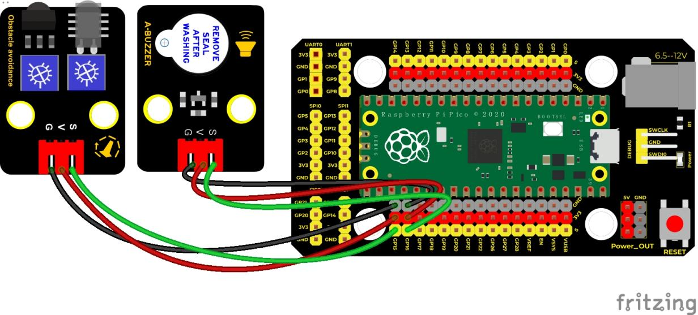

测试代码

/\*

\* Keyes Starter Kit for Raspberry Pi Pico

\* lesson 27

\* Avoiding alarm

\*/

int item = 0;

void setup() {

pinMode(15, INPUT); //避障传感器接GP15并设置为输入模式

pinMode(16, OUTPUT); //蜂鸣器接GP16并设置为输出模式

}

void loop() {

item = digitalRead(15);//读取避障传感器输出的电平值

if (item == 0) {//检测到障碍物

digitalWrite(16, HIGH);//蜂鸣器响起

} else {//没有检测到障碍物

digitalWrite(16, LOW);//蜂鸣器关闭

}

delay(100);//延时100ms

}

代码说明

1.  我们需要跟前面学习的课程一样，根据接线设置传感器/模块连接的IO口，然后配置引脚模式。

2.  我们前面已经知道，按下按键我们读取的值为0，那么我们通过if...else...语句判断按键值为0if     (item == 0)来响起蜂鸣器 digitalWrite(16, HIGH)。

测试结果

上传测试代码成功，按照接线图接好线，上电后，检测到障碍物时，外接的有源蜂鸣器响起声音，否则有源蜂鸣器停止响音。

### 实验二十八 pico入侵检测报警器

实验说明

在上一课实验中，我们利用避障传感器检测障碍物进行报警提醒，在这一实验中，我们利用人体红外热释传感器检测结果控制一个有源蜂鸣器响起和板载LED快速闪烁。

实验器材

|||||||
|-|-|-|-|-|-|
|Raspberry Pi Pico板*1|Raspberry Pi Pico扩展板*1|keyes DIY电子积木 人体红外热释传感器*1|keyes DIY电子积木 有源蜂鸣器模块*1|防反插3Pin*2|MicroUSB线*1|

接线图

测试代码

/\*

\* Keyes Starter Kit for Raspberry Pi Pico

\* lesson 28

\* PIR alarm

\*/

int item = 0;

void setup() {

pinMode(15, INPUT); //人体红外传感器接GP15并设置为为输入模式

pinMode(16, OUTPUT);//有缘蜂鸣器接GP16并设置为为输出模式

}

void loop() {

item = digitalRead(15);//读取红外热释传感器输出的数字电平信号

if (item == 1) { //检测到有人运动

digitalWrite(16, HIGH); //打开蜂鸣器

} else { //没有检测到

digitalWrite(16, LOW); //关闭蜂鸣器

}

}

代码说明

实验中代码设置与前面实验相同，这里就不多说了。

测试结果

上传测试代码成功，按照接线图接好线，上电后，传感器检测到附近有人运动时，外接的有源蜂鸣器响起声音，否则有源蜂鸣器停止响声。

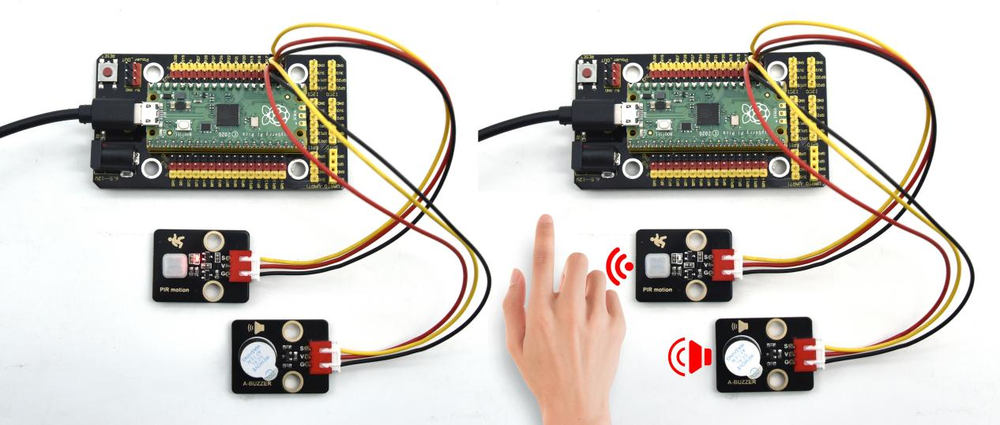

### 实验二十九 音乐播放

实验说明

在前面的单个模块是学校中，我们学习了让8002b功放
喇叭模块发出特定频率的声音、播放的节拍以及调节喇叭的声音大小，其实每首音乐就是由一个个特定的节拍与音调（频率）组合而成的。在这一实验中，我们利用这个喇叭模块播放一首音乐。

要演奏出音乐，我们首先需要搞清楚各音调的频率，具体见下表：

低音：

|音调音符|1#|2#|3#|4#|5#|6#|7#|
|-|-|-|-|-|-|-|-|
|A|221|248|278|294|330|371|416|
|B|248|278|294|330|371|416|467|
|C|131|147|165|175|196|221|248|
|D|147|165|175|196|221|248|278|
|E|165|175|196|221|248|278|312|
|F|175|196|221|234|262|294|330|
|G|196|221|234|262|294|330|371|

中音：

<table >

|音调音符|1|2|3|4|5|6|7|
|-|-|-|-|-|-|-|-|
|A|441|495|556|589|661|724|833|
|B|495|556|624|661|724|833|935|
|C|262|294|330|350|393|441|495|
|D|294|330|350|393|441|495|556|
|E|330|350|393|441|495|556|624|
|F|350|393|441|495|556|624|661|
|G|393|441|495|556|624|661|724|

高音：

|音调音符|1#|2#|3#|4#|5#|6#|7#|
|-|-|-|-|-|-|-|-|
|A|882|990|1112|1178|1322|1484|1665|
|B|990|1112|1178|1322|1484|1665|1869|
|C|525|589|661|700|786|882|990|
|D|589|661|700|786|882|990|1112|
|E|661|700|786|882|990|1112|1248|
|F|700|786|882|935|1049|1178|1322|
|G|786|882|990|1049|1178|1322|1484|

我们知道了音调的频率后，下一步就是控制音符的演奏时间。每个音符都会播放一定的时间，这样才能构成一首优美的曲子，而不是生硬的一个调的把所有的音符一股脑的都播放出来。音符节奏分为一拍、半拍、1/4拍、1/8拍，我们规定一拍音符的时间为1；半拍为0.5；1/4拍为0.25；1/8拍为0.125……，所以我们可以为每个音符赋予这样的拍子播放出来，音乐就成了。

这里我们具体以《生日快乐》为例：

实验器材

||||||
|-|-|-|-|-|
|Raspberry Pi Pico板*1|Raspberry Pi Pico扩展板*1|keyes DIY电子积木 8002b功放 喇叭模块*1|防反插3Pin*1|MicroUSB线*1|

接线图

测试代码

/\*

\* Keyes Starter Kit for Raspberry Pi Pico

\* lesson 29

\* play music

\*/

\#define D0 -1

\#define D1 262

\#define D2 293

\#define D3 329

\#define D4 349

\#define D5 392

\#define D6 440

\#define D7 494

\#define M1 523

\#define M2 586

\#define M3 658

\#define M4 697

\#define M5 783

\#define M6 879

\#define M7 987

\#define H1 1045

\#define H2 1171

\#define H3 1316

\#define H4 1393

\#define H5 1563

\#define H6 1755

\#define H7 1971

//列出全部D调的频率

\#define WHOLE 1

\#define HALF 0.5

\#define QUARTER 0.25

\#define EIGHTH 0.25

\#define SIXTEENTH 0.625

//列出所有节拍

int tune\[\] = //根据简谱列出各频率

{

D5, D5, D6, D5, M1, D7,

D5, D5, D6, D5, M2, M1,

D5, D5, M5, M3, M1, D7, D6,

M4, M4, M3, M1, M2, M1

};

float durt\[\] = //根据简谱列出各节拍

{

0.5, 0.5, 1, 1, 1, 1 + 1,

0.5, 0.5, 1, 1, 1, 1 + 1,

0.5, 0.5, 1, 1, 1, 1, 1,

0.5, 0.5, 1, 1, 1, 1 + 1

};

int beeppin = 15; //功放喇叭引脚接GP15

int length;

void setup() {

pinMode(beeppin, OUTPUT); //设置蜂鸣器引脚输出模式

length = sizeof(tune) / sizeof(tune\[0\]); //计算长度

}

void loop() {

for (int x = 0; x \< length; x++)

{

tone(beeppin, tune\[x\]);

delay(500 \* durt\[x\]);
//这里用来根据节拍调节延时，500这个指数可以自己调整，在该音乐中，我发现用500比较合适。

noTone(beeppin);

}

delay(2000);

}

代码说明

我们先是列出了所有D调的频率，方便后面使用。然后根据简谱列出各频率，再列出各节拍，我们用到的一个节拍为500ms，这个可以自己调整，然后循环响起音调与对应节拍就成了一首歌曲。

测试结果

上传测试代码成功，按照接线图接好线，功放喇叭模块播放出生日快乐歌曲。

### 实验三十 旋转编码器模块控制RGB模块

实验说明

在前面课程的实验十八中，我们利用旋转编码器计数。在这里我们将它扩展一下，通过得出的计数，我们用来控制RGB模块上LED显示不同颜色。

设计代码时，我们需要对所得数据取绝对值。然后我们将数据除以3，得到余数，余数为0控制插件RGB模块上LED亮红光，余数为1，RGB模块上LED亮绿光，余数为2，RGB模块上LED亮蓝光。

实验器材

|||||
|-|-|-|-|
|Raspberry Pi Pico板*1|Raspberry Pi Pico扩展板*1|keyes DIY电子积木 共阴RGB模块*1|keyes DIY电子积木 旋转编码器模块*1|
|||||
|防反插5Pin*1|防反插4Pin*1|MicroUSB线*1||

接线图

测试代码

/\*

Keyes Starter Kit for Raspberry Pi Pico

lesson 30

Encoder control RGB

\*/

//Interfacing Rotary Encoder with Arduino

//Encoder Switch -\> pin 20

//Encoder DT -\> pin 19

//Encoder CLK -\> pin 18

int Encoder_DT = 19;

int Encoder_CLK = 18;

int Encoder_Switch = 20;

int Previous_Output;

int Encoder_Count;

int redPin = 9; //定义红色接D9

int greenPin = 10; //定义绿色接D10

int bluePin = 11; //定义蓝色接D11

int val;

void setup() {

Serial.begin(9600);

//pin Mode declaration

pinMode (Encoder_DT, INPUT);

pinMode (Encoder_CLK, INPUT);

pinMode (Encoder_Switch, INPUT);

Previous_Output = digitalRead(Encoder_DT); //Read the inital value of Output A

pinMode(redPin, OUTPUT);

pinMode(greenPin, OUTPUT);

pinMode(bluePin, OUTPUT);

}

void loop() {

//aVal = digitalRead(pinA);

if (digitalRead(Encoder_DT) != Previous_Output)

{

if (digitalRead(Encoder_CLK) != Previous_Output)

{

Encoder_Count ++;

Serial.print(Encoder_Count);

Serial.print(" ");

val = Encoder_Count % 3;

Serial.println(val);

}

else

{

Encoder_Count--;

Serial.print(Encoder_Count);

Serial.print(" ");

val = Encoder_Count % 3;

Serial.println(val);

}

}

Previous_Output = digitalRead(Encoder_DT);

if (digitalRead(Encoder_Switch) == 0)

{

delay(5);

if (digitalRead(Encoder_Switch) == 0) {

Serial.println("Switch pressed");

while (digitalRead(Encoder_Switch) == 0);

}

}

if (val == 0) {

//红色(255, 0, 0)

analogWrite(9, 255);

analogWrite(10, 0);

analogWrite(11, 0);

} else if (val == 1) {

//绿色(255, 0, 0)

analogWrite(9, 0);

analogWrite(10, 255);

analogWrite(11, 0);

} else {

//蓝色(255, 0, 0)

analogWrite(9, 0);

analogWrite(10, 0);

analogWrite(11, 255);

}

}

代码说明

1.  在实验中我们将val设置为Encoder_Count除以3的余数，Encoder_Count是编码器的值。得到余数后根据接线设置管脚为9（红灯）、10（绿灯）和11（蓝灯）。参考前面实验学习的控制方法，利用余数控制模块上LED显示对应灯光颜色，任何数对3进行取余得到的值都是0或1或2，我们就利用这三个值来判断，并显示对应的颜色。

测试结果

上传测试代码成功，按照接线图接好线，上电后，打开串口监视器，设置波特率为9600。旋转编码器，串口监视器显示对应余数。即可控制外接的RGB模块上的LED的颜色（红绿蓝）。

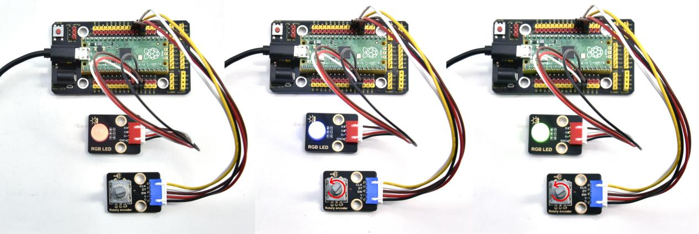

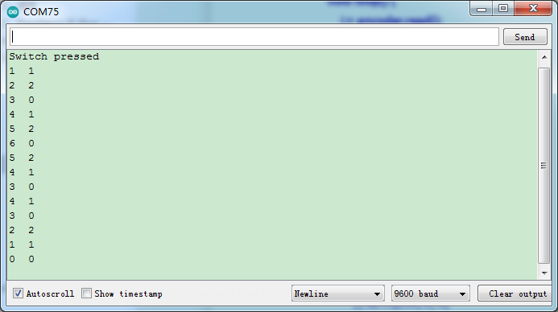

### 实验三十一 电位器调节灯光亮度

实验说明

在前面课程中，我们学习了呼吸灯、按键控制LED灯，我们可不可以把这两个实验现象结合起来呢？答案是肯定的。学习利用可调电位器读取模拟值的方法，我们利用从可调电位器读取到的模拟值控制LED的亮度。设计代码时，模拟值的范围是0-4095；LED的亮度是由PWM值控制，范围为0-255，我们需要把模拟值范围映射到PWM值范围再来控制。

设置成功后，我们就可以通过旋转电位器，控制模块上LED的亮度。

实验器材

<table >

|||||||
|-|-|-|-|-|-|
|Raspberry Pi Pico板*1|Raspberry Pi Pico扩展板*1|keyes DIY电子积木 白色LED模块*1|keyes DIY电子积木 旋转电位器传感器*1|防反插3Pin*2|MicroUSB线*1|

接线图

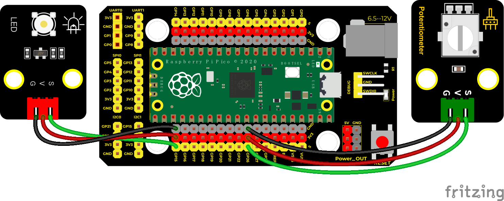

测试代码

/\*

Keyes Starter Kit for Raspberry Pi Pico

lesson 31

adjust the light

\*/

int val1 = 0;//这个变量用来存放模拟值

int val2 = 0;//这个变量用来存放要输出的PWM值

void setup() {

Serial.begin(9600);//设置波特率为9600

}

void loop() {

val1 = analogRead(26);//读取电位器的模拟值

Serial.print(val1);//打印模拟值

Serial.print(" ");

val2 = map(val1, 0, 4095, 0, 255);//把模拟值范围映射到输出到PWM值范围

Serial.println(val2);//打印转换后的PWM值

analogWrite(15, val2);//引脚15输出PWM值

delay(100);//延时100ms

}

代码说明

设置变量，控制设置，以及串口通信，我们都在前面课程中介绍了。实验中映射功能

将val1从范围0-4095映射到0-255，并赋值给val2，这里可参照前面实验十九的代码说明。

测试结果

上传测试代码成功，上电后，滑动模块上电位器，就可以调节LED模块上的LED的亮度。

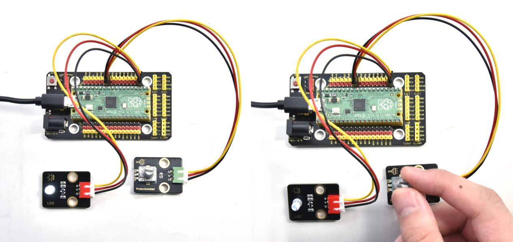

### 实验三十二 声控灯

实验说明

如今智能家居发展迅速，很多人都想自己制作一个可以根据温度和湿度发生变换的智能感光声控灯，在这里我就教大家做一个最简单的智能声控灯。这些灯平时不亮，当我们吼一句或者拍拍手，LED自动亮起；当没有声音时，这些灯就自动关闭。难道是有人在手动控制这些灯光？实际上不是的，实际上这些灯光上都安装有声音探测元件，这些传感器将外界声音的大小，转换成对应数值。然后设置一个临界点，当超过临界点时，控制灯光熄灭，没有超过时，控制灯光亮起。

在这个实验中，我们利用套件中自带的声音传感器和LED模块模拟这一现象。

实验器材

|||||||
|-|-|-|-|-|-|
|Raspberry Pi Pico板*1|Raspberry Pi Pico扩展板*1|keyes DIY电子积木 声音传感器*1|keyes DIY电子积木 白色LED模块*1|防反插3Pin*2|MicroUSB线*1|

接线图

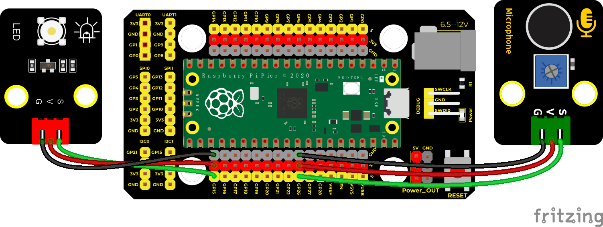

测试代码

/\*

Keyes Starter Kit for Raspberry Pi Pico

lesson 32

sound-controlled lights

\*/

int ledPin = 15;//LED接GP15

int microPin = 26;//声音传感器接ADC0（GP26）

void setup() {

Serial.begin(9600);//设置波特率为9600

pinMode(ledPin, OUTPUT);//LED为输出模式

}

void loop() {

int val = analogRead(microPin);//读取模拟值

Serial.print(val);//串口打印

if(val \> 200){//超过阈值200

digitalWrite(ledPin, HIGH);//点亮LED3s，并打印相应信息

Serial.println(" led on");

delay(3000);

}else{//否则

digitalWrite(ledPin, LOW);//关闭LED， 并打印相应信息

Serial.println(" led off");

}

delay(100);

}

代码说明

在实验中，我们设置了当模拟值阈值为200，超过200点亮LED 3秒，否则熄灭。

测试结果

运行测试代码，shell显示对应音量模拟值。我们制造声音，数据变大，大于200时，LED模块上LED亮起，否则熄灭。

### 实验三十三 6812花样彩灯

实验说明

晚上的时候，我们可以看到各种各样的非常漂亮，炫目的灯光。城市的夜景也是是一个个霓虹灯组成，其实这么美丽炫目的灯光，我们也可以用我们的模块来完成。在前面实验三十，我们学会了使用6812RGB模块，我们知道这个模块只用到一个管脚便可点亮任何一个灯的任何一种颜色；我们这个实验就通过制作一个炫目的灯光来加深对这个灯的印象。（注意，灯光的亮度可能过高，避免用眼睛长时间直视灯珠！以免损害我们的眼睛。）

实验器材

||||||
|-|-|-|-|-|
|Raspberry Pi Pico板*1|Raspberry Pi Pico扩展板*1|keyes DIY电子积木 6812 RGB模块*1|防反插3Pin*1|MicroUSB线*1|

接线图

测试代码

/\*

Keyes Starter Kit for Raspberry Pi Pico

lesson 33

SK6812 RGB

\*/

\#include"rgb.h"

RGB rgb(16, 4); //rgb(pin, num); num = 0-100

//用来储存RGB颜色的变量

int R = 0;

int G = 0;

int B = 0;

int num = 0;

void setup() {

rgb.setBrightness(100); //rgb.setBrightness(0-255);

delay(10);

rgb.clear(); //Turn off all leds

delay(10);

}

void loop() {

num++;

if (num \> 3) { //num在0~3之间

//取0~255之间的随机整数

R = random(0, 255);

G = random(0, 255);

B = random(0, 255);

num = 0;

}

rgb.setPixelColor(num, R, G, B); //设置num-1灯号颜色

rgb.show();//显示

delay(100);//200ms刷新颜色

}

代码说明

random(0, 255):在0~255之间取随机数

.setPixelColor(num - 1, R, G, B)：设置num-1位置灯珠显示RGB颜色

.show()：显示，如果没有这个函数，我们前面设置的将不起作用

测试结果

上传代码成功后，按照接线图接好线，上电，我们就能看到我们6812RGB模块。四个灯珠以随机颜色显示流水灯。

### 实验三十四 超声波雷达

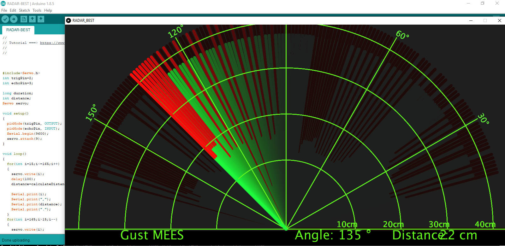

实验说明

我们知道，蝙蝠飞行与获取猎物是通过回声定位的。在现实生活中有种在水里专用的电子设备：声呐，一种声学探测设备，由于电磁波在水中衰减的速率非常的高，无法做为侦测的讯号来源，因此以声波探测水面下的人造物体成为运用最广泛的手段在水中进行观察和测量，具有得天独厚条件的只有声波。这是由于其他探测手段的作用距离都很短，光在水中的穿透能力很有限，即使在最清澈的海水中，人们也只能看到十几米到几十米内的物体；
电磁波在水中也衰减太快，而且波长越短，损失越大，即使用大功率的低频电磁波，也只能传播几十米。然而，声波在水中传播的衰减就小得多，在深海声道中爆炸一个几公斤的炸弹，在两万公里外还可以收到
信号，低频的声波还可以穿透海底几千米的地层，并且得到地层中的信息。在水中进行测量和观察，至今还没有发现比声波更有效的手段。

在前面实验中，我们学会了控制RGB模块发出彩色光；也学会了利用功放喇叭模块发出不同频率的声音及播放音乐，我们也学会了利用超声波传感器检测前方障碍物的距离，也会用四位数码管来显示检测数据；如果说，我们把这几个模块结合起来呢？我们利用距离大小控制功放喇叭模块模块响起对应频率的声音和RGB亮起对应颜色，然后把这个距离显示在四位数码管上。这就搭建好了一个简易的超声波雷达系统。

实验器材

||||||
|-|-|-|-|-|
|Raspberry Pi Pico板*1|Raspberry Pi Pico扩展板*1|HC-SR04超声波传感器*1|keyes DIY电子积木 8002b功放 喇叭模块*1|keyes DIY电子积木 共阴RGB模块*1|
||||||
|keyes DIY电子积木 TM1650四位数码管模块*1|防反插4Pin*3|防反插3Pin*1|MicroUSB线*1||

接线图

测试代码

/\*

Keyes Starter Kit for Raspberry Pi Pico

lesson 34

Ultrasonic radar

\*/

\#include "KETM1650.h"//四位数码管的库文件

KETM1650 tm_4display(15, 14);

int beeppin = 16; //定义喇叭引脚为GP16

int EchoPin = 19; //Echo引脚接GP19

int TrigPin = 20; //Trig引脚接GP20

int distance;//超声波测的距离

int redPin = 9; //定义红色接GP9

int greenPin = 10; //定义绿色接GP10

int bluePin = 11; //定义蓝色接GP11

float checkdistance() { //获取距离

// 预先给出一个短的低电平，以确保一个干净的高脉冲:

digitalWrite(TrigPin, LOW);

delayMicroseconds(2);

// 传感器由10微秒或更长时间的高脉冲触发

digitalWrite(TrigPin, HIGH);

delayMicroseconds(10);

digitalWrite(TrigPin, LOW);

// 读取来自传感器的信号:一个高电平脉冲，

//其持续时间是指从发送ping命令到接收物体回波的时间(以微秒计)。

float distance = pulseIn(EchoPin, HIGH) / 58.00; //换算成距离

delay(10);

return distance;

}

void setup() {

tm_4display.init(); //数码管初始化

pinMode(TrigPin, OUTPUT);//Trig引脚为输出

pinMode(EchoPin, INPUT); //Echo引脚为输入

pinMode(beeppin, OUTPUT);//定义功放喇叭模块数字口为输出模式

pinMode(redPin, OUTPUT);

pinMode(greenPin, OUTPUT);

pinMode(bluePin, OUTPUT);

}

void loop() {

distance = checkdistance(); //超声波测距

tm_4display.displayString(distance); //数码管显示距离

if (distance \<= 10) {

tone(beeppin, 880);

delay(100);

noTone(beeppin);

analogWrite(9, 255);//红色(255, 0, 0)

analogWrite(10, 0);

analogWrite(11, 0);

} else if (distance \> 10 && distance \<= 20) {

tone(beeppin, 532);

delay(200);

noTone(beeppin);

analogWrite(9, 0);//蓝色(255, 0, 0)

analogWrite(10, 0);

analogWrite(11, 255);

} else {

analogWrite(9, 0);//绿色(255, 0, 0)

analogWrite(10, 255);

analogWrite(11, 0);

}

}

代码说明

1.  设置时，我们通过调节不同距离范围，设置声音频率和灯光颜色。

2.  为方便控制障碍物距离，我们可以在上面代码中，根据实际情况，在控制逻辑里调节距离范围。

测试结果

上传测试代码成功，按照接线图接好线，上电后，超声波传感器检测到障碍物不同距离时，外接无源蜂鸣器模块上蜂鸣器响起不同频率的声音、RGB亮起不同的颜色，并且测得的距离显示在四位数码管上。

### 实验三十五 红外遥控灯

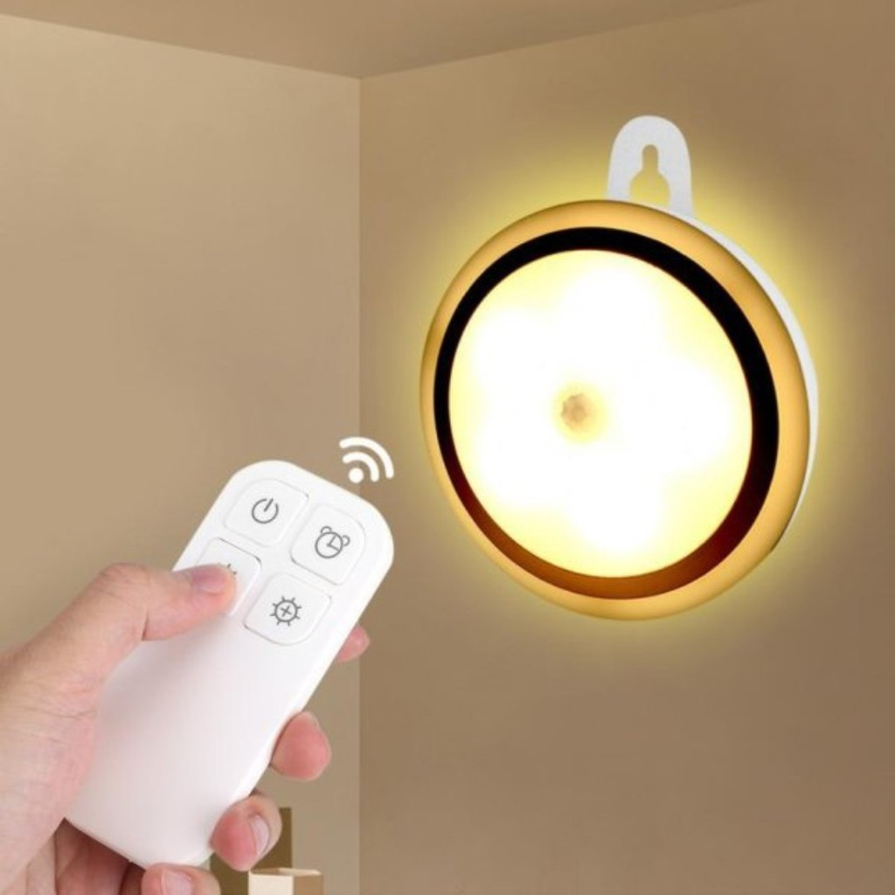

实验说明

大家生活中不知道有没有这个场景，当我们快要入睡的时候，还没有关灯，然而灯的开关又比较远，当我们起床去关灯，又影响了我们入睡，这个时候大家是不是希望有个遥控器能遥控电视一样来控制灯光，这样就方便多了。在前面实验中，我们学会了点亮或熄灭LED、利用PWM技术调节灯光的亮度；实验二十一，我们学会了使用红外接收模块，并把接收到的遥控器的信息打印了出来。那么在这个实验中，我们就用红外遥控接控制我们的LED模块亮灭和亮度。

当我们接收到一个按键值时，我们通过对应按键值来设置输出的PWM值，这样就可以设置亮度了，控制LED亮灭也一样，但是如果说，在控制LED亮灭这里，我们用同一个按键来控制LED的亮与灭，就需要一个灵活的编程技巧了。我们可以先自己思考，再来看程序。

实验器材

|||||
|-|-|-|-|
|Raspberry Pi Pico板*1|Raspberry Pi Pico扩展板*1|keyes DIY电子积木 白色LED模块*1|keyes DIY电子积木 红外接收模块*1|
|||||
|MicroUSB线*1|遥控器*1|防反插3Pin*2||

接线图

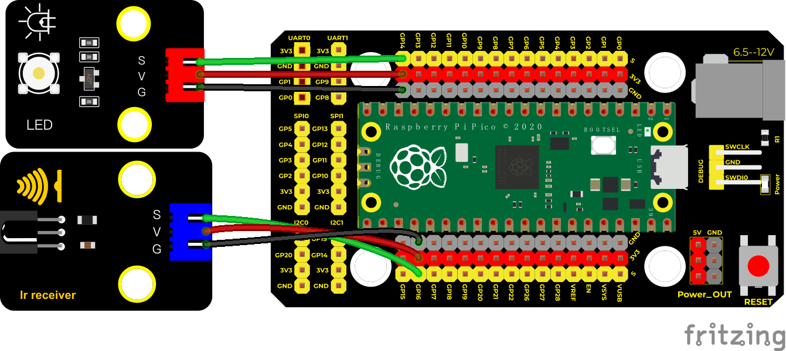

测试代码

/\*

Keyes Starter Kit for Raspberry Pi Pico

lesson 35

IR control LED

\*/

\#include"ir.h"

IR IRreceive(16);//红外接收接GP16

int led = 14;//LED接GP14

boolean flag = true;//LED标志位

void setup() {

Serial.begin(9600);

pinMode(led, OUTPUT);

delay(1000);

}

////////////////////

void loop() {

Serial.println("IR receive");

while (1) {

int key = IRreceive.getKey();

if (key != -1) {

Serial.print(key);

if (key == 64) { //按下OK键

if (flag == true) {//flag为真

digitalWrite(led, HIGH);//打开LED

Serial.println(" led on");

flag = false;//flag变为假

} else { //flag为假

digitalWrite(led, LOW);//关闭LED

Serial.println(" led off");

flag = true;//flag变为真

}

}

}

}

}

代码说明

1\.
与前面定义变量不同，这里我们定义一个布尔变量，布尔变量的值只有两个，真（true）或者假（false），boolean flag = true。

2\.
我们按下OK键时，红外接收的值为64，此时我们需要设置一个布尔变量flag，flag为真(true)的时候点亮LED，为假(false)的时候熄灭LED，点亮LED后我们又把它设置为假，这样当下次按下OK键时，LED将熄灭。

测试结果

上传测试代码成功，按照接线图接好线，上电后，打开串口监视器，设置波特率为9600.按下遥控器按钮，串口监视器显示我们按下的值，按下ok键点亮LED，再次按下LED熄灭LED。

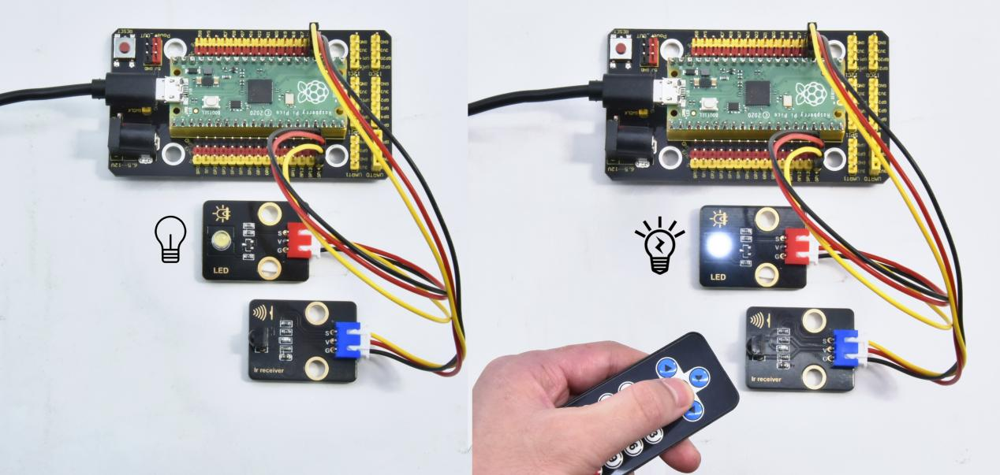

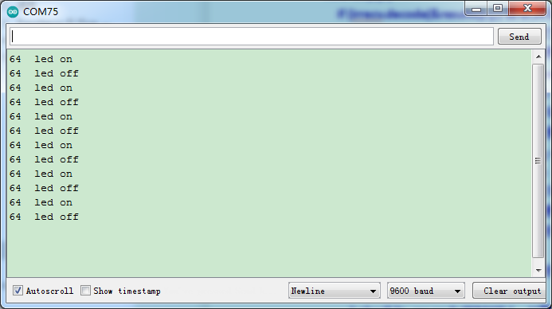

### 实验三十六 综合实验

实验说明

在前面我们做了很多实验，每做一个实验，我们都需要重新上传一次代码。那我们可以把多个实验组合在一起吗？可以的，在这一实验中，我们将第四章节中的实验三、实验十一、实验十六、实验十七、实验二十、实验二十一和本章节中的实验一，组合在一起。设置时，我们利用外接按键模块。每按一次按键，功能变换一次，实验功能循环交替。

实验器材

||||||
|-|-|-|-|-|
|Raspberry Pi Pico板*1|Raspberry Pi Pico扩展板*1|keyes DIY电子积木 白色LED模块*1|keyes DIY电子积木 单路按键模块*1|keyes DIY电子积木 旋转电位器模块*1|
||||||
|keyes DIY电子积木 红外接收模块*1|keyes DIY电子积木 摇杆模块*1|keyes brick HC-SR04超声波传感器*1|Keyes DIY电子积木 6812 RGB模块*1|MicroUSB线*1|
||||||
|防反插3Pin*5|防反插4Pin*1|防反插5Pin*1|遥控器*1||

接线图

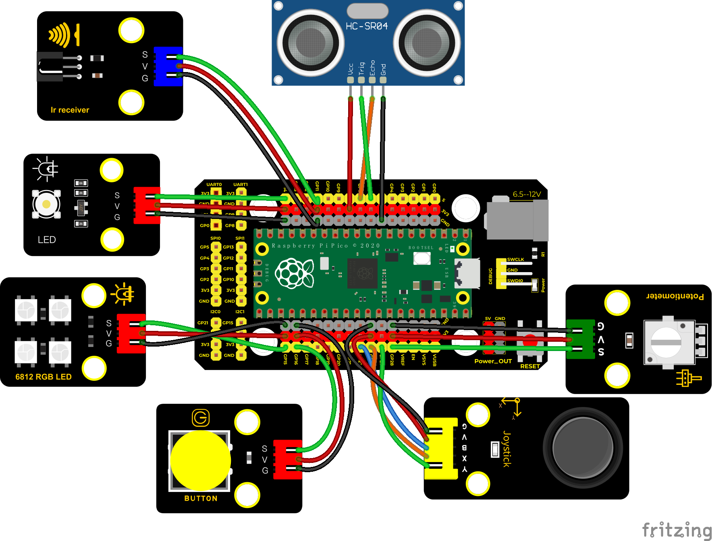

测试代码

/\*

Keyes Starter Kit for Raspberry Pi Pico

lesson 36

Comprehensive experiment

\*/

\#include"rgb.h"//6812的库

\#include"ir.h"//红外接收的库

//rgb6812接GP15

RGB rgb(15,4); //rgb(pin, num); num = 0-100

//红外接收接GP11

IR IRreceive(11);

//摇杆模块接口

int X = 26;

int Y = 27;

int KEY = 22;

//电位器管脚接模拟口28

int resPin = 28;

//LED接GP14

int LED = 14;

//超声波传感器接口

int Trig = 6;

int Echo = 7;

//按键模块接口

int button = 16;

int PushCounter = 0;//存放按键按下的次数

int State = 1;//按键的状态

int LastState = 1;//上一个状态，要么按下，要么松开，两种状态

int PushCounter1 = 0;//对PushCounter取余后的值

void setup() {

Serial.begin(9600);//设置波特率为9600

rgb.setBrightness(80); //rgb.setBrightness(0-255);

rgb.clear(); //Turn off all leds

delay(10);

pinMode(KEY, INPUT);//遥感模块的按钮

pinMode(button, INPUT);//按键模块

pinMode(Trig, OUTPUT);//超声波模块

pinMode(Echo, INPUT);

delay(1000);

}

void loop() {

State = digitalRead(button);//读取按键模块的状态

if (LastState != State) { //按键的状态改变了

if (State == 0) { //按下了按键

PushCounter = PushCounter + 1; //累计按下次数加1

}

}

LastState = State;//刷新上一次状态

PushCounter1 = PushCounter % 5;
//对按下状态对5取余，也就是按5次就重新开始

if (PushCounter1 == 0) { //余数为0

yushu_0(); //6812显示

} else if (PushCounter1 == 1) { //余数为1

yushu_1(); //显示红外遥控信号

} else if (PushCounter1 == 2) { //余数为2

yushu_2(); //显示摇杆值

} else if (PushCounter1 == 3) { //余数为3

yushu_3(); //显示电位器控制LED

} else if (PushCounter1 == 4) { //余数为4

yushu_4(); //显示超声波测的距离

}

}

//6812

void yushu_0() {

int R = random(0, 255);

int G = random(0, 255);

int B = random(0, 255);

for(int i=0; i\<4; i++){

rgb.setPixelColor(i, R, G, B);

rgb.show();

}

delay(300);

}

//红外接收

void yushu_1() {

bool flag = 1;

while(flag){

int key = IRreceive.getKey();

if(key != -1){

Serial.println(key);

if(key == 74){

PushCounter = 2;

Serial.print(PushCounter);

flag = 0;

}

}

}

}

void yushu_2() {

int x = analogRead(X);

int y = analogRead(Y);

int key = digitalRead(KEY);

Serial.print("X:");

Serial.print(x);

Serial.print(" Y:");

Serial.print(y);

Serial.print(" KEY:");

Serial.println(key);

delay(100);

}

void yushu_3() {

int RES = analogRead(resPin);

int res = map(RES, 0, 4095, 0, 255);

Serial.println(res);

analogWrite(LED, res);

delay(100);

}

void yushu_4() {

float distance = checkdistance();

Serial.print("distance:");

Serial.print(distance);

Serial.println("cm");

delay(100);

}

float checkdistance() {

digitalWrite(Trig, LOW);

delayMicroseconds(2);

digitalWrite(Trig, HIGH);

delayMicroseconds(10);

digitalWrite(Trig, LOW);

float distance = pulseIn(Echo, HIGH) / 58.00;

delay(10);

return distance;

}

代码说明

1.  设置时，我们参考本章节实验三十方法。计算出按下按键的次数，除以5，得到余数，为0     1 2 3 4 ，根据不同的余数，构造5个独一的函数来控制实验实现不同功能。

2.  参照介绍方法，我们可以在接线中添加或减少传感器/模块，然后在代码中更改实验功能。

测试结果

上传测试代码成功，按照接线图接好线，利用USB上电。

刚开始时，按键次数为0，余数为0，6812RGB模块上四个灯珠循环闪烁随机颜色。点击打开串口监视器，设置波特率为9600，按一下按键（时间长些），6812灯停止闪烁，按键次数为1，余数为1，实验实现的功能是红外接收模块红外发射信息。如果我们利用红外遥控对准接收模块接收头，按下按键，红外接收头接收到信息，串口监视器显示如下。

特别注意：如果先按下按键，按键次数变为1，再打开串口监视器时，程序会复位，按键成次数会变为0，需要再按下按键重新设置按键次数。

按下遥控器#键退出，按键数为2，余数为2，实验实现的功能是读取摇杆模块传感器X轴和Y轴对应的模拟值，KEY（Z轴）接口对应的数字值，串口监视器显示如下图。

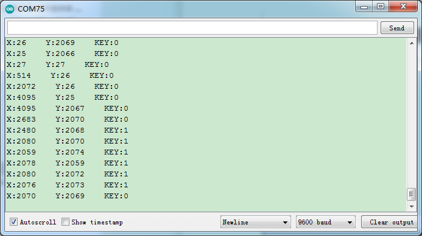

再按一下按键，按键次数为3，余数为3，实验实现的功能是利用外接可调电位器模块调节LED(GP14)接口的PWM值，从而调节外接的白色LED模块上LED的亮度。串口监视器显示图下图。

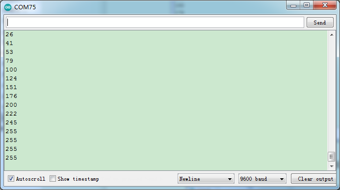

再按一下按键，按键次数为4，余数为4，实验实现的功能是利用超声波模块检测距离并在串口打印出来，串口监视器显示图下图。

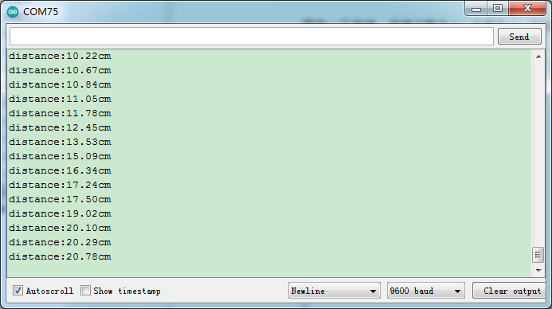

再按一下按键，按键次数为5，余数为0，实现初始时的现象，6812RGB再次闪烁。不断按下按键，余数循环变化，实验功能也循环变化。
