# Raspberry Pi Pico和Arduino IDE

## **第1小节 Raspberry Pi Pico简介**

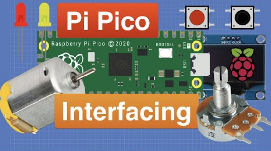 

2021年1月底的时候，树莓派基金会发布了一个重磅消息，推出了进军微控制器领域的树莓派Pico。功能强劲，价格便宜的特性让Pico受到了全世界创客们的关注，下面就来给大家介绍一下Pico这个小玩意儿。

Pico是一块小小的板子，大小和Arduino Nano差不多，为21mm × 51mm。

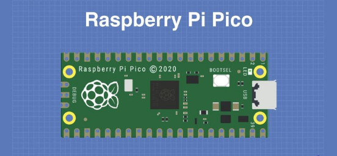 

Raspberry Pi Pico是具有灵活数字接口的低成本高性能微控制器板。它集成了Raspberry Pi自己的RP2040微控制器芯片，运行速度高达133 MHz的双核Arm Cortex M0 +处理器，嵌入式264KB SRAM和2MB板载闪存以及26个多功能GPIO引脚。对于软件开发，可以使用Raspberry Pi的C/C++SDK或MicroPython，这个教程中我们使用MicroPython。

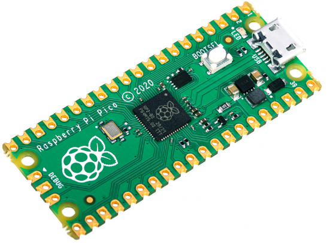 

裸板不带针脚，需要自己焊。这是一块做工精良的电路板，也可以作为SMD元件，直接焊接到印刷电路板上。

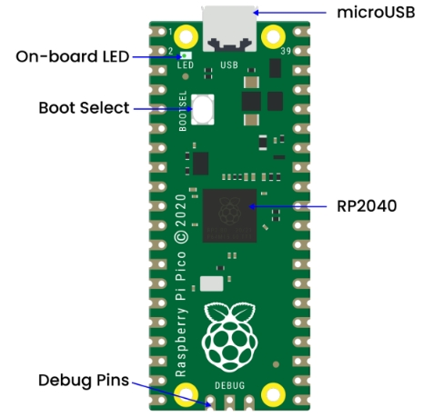 

板上最主要的功能是一端的microUSB连接器。它既用于通信，也用于给Pico供电。

在microUSB连接器旁边安装了一个板载LED，它内部连接到GPIO针脚25，这是整个Pico板上唯一的LED。

开机按钮安装在离LED稍低一点的地方，它可以让你改变Pico的启动模式，这样你就可以在上面加载MicroPython，进行拖拽式编程。

在板子的底部，你会看到三个连接点，这些连接点是用于串行Debug选项的，我们今天是入门，暂时不探讨这个问题，高级开发者会比较感兴趣。

 

在板子的中央是整个板子的“大脑”——RP2040 MCU，RP2040能够支持高达16MB的片外闪存，不过在Pico中只有4MB。

– 双核32位ARM Cortex -M0+处理器

– 运行在48MHz，但可以超频到133MHz。

– 30个GPIO引脚(26个暴露)

– 可支持USB主机或设备模式

– 8 可编程I/O（PIO）状态机

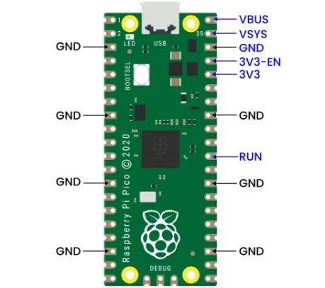 

Pico是一个3.3V的逻辑器件，但由于内置了电压转换器和稳压器，它可以用一系列电源供电。

**GND**–––地线，8个地线加上3针Debug连接器上的一个附加地线，是方形的，而不是像其他连接的圆形。

**VBUS**–––这是来自 microUSB 总线的电源，5 V。如果Pico不是由microUSB连接器供电，那么这里将没有输出。

**VSYS**–––这是输入电压，范围为 2 至 5 V。板载电压转换器将为 Pico 将其改为 3.3 V。

**3V3**–––这是 Pico 内部调节器的 3.3 伏输出。只要将负载保持在 300ma 以下，它就可用于为其他组件供电。

**3V3_EN**–––你可以使用此输入禁用 Pico 的内部电压调节器，从而关闭 Pico 和由其供电的任何组件。

**RUN**–––可以启用或禁用 RP2040 微控制器，也可以将其复位。

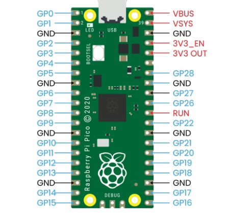 

树莓派 Pico板上有26个裸露的GPIO连接，它们的排列顺序很好，在GP22和GP26之间有“空隙”（这些“缺失”的引脚在内部使用）。这些引脚都有多种功能，你可以为PWM配置多达16个引脚。有两个I2C总线，两个UART和两个SPI总线，这些可以配置使用多种GPIO引脚。

Pico有三个模数转换器分别为ADC0-GP26、ADC1-GP27、ADC2-GP28还有一个内部用于板载温度传感器的转换器ADC-VREF。注意：ADC的分辨率为12位。但MicroPython把范围映射到16位，也就是从0到65535，微处理器的工作电压是3.3V，也就是说0对应着0V，65535对应着3.3V。

你也可以在ADC_VREF引脚上提供一个外部精密电压参考。其中一个接地点，即33脚上的ADC_GND被用作该参考点的接地点。

 

| 树莓派 PICO配置                                           |
| --------------------------------------------------------- |
| 双核 Arm Cortex-M0 + @ 133MHz                             |
| 2 个 UART、2 个 SPI 控制器和 2 个 I2C 控制器              |
| 芯片内置 264KB SRAM 和 2MB 的板载闪存                     |
| 16 个 PWM 通道                                            |
| 通过专用 QSPI 总线支持最高 16MB 的片外闪存                |
| USB 1.1 主机和设备支持                                    |
| DMA 控制器                                                |
| 8 个树莓派可编程 I/O（PIO）状态机，用于自定义外围设备支持 |
| 30 个 GPIO 引脚，其中 4 个可用作模拟输入                  |
| 支持 UF2 的 USB 大容量存储启动模式，用于拖放式编程        |

 

**完整引脚图：**

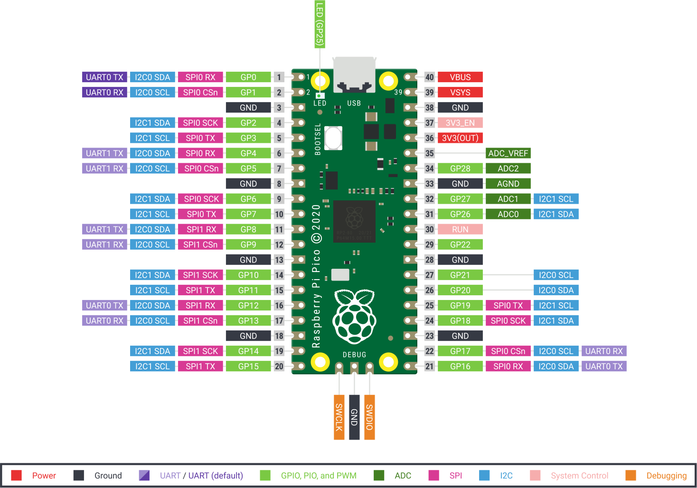 

 

树莓派也在官网发布了一大堆技术文档，还有一本名为《Get Started with MicroPython on Raspberry Pi Pico》的说明书。它有纸质版，也有PDF版下载。

更多详情请了解树莓派官方网站：

https://www.raspberrypi.com/products/raspberry-pi-pico/

## **第2小节 Arduino IDE下载方法**

我们先到arduino 官方的网站https://www.arduino.cc/下载最新版本的arduino开发软件,进入网站之后点击界面上的SOFTWARE,选择DOWNLOADS进入下载页面，如下图：

 

Arduino 软件有很多版本，有wodows,mac linux系统的（如下图），而且还有过去老的版本，你只需要下载一个适合系统的版本。

这里我们以WINDOWS系统的为例给大家介绍一下下载和安装的步骤。

WINDOWS系统的也有两个版本，一个版本是安装版的，一个是下载版的不用安装，直接下载文件到电脑，解压缩就可以用了。

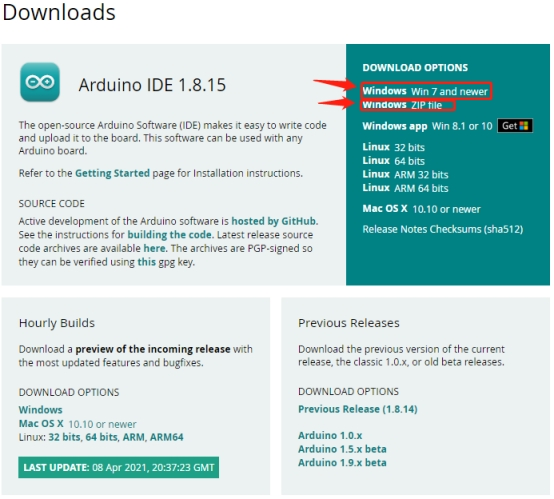 

两个版本都可以正常使用，看你自己的喜好了。选择一个版本，然后将Arduino 开发软件下载到我们的电脑。

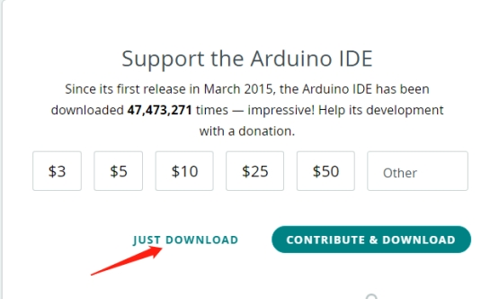 

一般情况下，我们点击JUST DOWNLOAD就可以下载了，当然如果你愿意，你可以选择小小的赞助，以帮助伟大的ARDUINO开源事业。

 

## **第3小节 Arduino IDE设置和工具栏介绍**

我们下面了解Arduino开发软件的使用了，首先我们点击电脑桌面上的图标，打开Arduino IDE。

我们的程序上传到板之前，我们必须演示Arduino IDE工具栏中出现的每个符号的功能。

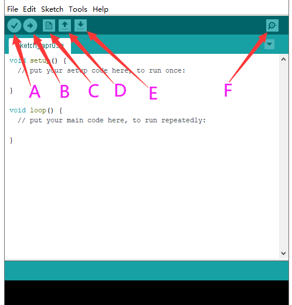 

A - 用于检查是否存在任何编译错误。

B - 用于将程序上传到Arduino板。

C - 用于创建新草图的快捷方式。

D - 用于直接打开示例草图之一。

E - 用于保存草图。

F - 用于从板接收串行数据并将串行数据发送到板的串行监视器。

 

设置pico环境：(相关资讯：https://github.com/earlephilhower/arduino-pico)

首先选择(File) → (Preferences)

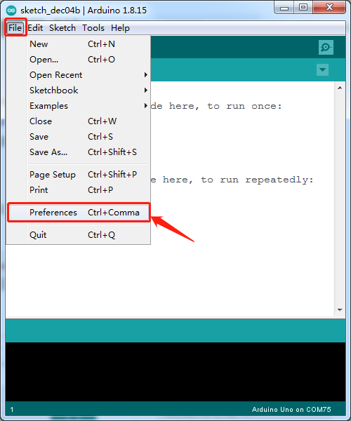 

在「Additional Boards Manager URLs」输入以下这行URL：

https://github.com/earlephilhower/arduino-pico/releases/download/global/package_rp2040_index.json

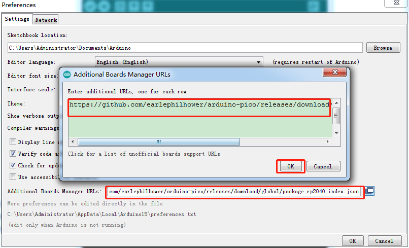 

然后点击OK

回到主页面，选择(Tools)→ (Board) → (Board Manager)

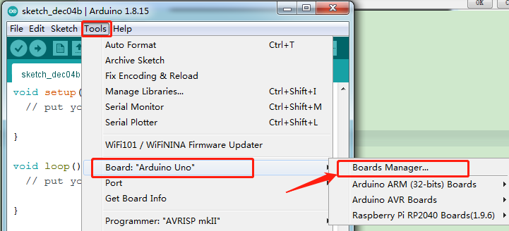

 

在搜索的地方輸入pico，出现如下图的画面，再点击(Install)进行安装。

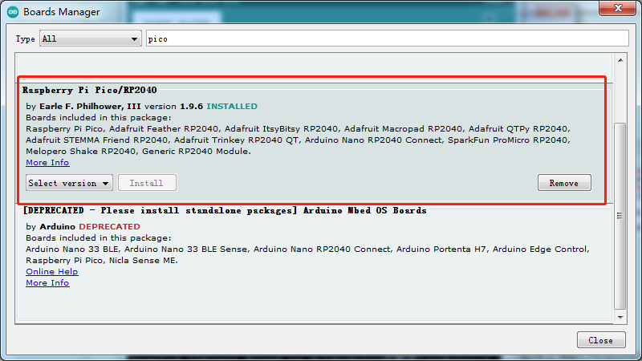

 

我的IDE这里已经安装好了。

等待安裝完成后，回到主界面选择(Tools)→ (Board) → Raspberry Pi RP2040 Boards(1.9.6) → Raspberry Pi Pico。

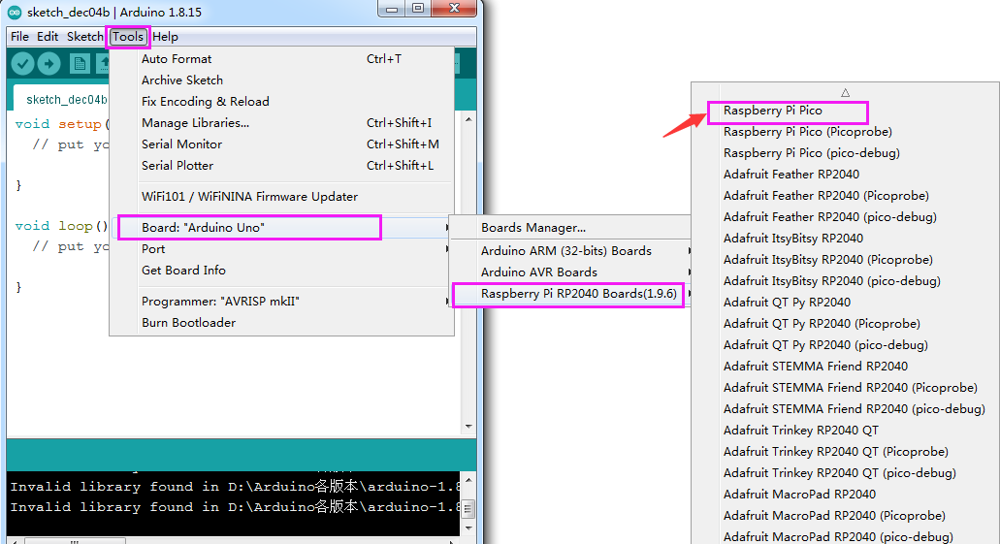

 

选择好开发板后，再选择 Pico 连接的 Port。这样就完成环境的设定了。

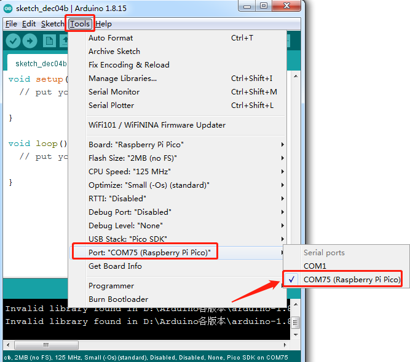

 

下面我们就用内部的示例代码让板载LED灯呈现明暗的变化：

选择(File)→ (Examples)→ rp2040→ Fade。

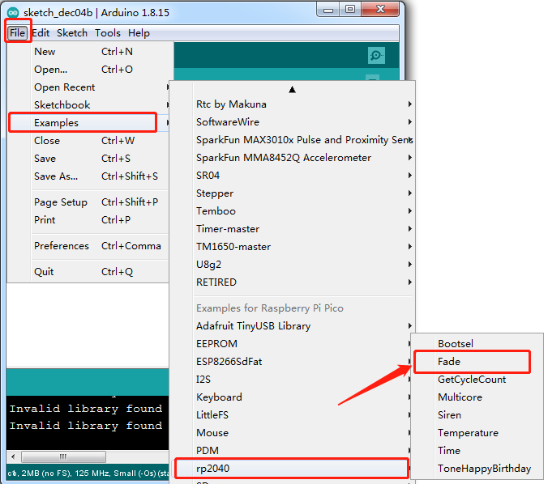

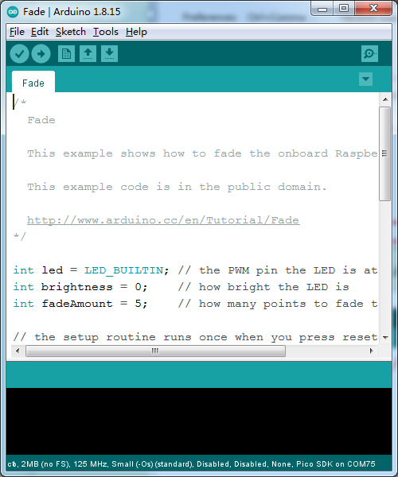 

 

 

打开示例代码后，编译前，要特別注意操作的顺序：
(1) 先断开 Pi Pico USB电源
(2) 按住开发板上白色 BOOTSEL 按鍵，然后插上USB电源 
(3) 点击Arduino IDE下的上传，进行编译并上传开发板 
(4) 等到编译“Compiling sketch...”，下面提示信息出现上传中“Uploading...”，再松开BOOTSEL按键
(5) 等待至上传完毕“Done uploading.”才算完成
第一次上传过程中一定要注意这个顺序，不然则导致上传失败，后面上传选择对应的port直接点击上传即可。上传完成后，就可以看到开发板上的LED从暗到亮、又从亮到暗，一直重复，有点像是LED在呼吸，我们在后面课程中会详细讲到。

 

## **第4小节 库文件的添加**

首先找到arduino库文件夹：

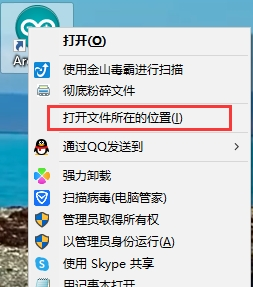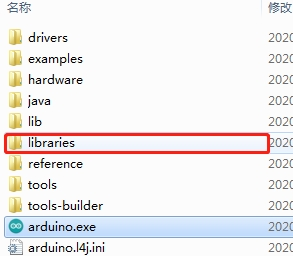 

然后把所要用到的库文件复制在这个文件夹下就行了。

 

## **第5小节 Keyes raspberry pico IO 扩展板**

**1.概述**

Keyes raspberry pico IO 扩展板是专为Raspberry Pi Pico开发的扩展板，无需焊接，全引脚引出。为方便接线，扩展板上接口都带有丝印。3pin接口丝印一般为G V S，其中扩展板上所有的G代表GND，V代表VCC（3.3V）接口，S代表接口上方的数字口/模拟口。4pin/6pin接口左面都有对应接口丝印。扩展板上自带间距为2.54mm的排母接口，接线顺序和Pico板的排母接口的线序一致。同时扩展板上自带一个复位按键，1个电源指示灯PWR。同时扩展板自带4个标准乐高定位孔。

该扩展板提供各种通信接口包括2 x I2C、2 x UART、2 x SPI、3 x 模拟IO和13 x 数字IO，并提供6.5-12V的电源接口为原型开发提供最简单的连接方式。

 

**2.规格参数：**

输出电流：≦500mA

DC输入电压：6.5 - 12V

输出电压：DC3.3V\5V

推荐环境温度：-10°C ~ 50°C

产品尺寸：45.339MM *83.617MM

排针间距：2.54mm

 

**3.原理图**

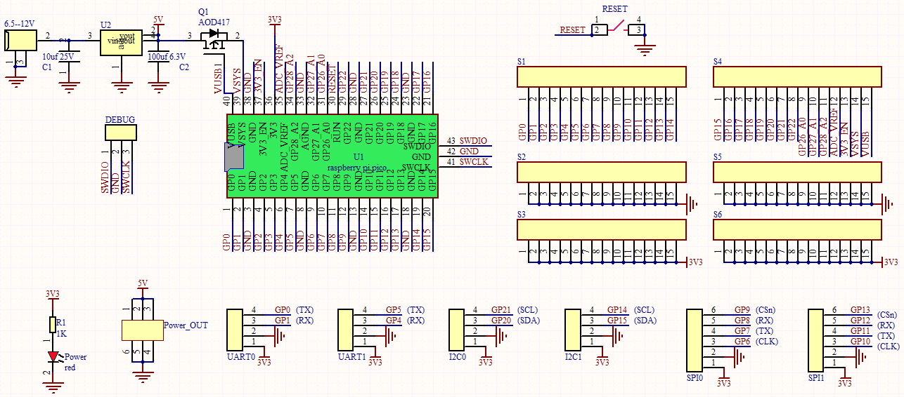

  

**4.接口说明**

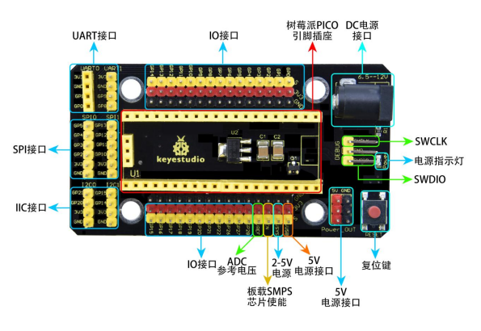

**5.使用方法**

将Raspberry Pi Pico堆叠在扩展板上即可使用，如下图

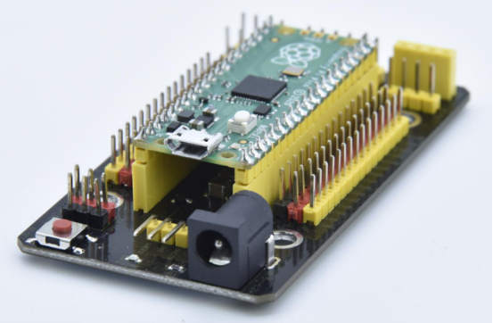

## 第6小节 pico win7系统不能识别端口解决办法

**pico win7系统第一次上传代码后不能识别端口解决办法**

按照这个步骤，第一次上传后没有出现端口

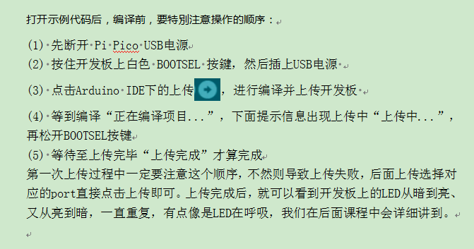

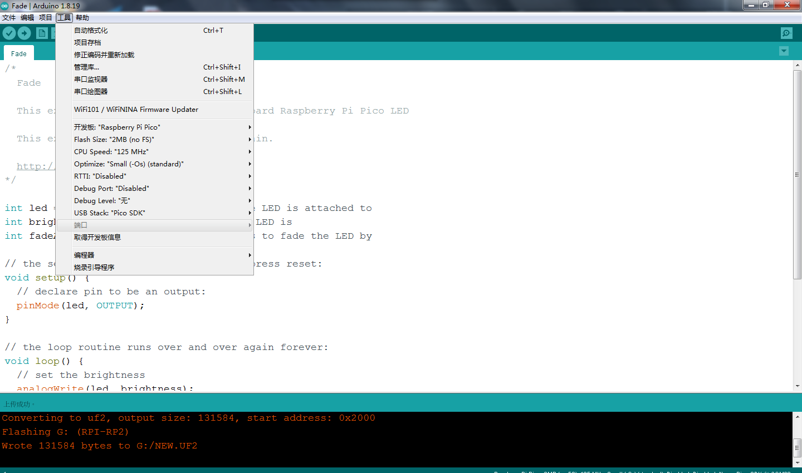

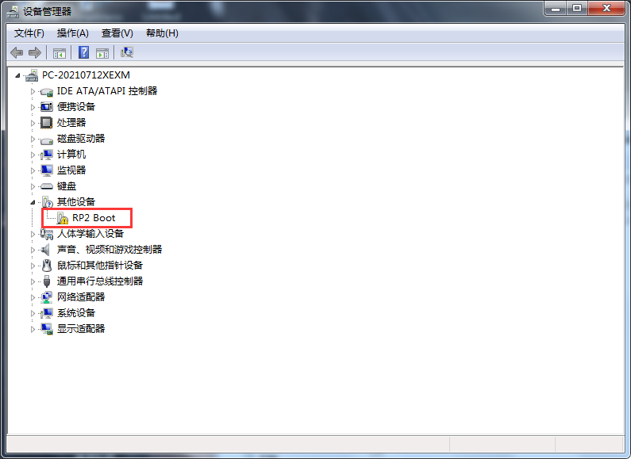

第一步：将pico开发板连接到电脑电脑

第二步：点击下载`zadig-2.7.exe`软件  [点击下载zadig-2.7.exe](./zadig.zip)

第三步：打开我们提供的软件

第四步：USB ID 红色框内为`2E8A`

Driver红色框内为 `USB Serial(CDC)`   后面的箭头可以选择

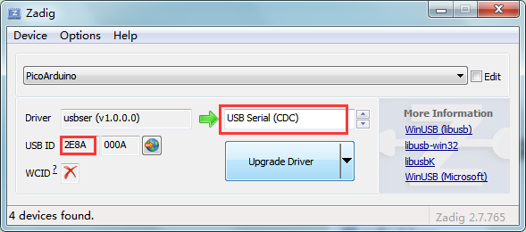

第四步:点击下载，等待下载完毕就成功了，这一步最好关闭杀毒软件

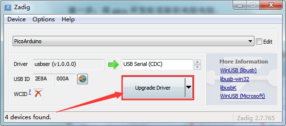

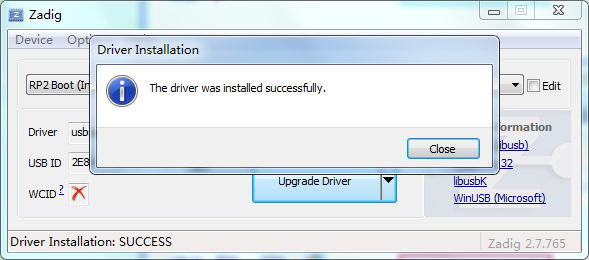

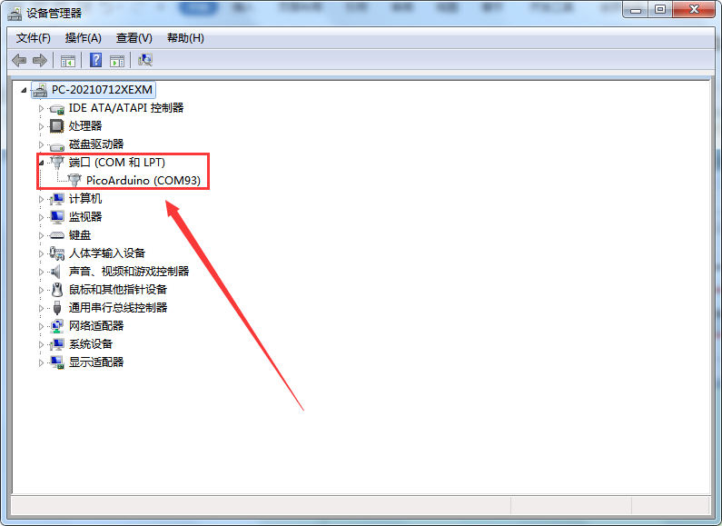

**注意：如果第一次没成功那就拔掉pico板重新在插上，在重新安装一遍！！！**

 