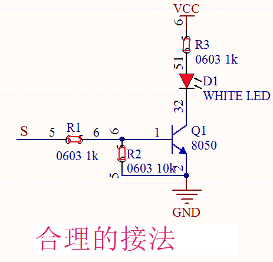
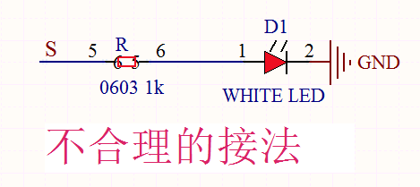
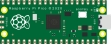
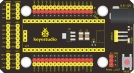
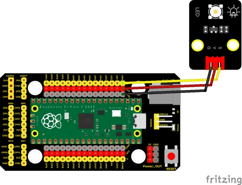
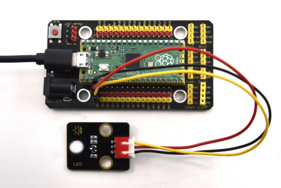

## 实验一  点亮LED

 

**实验说明**

在我们前面的准备工作中，知道我们Pico板上有个板载LED，而且我们已经知道这个LED是连接在Pico的GP25的，我们还让这个LED明暗变化了。下面我们就用同样的方法点亮一个外接的LED模块。

在这个套件中，我们有一个Keyes DIY电子积木 白色LED模块。它的控制方法非常简单，要想点亮LED，只要让它两端有一定的电压就可以。

实验中，我们通过编程控制信号端S的高低电平，从而控制LED的亮灭。我们提供两个测试代码，分别控制LED模块上实现点亮和闪烁的效果。

 

**实验原理**

下面附了两个电路原理图，左边我们直接把LED串联一个电阻，负极接地，正极接到单片机的IO口，理论上来说当我们把信号端S输出高电平(3.3V)，LED两端就会有电压，LED就会被点亮，那么我们为什么说这么接不合理呢？原因就是我们Pico IO口输出电流的能力有限(最大12mA)，虽然输出了高电平，但是可能达不到控制LED的电流，此时LED可能比较暗。

右边的接法：控制时，GND和VCC上电后，如果信号端S为高电平，那么三极管Q1就会导通，则LED有电流流过，LED即会亮起(注意：此时电流是由VCC电源端流经LED和电阻R3到GND，而不是直接从单片机IO口输出，此时输出电流的能力就比较强)，S端为低电平时三极管Q1截止，那么就没有电流流过LED，那么LED就会熄灭。也就是说，我们这里的三极管Q1相当于一个开关作用，而电阻R1,R3都是一个限流电阻，顾名思义就是限制电流的大小，以免烧坏电子元器件。






 **实验器材**

|  |  |        |  |  |
| ------------------------- | ------------------------- | ------------------------------- | ------------------------- | ------------------------- |
| Raspberry Pi Pico板*1     | Raspberry Pi Pico扩展板*1 | Keyes DIY电子积木 白色LED模块*1 | 防反插3Pin*1              | MicroUSB线*1              |

 

**接线图**

 

 

**测试代码**

 **代码1：**

```c
/* 

  Keyes Starter Kit for Raspberry Pi Pico

  lesson 1.1

  LED

*/

void setup() {

 pinMode(0, OUTPUT);//设置GP0引脚模式为输出

 digitalWrite(0, HIGH); //输出高电平，点亮

}

void loop() {

}
```


**代码2：**

```c
/* 

 *** Keyes Starter Kit for Raspberry Pi Pico

 *** lesson 1.2

 *** Blink

*/

int ledPin = 0; //定义LED管脚接GP0

void setup() {

 pinMode(ledPin, OUTPUT);//设置模式为输出

}

 

void loop() {

 digitalWrite(ledPin, HIGH); //输出高电平，点亮

 delay(1000);//延迟1000毫秒

 digitalWrite(ledPin, LOW); //输出低电平，熄灭

 delay(1000);//延迟1000毫秒

}
```


**代码说明**

**代码1说明：**

1. pinMode(pin,mode)；pin是用于设置模式的pico GPIO引脚号；mode为模式，可选：输入模式INPUT，输出模式OUTPUT或输入上拉INPUT_PULLUP，在这里我们设置了管脚0为输出模式。
2. digitalWrite(pin, value)；pin是单片机GPIO管脚，在这里我们定义了GP0；value是你将要输出的数字电平（HIGH/LOW）；如果使用pinMode()将引脚配置为OUTPUT，则其电压将设置为相应的值：3.3V为HIGH，低电平为0V（接地）。如果没有把pinMode()设置为OUTPUT，而是将LED连接到引脚，则在调用digitalWrite（HIGH）时，LED可能会变暗。因为此时digitalWrite()将启用内部上拉电阻，其作用类似于一个大限流电阻。

 

**代码2说明：**

1. Setup()中代码是只执行一次，而loop()函数里面的代码是一直循环执行。delay(ms)；延时函数，ms为暂停的毫秒数，数据类型：unsigned long（范围 0~ 4,294,967,295 (2^32 - 1)）。
2. 通过整合前面知识。我们再来看代码就清楚明了了，代码中第一条我们把模块信号端接到ledpin也就是GP0，设置为高电平，就是点亮模块上LED；第二条延迟1000毫秒，就是让模块上LED点亮1秒。同样第三条第四条代码表示让模块上LED熄灭1秒。代码默认循环，也就是控制模块上LED，循环亮1秒，灭1秒，实现闪烁效果。通过代码设置，我们可以更改模块上LED亮灭的延迟时间，从而使模块上LED实现不同的闪烁效果。
3. 更多arduino语法解释与详情请了解官网https://www.arduino.cc/reference/en/

 

**测试结果**

代码一：运行代码一成功后，模块上白色LED点亮

代码二：运行代码二成功后，白色LED亮1秒灭一秒，循环交替闪烁。

