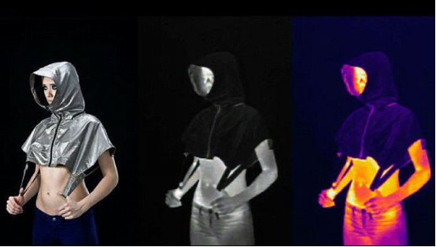
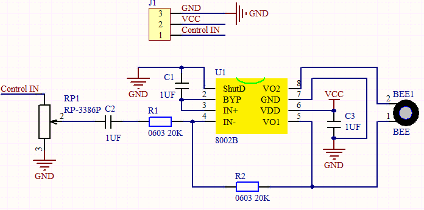
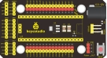
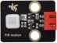
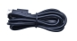
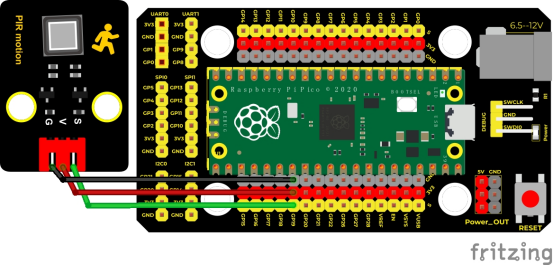
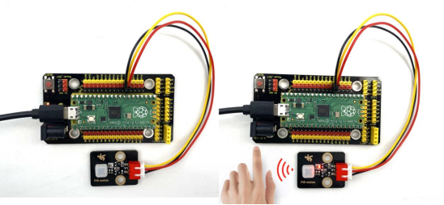
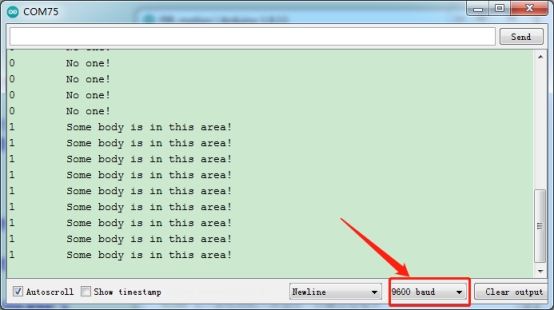

## 实验七  附近有人吗

 

**实验说明**

在这个套件中，有一个Keyes DIY电子积木 人体红外热释传感器，它主要采用RE200B-P传感器元件。它是一款基于热释电效应的人体热释运动传感器，能检测到人体或动物身上发出的红外线，配合菲涅尔透镜能使传感器探测范围更远更广。

实验中，我们通过读取模块上S端高低电平，判断附近是否有人在运动；并且，我们在串口监视器上显示测试结果。

 

**实验原理**

这个原理图可能较前面的模块稍复杂，我们一个个来看。左上角那部分是电压转换，VCC转3.3V，因为我们模块上用到的传感器工作电压为3.3V，不能直接用5V供电，所以需要一个电压转换电路，所以这个模块我们也兼容5V单片机，如Arduino。当传感器附近没有检测到人即没有接收到红外信号时，传感器1脚输出低电平，此时模块上LED两端有电压就会点亮，此时MOS管Q1导通，信号端S检测到低电平。当传感器附近检测到人即接收到红外信号时，传感器1脚输出高电平，此时模块上LED两端没有电压就会熄灭，此时MOS管Q1不导通，信号端S则检测到被10K上拉电阻R5拉高的高电平。


 

**实验器材**

|  |  |               |  |  |
| ------------------------- | ------------------------- | -------------------------------------- | ------------------------- | ------------------------- |
| Raspberry Pi Pico板*1     | Raspberry Pi Pico扩展板*1 | keyes DIY电子积木 人体红外热释传感器*1 | 防反插3Pin*1              | MicroUSB线*1              |

 

 

**接线图**

 

 

 

**测试代码**

```c
/* 

 * Keyes Starter Kit for Raspberry Pi Pico

 * lesson 7

 * PIR motion

*/

int val = 0;

int pirPin = 19; //定义人体红外传感器管脚为GP19

void setup() {

 Serial.begin(9600); //设置波特率为9600

 pinMode(pirPin, INPUT);  //设置传感器为输入模式

}

 

void loop() {

 val = digitalRead(pirPin);  //读取传感器的值

 Serial.print(val);//打印val值

 if (val == 1) {//附近有人运动,输出高电平

  Serial.print("     ");

  Serial.println("Some body is in this area!");

  delay(100);

 }

 else {//没检测到人体运动，则输出低电平

  Serial.print("     ");

  Serial.println("No one!");

  delay(100);

 }

}
```


 

**代码说明**

设置方法和实验三类似，这里就不多做介绍了。

 

**测试结果**

上传测试代码成功，利用USB线上电后，打开串口监视器，设置波特率为9600。

串口监视器显示对应数据和字符。实验中，传感器检测到附近有人在运动时，val为1，模块上LED熄灭，串口监视器显示“Somebody is in this area!”字符；没有检测到人运动时，item为0，模块上LED点亮，串口监视器显示“No one!”字符，如下图。

 

