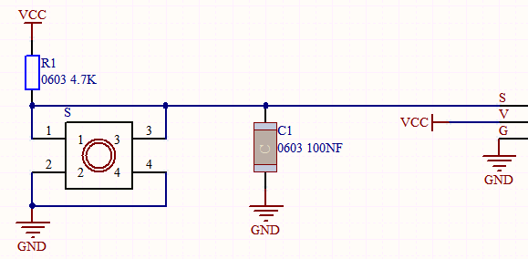
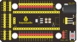
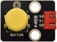
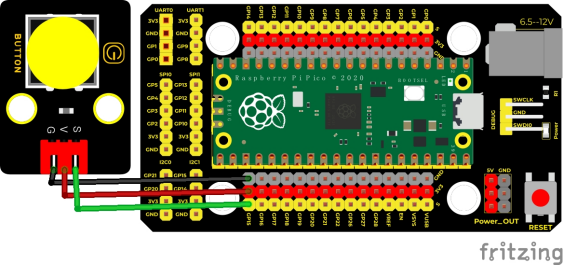
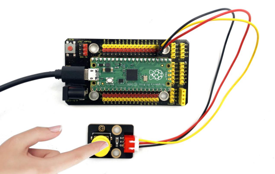
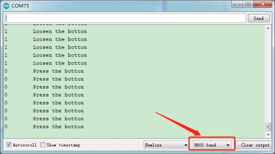

## 实验三  按键传感器检测实验

 

**实验说明**

在这个套件中，有一个Keyes DIY电子积木 单路按键模块，它主要采用1个轻触开关，自带1个黄色按键帽。前面我们学习了怎么让我们单片机的引脚输出一个高电平或者低电平，这节实验我们就来学习怎么读取引脚是高电平（3.3V）还是低电平（0V）。

实验中，我们通过读取传感器上S端高低电平，判断传感器上按键是否按下；并且，我们在串口监视器上显示测试结果。

 

**实验原理**



附原理图，按键有四个引脚，其中1和3是相连的，2和4是相连的，在我们未按下按键时，13与24是断开的，信号端S读取的是被4.7K的上拉电阻R1所拉高的高电平，而当我们按下按键时，13和24连通。信号端S连接到了GND，此时读取到的电平为低电平，即按下按键，传感器信号端为低电平；松开按键时，信号端为高电平。

 

**实验器材**

|  |  |         |  |  |
| ------------------------- | ------------------------- | -------------------------------- | ------------------------- | ------------------------- |
| Raspberry Pi Pico板*1     | Raspberry Pi Pico扩展板*1 | keyes DIY电子积木 单路按键模块*1 | 防反插3Pin*1              | MicroUSB线*1              |

 

**接线图**

 

 

**测试代码**

```c
/* 

 * Keyes Starter Kit for Raspberry Pi Pico

 * lesson 3

 * button

*/

int val = 0;  //用来存放按键值

int button = 15; //按键的管脚接GP15

void setup() {

 Serial.begin(9600); //启动串口监视器并设置波特率为9600

 pinMode(button, INPUT); //设置按键管脚为输入模式

}

 

void loop() {

 val = digitalRead(button);  //读取按键的值并赋给变量val

 Serial.print(val);  //串口上打印出来

 if (val == 0) { //按下按键则读取到低电平，打印按下相关信息

  Serial.print("     ");

  Serial.println("Press the botton");

  delay(100);

 }

 

 else {  //打印松开按键相关信息

  Serial.print("     ");

  Serial.println("Loosen the botton");

  delay(100);

 }

}
```


**代码说明**

1. pinMode(button, INPUT); 由前面学过的知识我们知道，在这里我们定义按键管脚为GP15，设置为输入模式。通过pinMode()配置为INPUT必须使用上拉或下拉电阻（我们的模块已经使用上拉电阻R1）。该电阻的目的是在开关断开时将引脚拉至已知状态。通常选择一个4.7K/10 K欧姆的电阻，因为它的阻值足够低，可以可靠地防止输入悬空，同时，该阻值也要足够高，以使开关闭合时不会消耗太多电流。如果使用下拉电阻，则当开关断开时，输入引脚将为低电平；当开关闭合时，输入引脚将为高电平。如果使用上拉电阻，则当开关断开时，输入引脚将为高电平；当开关闭合时，输入引脚将为低电平。
2. Serial.begin(9600)；初始化串口通信，并设置波特率为9600.
3. digitalRead(button)；读取按键的数字电平，高HIGH或者低LOW。如果该引脚未连接任何东西，则digitalRead()可以返回HIGH或LOW（并且可以随机更改）。
4. if..else..语句：当if后面()的逻辑判断为真时，执行大括号里的代码；否则执行else后面{}里的代码。
5. 代码逻辑是传感器感应到按键按下时，信号端为低电平，GP15为低电平，即val为

0。这时我们在串口监视器显示对应的数字值和字符；否则（传感器感应到按键松开时），val为1，窗口监视器显示1和另外的字符。

 

**测试结果**

上传测试代码成功，利用USB线上电后，打开串口监视器，设置波特率为9600。串口监视器显示对应数据和字符。实验中，当传感器按下按键时，val为0，串口监视器显示“Press the button”字符；松开按键时，val为1，串口监视器显示“Loosen the button”字符，如下图。

 

 

 

 