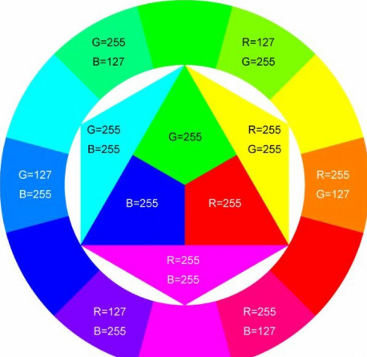
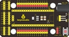
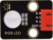
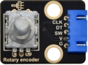
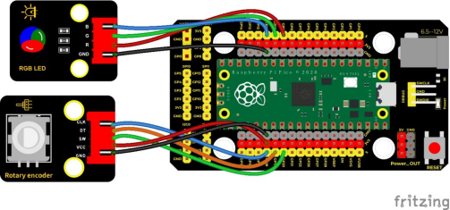
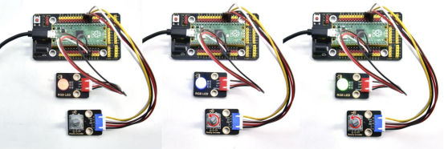
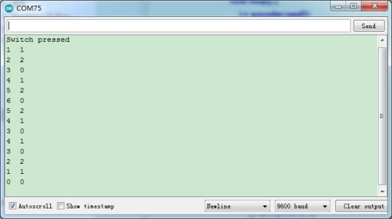

## 实验三十  旋转编码器模块控制RGB模块

 

**实验说明**

在前面课程的实验十八中，我们利用旋转编码器计数。在这里我们将它扩展一下，通过得出的计数，我们用来控制RGB模块上LED显示不同颜色。

设计代码时，我们需要对所得数据取绝对值。然后我们将数据除以3，得到余数，余数为0控制插件RGB模块上LED亮红光，余数为1，RGB模块上LED亮绿光，余数为2，RGB模块上LED亮蓝光。

 

**实验器材**

|  |  |       |          |
| -------------------------- | -------------------------- | ------------------------------- | ---------------------------------- |
| Raspberry Pi Pico板*1      | Raspberry Pi Pico扩展板*1  | keyes DIY电子积木 共阴RGB模块*1 | keyes DIY电子积木 旋转编码器模块*1 |
|  |  |       |                                    |
| 防反插5Pin*1               | 防反插4Pin*1               | MicroUSB线*1                    |                                    |

 

 

**接线图**

 

 

**测试代码**

```c
/*

  Keyes Starter Kit for Raspberry Pi Pico

  lesson 30

  Encoder control RGB

 */

//Interfacing Rotary Encoder with Arduino

//Encoder Switch -> pin 20

//Encoder DT -> pin 19

//Encoder CLK -> pin 18

int Encoder_DT  = 19;

int Encoder_CLK  = 18;

int Encoder_Switch = 20;

 

int Previous_Output;

int Encoder_Count;

int redPin = 9; //定义红色接D9

int greenPin = 10; //定义绿色接D10

int bluePin = 11; //定义蓝色接D11

int val;

void setup() {

 Serial.begin(9600);

 

 //pin Mode declaration

 pinMode (Encoder_DT, INPUT);

 pinMode (Encoder_CLK, INPUT);

 pinMode (Encoder_Switch, INPUT);

 

 Previous_Output = digitalRead(Encoder_DT); //Read the inital value of Output A

 pinMode(redPin, OUTPUT);

 pinMode(greenPin, OUTPUT);

 pinMode(bluePin, OUTPUT);

}

 

void loop() {

 //aVal = digitalRead(pinA);

 

 if (digitalRead(Encoder_DT) != Previous_Output)

 {

  if (digitalRead(Encoder_CLK) != Previous_Output)

  {

   Encoder_Count ++;

   Serial.print(Encoder_Count);

   Serial.print("  ");

   val = Encoder_Count % 3;

   Serial.println(val);

  }

  else

  {

   Encoder_Count--;

   Serial.print(Encoder_Count);

   Serial.print("  ");

   val = Encoder_Count % 3;

   Serial.println(val);

  }

 }

 

 Previous_Output = digitalRead(Encoder_DT);

 

 if (digitalRead(Encoder_Switch) == 0)

 {

  delay(5);

  if (digitalRead(Encoder_Switch) == 0) {

   Serial.println("Switch pressed");

   while (digitalRead(Encoder_Switch) == 0);

  }

 }

 if (val == 0) {

  //红色(255, 0, 0)

  analogWrite(9, 255);

  analogWrite(10, 0);

  analogWrite(11, 0);

 } else if (val == 1) {

  //绿色(255, 0, 0)

  analogWrite(9, 0);

  analogWrite(10, 255);

  analogWrite(11, 0);

 } else {

  //蓝色(255, 0, 0)

  analogWrite(9, 0);

  analogWrite(10, 0);

  analogWrite(11, 255);

 }

}
```

**代码说明**

1. 在实验中我们将val设置为Encoder_Count除以3的余数，Encoder_Count是编码器的值。得到余数后根据接线设置管脚为9（红灯）、10（绿灯）和11（蓝灯）。参考前面实验学习的控制方法，利用余数控制模块上LED显示对应灯光颜色，任何数对3进行取余得到的值都是0或1或2，我们就利用这三个值来判断，并显示对应的颜色。

 

 

**测试结果

上传测试代码成功，按照接线图接好线，上电后，打开串口监视器，设置波特率为9600。旋转编码器，串口监视器显示对应余数。即可控制外接的RGB模块上的LED的颜色（红绿蓝）。

 

