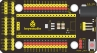
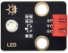
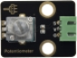
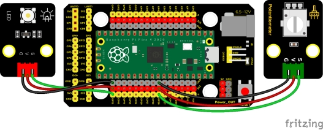
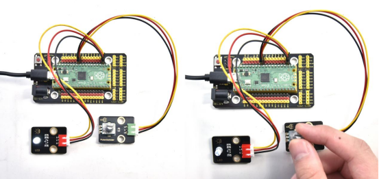

## 实验三十一  电位器调节灯光亮度

 

**实验说明**

在前面课程中，我们学习了呼吸灯、按键控制LED灯，我们可不可以把这两个实验现象结合起来呢？答案是肯定的。学习利用可调电位器读取模拟值的方法，我们利用从可调电位器读取到的模拟值控制LED的亮度。设计代码时，模拟值的范围是0-4095；LED的亮度是由PWM值控制，范围为0-255，我们需要把模拟值范围映射到PWM值范围再来控制。

设置成功后，我们就可以通过旋转电位器，控制模块上LED的亮度。

 

**实验器材**

|  |  |       |            |  |  |
| -------------------------- | -------------------------- | ------------------------------- | ------------------------------------ | -------------------------- | -------------------------- |
| Raspberry Pi Pico板*1      | Raspberry Pi Pico扩展板*1  | keyes DIY电子积木 白色LED模块*1 | keyes DIY电子积木 旋转电位器传感器*1 | 防反插3Pin*2               | MicroUSB线*1               |

 

 

**接线图**

 

 

**测试代码**

```c
/*

  Keyes Starter Kit for Raspberry Pi Pico

  lesson 31

  adjust the light

 */

int val1 = 0;//这个变量用来存放模拟值

int val2 = 0;//这个变量用来存放要输出的PWM值

void setup() {

 Serial.begin(9600);//设置波特率为9600

}

 

void loop() {

 val1 = analogRead(26);//读取电位器的模拟值

 Serial.print(val1);//打印模拟值

 Serial.print("  ");

 val2 = map(val1, 0, 4095, 0, 255);//把模拟值范围映射到输出到PWM值范围

 Serial.println(val2);//打印转换后的PWM值

 analogWrite(15, val2);//引脚15输出PWM值

 delay(100);//延时100ms

}
```

**代码说明**

设置变量，控制设置，以及串口通信，我们都在前面课程中介绍了。实验中映射功能

将val1从范围0-4095映射到0-255，并赋值给val2，这里可参照前面实验十九的代码说明。

 

**测试结果**

上传测试代码成功，上电后，滑动模块上电位器，就可以调节LED模块上的LED的亮度。

