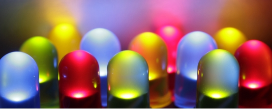
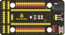
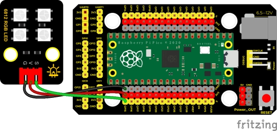

## 实验三十三  6812花样彩灯

 

**实验说明**

晚上的时候，我们可以看到各种各样的非常漂亮，炫目的灯光。城市的夜景也是是一个个霓虹灯组成，其实这么美丽炫目的灯光，我们也可以用我们的模块来完成。在前面实验三十，我们学会了使用6812RGB模块，我们知道这个模块只用到一个管脚便可点亮任何一个灯的任何一种颜色；我们这个实验就通过制作一个炫目的灯光来加深对这个灯的印象。（注意，灯光的亮度可能过高，避免用眼睛长时间直视灯珠！以免损害我们的眼睛。）

 

**实验器材**

|  |  |        |  |  |
| -------------------------- | -------------------------- | -------------------------------- | -------------------------- | -------------------------- |
| Raspberry Pi Pico板*1      | Raspberry Pi Pico扩展板*1  | keyes DIY电子积木 6812 RGB模块*1 | 防反插3Pin*1               | MicroUSB线*1               |

 

**接线图**

 

**测试代码**

```c
/*

  Keyes Starter Kit for Raspberry Pi Pico

  lesson 33

  SK6812 RGB

 */

#include"rgb.h"

RGB rgb(16, 4); //rgb(pin, num);  num = 0-100

//用来储存RGB颜色的变量

int R = 0;

int G = 0;

int B = 0;

int num = 0;

void setup() {

 rgb.setBrightness(100); //rgb.setBrightness(0-255);

 delay(10);

 rgb.clear(); //Turn off all leds

 delay(10);

}

 

void loop() {

 num++;

 if (num > 3) {  //num在0~3之间

  //取0~255之间的随机整数

  R = random(0, 255);

  G = random(0, 255);

  B = random(0, 255);

  num = 0;

 }

 rgb.setPixelColor(num, R, G, B); //设置num-1灯号颜色

 rgb.show();//显示

 delay(100);//200ms刷新颜色

}
```

**代码说明**

**random(0, 255)**:在0~255之间取随机数

**.setPixelColor(num - 1, R, G, B)**：设置num-1位置灯珠显示RGB颜色

**.show()**：显示，如果没有这个函数，我们前面设置的将不起作用

 

**测试结果**

上传代码成功后，按照接线图接好线，上电，我们就能看到我们6812RGB模块。四个灯珠以随机颜色显示流水灯。

