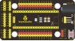
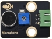
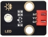
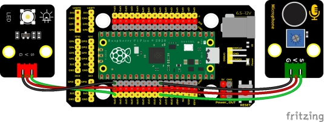
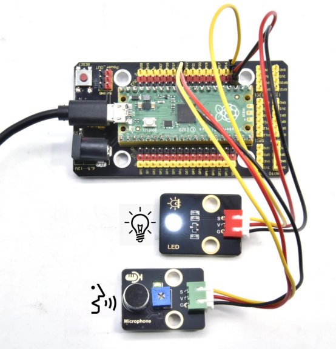

## 实验三十二  声控灯

 

**实验说明**

如今智能家居发展迅速，很多人都想自己制作一个可以根据温度和湿度发生变换的智能感光声控灯，在这里我就教大家做一个最简单的智能声控灯。这些灯平时不亮，当我们吼一句或者拍拍手，LED自动亮起；当没有声音时，这些灯就自动关闭。难道是有人在手动控制这些灯光？实际上不是的，实际上这些灯光上都安装有声音探测元件，这些传感器将外界声音的大小，转换成对应数值。然后设置一个临界点，当超过临界点时，控制灯光熄灭，没有超过时，控制灯光亮起。

在这个实验中，我们利用套件中自带的声音传感器和LED模块模拟这一现象。

 

**实验器材**

|  |  |      |       |  |  |
| -------------------------- | -------------------------- | ------------------------------ | ------------------------------- | -------------------------- | -------------------------- |
| Raspberry Pi Pico板*1      | Raspberry Pi Pico扩展板*1  | keyes DIY电子积木 声音传感器*1 | keyes DIY电子积木 白色LED模块*1 | 防反插3Pin*2               | MicroUSB线*1               |

 

**接线图**

 

 

**测试代码**

```c
/*

  Keyes Starter Kit for Raspberry Pi Pico

  lesson 32

  sound-controlled lights

 */

int ledPin = 15;//LED接GP15

int microPin = 26;//声音传感器接ADC0（GP26）

void setup() {

 Serial.begin(9600);//设置波特率为9600

 pinMode(ledPin, OUTPUT);//LED为输出模式

}

 

void loop() {

 int val = analogRead(microPin);//读取模拟值

 Serial.print(val);//串口打印

 if(val > 200){//超过阈值200

  digitalWrite(ledPin, HIGH);//点亮LED3s，并打印相应信息

  Serial.println("  led on");

  delay(3000);

 }else{//否则

  digitalWrite(ledPin, LOW);//关闭LED， 并打印相应信息

  Serial.println("  led off");

 }

 delay(100);

}
```

**代码说明**

在实验中，我们设置了当模拟值阈值为200，超过200点亮LED 3秒，否则熄灭。

 

**测试结果**

运行测试代码，shell显示对应音量模拟值。我们制造声音，数据变大，大于200时，LED模块上LED亮起，否则熄灭。

