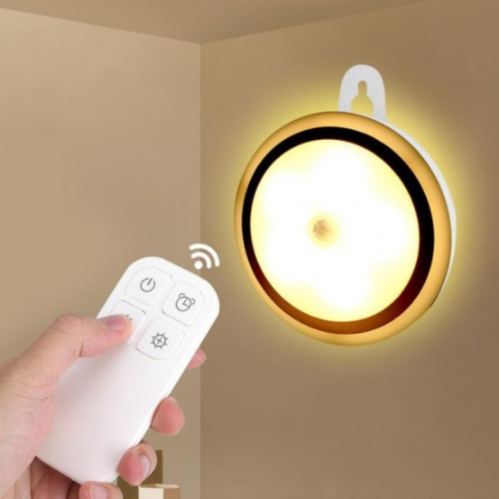
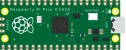
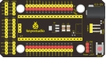
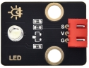
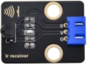
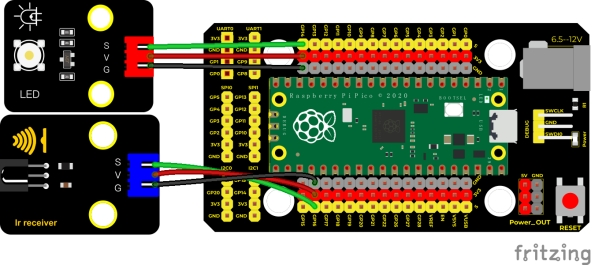
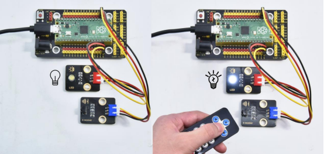
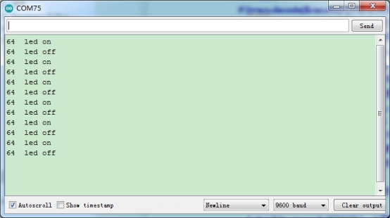

## 实验三十五  红外遥控灯

 

**实验说明**

大家生活中不知道有没有这个场景，当我们快要入睡的时候，还没有关灯，然而灯的开关又比较远，当我们起床去关灯，又影响了我们入睡，这个时候大家是不是希望有个遥控器能遥控电视一样来控制灯光，这样就方便多了。在前面实验中，我们学会了点亮或熄灭LED、利用PWM技术调节灯光的亮度；实验二十一，我们学会了使用红外接收模块，并把接收到的遥控器的信息打印了出来。那么在这个实验中，我们就用红外遥控接控制我们的LED模块亮灭和亮度。

当我们接收到一个按键值时，我们通过对应按键值来设置输出的PWM值，这样就可以设置亮度了，控制LED亮灭也一样，但是如果说，在控制LED亮灭这里，我们用同一个按键来控制LED的亮与灭，就需要一个灵活的编程技巧了。我们可以先自己思考，再来看程序。

 

**实验器材**

|  |  |       |        |
| -------------------------- | -------------------------- | ------------------------------- | -------------------------------- |
| Raspberry Pi Pico板*1      | Raspberry Pi Pico扩展板*1  | keyes DIY电子积木 白色LED模块*1 | keyes DIY电子积木 红外接收模块*1 |
|  |  |       |                                  |
| MicroUSB线*1               | 遥控器*1                   | 防反插3Pin*2                    |                                  |

 

**接线图**

 

**测试代码**

```c
/*

  Keyes Starter Kit for Raspberry Pi Pico

  lesson 35

  IR control LED

 */

#include"ir.h"

IR IRreceive(16);//红外接收接GP16

int led = 14;//LED接GP14

boolean flag = true;//LED标志位

void setup() {

 Serial.begin(9600);

 pinMode(led, OUTPUT);

 delay(1000);

}

////////////////////

void loop() {

 Serial.println("IR receive");

 while (1) {

  int key = IRreceive.getKey();

  if (key != -1) {

   Serial.print(key);

   if (key == 64) { //按下OK键

    if (flag == true) {//flag为真

     digitalWrite(led, HIGH);//打开LED

     Serial.println("  led on");

     flag = false;//flag变为假

    } else { //flag为假

     digitalWrite(led, LOW);//关闭LED

     Serial.println("  led off");

     flag = true;//flag变为真

    }

   }

  }

 }

}
```

**代码说明**

1. 与前面定义变量不同，这里我们定义一个布尔变量，布尔变量的值只有两个，真（true）或者假（false），**boolean flag = true**。
2. 我们按下OK键时，红外接收的值为64，此时我们需要设置一个布尔变量flag，flag为**真(true)**的时候点亮LED，为**假(false)**的时候熄灭LED，点亮LED后我们又把它设置为假，这样当下次按下OK键时，LED将熄灭。

 

**测试结果**

上传测试代码成功，按照接线图接好线，上电后，打开串口监视器，设置波特率为9600.按下遥控器按钮，串口监视器显示我们按下的值，按下ok键点亮LED，再次按下LED熄灭LED。

 

