## 实验三十六  综合实验

 

**实验说明**

在前面我们做了很多实验，每做一个实验，我们都需要重新上传一次代码。那我们可以把多个实验组合在一起吗？可以的，在这一实验中，我们将第四章节中的实验三、实验十一、实验十六、实验十七、实验二十、实验二十一和本章节中的实验一，组合在一起。设置时，我们利用外接按键模块。每按一次按键，功能变换一次，实验功能循环交替。

 

**实验器材**

| 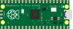       | 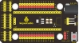   | 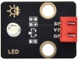        | 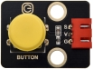       | 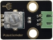         |
| -------------------------------- | ---------------------------- | --------------------------------- | -------------------------------- | ---------------------------------- |
| Raspberry Pi Pico板*1            | Raspberry Pi Pico扩展板*1    | keyes DIY电子积木 白色LED模块*1   | keyes DIY电子积木 单路按键模块*1 | keyes DIY电子积木 旋转电位器模块*1 |
| 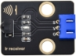       | 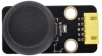   | 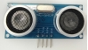        | 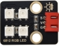       |          |
| keyes DIY电子积木 红外接收模块*1 | keyes DIY电子积木 摇杆模块*1 | keyes brick HC-SR04超声波传感器*1 | Keyes DIY电子积木 6812 RGB模块*1 | MicroUSB线*1                       |
| 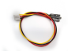       |    |         |        |                                    |
| 防反插3Pin*5                     | 防反插4Pin*1                 | 防反插5Pin*1                      | 遥控器*1                         |                                    |

 

 

**接线图**

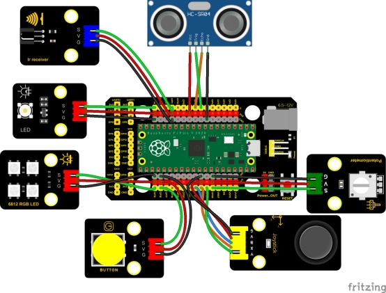 

 

**测试代码**

```c
/*

  Keyes Starter Kit for Raspberry Pi Pico

  lesson 36

  Comprehensive experiment

 */

#include "rgb.h"  //6812的库

#include "ir.h"  //红外接收的库

//rgb6812接GP15

RGB rgb(15, 4);  //rgb(pin, num);  num = 0-100

//红外接收接GP11

IR IRreceive(11);

//摇杆模块接口

int X = 26;

int Y = 27;

int KEY = 22;

//电位器管脚接模拟口28

int resPin = 28;

//LED接GP14

int LED = 14;

//超声波传感器接口

int Trig = 6;

int Echo = 7;

//按键模块接口

int button = 16;

int PushCounter = 0;  //存放按键按下的次数

int State = 1;  //按键的状态

int LastState = 1;  //上一个状态，要么按下，要么松开，两种状态

int PushCounter1 = 0;  //对PushCounter取余后的值

void setup() {

  Serial.begin(9600);  //设置波特率为9600

  rgb.setBrightness(80);  //rgb.setBrightness(0-255);

  rgb.clear();  //Turn off all leds

  delay(10);

  pinMode(KEY, INPUT);  //遥感模块的按钮
  pinMode(button, INPUT);  //按键模块
  pinMode(Trig, OUTPUT);  //超声波模块
  pinMode(Echo, INPUT);

  delay(1000);
}

void loop() {

  State = digitalRead(button);  //读取按键模块的状态

  if (LastState != State) {  //按键的状态改变了

    if (State == 0) {  //按下了按键

      PushCounter = PushCounter + 1;  //累计按下次数加1
    }
  }

  LastState = State;  //刷新上一次状态

  PushCounter1 = PushCounter % 5;  //对按下状态对5取余，也就是按5次就重新开始

  if (PushCounter1 == 0) {  //余数为0

    yushu_0();  //6812显示

  } else if (PushCounter1 == 1) {  //余数为1

    yushu_1();  //显示红外遥控信号

  } else if (PushCounter1 == 2) {  //余数为2

    yushu_2();  //显示摇杆值

  } else if (PushCounter1 == 3) {  //余数为3

    yushu_3();  //显示电位器控制LED

  } else if (PushCounter1 == 4) {  //余数为4

    yushu_4();  //显示超声波测的距离
  }
}

//6812

void yushu_0() {

  int R = random(0, 255);

  int G = random(0, 255);

  int B = random(0, 255);

  for (int i = 0; i < 4; i++) {

    rgb.setPixelColor(i, R, G, B);

    rgb.show();
  }

  delay(300);
}

//红外接收

void yushu_1() {

  bool flag = 1;

  while (flag) {

    int key = IRreceive.getKey();

    if (key != -1) {

      Serial.println(key);

      if (key == 74) {

        PushCounter = 2;

        Serial.print(PushCounter);

        flag = 0;
      }
    }
  }
}

void yushu_2() {

  int x = analogRead(X);

  int y = analogRead(Y);

  int key = digitalRead(KEY);

  Serial.print("X:");

  Serial.print(x);

  Serial.print("   Y:");

  Serial.print(y);

  Serial.print("   KEY:");

  Serial.println(key);

  delay(100);
}

void yushu_3() {

  int RES = analogRead(resPin);

  int res = map(RES, 0, 4095, 0, 255);

  Serial.println(res);

  analogWrite(LED, res);

  delay(100);
}

void yushu_4() {

  float distance = checkdistance();

  Serial.print("distance:");

  Serial.print(distance);

  Serial.println("cm");

  delay(100);
}

float checkdistance() {

  digitalWrite(Trig, LOW);

  delayMicroseconds(2);

  digitalWrite(Trig, HIGH);

  delayMicroseconds(10);

  digitalWrite(Trig, LOW);

  float distance = pulseIn(Echo, HIGH) / 58.00;

  delay(10);

  return distance;
}

```

**代码说明**

1. 设置时，我们参考本章节实验三十方法。计算出按下按键的次数，除以5，得到余数，为0 1 2 3 4 ，根据不同的余数，构造5个独一的函数来控制实验实现不同功能。
2. 参照介绍方法，我们可以在接线中添加或减少传感器/模块，然后在代码中更改实验功能。

 

**测试结果**

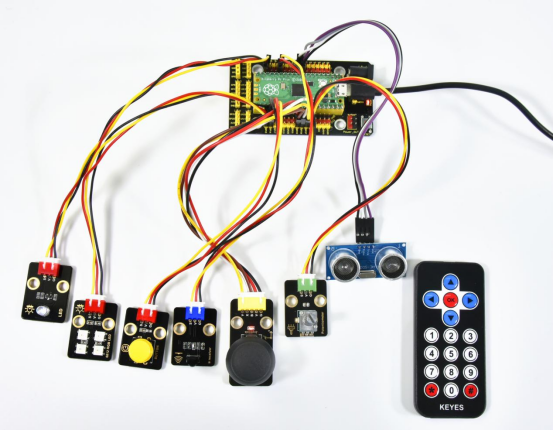 

上传测试代码成功，按照接线图接好线，利用USB上电。

刚开始时，按键次数为0，余数为0，6812RGB模块上四个灯珠循环闪烁随机颜色。点击打开串口监视器，设置波特率为9600，按一下按键（时间长些），6812灯停止闪烁，按键次数为1，余数为1，实验实现的功能是红外接收模块红外发射信息。如果我们利用红外遥控对准接收模块接收头，按下按键，红外接收头接收到信息，串口监视器显示如下。

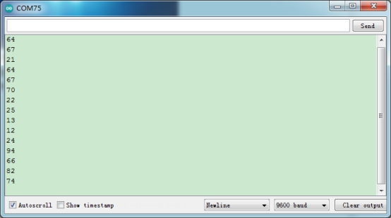 

**特别注意：如果先按下按键，按键次数变为1，再打开串口监视器时，程序会复位，按键成次数会变为0，需要再按下按键重新设置按键次数。**

**按下遥控器#键退出，**按键数为2，余数为2，实验实现的功能是读取摇杆模块传感器X轴和Y轴对应的模拟值，KEY（Z轴）接口对应的数字值，串口监视器显示如下图。

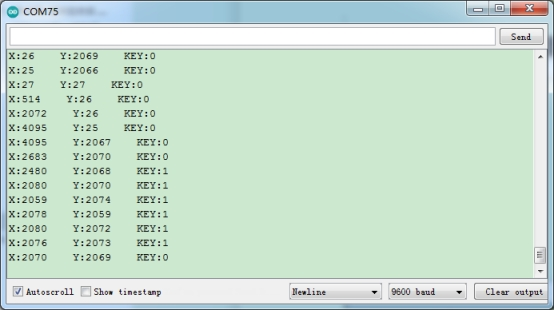 

 

再按一下按键，按键次数为3，余数为3，实验实现的功能是利用外接可调电位器模块调节LED(GP14)接口的PWM值，从而调节外接的白色LED模块上LED的亮度。串口监视器显示图下图。

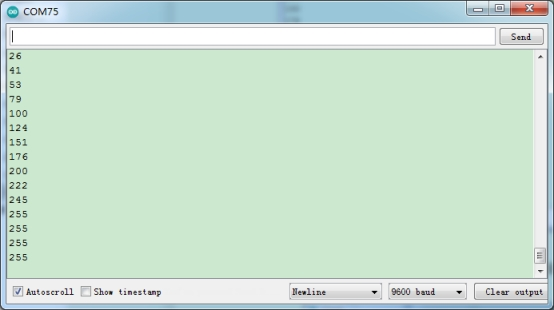 

 

再按一下按键，按键次数为4，余数为4，实验实现的功能是利用超声波模块检测距离并在串口打印出来，串口监视器显示图下图。

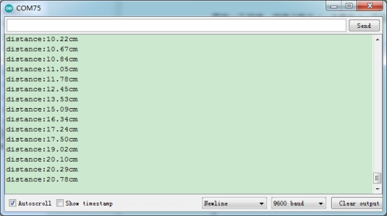 

再按一下按键，按键次数为5，余数为0，实现初始时的现象，6812RGB再次闪烁。不断按下按键，余数循环变化，实验功能也循环变化。