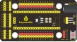
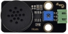
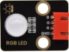
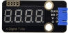
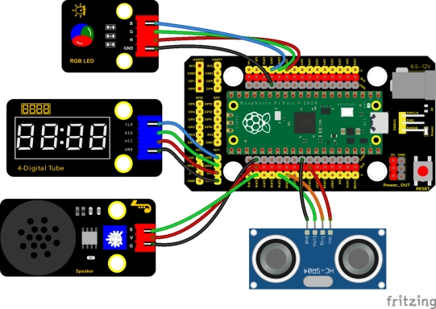
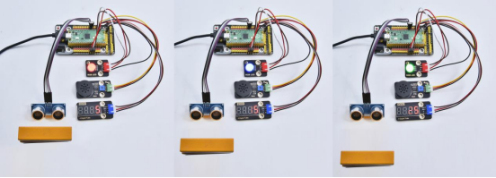

## 实验三十四  超声波雷达


**实验说明**

我们知道，蝙蝠飞行与获取猎物是通过回声定位的。在现实生活中有种在水里专用的电子设备：声呐，一种声学探测设备，由于电磁波在水中衰减的速率非常的高，无法做为侦测的讯号来源，因此以声波探测水面下的人造物体成为运用最广泛的手段在水中进行观察和测量，具有得天独厚条件的只有声波。这是由于其他探测手段的作用距离都很短，光在水中

的穿透能力很有限，即使在最清澈的海水中，人们也只能看到十几米到几十米内的物体； 电磁波在水中也衰减太快，而且波长越短，损失越大，即使用大功率的低频电磁波，也只能传播几十米。然而，声波在水中传播的衰减就小得多，在[深海声道](https://baike.sogou.com/lemma/ShowInnerLink.htm?lemmaId=73004794&ss_c=ssc.citiao.link)中爆炸一个几公斤的炸弹，在两万公里外还可以收到 信号，低频的声波还可以穿透海底几千米的地层，并且得到地层中的信息。在水中进行测量和观察，至今还没有发现比声波更有效的手段。

在前面实验中，我们学会了控制RGB模块发出彩色光；也学会了利用功放喇叭模块发出不同频率的声音及播放音乐，我们也学会了利用超声波传感器检测前方障碍物的距离，也会用四位数码管来显示检测数据；如果说，我们把这几个模块结合起来呢？我们利用距离大小控制功放喇叭模块模块响起对应频率的声音和RGB亮起对应颜色，然后把这个距离显示在四位数码管上。这就搭建好了一个简易的超声波雷达系统。

 

 

**实验器材**

|                |  |  |              |       |
| ---------------------------------------- | -------------------------- | -------------------------- | -------------------------------------- | ------------------------------- |
| Raspberry Pi Pico板*1                    | Raspberry Pi Pico扩展板*1  | HC-SR04超声波传感器*1      | keyes DIY电子积木 8002b功放 喇叭模块*1 | keyes DIY电子积木 共阴RGB模块*1 |
|                |  |  |              |                                 |
| keyes DIY电子积木 TM1650四位数码管模块*1 | 防反插4Pin*3               | 防反插3Pin*1               | MicroUSB线*1                           |                                 |

 

 

**接线图**

 

 

**测试代码**

```c
/*

  Keyes Starter Kit for Raspberry Pi Pico

  lesson 34

  Ultrasonic radar

 */

#include "KETM1650.h"//四位数码管的库文件

KETM1650 tm_4display(15, 14);

 

int beeppin = 16; //定义喇叭引脚为GP16

int EchoPin = 19; //Echo引脚接GP19

int TrigPin = 20; //Trig引脚接GP20

int distance;//超声波测的距离

 

int redPin = 9; //定义红色接GP9

int greenPin = 10; //定义绿色接GP10

int bluePin = 11; //定义蓝色接GP11

 

float checkdistance() { //获取距离

 // 预先给出一个短的低电平，以确保一个干净的高脉冲:

 digitalWrite(TrigPin, LOW);

 delayMicroseconds(2);

 // 传感器由10微秒或更长时间的高脉冲触发

 digitalWrite(TrigPin, HIGH);

 delayMicroseconds(10);

 digitalWrite(TrigPin, LOW);

 // 读取来自传感器的信号:一个高电平脉冲，

 //其持续时间是指从发送ping命令到接收物体回波的时间(以微秒计)。

 float distance = pulseIn(EchoPin, HIGH) / 58.00;  //换算成距离

 delay(10);

 return distance;

}

 

void setup() {

 tm_4display.init(); //数码管初始化

 pinMode(TrigPin, OUTPUT);//Trig引脚为输出

 pinMode(EchoPin, INPUT);  //Echo引脚为输入

 pinMode(beeppin, OUTPUT);//定义功放喇叭模块数字口为输出模式

 pinMode(redPin, OUTPUT);

 pinMode(greenPin, OUTPUT);

 pinMode(bluePin, OUTPUT);

}

 

void loop() {

 distance = checkdistance(); //超声波测距

 tm_4display.displayString(distance);  //数码管显示距离

 if (distance <= 10) {

  tone(beeppin, 880);

  delay(100);

  noTone(beeppin);

  analogWrite(9, 255);//红色(255, 0, 0)

  analogWrite(10, 0);

  analogWrite(11, 0);

 

 } else if (distance > 10 && distance <= 20) {

  tone(beeppin, 532);

  delay(200);

  noTone(beeppin);

  analogWrite(9, 0);//蓝色(255, 0, 0)

  analogWrite(10, 0);

  analogWrite(11, 255);

 } else {

  analogWrite(9, 0);//绿色(255, 0, 0)

  analogWrite(10, 255);

  analogWrite(11, 0);

 }

 

}
```

**代码说明**

1. 设置时，我们通过调节不同距离范围，设置声音频率和灯光颜色。
2. 为方便控制障碍物距离，我们可以在上面代码中，根据实际情况，在控制逻辑里调节距离范围。

 

**测试结果**

上传测试代码成功，按照接线图接好线，上电后，超声波传感器检测到障碍物不同距离时，外接无源蜂鸣器模块上蜂鸣器响起不同频率的声音、RGB亮起不同的颜色，并且测得的距离显示在四位数码管上。

