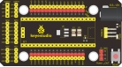
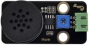
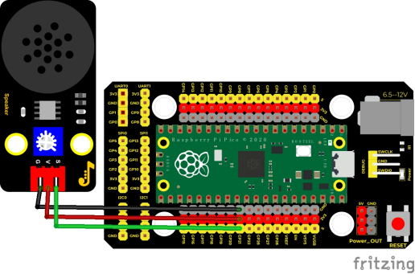
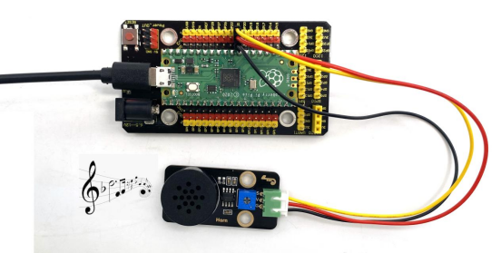

## 实验九  8002b功放 喇叭模块

 

**实验说明**

 在这个套件中，有一个Keyes DIY电子积木 8002b功放 喇叭模块，这个模块主要的元件有一个可调电位器，一个喇叭，一个音频放大芯片；前面课程中我们介绍了套件中的有源蜂鸣器模块的使用方法。在这里我们介绍下套件中的8002b功放 喇叭模块，这个模块主要功能是：可以对输出的小音频信号进行放大，大概放大倍数为8.5倍，并且可以通过自带的小功率喇叭播放出来，也可以用来播放音乐，作为一些音乐播放设备的外接扩音设备。

实验中，我们利用8002b功放 喇叭模块上发出各种频率的声音。

 

**实验原理**

其实它就类似于于一个无源蜂鸣器，前面我们介绍过，有缘蜂鸣器自带振荡源，只要我们给它足够的电压就能响起来，而无源蜂鸣器元件内部不带震荡电路，控制时我们需要在元件正极输入不同频率的方波（电压3.3V/5V），负极接地，从而控制蜂鸣器响起不同频率的声音。


 


**实验器材**

|  |  |              |  |  |
| -------------------------- | -------------------------- | -------------------------------------- | -------------------------- | -------------------------- |
| Raspberry Pi Pico板*1      | Raspberry Pi Pico扩展板*1  | keyes DIY电子积木 8002b功放 喇叭模块*1 | 防反插3Pin*1               | MicroUSB线*1               |

 

 

**接线图**

 

 

**测试代码**

```c
/* 

 * Keyes Starter Kit for Raspberry Pi Pico

 * lesson 9

 * Passive buzzer

*/

int beeppin = 21; //定义喇叭引脚为GP21

void setup() {

 pinMode(beeppin, OUTPUT);//定义功放喇叭模块数字口为输出模式

}

 

void loop() {

 tone(beeppin, 262);//DO播放1000ms

 delay(1000);

 tone(beeppin, 294);//Re播放750ms

 delay(750);

 tone(beeppin, 330);//Mi播放625ms

 delay(625);

 tone(beeppin, 349);//Fa播放500ms

 delay(500);

 tone(beeppin, 392);//So播放375ms

 delay(375);

 tone(beeppin, 440);//La播放250ms

 delay(250);

 tone(beeppin, 494);//Si播放125ms

 delay(125);

 noTone(beeppin);//停止播放一秒

 delay(1000);

}
```

 

**代码说明**

在本实验中，我们用到了函数tone()。tone(pin, frequency)；pin为生成音调的单片机引脚,我们设置了21；frequency为音调频率，单位为Hz,数据类型为unsigned int（范围0 ~ 65,535 ((2^16) - 1))。tone函数在引脚上生成指定频率（和50％占空比）的方波。 直到调用noTone()（停止生成音调）为止。

 

**测试结果**

当我们上传测试代码成功，上电后，功放喇叭模块循环播放对应频率对应节拍的声音：DO一拍，Re0.75拍，Mi0.625拍，Fa半拍，So0.375拍，La四分之一拍，Si0.125拍。

 