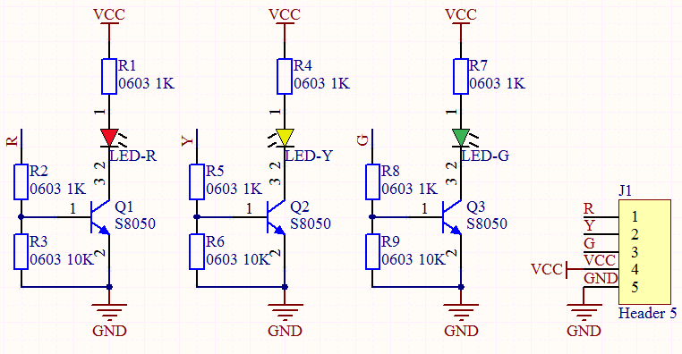
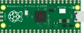
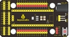
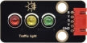
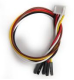
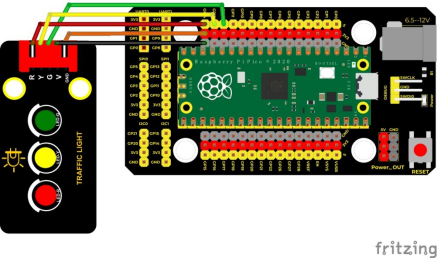
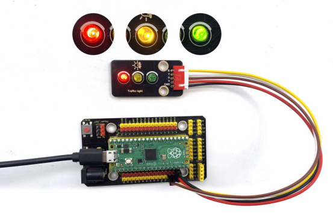

## 实验二  交通灯模块

 

**实验说明**

我想大家都看见过交通灯，就是马路上十字路口的红绿灯。如果您开过车，我想您一定仔细观察过交通灯，如果您还没有驾驶过车，您是否仔细观察过交通灯呢？在我们这个套件中，就包含一个交通灯模块。我们经常会用红绿黄3个LED外接电路来模拟路边的红绿黄灯闪烁。因此我们特别设计了这款模块，模块上自带了红黄绿3个LED灯，我们这个实验就做一个模拟交通灯。

 

**实验原理**

前面第一课我们就学习了如何控制一个LED，由原理图容易得知，控制这个模块就好比分别控制3个独立的LED灯，给对应颜色灯高电平就亮起对应的颜色。比如，我们给信号“R”输出高电平，也就是3.3V，则红色LED点亮。



**实验器材**

|  |  |  |  |  |
| ----------------------------------------------------------- | ----------------------------------------------------------- | ----------------------------------------------------------- | ----------------------------------------------------------- | ----------------------------------------------------------- |
| Raspberry Pi Pico板*1                                       | Raspberry Pi Pico扩展板*1                                   | keyes DIY电子积木 交通灯模块*1                              | 防反插5Pin*1                                                | MicroUSB线*1                                                |

 

 **接线图**

 

 

**测试代码**

```c
/* 

 * Keyes Starter Kit for Raspberry Pi Pico

 * lesson 2

 * Traffic_Light

*/

int greenPin = 12;  //绿色LED接GP12

int yellowPin = 13; //黄色LED接GP13

int redPin = 14;  //红色LED接GP14

void setup() {

 //LED接口都设置为输出模式

 pinMode(greenPin, OUTPUT);

 pinMode(yellowPin, OUTPUT);

 pinMode(redPin, OUTPUT);

}

 

void loop() {

 digitalWrite(greenPin, HIGH); //点亮绿色LED

 delay(5000);  //延时5秒

 digitalWrite(greenPin, LOW); //关闭绿色LED

 for (int i = 1; i <= 3; i = i + 1) {  //运行三次

  digitalWrite(yellowPin, HIGH); //点亮黄色LED

  delay(500); //延时0.5秒

  digitalWrite(yellowPin, LOW); //关闭黄色LED

  delay(500); //延时0.5秒

 }

 digitalWrite(redPin, HIGH); //点亮红色LED

 delay(5000);  //延时5s

 digitalWrite(redPin, LOW); //关闭红色LED

 

}
```


**代码说明**

1. 定义管脚接口，设置引脚模式，延时函数，输出高低电平参考实验一说明，这里就不多说了。
2. 这里我们还用到了for()循环：最简单形式为for( ; ; )，我们在此实验中用到for (int i = 1; i <= 3; i = i + 1)；表示变量i从1到3，每次自加1，知道不满足 i <= 3这个判断表达式，否则一直执行大括号里的代码，即一共执行3次大括号里的代码；同理：如果是for (int i = 255; i >= 0; i = i - 1)；i每次自减1，当不满足i>= 0时，跳出该for()循环，一共执行256次。

 

 

**测试结果**

上传测试代码成功，上电后，模块上绿色LED亮5秒然后熄灭，黄色LED闪烁3秒然后熄灭，再然后红色LED亮5秒，然后熄灭，模块上3个LED自动模拟交通灯循环运行。

