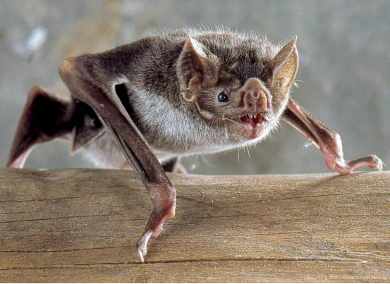
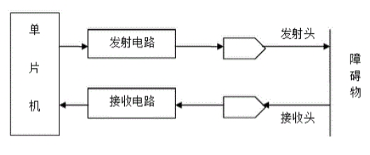
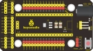
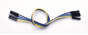
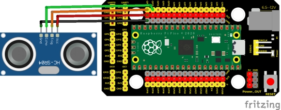
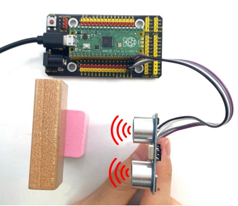
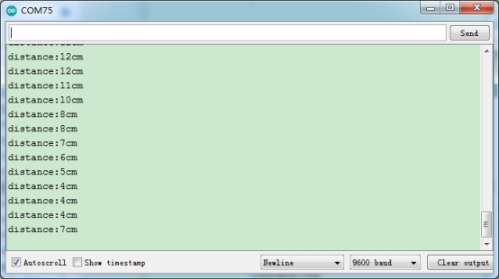

## 实验二十  超声波传感器的原理

 

蝙蝠和某些海洋动物都能够利用高频率的声音进行回声定位或信息交流。它们能通过口腔或鼻腔把从喉部产生的超声波发射出去，利用折回的声波来定向，并判定附近物体的位置、大小以及是否在移动。超声波是一种频率高于20000赫兹的声波，它的方向性好，穿透能力强，易于获得较集中的声能，在水中传播距离远，可用于测距、测速、清洗、焊接、碎石、杀菌消毒等。在医学、军事、工业、农业上有很多的应用。超声波因其频率下限大于人的听觉上限而得名。科学家们将每秒钟振动的次数称为声音的频率，它的单位是赫兹(Hz)。

 

**实验说明**

在这个套件中，有一个keyes HC-SR04超声波传感器，它可以检测前方是否存在障碍物，并且检测出传感器与障碍物的详细距离。它的原理和蝙蝠飞行的原理一样，就是超声波模块发送出一种频率很高的超声波信号，通常正常人耳朵的听力的声波范围是20Hz~20kHz，人类无法听到。这些超声波的信号若是碰到障碍物，就会立刻反射回来，在接收到返回的信息之后，通过判断发射信号和接收信号的时间差，计算出传感器和障碍物的距离。

实验中，我们利用传感器检测传感器和障碍物之间的距离，将测试结果在串口监视器上显示。

 

**实验原理**

最常用的超声测距的方法是回声探测法，如图，超声波发射器向某一方向发射超声波，在发射时刻的同时计数器开始计时，超声波在空气中传播，途中碰到障碍物面阻挡就立即反射回来，超声波接收器收到反射回的超声波就立即停止计时。超声波也是一种声波，其声速V与温度有关。一般情况下超声波在空气中的传播速度为340m/s，根据计时器记录的时间t，就可以计算出发射点距障碍物面的距离s，即：s=340t/2

HC-SR04超声波测距模块可提供2cm-400cm的非接触式距离感测功能， 测距精度可达高到3mm；模块包括超声波发射器、接收器与控制电路。基本工作原理：

 

(1)采用IO口TRIG触发测距，给至少10us的高电平信号;

 

(2)模块自动发送8个40khz的方波，自动检测是否有信号返回；

 

(3)有信号返回，通过IO口ECHO输出一个高电平，高电平持续的时间就是超声波从发射到返回的时间。


 


**实验器材**

|  |  |  |  |  |
| -------------------------- | -------------------------- | -------------------------- | -------------------------- | -------------------------- |
| Raspberry Pi Pico板*1      | Raspberry Pi Pico扩展板*1  | keyes SR01超声波模块*1     | 杜邦线4Pin*1               | MicroUSB线*1               |

 

**接线图**

 

 

**测试代码**

```c
/*

  Keyes Starter Kit for Raspberry Pi Pico

  lesson 20

  Ultrasonic

 */

int distance = 0; //定义一个用来接收距离的变量

int EchoPin = 13; //Echo引脚接GP13

int TrigPin = 14; //Trig引脚接GP14

float checkdistance() { //获取距离

 // 预先给出一个短的低电平，以确保一个干净的高脉冲:

 digitalWrite(TrigPin, LOW);

 delayMicroseconds(2);

 // 传感器由10微秒或更长时间的高脉冲触发

 digitalWrite(TrigPin, HIGH);

 delayMicroseconds(10);

 digitalWrite(TrigPin, LOW);

 // 读取来自传感器的信号:一个高电平脉冲，

 //其持续时间是指从发送ping命令到接收物体回波的时间(以微秒计)。

 float distance = pulseIn(EchoPin, HIGH) / 58.00;  //换算成距离

 delay(10);

 return distance;

}

 

void setup() {

 Serial.begin(9600);//设置波特率为9600

 pinMode(TrigPin, OUTPUT);//Trig引脚为输出

 pinMode(EchoPin, INPUT);  //Echo引脚为输入

}

 

void loop() {

 distance = checkdistance();

 if (distance < 2 || distance >= 400) {  //在范围外打印"-1"

  Serial.println("-1");

  delay(100);

 }

 else {  //打印距离，单位厘米

  Serial.print("distance:");

  Serial.print(distance);

  Serial.println("cm");

  delay(100);

 }

 

}
```


**代码说明**

HC-SR04超声波传感器最大测试距离为3-4m，最小测试距离为2cm。设置代码当检测距离小于2cm或者大于等于400cm时，串口监视器显示-1。我们在电脑的串口监视器中显示出传感器和障碍物之间的距离。

 

**测试结果**

上传测试代码成功，利用USB线上电后，打开串口监视器，设置波特率为9600。如果障碍物在测试范围外，串口监视器显示“-1”；否则，串口监视器显示超声波传感器和前方障碍物之间的距离，单位为cm，如下图。

 

 