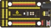
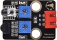
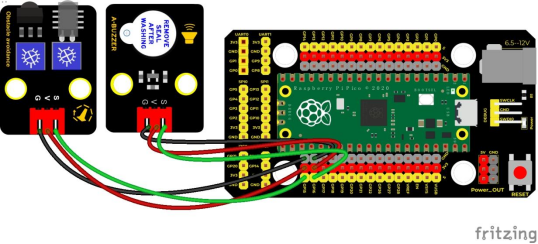
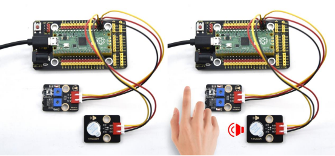

## 实验二十七  障碍物报警实验

 

**实验说明**

在前面实验课程中中，我们利用一个输入模块控制另一个输出模块。在这一实验中，我们还是用一个模块控制另一个模块，当避障传感器检测到障碍物时有源蜂鸣器响起。

生活中，我们可以利用一个检测传感器控制一个有源蜂鸣器响起或者LED点亮，做声光报警设备，如检测磁场（干簧管）、检测倾斜（倾斜模块）等等。

 

**实验器材**

|  |  |      |          |  |  |
| -------------------------- | -------------------------- | ------------------------------ | ---------------------------------- | -------------------------- | -------------------------- |
| Raspberry Pi Pico板*1      | Raspberry Pi Pico扩展板*1  | keyes DIY电子积木 避障传感器*1 | keyes DIY电子积木 有源蜂鸣器模块*1 | 防反插3Pin*2               | MicroUSB线*1               |

 

**接线图**

 

 

**测试代码**

```c
/* 

 * Keyes Starter Kit for Raspberry Pi Pico

 * lesson 27

 * Avoiding alarm

*/

int item = 0;

void setup() {

 pinMode(15, INPUT);  //避障传感器接GP15并设置为输入模式

 pinMode(16, OUTPUT); //蜂鸣器接GP16并设置为输出模式

}

 

void loop() {

 item = digitalRead(15);//读取避障传感器输出的电平值

 if (item == 0) {//检测到障碍物

  digitalWrite(16, HIGH);//蜂鸣器响起

 } else {//没有检测到障碍物

  digitalWrite(16, LOW);//蜂鸣器关闭

 }

 delay(100);//延时100ms

 

}
```

**代码说明**

1. 我们需要跟前面学习的课程一样，根据接线设置传感器/模块连接的IO口，然后配置引脚模式。
2. 我们前面已经知道，按下按键我们读取的值为0，那么我们通过**if...else...**语句判断按键值为0**if (item == 0)**来响起蜂鸣器 **digitalWrite(16, HIGH)**。

 

 

**测试结果**

上传测试代码成功，按照接线图接好线，上电后，检测到障碍物时，外接的有源蜂鸣器响起声音，否则有源蜂鸣器停止响音。

