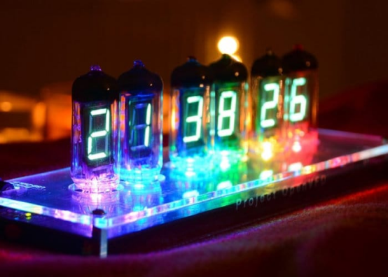
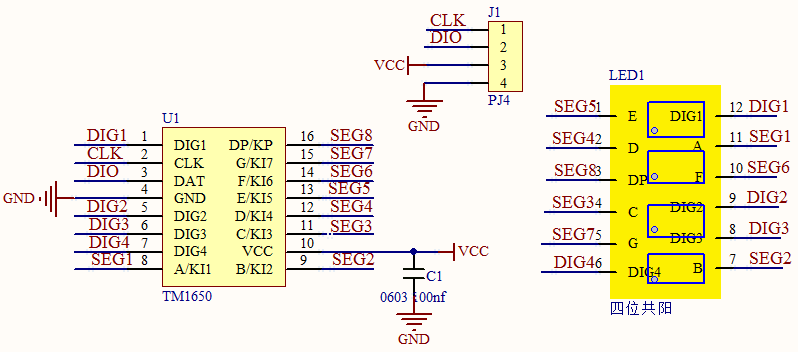
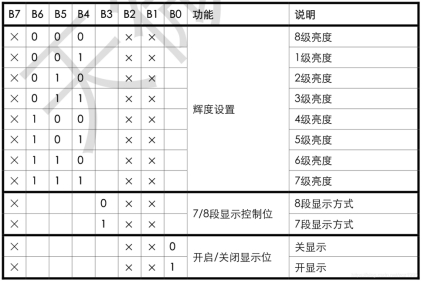
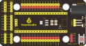
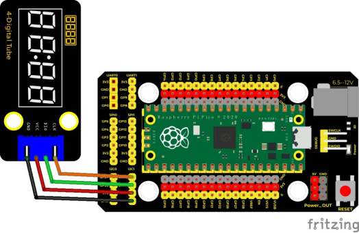
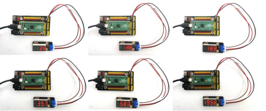

## 实验二十三  TM1650四位数码管模块

 

**实验说明**

这个模块主要由一个0.36英寸红色共阳4位数码管组成，它的驱动芯片是TM1650。使用时，我们只需要2根信号线即可使单片机控制4位数码管，大大节约了控制板IO口资源。TM1650是一种带键盘扫描接口的LED驱动控制专用电路。内部集成有MCU输入输出控制数字接口、数据锁存器、LED 驱动、键盘扫描等电路。TM1650性能稳定、质量可靠、抗干扰能力强，可适用于24小时长期连续工作的应用场合。TM1650采用两线串行传输协议通讯（注意该数据传输协议不是标准的I2C协议）。该芯片只需要通过两个引脚与MCU通讯就可以完成数码管的驱动，可以节省MCU引脚资源。

实验中，我们利用四位数码管从0到9999累加显示出来，并刷新时间为0.01秒。

 

**实验原理**

TM1650采用的是IIC协议。使用SDA、SCL两条总线。

我们使用封装好的库函数直接驱动，当然大家有兴趣也可以去了解底层的库函数是如何实现的。



**数据命令设置**：0x48，这个是告诉TM1650，我们要用点亮数码管的功能，而不是按键扫描的功能


|      |                            |
| ---- | -------------------------- |
|      |  |

**显示命令设置：**


这里实际是一个字节数据，只是不同位部分代表不同功能。
bit[6:4]：设置数码管亮度，注意，000是最亮。
bit[3]：设置要不要显示小数点
bit[0]：是不是要开启数码管的显示

 

**实验器材**

|  |  |              |  |  |
| -------------------------- | -------------------------- | -------------------------------------- | -------------------------- | -------------------------- |
| Raspberry Pi Pico板*1      | Raspberry Pi Pico扩展板*1  | keyes DIY子积木 TM1650四位数码管模块*1 | 防反插4Pin*1               | MicroUSB线*1               |

 

**接线图**

 

 

**测试代码**

```c
/*

  Keyes Starter Kit for Raspberry Pi Pico

  lesson 23

  TM1650 Four digital tube

 */

#include "KETM1650.h" //导入TM1650的库文件

int item = 0; //要显示的值

//两线接口为GP14, GP15

#define DIO 15

#define CLK 14

KETM1650 tm_4display(CLK, DIO);

 

void setup() {

 tm_4display.init(); //初始化

 tm_4display.setBrightness(3); //设置 亮度为3，范围（1~8）

}

 

void loop() {

 tm_4display.displayString(item);//四位数码管显示item值

 item = item + 1;  //自加一

 if (item > 9999) {  //加到超过9999时，清零

  item = 0;

 }

 delay(100); //延时100毫秒

}
```

**代码说明**

同样我们需要先导入TM1650模块的库文件，下面介绍一些常用的函数接口：

**.init();**初始化TM1650

**.clear();**清除数码管显示

**.displayString(char \*aString);**显示字符串，*aString指向aString的字符串内容

**.displayString(String sString);**显示字符串，sString为字符串

**.displayString(float value);**显示小数，内容为float型

**.displayString(double value);**显示小数，内容为double型

**.displayString(int value);**显示整数，内容为int型

**.displayOn();**打开数码管显示

**.displayOff();**关闭数码管显示，与.clear方法不同的是，一旦关闭必须调用.displayOn();才能重新显示。

**.setDot(unsigned int aPos, bool aState);**显示小数点，aPos为小数点的位置（0~3）对应（1~4），aState为显示状态：1（true）点亮，2（false）熄灭。

**.setBrightness(unsigned int iBrightness);**设置数码管的亮度，iBrightness为亮度值（1~8），类型为unsigned int，当设置小于1时自动设置1，当设置大于8时自动设置为8。

细节请看代码注释。

 

**测试结果**

烧录好测试代码，按照接线图连接好线,上电后，4位数码管从0开始显示的数字每10毫秒加1，直到大于9999又从0开始。

 