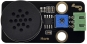
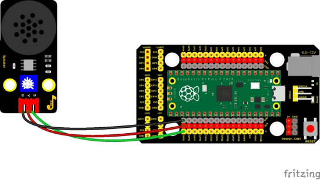
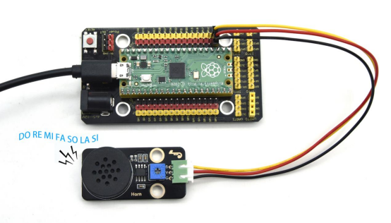

## 实验二十九  音乐播放

 

**实验说明**

在前面的单个模块是学校中，我们学习了让8002b功放 喇叭模块发出特定频率的声音、播放的节拍以及调节喇叭的声音大小，其实每首音乐就是由一个个特定的节拍与音调（频率）组合而成的。在这一实验中，我们利用这个喇叭模块播放一首音乐。

要演奏出音乐，我们首先需要搞清楚各音调的频率，具体见下表：

低音：

| 音调音符 | 1#   | 2#   | 3#   | 4#   | 5#   | 6#   | 7#   |
| -------- | ---- | ---- | ---- | ---- | ---- | ---- | ---- |
| A        | 221  | 248  | 278  | 294  | 330  | 371  | 416  |
| B        | 248  | 278  | 294  | 330  | 371  | 416  | 467  |
| C        | 131  | 147  | 165  | 175  | 196  | 221  | 248  |
| D        | 147  | 165  | 175  | 196  | 221  | 248  | 278  |
| E        | 165  | 175  | 196  | 221  | 248  | 278  | 312  |
| F        | 175  | 196  | 221  | 234  | 262  | 294  | 330  |
| G        | 196  | 221  | 234  | 262  | 294  | 330  | 371  |

 

中音：

| 音调音符 | 1    | 2    | 3    | 4    | 5    | 6    | 7    |
| -------- | ---- | ---- | ---- | ---- | ---- | ---- | ---- |
| A        | 441  | 495  | 556  | 589  | 661  | 724  | 833  |
| B        | 495  | 556  | 624  | 661  | 724  | 833  | 935  |
| C        | 262  | 294  | 330  | 350  | 393  | 441  | 495  |
| D        | 294  | 330  | 350  | 393  | 441  | 495  | 556  |
| E        | 330  | 350  | 393  | 441  | 495  | 556  | 624  |
| F        | 350  | 393  | 441  | 495  | 556  | 624  | 661  |
| G        | 393  | 441  | 495  | 556  | 624  | 661  | 724  |

 

高音：

| 音调音符 | 1#   | 2#   | 3#   | 4#   | 5#   | 6#   | 7#   |
| -------- | ---- | ---- | ---- | ---- | ---- | ---- | ---- |
| A        | 882  | 990  | 1112 | 1178 | 1322 | 1484 | 1665 |
| B        | 990  | 1112 | 1178 | 1322 | 1484 | 1665 | 1869 |
| C        | 525  | 589  | 661  | 700  | 786  | 882  | 990  |
| D        | 589  | 661  | 700  | 786  | 882  | 990  | 1112 |
| E        | 661  | 700  | 786  | 882  | 990  | 1112 | 1248 |
| F        | 700  | 786  | 882  | 935  | 1049 | 1178 | 1322 |
| G        | 786  | 882  | 990  | 1049 | 1178 | 1322 | 1484 |

我们知道了音调的频率后，下一步就是控制音符的演奏时间。每个音符都会播放一定的时间，这样才能构成一首优美的曲子，而不是生硬的一个调的把所有的音符一股脑的都播放出来。音符节奏分为一拍、半拍、1/4拍、1/8拍，我们规定一拍音符的时间为1；半拍为0.5；1/4拍为0.25；1/8拍为0.125……，所以我们可以为每个音符赋予这样的拍子播放出来，音乐就成了。

这里我们具体以《生日快乐》为例：

 

**实验器材**

|  |  |              |  |  |
| -------------------------- | -------------------------- | -------------------------------------- | -------------------------- | -------------------------- |
| Raspberry Pi Pico板*1      | Raspberry Pi Pico扩展板*1  | keyes DIY电子积木 8002b功放 喇叭模块*1 | 防反插3Pin*1               | MicroUSB线*1               |

 

**接线图**

 

 

**测试代码**

```cpp
/*

 * Keyes Starter Kit for Raspberry Pi Pico

 * lesson 29

 * play music

*/

#define D0 -1

#define D1 262

#define D2 293

#define D3 329

#define D4 349

#define D5 392

#define D6 440

#define D7 494

#define M1 523

#define M2 586

#define M3 658

#define M4 697

#define M5 783

#define M6 879

#define M7 987

#define H1 1045

#define H2 1171

#define H3 1316

#define H4 1393

#define H5 1563

#define H6 1755

#define H7 1971

//列出全部D调的频率

#define WHOLE 1

#define HALF 0.5

#define QUARTER 0.25

#define EIGHTH 0.25

#define SIXTEENTH 0.625

//列出所有节拍

int tune[] =       //根据简谱列出各频率

{

 D5, D5, D6, D5, M1, D7,
 D5, D5, D6, D5, M2, M1,
 D5, D5, M5, M3, M1, D7, D6,
 M4, M4, M3, M1, M2, M1
};

float durt[] =    //根据简谱列出各节拍

{
 0.5, 0.5, 1, 1, 1, 1 + 1,
 0.5, 0.5, 1, 1, 1, 1 + 1,
 0.5, 0.5, 1, 1, 1, 1, 1,
 0.5, 0.5, 1, 1, 1, 1 + 1
};

int beeppin = 15; //功放喇叭引脚接GP15

int length;

void setup() {

 pinMode(beeppin, OUTPUT);//设置蜂鸣器引脚输出模式

 length = sizeof(tune) / sizeof(tune[0]);//计算长度

}

 
void loop() {
 for (int x = 0; x < length; x++)

 {
  tone(beeppin, tune[x]);
  delay(500 * durt[x]); //这里用来根据节拍调节延时，500这个指数可以自己调整，在该音乐中，我发现用500比较合适。
  noTone(beeppin);
 }

 delay(2000);

}

```

 

**代码说明**

我们先是列出了所有D调的频率，方便后面使用。然后根据简谱列出各频率，再列出各节拍，我们用到的一个节拍为500ms，这个可以自己调整，然后循环响起音调与对应节拍就成了一首歌曲。

 

**测试结果**

上传测试代码成功，按照接线图接好线，功放喇叭模块播放出生日快乐歌曲。

 