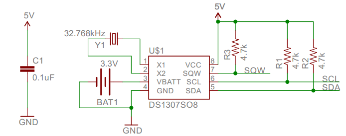
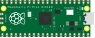
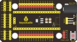
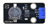
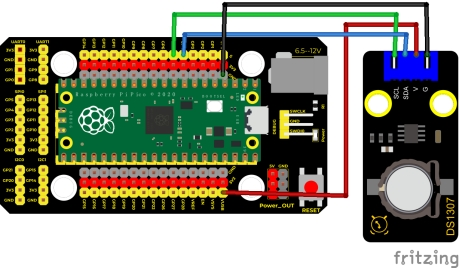
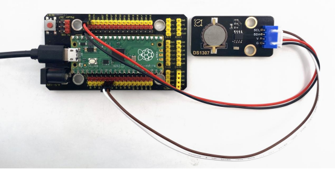
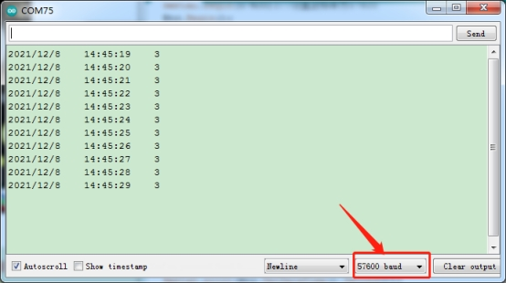

## 实验二十二  DS1307时钟模块


 

**实验说明**

这个模块主要用到实时时钟芯片DS1307。是美国DALLAS公司推出的I2C总线接口实时时钟芯片，它可独立于CPU工作，不受CPU主晶振及其电容的影响，且计时准确，月累积误差一般小于10秒。芯片还具有主电源掉电情况下的时钟保护电路，DS1307的时钟靠后备电池维持工作，拒绝CPU对其读出和写入访问。同时还具有备用电源自动切换控制电路，因而可在主电源掉电和其它一些恶劣环境场合中保证系统时钟的定时准确性。DS1307具有产生秒、分、时、日、月、年等功能，且具有闰年自动调整功能。同时，DS1307芯片内部还集成有一定容量、具有掉电保护特性的静态RAM，可用于保存一些关键数据。

实验中，我们利用DS1307时钟模块获取系统时间，将测试结果在串口监视器上显示出来。

 

**实验原理**



DS1307 把8 个寄存器和56 字节的RAM 进行了统一编址，记录年、月、日、时、分、秒及星期; AM、PM 分别表示上午和下午; 56 个字节的NVRAM存放数据; 2线串口; 可编程的方波输出;电源故障检测及自动切换电路;电池电流小于500nA。

主要引脚定义如下： 

X1、32.768kHz 晶振接入端;

VBAT:X2：+3V 电池电压输入;

SDA：串行数据;

SCL：串行时钟;

SQW/OUT：方波/输出驱动器。

 

**实验器材**

|  |  |           |  |  |
| -------------------------- | -------------------------- | ----------------------------------- | -------------------------- | -------------------------- |
| Raspberry Pi Pico板*1      | Raspberry Pi Pico扩展板*1  | keyes DIY电子积木DS1307传感器模块*1 | 防反插4Pin*1               | MicroUSB线*1               |

 

**接线图**

 

我们前面介绍了，VUSB为5V，所以我们这里的电源接到了VUSB。

**测试代码**

```c
/*

  Keyes Starter Kit for Raspberry Pi Pico

  lesson 22

  DS1307 Real Time Clock

 */

#include <Wire.h>
#include "RtcDS1307.h"  //DS1307时钟模块的库
RtcDS1307<TwoWire> Rtc(Wire);//i2c接口

void setup(){

 Serial.begin(57600);//设置波特率为57600
 Rtc.Begin();
 Rtc.SetIsRunning(true);
 Rtc.SetDateTime(RtcDateTime(__DATE__, __TIME__));
}

 

void loop(){

 //打印年/月/日/时/分/秒/星期

 Serial.print(Rtc.GetDateTime().Year());
 Serial.print("/");
 Serial.print(Rtc.GetDateTime().Month());
 Serial.print("/");
 Serial.print(Rtc.GetDateTime().Day());
 Serial.print("   ");
 Serial.print(Rtc.GetDateTime().Hour());
 Serial.print(":");
 Serial.print(Rtc.GetDateTime().Minute());
 Serial.print(":");
 Serial.print(Rtc.GetDateTime().Second());
 Serial.print("   ");
 Serial.println(Rtc.GetDateTime().DayOfWeek());
 delay(1000);//延时1秒
}

```

**代码说明**

在实验中，我们需要先导入这个时钟模块的库。Rtc.GetDateTime()为获取当前系统的时间和日期。

**Rtc.Begin();** 启动DS1307实时时钟

**Rtc.SetIsRunning(true);** 运行DS1307实时时钟，如果**true** 改为**false** 则时间暂停

**Rtc.SetDateTime()；** 设置时间

**Rtc.GetDateTime().Year()**  返回年份

**Rtc.GetDateTime().Month()**  返回月份

**Rtc.GetDateTime().Day() ** 返回日期

**Rtc.GetDateTime().Hour()** 返回时

**Rtc.GetDateTime().Minute()** 返回分

**Rtc.GetDateTime().Second()** 返回秒

**Rtc.GetDateTime().DayOfWeek()** 返回星期

 

**测试结果**

烧录好测试代码，按照接线图连接好线；利用USB接口上电后，进入串口监视器，设置波特率为9600。我们可在软件串口监视器中看到设置时间日期（年、月、日、时、分、秒、周），如下图。

 

 