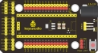
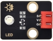
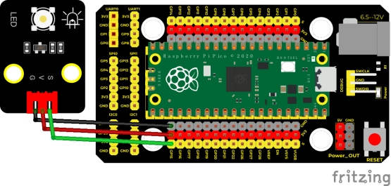
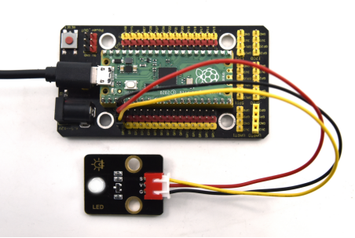

## 实验二十五  呼吸灯

 

**实验说明**

在第一课我们学习了如何点亮LED灯及让LED闪烁。但是LED的玩法远不仅如此，例如有时候我们看到灯光的慢慢变亮或者慢慢变暗，这个就叫呼吸灯，在前面第三章第三小节我们上传了一个示例代码，让我们的板载LED明暗变化，这个其实就是一个呼吸灯效果。所谓呼吸灯，就是控制LED首先逐渐变亮，然后逐渐变暗，循环交替，如人体呼吸一样。我们前面是直接用高电平点亮LED，用低电平熄灭LED，如果要让LED不那么亮但又不完全熄灭，那怎么办呢?这个也很简单，我们控制流过LED的电流就可以，电流小了，LED自然就暗了，也就是LED两端的电压小了LED就暗了。如何控制电压呢？前面我们已经学习的插件RGB就是利用PWM原理进行调色，所以我们使用PWM就可以了。

 

**实验器材**

|  |  |       |  |  |
| -------------------------- | -------------------------- | ------------------------------- | -------------------------- | -------------------------- |
| Raspberry Pi Pico板*1      | Raspberry Pi Pico扩展板*1  | keyes DIY电子积木 白色LED模块*1 | 防反插3Pin*1               | MicroUSB线*1               |

 

 

**接线图**

 

 

**测试代码**

```c
/* 

 * Keyes Starter Kit for Raspberry Pi Pico

 * lesson 25

 * Breath

*/

int LED = 15; //LED管脚接GP15

 

void setup() {

 pinMode(LED, OUTPUT);  //设置LED引脚为输出模式

}

 

void loop() {

 for (int i = 0; i <= 255; i++) {  //从0到255，每次加1

  analogWrite(LED, i);

  delay(10);//延时10ms

 }

 for (int i = 255; i >= 0; i--) {  //从255到0，每次减1

  analogWrite(LED, i);

  delay(10);//延时10ms

 }

}
```

**代码说明**

我们在此实验中用到for (int i = 0; i <= 255; i = i + 1)；表示变量i从0到255，每次自加1，直到不满足 i <= 255这个判断表达式，否则一直执行大括号里的代码，即一共执行256次大括号里的代码；同理for (int i = 255; i >= 0; i = i - 1)；i每次自减1，当不满足i>= 0时，跳出该for()循环，一共执行256次。

代码中，我们通过设置PWM值，控制模块上LED亮度。实验中，我们将模块信号端接在GPIO15脚。设置时我们设置PWM数值越小，模块上LED越暗，数值越大，模块上LED越亮，范围为0-255。analogWrite（pin，value），pin为PWM口，value是要输出的PWM值（0~255）。

通过整合前面知识，我们再来看代码，就清楚多了。将GP15的PWM输出值设置为i，i刚开始由0增加到255，每次加1，每加一次延迟10毫秒，模块上LED逐渐变亮。PWM为255后，i开始由255减小到0，每次减1，每减一次延迟10毫秒，模块上LED逐渐变暗。然后又逐渐变亮，循环交替，如人体呼吸一样。

如果我们感觉逐渐变亮 或者逐渐变暗的时间过长，我们可以更改代码设置。有两种方法，一种是将每次加1减1的延迟时间降低；另一种是更改步长，注意这个步长必须能被255整除，如3 5。步长改为3  -3代表i每次增加3或减小3。

 

**测试结果**

上传测试代码成功，上电后，模块上LED逐渐变暗。然后又逐渐变亮，循环交替，如人体呼吸一样。

 