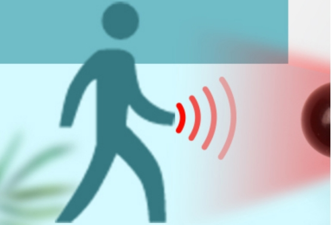
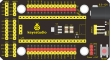
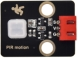
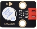
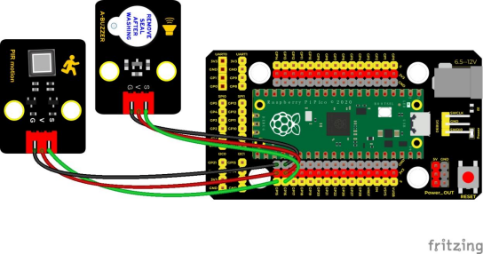
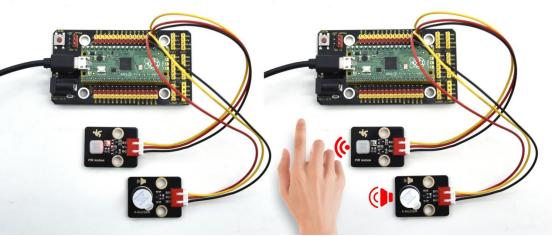

## 实验二十八  pico入侵检测报警器

 

**实验说明**

在上一课实验中，我们利用避障传感器检测障碍物进行报警提醒，在这一实验中，我们利用人体红外热释传感器检测结果控制一个有源蜂鸣器响起和板载LED快速闪烁。

 

**实验器材**

|  |  |              |          |  |  |
| -------------------------- | -------------------------- | -------------------------------------- | ---------------------------------- | -------------------------- | -------------------------- |
| Raspberry Pi Pico板*1      | Raspberry Pi Pico扩展板*1  | keyes DIY电子积木 人体红外热释传感器*1 | keyes DIY电子积木 有源蜂鸣器模块*1 | 防反插3Pin*2               | MicroUSB线*1               |

 

 

**接线图**

 

 

**测试代码**

```c
/* 

 * Keyes Starter Kit for Raspberry Pi Pico

 * lesson 28

 * PIR alarm

*/

int item = 0;

void setup() {

 pinMode(15, INPUT);  //人体红外传感器接GP15并设置为为输入模式

 pinMode(16, OUTPUT);//有缘蜂鸣器接GP16并设置为为输出模式

}

 

void loop() {

 item = digitalRead(15);//读取红外热释传感器输出的数字电平信号

 if (item == 1) {  //检测到有人运动

  digitalWrite(16, HIGH); //打开蜂鸣器

 } else {  //没有检测到

  digitalWrite(16, LOW); //关闭蜂鸣器

 }

}
```

**代码说明**

实验中代码设置与前面实验相同，这里就不多说了。

 

**测试结果**

上传测试代码成功，按照接线图接好线，上电后，传感器检测到附近有人运动时，外接的有源蜂鸣器响起声音，否则有源蜂鸣器停止响声。

 