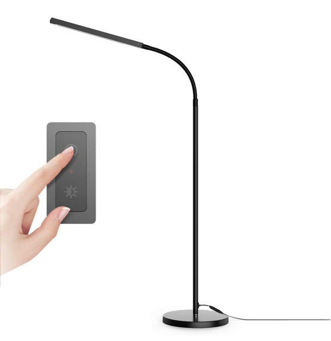
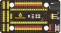
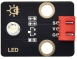
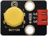
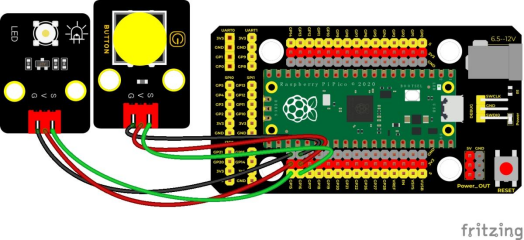
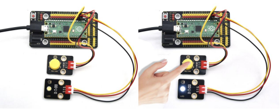

## 实验二十六  按键控制LED灯

 

**实验说明**

从前面的实验课程中我们了解到按键模块按下我们的单片机读取到低电平，松开读取到高电平。在这一实验课程中，我们利用按键和LED做一个扩展，如果当按键按下时即读取到低电平时我们点亮LED，松开按键时即读取到高电平时我们熄灭LED，这样就可以通过一个模块控制另一个模块了，但是这样似乎过于简单，所以我们在这里使用中断，按下按键LED点亮，再次按下按键LED熄灭，再次按下再次点亮...。

 

**实验器材**

|  |  |       |        |  |  |
| -------------------------- | -------------------------- | ------------------------------- | -------------------------------- | -------------------------- | -------------------------- |
| Raspberry Pi Pico板*1      | Raspberry Pi Pico扩展板*1  | keyes DIY电子积木 白色LED模块*1 | keyes DIY电子积木 单路按键模块*1 | 防反插3Pin*2               | MicroUSB线*1               |

 

 

**接线图**

 

 

**测试代码**

```c
/* 

 * Keyes Starter Kit for Raspberry Pi Pico

 * lesson 26

 * button control LED

*/

int button = 16;//按键的管脚接数字口16

int led = 15;//LED的管脚接GP15

bool led_flag;

void setup() {

 pinMode(button, INPUT);  //按键的管脚设置为输入模式

 pinMode(led, OUTPUT);  //LED的管脚设置为输出模式

 attachInterrupt(digitalPinToInterrupt(button), toggle_handle, FALLING);  //外部中断0，下降沿触发

}

 

void loop() {

 digitalWrite(led, led_flag);//按下按键点亮LED或者熄灭LED

 delay(100);

}

 

void toggle_handle(){//切换LED状态

 led_flag = !led_flag;

}
```

**代码说明**

1. 我们需要跟前面学习的课程一样，根据接线设置传感器/模块连接的IO口，然后配置引脚模式。

**2.** **attachInterrupt(digitalPinToInterrupt(button), toggle_handle, FALLING)**触发模式为下降沿触发也就是高电平变为低电平时，触发中断，然后调用中断服务函数**toggle_handle**，每次进入中断，我们都把变量**led_flag**取反，这样就可以按下点亮再次按下熄灭的效果了。

 

**测试结果**

上传测试代码成功，按照接线图接好线，利用USB上电后，当我们按下按键，LED被点亮，再次按下按键，LED熄灭。

 