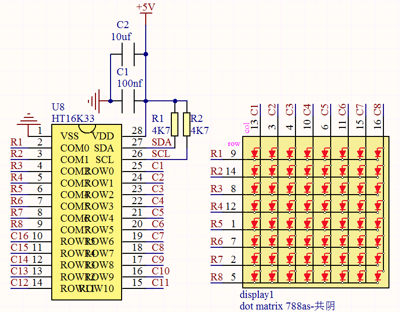
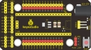
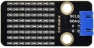
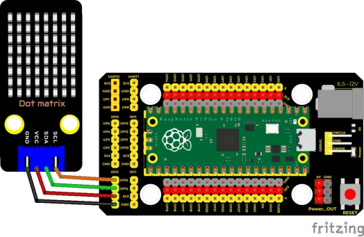
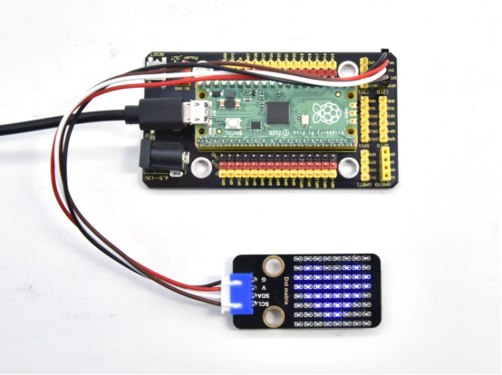

## 实验二十四  HT16K33_8X8点阵模块

 

**实验说明**

什么是点阵？我们用之前的方法一个IO口只能控制一个led，如果需要用更少的IO口控制更多的led怎么办呢，于是就有了点阵。

8X8点阵共由64个发光二极管组成，且每个发光二极管是放置在行线和列线的交叉点上，当对应的某一行置1电平，某一列置0电平，则相应的二极管就亮；如要将第一个点点亮，则1脚接高电平a脚接低电平，则第一个点就亮了。实验中我们用点阵显示一些字符图案图案。

 

**实验原理**

如原理图所示，我们如果想要点亮第一行第一列的那个LED灯，只需要把C1置高电平，R1置电平它就亮了，如果我们想让第一行led全部点亮，那么我们让R1为低电平，C1~C8全部为高电平就可以了，原理非常简单。但是这样的话我们总共需要用到16个IO口，这样就极大的浪费单片机资源。为此，我们特别设计了这个模块，利用HT16K33芯片驱动1个8*8点阵，只需要利用单片机的I2C通信端口控制点阵，大大的节约了单片机资源。



有些模块上自带3个拨码开关，可以让你随意拨动开关，这是用来设置I2C通信地址的。设置方法如下表格。我们的这个模块中，模块已经固定了通信地址，A0，A1，A2全部接地，即地址为0x70.


| A0（1）  | A1（2）  | A2（3）  | A0（1）  | A1（2）  | A2（3）  | A0（1）  | A1（2）  | A2（3）  |
| -------- | -------- | -------- | -------- | -------- | -------- | -------- | -------- | -------- |
| 0（OFF） | 0（OFF） | 0（OFF） | 1（ON）  | 0（OFF） | 0（OFF） | 0（OFF） | 1（ON）  | 0（OFF） |
| OX70     | OX71     | OX72     |          |          |          |          |          |          |
| A0（1）  | A1（2）  | A2（3）  | A0（1）  | A1（2）  | A2（3）  | A0（1）  | A1（2）  | A2（3）  |
| 1（ON）  | 1（ON）  | 0（OFF） | 0（OFF） | 0（OFF） | 1（ON）  | 1（ON）  | 0（OFF） | 1（ON）  |
| OX73     | OX74     | OX75     |          |          |          |          |          |          |
| A0（1）  | A1（2）  | A2（3）  | A0（1）  | A1（2）  | A2（3）  |          |          |          |
| 0（OFF） | 1（ON）  | 1（ON）  | 1（ON）  | 1（ON）  | 1（ON）  |          |          |          |
| OX76     | OX77     |          |          |          |          |          |          |          |

 

**实验器材**

|  |  |              |  |  |
| -------------------------- | -------------------------- | -------------------------------------- | -------------------------- | -------------------------- |
| Raspberry Pi Pico板*1      | Raspberry Pi Pico扩展板*1  | keyes DIY电 积木 HT16K33_8X8点阵模块*1 | 防反插4Pin*1               | MicroUSB线*1               |

 

 

**接线图**

 

 

  

**测试代码**

```c
/*

  Keyes Starter Kit for Raspberry Pi Pico

  lesson 24

  HT16K33 8\*8 dot matrix

*/

#include <Matrix.h>//点阵的库

 

Matrix myMatrix(20, 21);

uint8_t  LEDArray[8];

 

const uint8_t LedArray1[8] PROGMEM = {0x00, 0x18, 0x3c, 0x7e, 0xff, 0xff, 0x66, 0x00};//心形图案

 

void setup() {

 myMatrix.begin(0x70);//iic地址

 myMatrix.clear();//清除显示

 myMatrix.setBrightness(5);//亮度5,范围0~15

}

 

void loop() {

 memcpy_P(&LEDArray, &LedArray1, 8);

 for (int i = 0; i < 8; i++)

 {

  for (int j = 0; j < 8; j++)

  {

   if ((LEDArray[i] & 0x01))

    myMatrix.drawPixel(j, i, 1);

   else

    myMatrix.drawPixel(j, i, 0);

   LEDArray[i] = LEDArray[i] >> 1;

  }

 }

 myMatrix.write(); //显示

 

}
```

**代码说明**

1. 首先我们需要先导入库文件
2. 我们代码中的图案是一个字节数据类型的数组构成，我们在下面的表格上表示出来。

我们将{0x00, 0x18, 0x3c, 0x7e, 0xff, 0xff, 0x66, 0x00}转化为二进制，填入下面的8*8表格就清晰了。其中1表示亮，0表示灭，我们可以看到是一个心形。

| 0    | 0    | 0    | 0    | 0    | 0    | 0    | 0    |
| ---- | ---- | ---- | ---- | ---- | ---- | ---- | ---- |
| 0    | 0    | 0    | 1    | 1    | 0    | 0    | 0    |
| 0    | 0    | 1    | 1    | 1    | 1    | 0    | 0    |
| 0    | 1    | 1    | 1    | 1    | 1    | 1    | 0    |
| 1    | 1    | 1    | 1    | 1    | 1    | 1    | 1    |
| 1    | 1    | 1    | 1    | 1    | 1    | 1    | 1    |
| 0    | 1    | 1    | 0    | 0    | 1    | 1    | 0    |
| 0    | 0    | 0    | 0    | 0    | 0    | 0    | 0    |

 

**测试结果**

烧录好测试代码，按照接线图连接好线；上电后，点阵显示一个心形图案。



