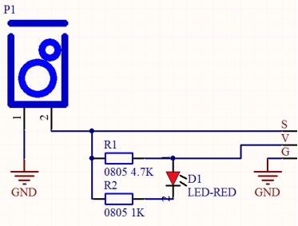
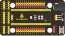
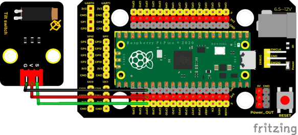
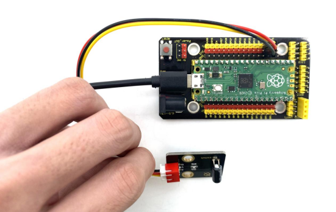
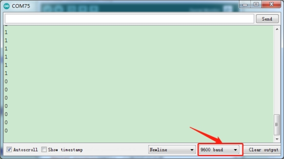

## 实验五  倾斜模块的原理

  

**实验说明**

在这个套件中，有一个Keyes DIY电子积木 倾斜传感器，倾斜开关可以依据模块是否倾斜而输出不同电平信号。其内部带有一颗滚珠，因此可以监测倾斜情况。当开关高于水平位置倾斜时开关导通，低于水平位置时开关断开。倾斜模块可用于倾斜检测、报警器制作或者其他检测。

实验中我们用串口监视器打印出信号端检测到的数字电平信号。

 

**实验原理**

它的原理非常简单，附原理图，主要是利用滚珠在开关内随不同倾斜角度的发化使滚珠开关P1的引脚1和2导通或者不导通，当1和2导通时，因为1教接GND，所以信号端S为低电平，此时红色LED形成回路，将会点亮；当1和2不导通时，引脚2被4.7K的上拉电阻R1拉高而使信号端S为高电平，模块上的LED将熄灭。


 


**实验器材**

|  |  |       |  |  |
| ------------------------- | ------------------------- | ------------------------------ | ------------------------- | ------------------------- |
| Raspberry Pi Pico板*1     | Raspberry Pi Pico扩展板*1 | keyes DIY电子积木 倾斜传感器*1 | 防反插3Pin*1              | MicroUSB线*1              |

**接线图**

 

 

**测试代码**

```c
/* 

 * Keyes Starter Kit for Raspberry Pi Pico

 * lesson 5

 * Tilt switch

*/

int val; //存放倾斜传感器输出的电平值

 

void setup() {

 Serial.begin(9600);

 pinMode(17, INPUT);  //倾斜传感器管脚接GP17，设置GP17为输入模式

}

 

void loop() {

 val = digitalRead(17); //读取模块的电平信号

 Serial.println(val);  //换行打印出来

 delay(100); //延时100毫秒

 

}
```

**代码说明**

代码设置与实验三相同，详情请看代码注释与实验三代码说明。

 

**测试结果**

上传测试代码成功，利用USB线上电后，打开串口监视器，设置波特率为9600。将倾斜模块倾斜一边， 模块上的红色LED不亮，串口监视器打印数字电平信号“1”；将倾斜模块倾斜另一边， 模块上的红色LED点亮，串口监视器打印数字电平信号“0”。

 

