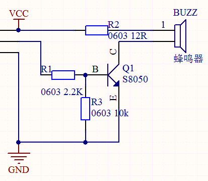
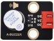
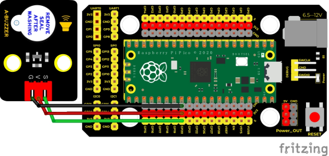
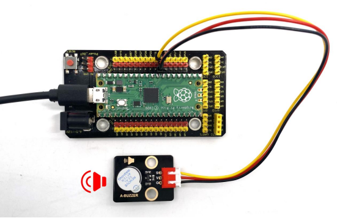

## 实验八  有源蜂鸣器模块播放声音

 

**实验说明**

在这个套件中，包含一个有源蜂鸣器模块，一个功放模块（相当于无源蜂鸣器模块）。这个实验中，我们控制有源蜂鸣器发出声音。有源蜂鸣器元件内部自带震荡电路，控制时，我们只需要给蜂鸣器元件足够的电压，蜂鸣器就自动响起。

实验中，我们只是控制这个模块上有源蜂鸣器的循环响起声音。

 

**实验原理**



从原理图中可以看出来在，蜂鸣器一端通过串联一个电阻R2连接到电压正极，另一端通过一个NPN三极管Q1连接到GND，所以只要导通这个三极管，让蜂鸣器一端连通GND，有缘蜂鸣器就会响起来。三极管控制端基极也就是连接到R1电阻一端为高电平，三极管Q1就导通了，三极管基极被下拉电阻R3拉低，所以常态为不导通，当我们用单片机IO口输出一个高电平到基极三极管就导通了。

即S信号端设置为高电平时，三极管导通，模块上蜂鸣器响起；设置为低电平时，三极管不导通，模块上蜂鸣器没有声音。

 

**实验器材**

|  |  |          |  |  |
| -------------------------- | -------------------------- | ---------------------------------- | -------------------------- | -------------------------- |
| Raspberry Pi Pico板*1      | Raspberry Pi Pico扩展板*1  | keyes DIY电子积木 有源蜂鸣器模块*1 | 防反插3Pin*1               | MicroUSB线*1               |

 

**接线图**

 

 

**测试代码**

```c
/* 

 * Keyes Starter Kit for Raspberry Pi Pico

 * lesson 8

 * Active buzzer

*/

int buzzer = 20; //定义蜂鸣器接管脚GP20

void setup() {

 pinMode(buzzer, OUTPUT);//设置输出模式

}

 

void loop() {

 digitalWrite(buzzer, HIGH); //发声

 delay(1000);

 digitalWrite(buzzer, LOW); //停止发声

 delay(1000);

}
```

**代码说明**

在实验中，我们把管脚号设置为20，设置为高时，模块上有源蜂鸣器响起；设置为低时，模块上有源蜂鸣器关闭声音。

 

**测试结果**

上传测试代码成功，上电后，模块上有源蜂鸣器响起1秒，关闭1秒，循环交替。

 

