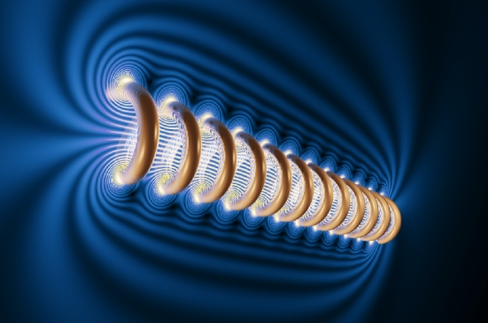
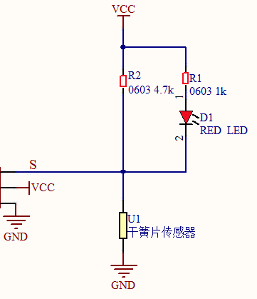
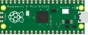
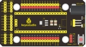
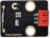
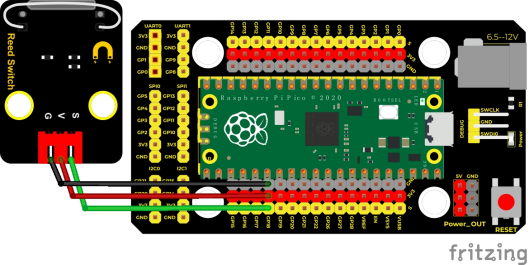
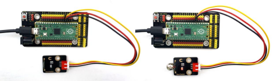
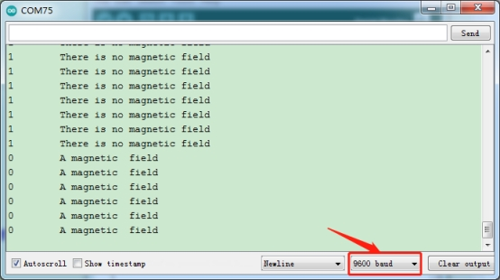

## 实验六  干簧管检测附近磁场

 

**实验说明**

在这个套件中，有一个Keyes DIY电子积木 干簧管模块，它主要采用MKA10110 绿色磁簧元件元件。簧管是干式舌簧管的简称，是一种有触点的无源电子开关元件，具有结构简单，体积小便于控制等优点。它的外壳是一根密封的玻璃管，管中装有两个铁质的弹性簧片电板，还灌有一种惰性气体，干簧管传感器用于检测附近有无磁场。

实验中，我们通过读取模块上S端高低电平，判断模块附近是否存在磁场；并且，我们在串口监视器上显示测试结果。

 

**实验原理**




平时状态下，玻璃管中的两个由特殊材料制成的簧片是分开的，此时信号端S被R2拉为高电平，LED熄灭。当有磁性物质靠近玻璃管时，在磁场磁力线的作用下，管内的两个簧片被磁化而互相吸引接触，簧片就会吸合在一起，使结点所接的电路连通，即信号端S连通GND，此时LED点亮。外磁力消失后，两个簧片由于本身的弹性而分开，线路也就断开了。该传感器就是利用元件这一特性，搭建电路将磁场信号转换为高低电平变换信号。


 

**实验器材**

|  |  |       |  |  |
| ------------------------- | ------------------------- | ------------------------------ | ------------------------- | ------------------------- |
| Raspberry Pi Pico板*1     | Raspberry Pi Pico扩展板*1 | keyes DIY电子积木 干簧管模块*1 | 防反插3Pin*1              | MicroUSB线*1              |

 

**接线图**

 

 

**测试代码**

```c
/* 

 * Keyes Starter Kit for Raspberry Pi Pico

 * lesson 6

 * Reed Switch

*/

int val = 0;

int reedPin = 18; //定义干簧管模块信号管脚接GP18

void setup() {

 Serial.begin(9600);//设置波特率为9600

 pinMode(reedPin, INPUT);//设置模式为输入

}

 

void loop() {

 val = digitalRead(reedPin);//读取数字电平

 Serial.print(val);//串口显示出来

 

 if (val == 0) {//附近存在磁场

  Serial.print("     ");

  Serial.println("A magnetic  field");

  delay(100);

 }

 else {//无磁场

  Serial.print("     ");

  Serial.println("There is no magnetic field");

  delay(100);

 }

}
```

**代码说明**

设置方法和前面实验类似，需要区分的是，这里是检测磁场。

 

**测试结果**

上传测试代码成功，利用USB线上电后，打开串口监视器，设置波特率为9600。串口监视器显示对应数据和字符。实验中，当传感器检测到磁场时，val为0且模块红色LED点亮，串口监视器显示“A magnetic field”字符；没有检测到磁场时，val为1，模块上LED熄灭，串口监视器显示“There is no magnetic field”字符，如下图。

 

