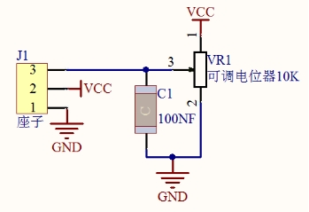
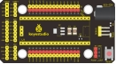
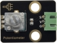
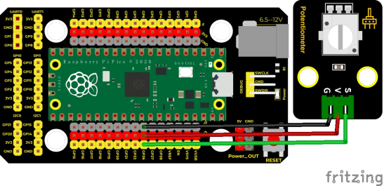
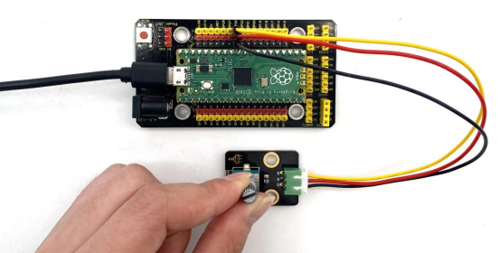
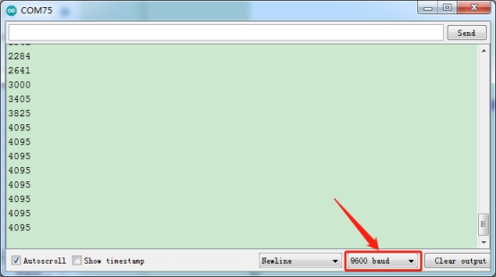

## 实验十一  旋转电位器传感器读取模拟值

 

**实验说明**

前面我们学习过的传感器，都是数字传感器，在这个套件中，有一个Keyes DIY电子积木 旋转电位器传感器，它与我们前面学到的传感器不同，它是一个模拟传感器，意思是例如我们前面学习的按键模块，当按键没有按下去时，我们读取到高电平（3.3V），当按键按下去时，我们读取到低电平（0V），而在0~3.3V中间的电压值，我们数字IO口无法读取到，当然按键模块也只能输出高低电平。而模拟传感器就可以通过我们pico板上的ADC模拟口（GP26~GP28）读取。

实验中，我们利用这个模块测试对应的模拟值；并且，我们在串口监视器显示测试结果。

 

**实验原理**



我们学过滑动变阻器的就很好理解，随着滑动变阻器上的滑片移动，滑片上的电压随着改变。我们的旋转电位器原理也是如此，它主要采用一个10K可调电阻。通过旋转电位器，我们可以改变电阻大小，信号端S检测到电压变化（0~3.3V），而这个电压变化是一个连续变化的模拟量，也就是在0~3.3V内可以取任意值，我们必须先对这个模拟量进行ADC采集，来测量连续的这些模拟量，A/D 是模拟量到数字量的转换，依靠的是模数转换器(Analog to Digital Converter)，简称ADC。我们的pico板已经集成了ADC采集，我们直接使用就可以。

我们pico板ADC位数是12位，一个n位的ADC表示这个ADC共有2的n次方个刻度。16位的ADC，输出的是从0～4095一共4096个数字量，也就是 2 的 12 次方个数据刻度，那么每个刻度就是3.3V/4096=0.0008V，这个也叫分辨率。

**实验器材**

|  |  |            |  |  |
| -------------------------- | -------------------------- | ------------------------------------ | -------------------------- | -------------------------- |
| Raspberry Pi Pico板*1      | Raspberry Pi Pico扩展板*1  | keyes DIY电子积木 旋转电位器传感器*1 | 防反插3Pin*1               | MicroUSB线*1               |

 

**接线图**

 

 

**测试代码**

```c
/* 

 * Keyes Starter Kit for Raspberry Pi Pico

 * lesson 11

 * Rotary potentiometer

*/

int analogVal = 0;

int resPin = 26; //电位器器接ADC0

void setup() {

 Serial.begin(9600);//设置波特率为9600

}

 

void loop() {

 analogVal = analogRead(resPin);//读取电位器的值

 Serial.println(analogVal);//打印模拟值

 delay(100);//延时100毫秒

 

}
```


**代码说明**

1. 在实验中，我们定义管脚变量名为analogVal，意思就是模拟值，前面我们又是用到数字传感器，我们这个实验用到的旋转电位器，它输出的是模拟值（0~4095），所以我们把管脚设置为模拟口，这里我们接ADC0即GP26。

 

2. 实验三，我们讲到digitalRead()函数，我们这里讲讲analogRead()函数。analogRead(pin)这个函数从指定的模拟引脚pin读取值。 pico板包含一个多通道、12位模数转换器。 这意味着它会将 0 和工作电压（5V 或 3.3V我们这里是3.3V）之间的输入电压映射为0和4095之间的整数值。例如，在pico上，这会产生以下读数之间的分辨率：3.3V/4096单位即每单位 0.0008V。
3. pin：要读取的模拟输入引脚的名称（我们pico板上的GP26到GP28，GP29测量VSYS电压，而ADC4测量的是内部温度）。设置1个整数变量item，将所测结果赋值给item。函数返回值为引脚上的模拟读数。虽然它受限于模数转换器的分辨率（0-4095为12位）。数据类型：int。
4. 串口监视器显示analogVal 的值，显示前需设置波特率（我们默认设置为9600，可更改）。

 

**测试结果**

上传测试代码成功，利用USB线上电后，打开串口监视器，设置波特率为9600。串口监视器显示对应模拟值。实验中，顺时针旋转电位器，模拟值增大，逆时针旋转电位器，模拟值减小，范围为0-4095，如下图。

 

