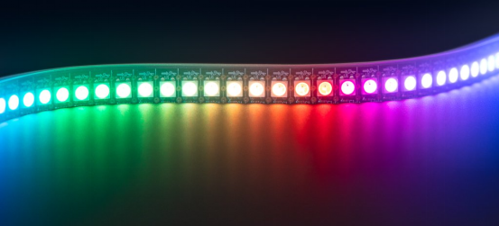
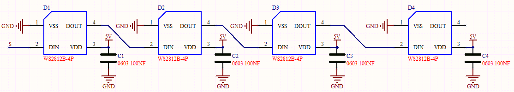
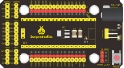
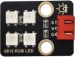
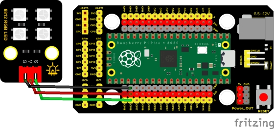
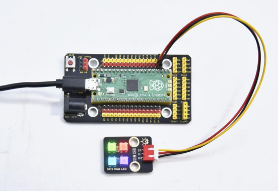

## 实验十七  SK6812 RGB模块

## 

**实验说明**

前面我们学习了插件RGB模块，利用PWM信号对模块的三个引脚进行调色。我们这个套价中，还有一个Keyes DIY电子积木 6812 RGB模块，但是这个SK6812 RGB 模块驱动原理不与我们前面学习过的插件RGB模块相同，而且只需要一个引脚就能控制，这是一个集控制电路与发光电路于一体的智能外控LED光源。每个LED原件其外型与一个5050LED灯珠相同，每个元件即为一个像素点，我们这个模块上有四个灯珠即四个像素，

实验中，我们分别使不同的灯亮出不同的颜色。

 

**实验原理**

从原理图中我们可以看出，这四个像素点灯珠都是串联起来的，其实不论多少个，我们都可以用一个引脚控制任一一个灯，并且让它显示任一种颜色。像素点内部包含了智能数字接口数据锁存信号整形放大驱动电路，还包含有高精度的内部振荡器和12V高压可编程定电流控制部分，有效保证了像素点光的颜色高度一致。

数据协议采用单线归零码的通讯方式，像素点在上电复位以后，S端接受从控制器传输过来的数据，首先送过来的24bit数据被第一个像素点提取后，送到像素点内部的数据锁存器。这个6812RGB通讯协议与驱动已经在底层封装好了，我们直接调用函数的接口就可以使用。


 


**实验器材**

|  |  |        |  |  |
| -------------------------- | -------------------------- | -------------------------------- | -------------------------- | -------------------------- |
| Raspberry Pi Pico板*1      | Raspberry Pi Pico扩展板*1  | keyes DIY电子积木 6812 RGB模块*1 | 防反插3Pin*1               | MicroUSB线*1               |

 

**接线图**

 

 

**测试代码**

```c
/* 

 * Keyes Starter Kit for Raspberry Pi Pico

 * lesson 17

 * 6812 RGB LED

*/

#include"rgb.h"

 

RGB rgb(16,4);             //rgb(pin, num);  num = 0-100

///////////////////////////////////////////////////////////////////////////////////

void setup() {

 rgb.setBrightness(100);       //rgb.setBrightness(0-255);

 delay(10);

 rgb.clear();            //Turn off all leds  

 delay(10);

}

///////////////////////////////////////////////////////////////////////////////////

void loop() {

 while(1){  

  rgb.setPixelColor(0,255,0,0);    //rgb.setPixelColor(num,r,g,b);  num = 0-100

  rgb.setPixelColor(1,0,255,0);    //rgb.setPixelColor(num,r,g,b);  num = 0-100

  rgb.setPixelColor(2,0,0,255);    //rgb.setPixelColor(num,r,g,b);  num = 0-100

  rgb.setPixelColor(3,255,255,255);  //rgb.setPixelColor(num,r,g,b);  num = 0-100

  rgb.show();

  delay(1000);

 }

}
```

**代码说明**

这里使用到库函数，库函数的添加方法请查看第三章第四小节。

我们介绍下主要的几个函数接口及功能：

**RGB rgb(16,4);**这个函数用来初始化6812RGB，16为引脚号，4为灯珠数

**rgb.setBrightness(100);**这个函数用来设置6812RGB显示的亮度，范围是（0~255），值越大，灯珠越亮，如果我们没有设置亮度，那么默认255，也就是最亮。

**rgb.clear();**这个函数用来清除显示

**rgb.setPixelColor(****uint16_t n, uint8_t r, uint8_t g, uint8_t b****);**这个函数用来设置6812RGB的灯珠号也就是位置，及每颗灯珠的颜色。

**rgb.show();**这个函数用来设置显示6812RGB，是必要的，如果没有这条语句，灯珠将不刷新显示

 

**测试结果**

烧录好测试代码，按照接线图连接好线，上电后，我们可以看到模块上的四个灯珠分别亮红绿蓝白色，如下图所示。

 