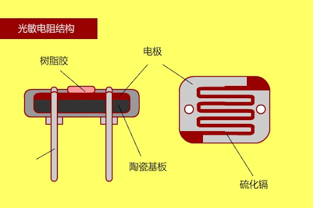
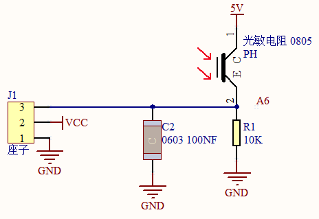
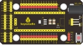
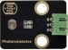
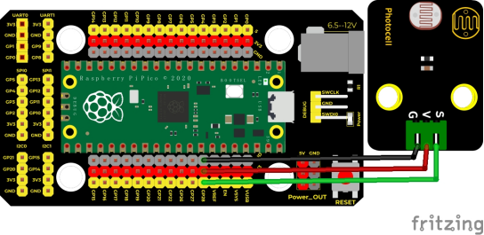
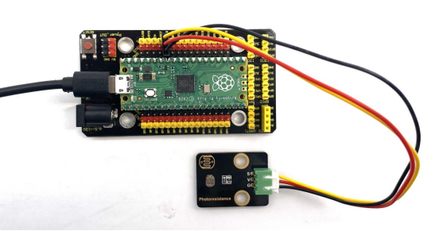
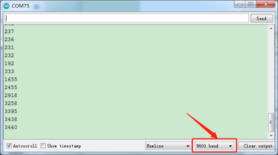

## 实验十三  光敏电阻传感器

 

**实验说明**

在这个套件中，有一个Keyes DIY电子积木 光敏电阻传感器，这是一个常用的光敏电阻传感器，它主要采用光敏电阻元件。该电阻元件电阻大小随着光照强度的变化而变化，该传感器就是利用光敏电阻元件这一特性，搭建电路将电阻变化转换为电压变化。光敏电阻传感器可以模拟人对环境光线的强度的判断，从而方便做出与人友好互动的应用。

接线时，我们将传感器信号端(S端)输入到pico模拟口，感知模拟值的变化，并在串口监视器上显示出对应的模拟值。

 

**实验原理**

当没有亮光时，电阻大小为0.2MΩ，信号端（2点）检测的电压接近0，当随着光照抢度增大，光线传感器的电阻值越来越小，所以信号端检测的电压越来越小。



 


 

**实验器材**

|  |  |  |  |  |
| ------------------------------------------- | ------------------------------------------- | ------------------------------------------- | ------------------------------------------- | ------------------------------------------- |
| Raspberry Pi Pico板*1                       | Raspberry Pi Pico扩展板*1                   | keyes DIY电子积木 光敏电阻传感器*1          | 防反插3Pin*1                                | MicroUSB线*1                                |

 

 

**接线图**

 

 

**测试代码**

```c
/* 

 * Keyes Starter Kit for Raspberry Pi Pico

 * lesson 13

 * Photoresistance

*/

int val = 0;

int photoPin = 28;  //光敏电阻传感器接模拟口ADC2

void setup() {

 Serial.begin(9600);//设置波特率9600

}

 

void loop() {

 val = analogRead(photoPin);//读取传感器器的值

 Serial.println(val);//打印值

 delay(100);//延时100MS

 

}
```

**代码说明**

设置方法和实验十一类似，这里就不多做介绍了。

 

**测试结果**

烧录好测试代码，按照接线图连接好线，利用USB线上电后，打开软件串口监视器，设置波特率为9600，我们可以看到对应光照强度的模拟值，光照越强，模拟值越大，如下图。

 

