## 实验十九  舵机的控制原理

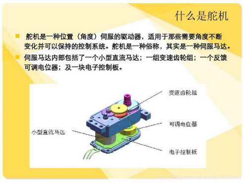 

**实验说明**

舵机是一种位置伺服的驱动器，主要是由外壳、电路板、无核心马达、齿轮与位置检测   

器所构成。舵机有很多规格，但所有的舵机都有外接三根线，分别用棕、红、橙三种颜色进行区分，由于舵机品牌不同，颜色也会有所差异，棕色为接地线，红色为电源正极线，橙色为信号线。

 

 

舵机的用途很广泛，特别是用于机器人行业，例如人形机器人，多足机器人。这一课我们就学习舵机的原理及基本的控制方法。舵机是一种位置伺服的驱动器，主要是由外壳、电路板、无核心马达、齿轮与位置检测器所构成。舵机有很多规格，有360°舵机、180°舵机和90度舵机，我们这款舵机为90度舵机，但是它转动的角度接近于180度，所以我们也可把它当做180度舵机使用，控制原理都是一样的。所有的舵机都有外接三根线，分别用棕、红、橙三种颜色进行区分，由于舵机品牌不同，颜色也会有所差异，棕色为接地线，红色为电源正极线，橙色为信号线。


|      |                            |
| ---- | -------------------------- |
|      | 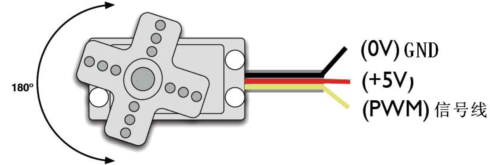 |

 


**实验原理**

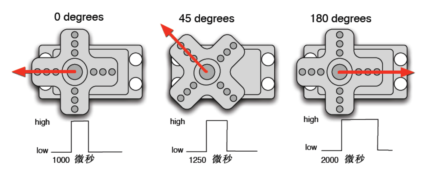舵机的转动的角度是通过调节PWM（脉冲宽度调制）信号的占空比来实现的，标准PWM

（脉冲宽度调制）信号的周期固定为20ms（50Hz），理论上脉宽分布应在1ms到2ms 

之间，但是，事实上脉宽可由0.5ms 到2.5ms 之间，脉宽和舵机的转角0°～180°相

对应。有一点值得注意的地方，由于舵机牌子不同，对于同一信号，不同牌子的舵机旋

转的角度也会有所不同。

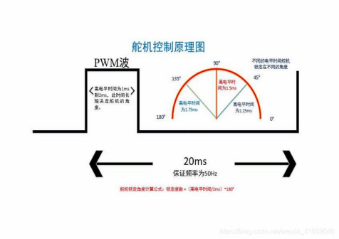 

 

**实验器材**

| 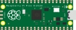 | 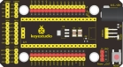 | 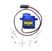 |  |
| -------------------------- | -------------------------- | -------------------------- | -------------------------- |
| Raspberry Pi Pico板*1      | Raspberry Pi Pico扩展板*1  | 伺服舵机*1                 | MicroUSB线*1               |

 

**接线图**

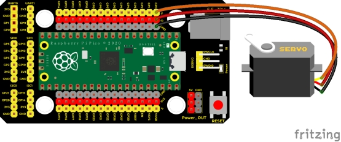 

 

**测试代码**

代码1：

```c
/*

  Keyes Starter Kit for Raspberry Pi Pico

  lesson 19.1

  servo_1

 */

int servoPin = 0;//舵机的PIN

 

void setup() {

 pinMode(servoPin, OUTPUT);//舵机引脚设置为输出

}

void loop() {

 servopulse(servoPin, 0);//转动到0度

 delay(1000);//延时1秒

 servopulse(servoPin, 90);//转动到90度

 delay(1000);

 servopulse(servoPin, 180);//转动到180度

 delay(1000);

}

 

void servopulse(int pin, int myangle) { //脉冲函数

 int pulsewidth = map(myangle, 0, 180, 500, 2500); //将角度映射到脉宽

 for (int i = 0; i < 10; i++) { //多输出几次脉冲

  digitalWrite(pin, HIGH);//将舵机接口电平至高

  delayMicroseconds(pulsewidth);//延时脉宽值的微秒数

  digitalWrite(pin, LOW);//将舵机接口电平至低

  delay(20 - pulsewidth / 1000);

 }

}
```


代码2：

```c
/*

  Keyes Starter Kit for Raspberry Pi Pico

  lesson 19.2

  servo_2

 */

#include <Servo.h>  //舵机库

Servo myservo;

void setup() {

 myservo.attach(0);//舵机连接GP0

}

 

void loop() {

 for (int pos = 0; pos < 180; pos++) {

  myservo.write(pos); //转动到pos角度

  delay(15);  //加延时转慢一点

 }

 for (int pos = 180; pos > 0; pos--) {

  myservo.write(pos);

  delay(15);

 }

 delay(2000);//等待2秒

}
```

**代码说明**

**代码1说明：**

1. map(value, fromLow, fromHigh, toLow, toHigh)；value为我们要映射的值；fromLow, fromHigh为当前值的下限和上限；toLow, toHigh为我们要映射到的目标范围的下限和上限。比如我们在实验中map(myangle, 0, 180, 500, 2500)的意思就是我们传进来一个需要转动的角度值为myangle，然后这个值的范围是0度到180度，我们要映射的范围为500us到2500us，即把0到180转到了500到2500然后被返回了，返回的数据类型为整型，余数会被截断，不进行四舍五入或平均。
2. 之后我们调用我们定义的的函数servopulse()就能让舵机转动了，代码中我们设置了让舵机从0度转动到90度再转动到180度，再转动到0度，中间暂停一秒，反复循环。

 

 

**代码2说明：**

1. 舵机库IDE已经自动下载了，点击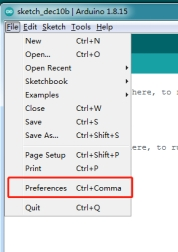点击，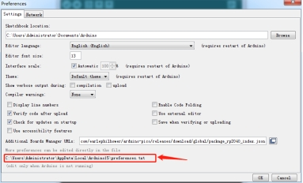找到路径就可以看到自带库文件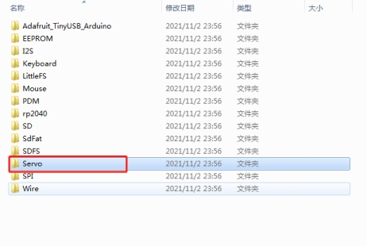。
2. 这个库的方法**.attach()**方法是连接舵机引脚，我们连到其他引脚也可以。

**3.** **myservo.write(pos)**为转动到pos角度值。**myservo.read()**是读取舵机当前角度值。

4. 其他设置请参照前面相关的代码注释。

**测试结果**

实验1 结果：上传测试代码成功，利用USB线上电后，舵机由0度，90度，180度三个角度循环转动。

实验2 结果：上传测试代码成功，利用USB线上电后，舵机由0~180度来回转动，并且每15ms转动一度。

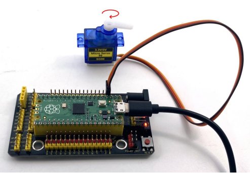 