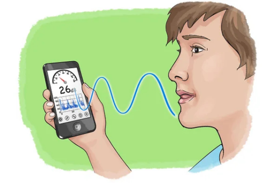
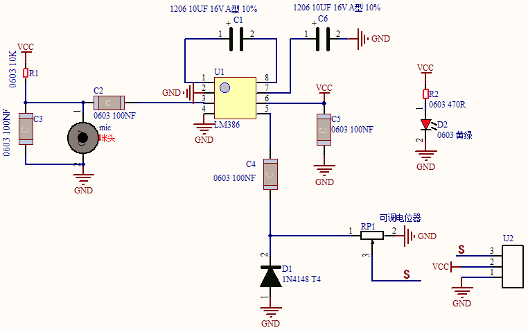
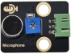
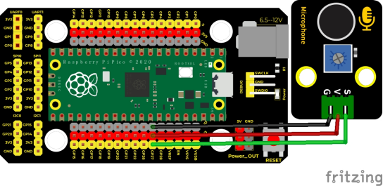
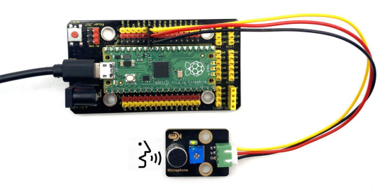
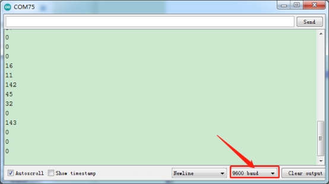

## 实验十二  声音传感器检测声量

 

**实验说明**

在这个套件中，有一个Keyes DIY电子积木 声音传感器，实验中，我们利用这个传感器测试当前环境中的声音大小对应的模拟值，声音越大，模拟值越大；并且，我们在串口监视器上显示测试结果。

 

**实验原理**



它主要采用一个高感度麦克风元件和LM386芯片。高感度麦克风元件用于检测外界的声音。利用LM386芯片搭建合适的电路，我们对高感度麦克风检测到的声音进行放大，最大倍数为200倍。使用时我们可以通过旋转传感器上电位器，调节声音的放大倍数。调节时，顺时针调节电位器到尽头，放大倍数最大。


 

 

**实验器材**

|  |  |      |  |  |
| -------------------------- | -------------------------- | ------------------------------ | -------------------------- | -------------------------- |
| Raspberry Pi Pico板*1      | Raspberry Pi Pico扩展板*1  | keyes DIY电子积木 声音传感器*1 | 防反插3Pin*1               | MicroUSB线*1               |

 

**接线图**

 

 

**测试代码**

```c
/* 

 * Keyes Starter Kit for Raspberry Pi Pico

 * lesson 12

 * MicroPhone

*/

int val = 0;

int Microphone = 27;  //麦克风传感器接ADC1

void setup() {

 Serial.begin(9600);//设置波特率9600

}

 

void loop() {

 val = analogRead(Microphone); //读取传感器的值赋给变量val

 Serial.println(val);  //换行打印传感器输出的模拟值

 delay(100); //加延时100MS

 

}
```


**代码说明**

设置方法和实验十一类似，这里就不多做介绍了。

 

**测试结果**

上传测试代码成功，利用USB线上电后，打开串口监视器，设置波特率为9600。串口监视器显示对应模拟值。实验中，我们顺时针旋转电位器和对准MIC头大声说话，可以看到模拟值数据变大，如下图。

 

