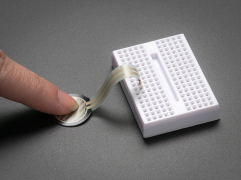
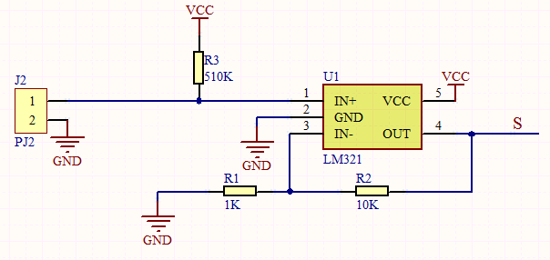
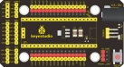
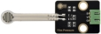
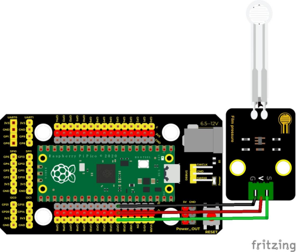
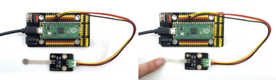
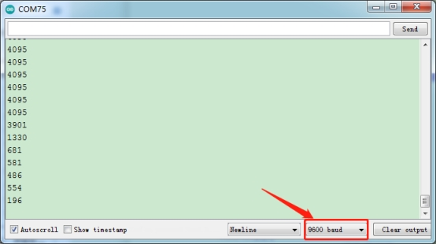

## 实验十五  薄膜压力传感器

 

**实验说明**

在这个套件中，有一个Keyes DIY电子积木 薄膜压力传感器，薄膜压力传感器是基于新型纳米压敏材料辅以舒适杨式模量的超薄薄膜衬底一次性贴片而成，兼具防水和压敏双重功能。

实验中，我们通过采集模块上S端模拟信号，判断压力大小，模拟值越小，压力越大；并且，我们在串口监视器上显示测试结果。

 

**实验原理**

当传感器感知到外界压力时，传感器电阻值发生变化，我们采用电路将传感器感知压力变化的压力信号转换成相应变化强度的电信号输出。这样我们就可以通过检测电压信号变化就可以得到压力变化情况。


 


**实验器材**

|  |  |  |  |  |
| ------------------------------------------- | ------------------------------------------- | ------------------------------------------- | ------------------------------------------- | ------------------------------------------- |
| Raspberry Pi Pico板*1                       | Raspberry Pi Pico扩展板*1                   | keyes DIY电子积木 薄膜压力传感器*1          | 防反插3Pin*1                                | MicroUSB线*1                                |

 

**接线图**

 

 

**测试代码**

```c
/* 

 * Keyes Starter Kit for Raspberry Pi Pico

 * lesson 15

 * Film pressure sensor

*/

int val = 0;

int Film = 27; //薄膜压力传感器接ADC1

void setup() {

 Serial.begin(9600);//设置波特率为9600

}

void loop() {

 val = analogRead(Film);//读取模拟值

 Serial.println(val);//打印模拟值

 delay(100);//延时100MS

 

}
```

**代码说明**

设置方法和实验十一类似，这里就不多做介绍了。

 

**测试结果**

上传测试代码成功，利用USB线上电后，打开串口监视器，设置波特率为9600。当我们用手挤压薄膜时，可以看到我们在串口监视器打印的模拟值变小，如下图。

 

 