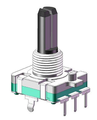
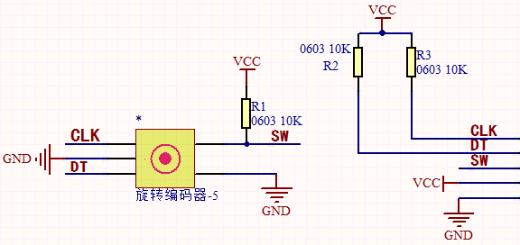
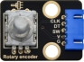
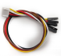
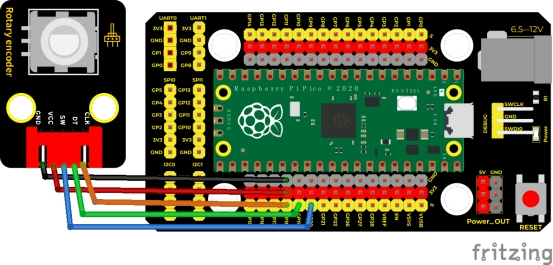
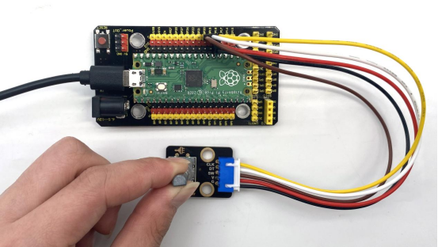
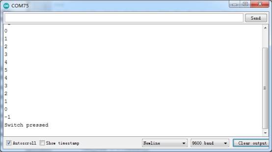

## 实验十八  旋转编码器模块计数

 

**实验说明**

在这个套件中，有一个Keyes DIY电子积木 旋转编码器模块，也叫开关编码器、旋转编码器。此款编码器有做20脉冲20定位点、15脉冲30定位点两种。编码器主要用于汽车电子、多媒体音响、仪器仪表、家用电器、智能家居、计算机周边、医疗器械等领域。主要用于频率调节、亮度调节、温度调节、音量调节的参数控制等。

实验中，我们利用Keyes DIY电子积木 旋转编码器模块用于计数，当我们顺时针旋转编码器时，设置数据减1；逆时针旋转编码器时，设置数据加1；按下编码器中间按键时，打印编码器的值；将测试结果在串口监视器上显示。

 

**实验原理**

增量式编码器是将位移转换成周期性的电信号，再把这个电信号转变成计数脉冲，用脉冲的个数表明位移的巨细。



这个模块主要采用20脉冲旋转编码器元件。它可通过旋转计数正方向和反方向转动过程中输出脉冲的次数，这种转动计数是没有限制的，复位到初始状态，即从0开始计数。

 

**实验器材**

|  |  |          |  |  |
| -------------------------- | -------------------------- | ---------------------------------- | -------------------------- | -------------------------- |
| Raspberry Pi Pico板*1      | Raspberry Pi Pico扩展板*1  | keyes DIY电子积木 旋转编码器模块*1 | 防反插5Pin*1               | MicroUSB线*1               |

 

**接线图**

 

 

**测试代码**

```c
/*

  Keyes Starter Kit for Raspberry Pi Pico

  lesson 18

  Encoder

 */

 

//Interfacing Rotary Encoder with Arduino

//Encoder Switch -> pin 20

//Encoder DT -> pin 19

//Encoder CLK -> pin 18

 

int Encoder_DT  = 19;

int Encoder_CLK  = 18;

int Encoder_Switch = 20;

 

int Previous_Output;

int Encoder_Count;

 

void setup() {

 Serial.begin(9600);

 

 //pin Mode declaration

 pinMode (Encoder_DT, INPUT);

 pinMode (Encoder_CLK, INPUT);

 pinMode (Encoder_Switch, INPUT);

 

 Previous_Output = digitalRead(Encoder_DT); //Read the inital value of Output A

}

 

void loop() {

 //aVal = digitalRead(pinA);

 

 if (digitalRead(Encoder_DT) != Previous_Output)

 {

  if (digitalRead(Encoder_CLK) != Previous_Output)

  {

   Encoder_Count ++;

   Serial.println(Encoder_Count);

  }

  else

  {

   Encoder_Count--;

   Serial.println(Encoder_Count);

  }

 }

 

 Previous_Output = digitalRead(Encoder_DT);

 

 if (digitalRead(Encoder_Switch) == 0)

 {

  delay(5);

  if (digitalRead(Encoder_Switch) == 0) {

   Serial.println("Switch pressed");

   while (digitalRead(Encoder_Switch) == 0);

  }

 }

}
```

**代码说明**

1.我们把CLK设置为GP18、DAT设置为GP19。该代码在库文件中设置好了，它的意思是（CLK）下降后，读取数字口（DAT）电压，当DAT电压为高电平时，旋转编码器的值加1；当DAT电压为低电平时，转编码器的值减1。

1. 然后循环程序中设置按钮管脚（GP20）为低电平时，打印出来。

 

**测试结果**

上传测试代码成功，利用USB线上电后，打开串口监视器，设置波特率为9600。顺时针旋转编码器，显示数据减小；逆时针旋转编码器，显示数据增加；按下编码器中间按键，显示“Switch pressed”，如下图。

 

