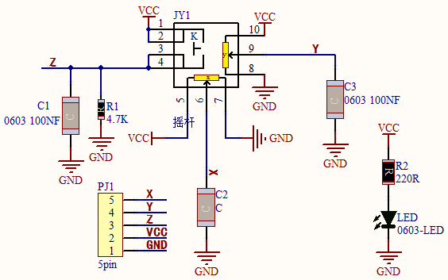
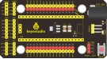
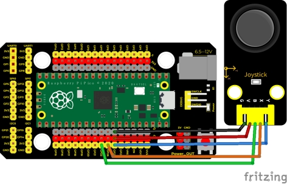
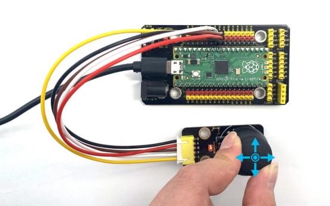
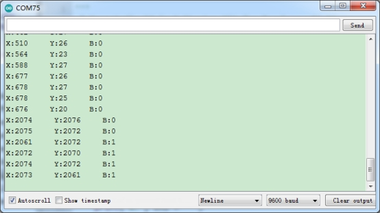

## 实验十六  摇杆模块

 

**实验说明**

大家都应该看过游戏手柄，有些游戏手柄上除了按键，还有摇杆，那摇杆是什么工作原理呢？那么在我们这个套件中，就有一个Keyes DIY电子积木 摇杆模块，它主要采用PS2手柄摇杆元件。控制时，我们需要将模块X Y端口连接单片机模拟口，B端口连接单片机数字口，VCC接单片机电源输出端（3.3-5V），GND接单片机GND。我们可以读取两个模拟值和一个数字口）的高低电平情况，判断模块上摇杆的工作状态。

实验中，我们将读取两个模拟值（X轴Y轴）和一个数字值（Z轴，并在shell显示测试结果。

 


**实验原理**

其实它的原理非常简单，内部相当于两个可调电位器（左右和上下）和一个按键，这个按键没被按下时被R1下拉为低电平，按下时接通VCC即为高电平，与我们前面学习过的按键模块是相反的，我们摇动摇杆时内部的电位器就会调节从而输出不同的电压，我们就可以读取到模拟值。

 

 

**实验器材**

|  |  |    |  |  |
| -------------------------- | -------------------------- | ---------------------------- | -------------------------- | -------------------------- |
| Raspberry Pi Pico板*1      | Raspberry Pi Pico扩展板*1  | keyes DIY电子积木 摇杆模块*1 | 防反插5Pin*1               | MicroUSB线*1               |

  

**接线图**

 

 

**测试代码**

```c
/* 

 * Keyes Starter Kit for Raspberry Pi Pico

 * lesson 16

 * Joystick

*/

int X = 0;

int Y = 0;

int Button = 0;

 

void setup() {

 Serial.begin(9600);

 pinMode(22, INPUT);  //定义遥感按钮的PIN为GP22

}

 

void loop() {

 X = analogRead(26); //遥感的X轴引脚接ADC0

 Y = analogRead(27); //遥感的Y轴引脚接ADC1

 Button = digitalRead(22);  //读取按钮的状态，并在下方打印出来

 Serial.write("X:");

 Serial.print(X);

 Serial.write("   Y:");

 Serial.print(Y);

 Serial.write("   B:");

 Serial.println(Button);

 delay(100);

 

}
```

**代码说明**

在实验中，根据接线，x管脚设置为GP26，y管脚设置为GP27，摇杆按钮管脚设置为GP22，串口监视器显示测试数据，显示前需设置波特率（我们默认设置为9600，可更改）。

 

**测试结果**

上传测试代码成功，利用USB线上电后，打开串口监视器，设置波特率为9600。串口监视器显示对应数值。摇动摇杆，x轴和y轴对应的模拟值发生改变，按下按钮，读取到的数字值为1，否则为0，如下图。

 

 