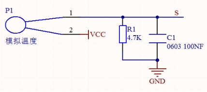
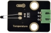
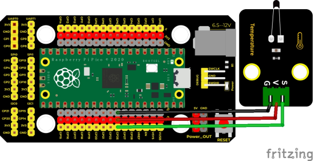
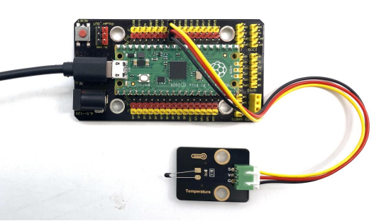
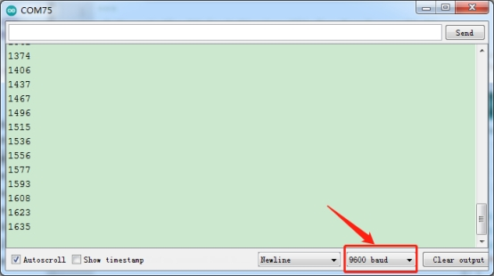

## 实验十四  NTC-MF52AT模拟温度传感器

 

**实验说明**

在这个套件中，有一个Keyes DIY电子积木 NTC-MF52AT模拟温度传感器，它的原理像光敏电阻传感器，只是感应的器件不同，实验中，我们将传感器信号端接到Pi Pico板模拟口，读出对应的模拟值。我们可以利用模拟值，通过特定公式，计算出当前环境的温度。由于温度计算公式比较复杂，这里就不多介绍了。实验中，我们只是读取对应的模拟值。

 

**实验原理**



这个模块主要采用NTC-MF52AT热敏电阻元件。NTC-MF52AT热敏电阻元件能够时感知周边环境温度的变化，电阻大小随着温度的变化而变化，从而引起信号端S的电压变化。该传感器就是利用NTC-MF52AT热敏电阻元件这一特性，搭建电路将电阻变化转换为电压变化。

 

**实验器材**

|  |  |                 |  |  |
| -------------------------- | -------------------------- | ----------------------------------------- | -------------------------- | -------------------------- |
| Raspberry Pi Pico板*1      | Raspberry Pi Pico扩展板*1  | keyes DIY电子积NTC-MF52AT模拟温度传感器*1 | 防反插3Pin*1               | MicroUSB线*1               |

 

 

**接线图**

 

 

**测试代码**

```c
/* 

 * Keyes Starter Kit for Raspberry Pi Pico

 * lesson 14

 * Temperature sensor

*/

int val;

int ntcPin = 26;  //设置NTC-MF52AT模拟温度传感器接ADC0

void setup() {

 Serial.begin(9600);//设置波特率为9600

}

 

void loop() {

 val = analogRead(ntcPin); //读取温度模拟值

 Serial.println(val); //读取并打印热敏电阻模拟值

 delay(100);//延时100毫秒

 

}
```

**代码说明**

设置方法和实验十一类似，这里就不多做介绍了。

 

**测试结果**

上传测试代码成功，利用USB线上电后，打开串口监视器，设置波特率为9600。串口监视器显示对应的模拟值，温度越高，模拟值越大。

 

 