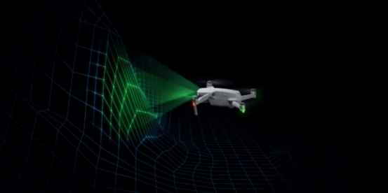
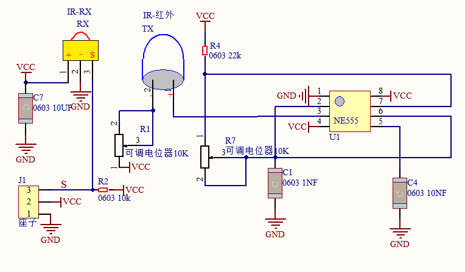
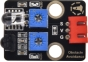
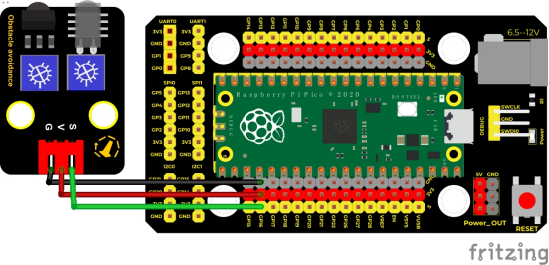
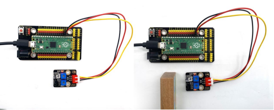
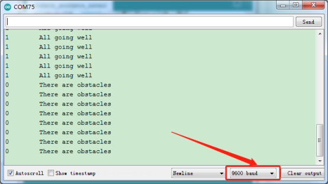

## 实验四  避障传感器检测障碍物

 

**实验说明**

在这个套件中，有一个Keyes DIY电子积木 避障传感器，它主要采用一对红外线发射与接收管元件。实验中，我们通过读取传感器上S端高低电平，判断是否存在障碍物；并且，我们在串口监视器上显示测试结果。

 

**实验原理**



原理就是发射管TX发射出一定频率的红外信号，红外信号会随着传送距离的加大逐渐衰减，如果遇到障碍物，就会形成红外反射。当检测方向RX遇到反射回来的信号比较弱时，接收检测引脚输出高电平，说明障碍物比较远；当反射回来的信号比较强，接收检测引脚输出低电平，说明障碍物比较近了，接收检测引脚输出低电平，此时指示灯亮起。传感器上有两个电位器，一个用于调节发送功率，一个用于调节接收频率，通过调节2个电位器，我们可以调节它的有效距离。


**实验器材**

|  |  |       |  |  |
| ------------------------- | ------------------------- | ------------------------------ | ------------------------- | ------------------------- |
| Raspberry Pi Pico板*1     | Raspberry Pi Pico扩展板*1 | keyes DIY电子积木 避障传感器*1 | 防反插3Pin*1              | MicroUSB线*1              |

 

**接线图**

 

 

**测试代码**

```c
/* 

* Keyes Starter Kit for Raspberry Pi Pico

* lesson 4

* obstacle avoidance sensor

*/

int val = 0;

void setup() {

 Serial.begin(9600);//设置波特率为9600

 pinMode(16, INPUT);//设置引脚GP16为输入模式

}

 

void loop() {

 val = digitalRead(16);//读取数字电平

 Serial.print(val);//打印读取的电平信号

 if (val == 0) {//检测到障碍物

  Serial.print("     ");

  Serial.println("There are obstacles");

  delay(100);

 }

 else {//没检测到障碍物

  Serial.print("     ");

  Serial.println("All going well");

  delay(100);

 }

}
```

**代码说明**

我们这里只使用一款传感器，所以没有定义管脚名称变量了，直接使用引脚“16”，其它设置方法和实验三类似，这里就不多做介绍了。

 

**特别注意**

烧录好测试代码，按照接线图连接好线，上电后，我们开始调节两个电位器调节感应距

离。

1.调节发射功率调节电位器，先将电位器顺时针到尽头，然后回调一些，使传感器上

P LED介于不亮与亮之间的零界点。

2.调节接收频率调节电位器，顺时针调节时，频率增大。调节使它产生38KHz频率的方波，调节时，也观察传感器上S LED，使它介于不亮与亮之间的零界点。

 

**测试结果**

上传测试代码成功，利用USB线上电后，打开串口监视器，设置波特率为9600。串口监视器显示对应数据和字符。实验中，当传感器检测到障碍物时，val为0，串口监视器显示“There are obstacles”字符；没有检测到障碍物时，val为1，串口监视器显示“All going well”字符，如下图。




