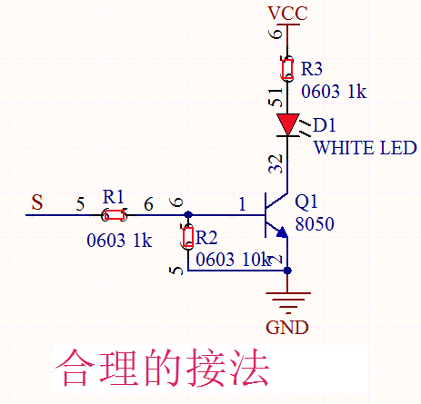
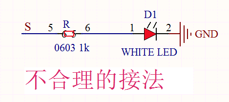

## 实验一 点亮LED


### 🌟 项目简介  
本实验将教你如何用 Raspberry Pi Pico 控制一个**外接的白色LED模块**（Keyes DIY电子积木），让它稳定点亮，再升级为有节奏地闪烁。这是学习MicroPython编程与硬件交互的“第一课”，简单却非常重要！

> 💡 小知识：Pico板载LED（GP25）我们已在准备阶段试过，现在我们要把控制能力“延伸”到外部元件上，真正迈出创客第一步！


### ⚙️ 工作原理  

LED是一种半导体发光器件，需要正向电压和合适电流才能亮起。但注意：**单片机IO口不能直接“推”大电流驱动LED**——Pico每个引脚最大输出电流仅约12mA，而多数LED正常工作需5–20mA。如果直接连接（左图），可能亮度很弱、不稳定，甚至影响Pico其他功能。

因此，我们套件中的LED模块内部已集成**三极管驱动电路**（右图），它像一个“智能开关”：
- 当Pico给信号端S输出**高电平（3.3V）** → 三极管导通 → 外部电源（VCC）通过LED和限流电阻R3形成回路 → LED**明亮点亮** ✅  
- 当S为**低电平（0V）** → 三极管截止 → 回路断开 → LED**完全熄灭** ✅  
✅ 所有电流由外部5V电源提供，Pico只负责“发指令”，安全又可靠！




### 🧰 所需材料  

|  |  |  |  |  |
| ------------------------------------------------------------ | ------------------------------------------------------------ | ----------------------------------------------------- | ------------------------------------------------------------ | ---------------------------------------------------- |
| Raspberry Pi Pico板 ×1                                       | Raspberry Pi Pico扩展板 ×1                                   | Keyes DIY电子积木 白色LED模块 ×1                      | 防反插3Pin杜邦线（公对母）×1                                 | MicroUSB数据线 ×1                                    |

📌 **小提示**：  
- LED模块有3个针脚：**S（信号）、VCC（电源+）、GND（电源-）**，务必按颜色/标记对应接线（S接Pico引脚，VCC接5V，GND接GND）；  
- 扩展板让接线更稳固、更清晰，强烈推荐使用！


### 🔌 接线图  

****  

✅ 正确接法（请对照图检查）：  
- LED模块 **S 端 → Pico GP0（即物理引脚1）**  
- LED模块 **VCC 端 → 扩展板 5V 输出（或Pico VSYS引脚）**  
- LED模块 **GND 端 → 扩展板 GND**  

⚠️ 注意：  
- 不要接错S/VCC/GND！接反可能导致LED不亮或损坏模块；  
- Pico的GPIO引脚是**3.3V逻辑电平**，但本LED模块设计兼容3.3V控制信号（S端）+5V供电（VCC），所以可直接使用，无需电平转换。


### 💻 示例代码  

#### ▶️ 代码1：常亮LED（点亮就不再灭）  
```python
# * Keyes Starter Kit for Raspberry Pi Pico
# * lesson 1.1
# * turn on led
from machine import Pin

led = Pin(0, Pin.OUT)  # 创建led对象：使用GP0引脚，设为输出模式
led.value(1)           # 输出高电平（3.3V），LED点亮
```

#### ▶️ 代码2：闪烁LED（亮1秒 → 灭1秒 → 循环）  
```python
# * Keyes Starter Kit for Raspberry Pi Pico
# * lesson 1.2
# * Blink
from machine import Pin
import time

led = Pin(0, Pin.OUT)  # 创建led对象：GP0引脚，输出模式

while True:            # 无限循环，程序一直运行
    led.value(1)       # 输出高电平 → LED亮
    time.sleep(1)      # 暂停1秒钟
    led.value(0)       # 输出低电平 → LED灭
    time.sleep(1)      # 再暂停1秒钟
```


### 📚 代码解析（小学生也能懂！）  

| 代码片段 | 中文解释 | 小贴士 |
|----------|-----------|--------|
| `from machine import Pin` | 导入“机器控制模块”里的“引脚”功能，就像打开遥控器的“开关按钮”功能 | 没这行，Pico就不知道怎么控制引脚！ |
| `led = Pin(0, Pin.OUT)` | 把Pico的**第0号引脚（GP0）** 命名为 `led`，并告诉它：“你以后负责**输出信号**！” | 引脚编号0 = 物理板上最左边那排第1个引脚（标着GP0）✅ |
| `led.value(1)` | 让 `led` 这个引脚“发出高电平（3.3V）”，相当于按下开关→LED亮 | `1` = 开 / `0` = 关，就像灯的“开/关” |
| `time.sleep(1)` | 让Pico“等1秒钟”，不干活，就休息 | `sleep(0.5)` = 等半秒；`sleep(0.1)` = 等100毫秒（更快闪烁！） |
| `while True:` | “只要电不断，就永远重复下面做的事！”——这是让LED不停闪烁的关键 | 没它，代码执行完就停止；有了它，才实现“自动循环” |


### ✅ 实验现象  

- **运行代码1后**：LED模块**立即、稳定点亮**，持续发光，直到断电或改写程序。  
- **运行代码2后**：LED**规律闪烁**——亮1秒 → 灭1秒 → 亮1秒 → 灭1秒……像在呼吸一样！  


### ⚠️ 安全与注意事项  

1. **先断电，再接线！** 每次修改线路前，请拔掉USB线，避免短路；  
2. **认准标识**：LED模块上印有 `S` `VCC` `GND` 字样，务必一一对应，不可凭感觉乱插；  
3. **勿接错电源**：VCC必须接**5V或VSYS**（不是3.3V！），否则LED可能不亮；  
4. **首次上传失败？** 检查：  
   - Thonny是否选对端口（如 `Pico-XXXX`）？  
   - Pico是否处于“U盘模式”（双击BOOTSEL按键再插USB）？  
   - 代码是否有拼写错误（比如 `Pin` 写成 `pin`，Python区分大小写！）？  
5. **LED不亮？别急！** 按顺序排查：  
   ✅ USB线已插稳 → ✅ 扩展板电源指示灯亮 → ✅ S线确实接到GP0 → ✅ VCC/GND没接反 → ✅ 代码已点击“运行”（▶️按钮）  


### 🧠 扩展思维  
在本课LED闪烁的基础上，如果想让它“渐亮渐灭”（像呼吸灯一样柔和变化），该怎么做？


