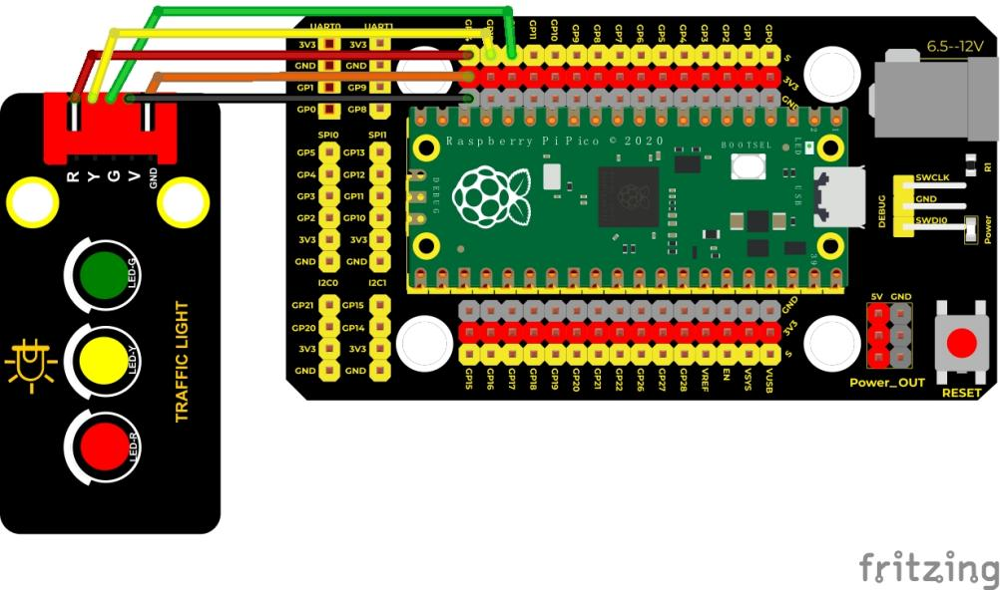
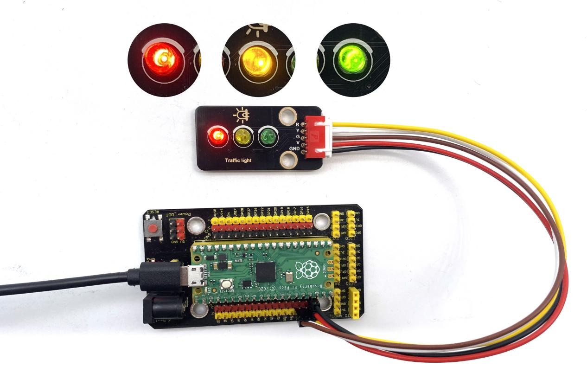

## 实验二 交通灯模块


### 🌟 项目简介  
你一定在马路上见过红绿灯吧？它就像一位无声的交通指挥员，用红、黄、绿三种颜色告诉车辆和行人：什么时候停、什么时候准备、什么时候走。本实验中，我们将用 Raspberry Pi Pico 控制一个交通灯模块，让红、黄、绿三颗 LED 灯按真实交通规则自动循环闪烁——绿灯通行 → 黄灯提醒 → 红灯停止 → 再循环，亲手打造一个迷你“路口指挥官”！

---

### ⚙️ 工作原理  
交通灯模块内部集成了三颗独立的 LED（红、黄、绿），每颗灯都直接连接到 Pico 的一个 GPIO 引脚，**无需额外电阻或驱动电路**，Pico 的 3.3V 输出可安全点亮它们。  
- 给对应引脚输出 **高电平（1）** → LED 亮起  
- 给对应引脚输出 **低电平（0）** → LED 熄灭  
就像打开/关闭三盏小台灯一样简单！  


---

### 🧰 所需材料  

|  |  |  |  |  |
|--------------------------------------------------------------------------|------------------------------------------------------------------|-------------------------------------------------------|----------------------------------------------------------------------|------------------------------------------------------|
| Raspberry Pi Pico 板 ×1                                                | Raspberry Pi Pico 扩展板 ×1                                      | Keyes 交通灯模块 ×1                                   | 防反插 5Pin 连接线 ×1                                               | Micro-USB 数据线 ×1                                 |

> ✅ 小提示：扩展板让接线更稳固、更直观；防反插线能避免插错方向，新手友好！

---

### 🔌 接线说明  

****  

请按图连接（模块背面有清晰丝印标注）：  
- 交通灯模块 **GND** → 扩展板 **GND**  
- 交通灯模块 **R（红）** → Pico **GP14**（即引脚14）  
- 交通灯模块 **A（黄）** → Pico **GP13**（即引脚13）  
- 交通灯模块 **G（绿）** → Pico **GP12**（即引脚12）  

💡 注意：模块上标有 “R/A/G” 字样，务必一一对应，接错会导致灯不亮或颜色混乱。

---

### 💻 示例代码（MicroPython）

 ```python
# Keyes 创客套件 · Raspberry Pi Pico 入门实验二：交通灯
# 功能：模拟真实交通灯时序（绿→黄闪→红→循环）

import machine
import time

# 定义三个LED引脚（使用GPIO编号）
led_red = machine.Pin(14, machine.Pin.OUT)    # 红灯接 GP14
led_amber = machine.Pin(13, machine.Pin.OUT)  # 黄灯接 GP13
led_green = machine.Pin(12, machine.Pin.OUT)  # 绿灯接 GP12

# 主循环：持续运行交通灯流程
while True:
    # 🟢 第一阶段：绿灯亮 5 秒（通行时间）
    led_green.value(1)   # 绿灯亮
    time.sleep(5)
    led_green.value(0)   # 绿灯灭

    # 🟡 第二阶段：黄灯闪烁 3 次（每次亮0.5秒 + 灭0.5秒，共3秒）
    for i in range(3):
        led_amber.value(1)  # 黄灯亮
        time.sleep(0.5)
        led_amber.value(0)  # 黄灯灭
        time.sleep(0.5)

    # 🔴 第三阶段：红灯亮 5 秒（停止时间）
    led_red.value(1)   # 红灯亮
    time.sleep(5)
    led_red.value(0)   # 红灯灭
    # 自动回到开头，开始下一轮循环 👈
```

---

### 📚 代码解析  

✅ **`machine.Pin(14, machine.Pin.OUT)`**  
→ 创建一个“开关”，把 GP14 引脚设置为**输出模式**，用来控制红灯。同理设置黄灯（GP13）、绿灯（GP12）。  

✅ **`led_green.value(1)` 和 `led_green.value(0)`**  
→ `1` 表示“打开开关”，LED 亮；`0` 表示“关闭开关”，LED 灭。  

✅ **`for i in range(3):`**  
→ 这是“重复做3次”的指令：  
 第1次：黄灯亮0.5秒 → 灭0.5秒  
 第2次：黄灯亮0.5秒 → 灭0.5秒  
 第3次：黄灯亮0.5秒 → 灭0.5秒  
→ 合起来就是**黄灯闪烁3次，总耗时3秒**，符合现实交通灯逻辑。  

✅ **`while True:`**  
→ 让整个流程**无限循环执行**，交通灯就能一直工作啦！

---

### 🌈 实验现象  

下载并运行代码后，你会看到：  
1. 🟢 **绿灯持续亮起 5 秒** → 表示“可以通行”  
2. 🟡 **黄灯快速闪烁 3 次（共 3 秒）** → 表示“准备停车”  
3. 🔴 **红灯持续亮起 5 秒** → 表示“禁止通行”  
→ 然后自动回到绿灯，周而复始，真实还原路口交通灯节奏！



---

### ⚠️ 注意事项  

- 🔌 **接线前务必断电**：拔掉 USB 线再接线，接好后再通电，避免短路。  
- 🧩 **确认模块型号**：本实验专用于 Keyes **KE4008 交通灯模块**（带 R/A/G 标识），不兼容其他三色灯模块。  
- 🐞 **如果灯不亮？**  
  - 检查 USB 是否插稳、Pico 是否被电脑识别（资源管理器中出现 RPI-RP2 盘符）；  
  - 检查接线是否与图一致（尤其 GND 和信号线别接反）；  
  - 检查代码中引脚号（14/13/12）是否与实际接线完全对应。  
- 🌡️ **安全提示**：模块工作温度正常，请勿覆盖遮挡，保持通风。

---

### 🧠 扩展思维  
如果想让交通灯更贴近真实场景，比如“绿灯最后3秒变成慢闪提醒”，该怎样修改代码？