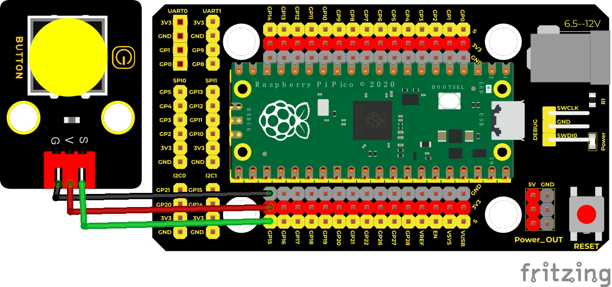
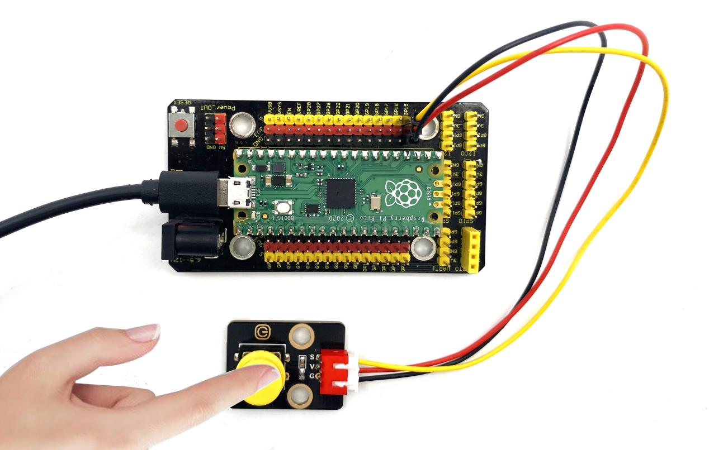
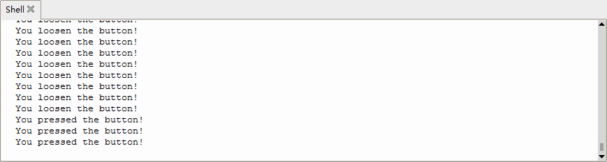

## 实验三 按键传感器检测实验

****

### 🌟 项目简介  
本实验带你用 Raspberry Pi Pico 轻松“听懂”按键的“话”——按下时说“我被按下了！”，松开时说“我松开了！”。你将学会如何让 Pico 主动读取外部信号（不是输出，而是输入），这是所有交互式电子项目（比如游戏手柄、智能台灯开关）的第一步！

---

### ⚙️ 工作原理  
按键模块内部其实是一个“会通断的小闸门”：  
- **没按的时候**：模块内部的上拉电阻（4.7KΩ）把信号线（S端）稳稳拉到 3.3V → Pico 读到的是 **高电平（1）**；  
- **按下的一刻**：闸门闭合，S端直接连到 GND（0V）→ Pico 瞬间读到 **低电平（0）**。  

这个“高→低”的变化，就是 Pico 判断“你按了”的秘密信号！  


> 💡 小知识：我们用 `Pin.PULL_UP` 是为了“双重保险”——即使模块上拉电阻稍弱，Pico 自带的上拉功能也能确保未按下时稳定读到高电平，避免屏幕乱跳“松开/按下”！

---

### 🧰 所需材料  

|  |  |  |  |  |
|--------------------------------------------------------------------------|------------------------------------------------------------------|-------------------------------------------------------|----------------------------------------------------------------------|------------------------------------------------------|
| Raspberry Pi Pico板 ×1                                                   | Raspberry Pi Pico扩展板 ×1                                       | Keyes 单路按键模块 ×1                                 | 防反插3Pin杜邦线 ×3（建议：红-GP15，黑-GND，黄-S）                   | Micro-USB 数据线 ×1                                  |

✅ 提示：扩展板让接线更稳、更安全，强烈推荐使用！

---

### 🔌 接线说明（超简单！）  

****  

请按以下方式连接（对应图中颜色/标识）：  
- 按键模块 **S（信号）** → Pico 的 **GP15 引脚**（扩展板上标有 “15” 的孔）  
- 按键模块 **-（GND）** → Pico 的 **GND 引脚**（扩展板上标有 “GND” 的孔）  
- 按键模块 **+（VCC）** → Pico 的 **3.3V 引脚**（扩展板上标有 “3V3” 的孔）  

> ✅ 关键检查：  
> - 线别接错！S 接 GP15，不是 VCC 或 GND；  
> - 杜邦线插紧，听到“咔哒”声更放心；  
> - USB 线先别插，接完再通电！

---

### 💻 示例代码（MicroPython）  

 ```python
# Keyes Starter Kit for Raspberry Pi Pico
# 实验三：按键传感器检测实验
from machine import Pin
import time

# 创建按键对象：使用 GP15 引脚，设置为输入模式 + 内部上拉电阻
button = Pin(15, Pin.IN, Pin.PULL_UP)

print("✅ 按键实验已启动！请按下模块上的黄色按钮～")

while True:
    if button.value() == 0:  # 按下时，S端接地 → 读到低电平（0）
        print("🔘 You pressed the button!")
    else:  # 松开时，上拉电阻生效 → 读到高电平（1）
        print("⚪ You loosen the button!")
    
    time.sleep(0.1)  # 每0.1秒检测一次，防止刷屏太快，也减轻CPU负担
```

---

### 📚 代码解析（小学生也能懂！）  

| 代码行 | 中文解释 | 为什么这么写？ |
|--------|----------|----------------|
| `button = Pin(15, Pin.IN, Pin.PULL_UP)` | 把 GP15 这个“耳朵”设为“听输入信号”，并打开内置“上拉小助手” | 不加 `PULL_UP`，不按按钮时引脚像“悬空的电线”，可能乱读成0或1，导致打印内容跳来跳去！ |
| `button.value()` | 问“GP15现在听到的是高音（1）还是低音（0）？” | 返回数字 `0` 或 `1`，不是文字，所以用 `== 0` 判断是否按下 |
| `if ... else ...` | 如果听到“0”，就执行第一段；否则（听到“1”）执行第二段 | Python靠缩进区分“谁属于谁”，多一个空格都会报错！务必用编辑器自动缩进 |
| `time.sleep(0.1)` | 每次判断完，休息0.1秒再继续听 | 不休息的话，1秒内会检测上百次，Shell刷屏太快看不清，还浪费电量 |

---

### 🌈 实验现象  
上传代码后，打开 Thonny 的 Shell（下方白色窗口），你会看到：  
- **手指按下黄色按键** → 突然出现一行：`🔘 You pressed the button!`  
- **手指松开按键** → 立刻变成：`⚪ You loosen the button!`  
- 屏幕会随着你的按/松节奏，像呼吸一样规律切换两行字 ✨  

  



> ✅ 成功标志：字符切换干净利落，不卡顿、不重复、不乱码！

---

### ⚠️ 注意事项（安全 & 稳定）  
- 🔌 **先断电，再接线！** 插拔杜邦线前务必拔掉 USB 线，保护 Pico 引脚；  
- 🧩 **模块方向别反！** 按键模块背面有 “S - +” 字样，S（信号）必须接 GP15；  
- 🐍 **代码复制要完整！** `print` 前的缩进是 **4个空格**（不是Tab键！），Thonny 会自动帮你对齐；  
- 🔄 **如果无反应？**  
  - 检查 USB 是否插稳、Thonny 是否选对串口（Tools → Options → Interpreter）；  
  - 检查杜邦线是否插在 GP15（不是 GPIO15 或其他编号）、GND、3V3；  
  - 尝试轻按按键——有些轻触开关需要稍微用力才能触发。

---

### 🧠 扩展思维  
在本课 LED 闪烁的基础上，如果想让它渐亮渐暗该怎么做？