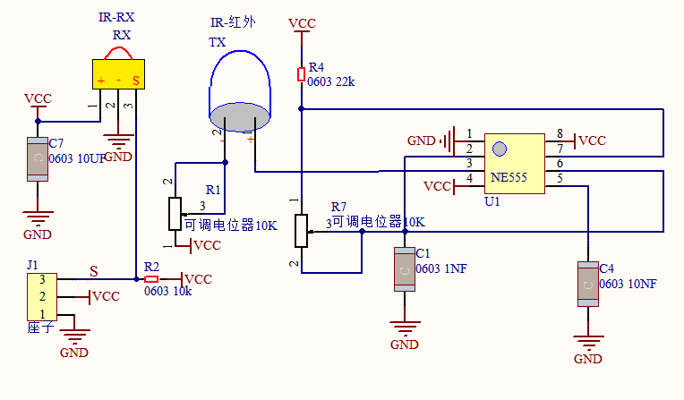
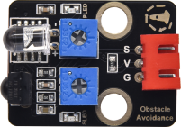
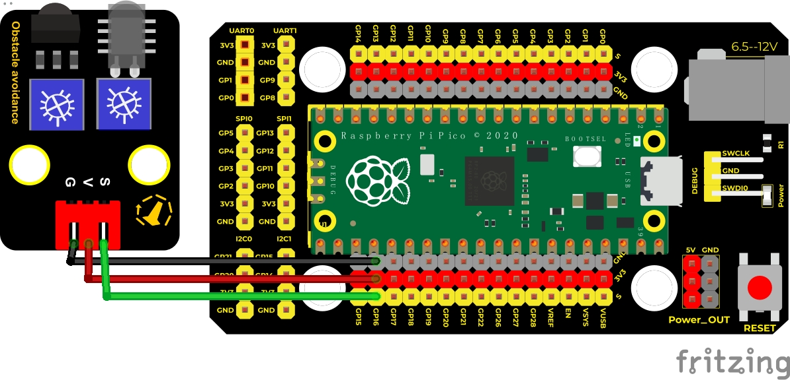
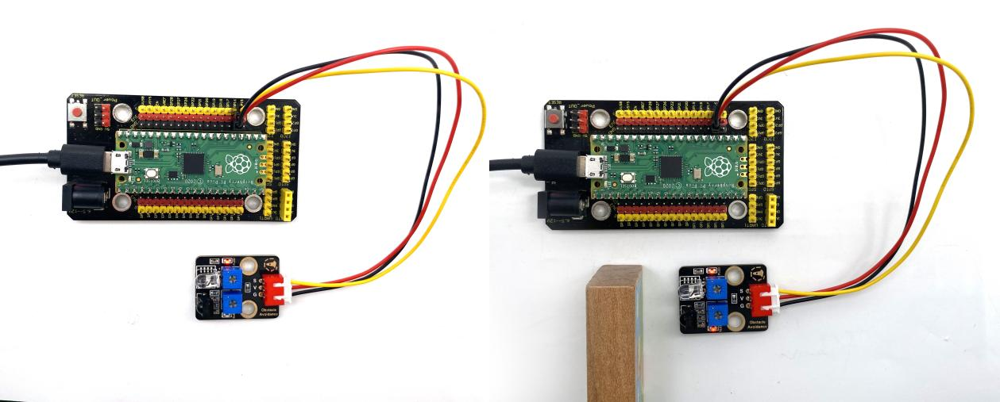

## 实验四 避障传感器检测障碍物

****

### 🌟 项目简介  
本实验将使用 Keyes DIY 电子积木避障传感器，让 Raspberry Pi Pico「看见」前方是否有障碍物。当手或物体靠近传感器时，它会自动检测并告诉 Pico —— 我们再把结果在电脑屏幕上显示出来！就像小车的“眼睛”一样，是智能小车、自动避障机器人最基础的功能之一。

---

### ⚙️ 工作原理（小学生也能懂）  
避障传感器其实是一对“红外搭档”：  
- **左边是红外灯（发射管）**：像手电筒一样，不断发出人眼看不见的红外光；  
- **右边是红外眼（接收管）**：专门“看”有没有光反射回来。  

✅ **没障碍物时**：红外光飞出去就散掉了，没光回来 → 接收管“没看到”，S 引脚输出 **高电平（1）** → 显示 “All going well”；  
❌ **有障碍物时**：红外光碰到你的手/书本/墙壁，被反射回来 → 接收管“看到了”，S 引脚输出 **低电平（0）** → 显示 “There are obstacles”。

> 💡 小知识：传感器上的两个小旋钮（电位器）就像“音量+调频旋钮”——  
> - 左边旋钮调“红外光有多亮”（发射功率），  
> - 右边旋钮调“红外眼有多灵敏”（接收阈值）。  
> 调好它们，传感器就能在 2–20 cm 范围内稳定工作！



---

### 🧰 所需材料（全部配齐，直接开做！）

|  |  |  |  |  |
|--------------------------------------------------------------------------|------------------------------------------------------------------|-------------------------------------------------------|----------------------------------------------------------------------|------------------------------------------------------|
| Raspberry Pi Pico 板 ×1                                                  | Raspberry Pi Pico 扩展板 ×1                                       | Keyes 避障传感器 ×1                                   | 防反插 3Pin 线（黑/红/黄）×1                                         | Micro USB 数据线 ×1                                 |

📌 **小提示**：避障传感器有 3 根线——  
- **VCC（红）→ 接 3.3V 或 5V（本实验接 3.3V 更安全）**  
- **GND（黑）→ 接 GND**  
- **S（黄）→ 接 Pico 的 GPIO16（即引脚数字 16）**

---

### 🔌 接线图（一目了然）

****

✅ 正确接法（请对照图检查）：  
- 传感器 **VCC（红）→ Pico 的 3.3V 引脚**（不是 VSYS！避免烧坏）  
- 传感器 **GND（黑）→ Pico 的 GND 引脚**（任意一个 GND 都可以）  
- 传感器 **S（黄）→ Pico 的 GP16 引脚**（即物理引脚第 21 脚）

⚠️ 注意：Pico 是 3.3V 系统，虽然该传感器支持 3.3V–5V，但首次测试建议用 **3.3V 供电**，更稳定、更安全！

---

### 💻 示例代码（MicroPython，复制即用）

 ```python
# ✨ Keyes 避障传感器实验（Pico 版）
# 📌 实验四：检测障碍物
# 📝 使用 GPIO16 读取传感器信号

from machine import Pin
import time

# 创建传感器对象：连接在 GP16，模式为输入（IN）
sensor = Pin(16, Pin.IN)

print("✅ 避障传感器已启动！")
print("👉 请将手慢慢靠近传感器前端……")

while True:
    # 读取传感器状态：0=检测到障碍物，1=无障碍物
    if sensor.value() == 0:
        print("🚨 There are obstacles!")
    else:
        print("🟢 All going well")
    
    time.sleep(0.1)  # 每0.1秒检测一次，避免刷屏太快
```

---

### 📖 代码解析（每行都看得懂）

| 代码行 | 中文说明 |
|--------|----------|
| `from machine import Pin` | 导入 Pico 的“引脚控制工具” |
| `import time` | 导入“时间工具”，用来加小暂停 |
| `sensor = Pin(16, Pin.IN)` | 把第 16 号引脚设为“输入口”，专门听传感器说话 |
| `if sensor.value() == 0:` | 如果传感器说“0”，代表它“看到”障碍物啦！ |
| `print("🚨 There are obstacles!")` | 在电脑屏幕上显示提醒（带表情更有趣 😄） |
| `time.sleep(0.1)` | 暂停 0.1 秒，让屏幕不疯狂滚动，也给传感器喘口气 |

💡 小技巧：你可以把 `0.1` 改成 `0.5`，让打印变慢；改成 `0.05`，反应更快哦！

---

### 🧪 实验现象（你将看到什么？）

运行代码后，在 Thonny 或其他 MicroPython IDE 的 **Shell（交互窗口）** 中，你会看到类似这样的滚动文字：

```
✅ 避障传感器已启动！
👉 请将手慢慢靠近传感器前端……
🟢 All going well
🟢 All going well
🟢 All going well
🚨 There are obstacles!
🚨 There are obstacles!
🟢 All going well
```

✅ 当手离传感器约 5–15 cm 时，会稳定显示 “There are obstacles”；  
✅ 拿开手后，立刻变回 “All going well”。

  


---

### ⚠️ 注意事项（安全又成功的关键！）

1. **供电优先选 3.3V**：Pico 的 3.3V 引脚电流足够驱动该传感器，比接 5V 更稳定，避免干扰。
2. **别接错线！** 黄线（S）必须接 GP16；红线（VCC）不能接到 VSYS（那是 5V 输入口，可能损坏传感器）。
3. **调节电位器有方法**（第一次必看！）：
   - 🔧 **先调左边（发射功率）**：顺时针拧到底 → 再慢慢往回拧，直到传感器上的 **P 指示灯刚好不亮**（临界点最灵敏）；
   - 🔧 **再调右边（接收灵敏度）**：顺时针微调，同时观察 **S 指示灯**，让它也处于 **将亮未亮的临界状态**（此时响应最准，抗干扰最强）。
4. **环境光影响小，但别对着强光/阳光直射**：日光含红外成分，可能干扰判断；普通教室灯光完全没问题。
5. **传感器正对障碍物效果最好**：倾斜角度太大（＞30°）可能导致漏检。

---

### 🧠 扩展思维  
在本课 LED 闪烁的基础上，如果想让 Pico 在检测到障碍物时，**自动点亮板载 LED（GP25）并发出“滴”声（用蜂鸣器）**，该怎样修改代码？