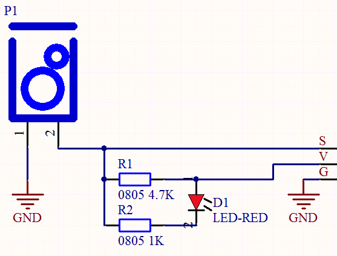
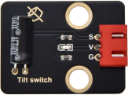
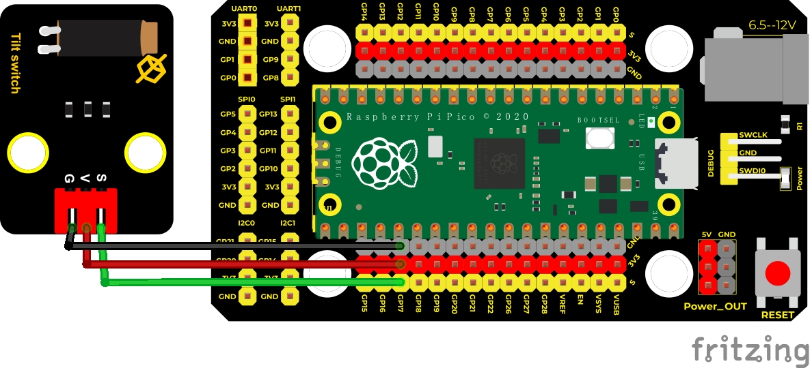
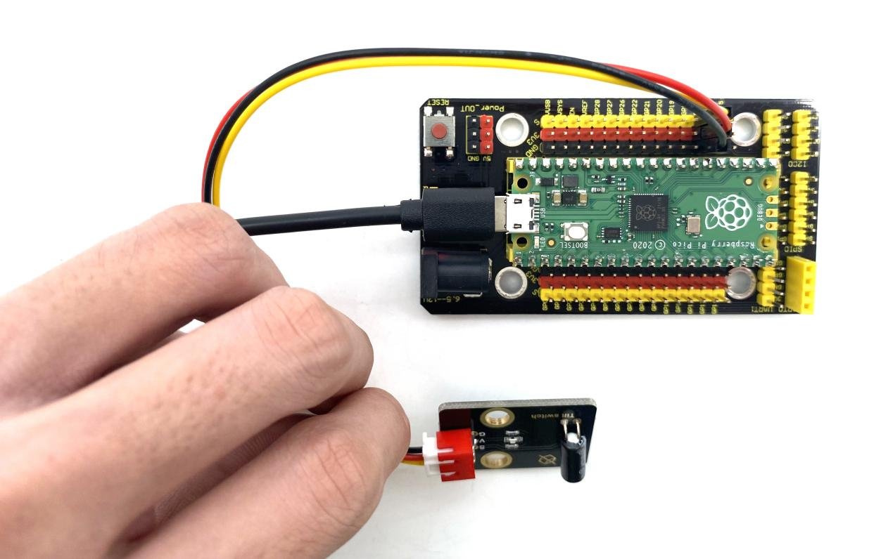
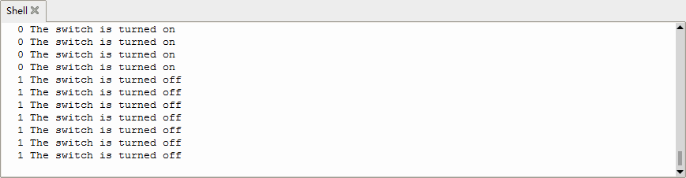

## 实验五 倾斜模块的原理


### 🌟 项目简介  
本实验将带你认识一个简单又有趣的电子元件——**倾斜传感器（也叫倾斜开关）**。它就像一个“会感知姿势的小哨兵”，内部藏着一颗可以自由滚动的小钢珠。当模块被轻轻倾斜时，小钢珠会因重力滚到不同位置，从而自动“接通”或“断开”电路。我们可以用它来检测设备是否被晃动、翻转或倾斜，比如：手机横竖屏切换、智能玩具的翻转响应、防盗报警器等。

---

### ⚙️ 工作原理  
倾斜传感器的核心是一颗金属滚珠和一对金属触点（引脚1和引脚2）。它的动作非常直观：

- ✅ **当模块向一侧倾斜（高于水平）**：滚珠滑向触点，使引脚1（接地GND）与引脚2（信号端S）导通 → 信号端S被拉低为 **低电平（0）** → 模块上的红色LED点亮；
- ❌ **当模块向另一侧倾斜（低于水平）或保持水平**：滚珠离开触点，引脚1与2断开 → 信号端S通过板载4.7kΩ上拉电阻连接到VCC → 输出 **高电平（1）** → LED熄灭。

> 💡 小知识：这种“一触即发”的开关叫**机械式倾斜开关**，成本低、结构简单、无需编程即可工作，非常适合初学者理解“输入信号”与“物理动作”的关系！



---

### 🧰 所需材料  

|  |  |  |  |  |
|--------------------------------------------------------------------------|------------------------------------------------------------------|-------------------------------------------------------|----------------------------------------------------------------------|------------------------------------------------------|
| Raspberry Pi Pico主控板 ×1                                               | Pico专用扩展板（带面包板区域）×1                                 | Keyes DIY电子积木 倾斜传感器 ×1                        | 防反插3Pin杜邦线（公对母）×3                                          | Micro-USB数据线 ×1                                   |

📌 提示：所有连线请务必使用**防反插3Pin线**（红-VCC、黑-GND、黄-信号），避免插错烧坏模块！

---

### 🔌 接线图说明  

****  

✅ 正确接法（三线直连，无需额外电阻）：  
- 倾斜模块 **VCC** → 扩展板 **5V 或 3.3V**（本实验用3.3V更安全）  
- 倾斜模块 **GND** → 扩展板 **GND**  
- 倾斜模块 **S（Signal）** → Pico **GP17 引脚**（即物理引脚22）  

⚠️ 注意：倾斜模块是**数字开关型传感器**，输出只有“0”或“1”，所以直接接GPIO即可，**不需要模拟读取，也不需要额外加电阻**（模块已内置上拉电阻）。

---

### 💻 示例代码（MicroPython）

 ```python
# Keyes Starter Kit for Raspberry Pi Pico
# 实验五：倾斜传感器检测
# 使用GP17引脚读取倾斜开关状态

from machine import Pin
import time

# 初始化倾斜传感器引脚为输入模式
tilt_sensor = Pin(17, Pin.IN)

print("【倾斜传感器测试开始】")
print("提示：倾斜模块，观察LED和Shell输出！\n")

while True:
    value = tilt_sensor.value()           # 读取当前电平：0=导通（倾斜触发），1=断开（未触发）
    
    if value == 0:
        print("🔴 LED亮 | 信号值：", value, "→ 开关已导通（检测到倾斜！）")
    else:
        print("⚪ LED灭 | 信号值：", value, "→ 开关已断开（未倾斜）")
    
    time.sleep(0.3)  # 每0.3秒检测一次，避免刷屏过快
```

---

### 📝 代码解析  

| 代码行 | 中文说明 |
|--------|----------|
| `tilt_sensor = Pin(17, Pin.IN)` | 将Pico的GP17引脚设置为**数字输入模式**，用于接收倾斜模块的高低电平信号 |
| `value = tilt_sensor.value()` | 读取当前引脚电压状态：`0` 表示低电平（开关导通），`1` 表示高电平（开关断开） |
| `if value == 0:` | 判断是否检测到倾斜动作（滚珠接通）→ 触发提示信息 |
| `time.sleep(0.3)` | 稍作延时，让串口输出更清晰易读，也减少CPU占用 |

💡 小技巧：`print()` 中加入表情符号（🔴 / ⚪）和中文提示，能让实验现象一目了然，特别适合小朋友观察和理解！

---

### 📋 实验现象  

运行程序后，在Thonny或串口终端中会持续打印状态信息：

- 当你**轻轻向左/右/前/后倾斜模块**（使滚珠接触触点）→ LED **亮起** → Shell显示：  
  `🔴 LED亮 | 信号值： 0 → 开关已导通（检测到倾斜！）`

- 当你**放平或反向倾斜**（滚珠脱离触点）→ LED **熄灭** → Shell显示：  
  `⚪ LED灭 | 信号值： 1 → 开关已断开（未倾斜）`

  


✅ 成功标志：LED亮灭与Shell提示**完全同步**，无延迟、不卡顿。

---

### ⚠️ 注意事项  

- 🔌 **接线务必检查三色线对应关系**：红→VCC、黑→GND、黄→GP17；插反可能导致模块不工作或损坏。  
- 🧊 **避免剧烈摇晃或摔落**：倾斜模块内部是机械结构，强烈冲击可能造成滚珠卡死或触点失灵。  
- 🔋 **供电选择建议**：优先使用扩展板的 **3.3V 输出**（不是5V），因Pico GPIO耐压为3.3V，长期接5V有风险。  
- 🐞 **如果无反应？先排查**：① USB线是否正常供电；② Thonny是否已成功连接Pico；③ 模块LED是否在通电后微亮（说明VCC/GND接对）；④ 轻轻敲击模块听是否有“嗒”声（判断滚珠是否卡住）。  

---

### 🧠 扩展思维  
在本课倾斜开关“亮/灭”二值检测的基础上，如果想让LED随着倾斜角度**缓慢变亮或变暗**（实现渐变效果），你觉得需要换成什么类型的传感器？为什么这个倾斜模块做不到？