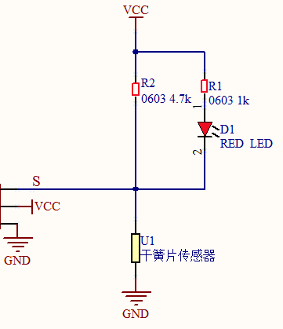
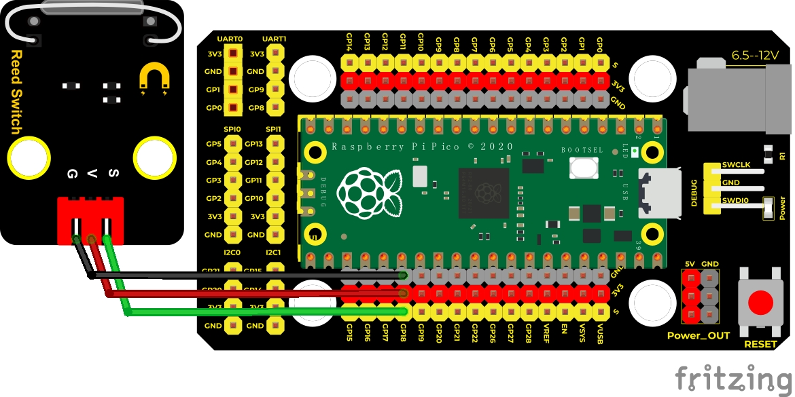
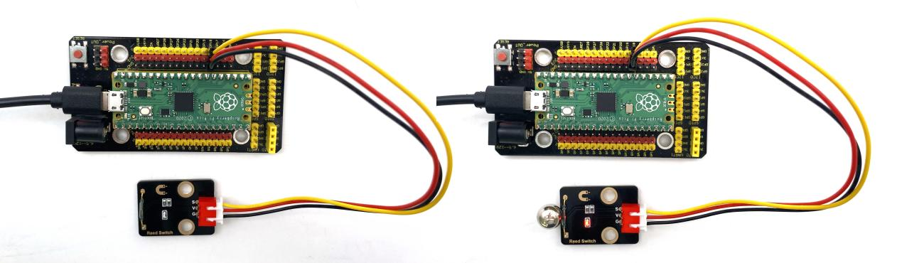
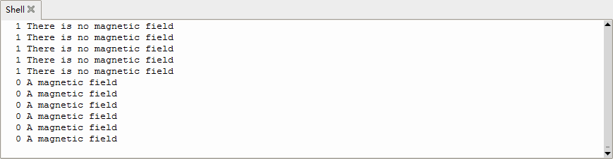

## 实验六 干簧管检测附近磁场


### 🌟 项目简介  
本实验带你认识一种简单又神奇的“磁控开关”——干簧管！它不需要通电就能工作，一靠近磁铁就自动“接通”，就像被磁力悄悄按下的按钮。我们将用它来制作一个“磁场小侦探”，实时告诉 Raspberry Pi Pico：“有磁铁来啦！”或“一切安静，没有磁场哦～”。

---

### 🔍 工作原理  

  
干簧管是一个密封的小玻璃管，里面装着两片薄薄的铁质簧片（像小小的金属舌头）。平时它们是分开的，互不接触；当磁铁靠近时，簧片被磁化、互相吸引而“啪”地吸合在一起，电路就通了！这时模块输出低电平（0）；磁铁拿走后，簧片靠自身弹性弹开，电路断开，输出高电平（1）。  
💡 小提示：模块上自带红色LED灯，它会和干簧管同步亮/灭——LED亮 = 检测到磁场 = 输出0；LED灭 = 无磁场 = 输出1。

---

### 🧰 所需材料  

|  |  |  |  |  |
|--------------------------------------------------------------------------|------------------------------------------------------------------|-------------------------------------------------------|----------------------------------------------------------------------|------------------------------------------------------|
| Raspberry Pi Pico板 ×1                                                   | Raspberry Pi Pico扩展板 ×1                                       | Keyes DIY电子积木 干簧管模块 ×1                       | 防反插3Pin杜邦线（公对母）×3                                          | Micro USB数据线 ×1                                  |

✅ **小贴士**：干簧管模块只有3个引脚——VCC（接5V或3.3V）、GND（接地）、S（信号端），接线非常简单！

---

### ⚙️ 接线说明  

****  

请按以下方式连接（模块标有 “+”、“-”、“S” 字样）：  
- 干簧管模块 **VCC** → 扩展板 **5V**（或Pico的VSYS/3.3V均可，模块兼容）  
- 干簧管模块 **GND** → 扩展板 **GND**  
- 干簧管模块 **S**（信号端）→ Pico 的 **GPIO18**（即物理引脚26）  

⚠️ 注意：模块上的S端必须接到Pico的**数字输入引脚**（如GP18），不能接模拟口；且无需额外上拉/下拉电阻——模块内部已集成上拉电阻（所以无磁场时读到的是1）。

---

### 💻 示例代码（MicroPython）

 ```python
# Keyes Starter Kit for Raspberry Pi Pico
# 实验六：干簧管检测附近磁场
# 使用GPIO18读取干簧管状态

from machine import Pin
import time

# 设置GP18为输入模式（干簧管模块S端接入此处）
reed_sensor = Pin(18, Pin.IN)

print("🔍 干簧管磁场检测启动中……")
print("👉 请用磁铁靠近模块，观察Shell提示与LED变化！\n")

while True:
    value = reed_sensor.value()  # 读取当前电平：0=有磁场，1=无磁场
    
    if value == 0:
        print("✅ 检测到磁场！ —— 红色LED已点亮")
    else:
        print("❌ 未检测到磁场 —— 红色LED已熄灭")
    
    time.sleep(0.3)  # 每0.3秒检测一次，避免刷屏过快
```

---

### 📖 代码解析  

| 代码行 | 说明 |
|--------|------|
| `Pin(18, Pin.IN)` | 将GPIO18设为**数字输入引脚**，用于接收干簧管模块发出的高低电平信号 |
| `reed_sensor.value()` | 读取引脚当前状态：`0` 表示干簧管闭合（有磁场），`1` 表示断开（无磁场） |
| `if value == 0:` | 判断是否检测到磁场——注意：这是**低电平有效**，和很多传感器相反！ |
| `time.sleep(0.3)` | 暂停0.3秒，让Shell输出更清晰易读，也减轻Pico负担 |

📌 **为什么是 value == 0 表示有磁场？**  
因为模块内部有上拉电阻，S端默认被拉高到1；只有干簧管吸合、S端连通GND时，才会被拉低成0——这就是“有磁才变0”的原因！

---

### 📋 实验现象  

运行代码后，在Thonny下方的 **Shell窗口** 中将看到持续滚动的文字提示：  
- 当你把磁铁靠近干簧管模块（约1–2 cm内）→ 显示 `✅ 检测到磁场！ —— 红色LED已点亮`，同时模块LED亮起；  
- 拿走磁铁 → 显示 `❌ 未检测到磁场 —— 红色LED已熄灭`，LED同步熄灭。  

  


✅ 成功标志：Shell提示与LED亮灭完全同步，响应灵敏、无延迟！

---

### ⚠️ 注意事项  

- 🔌 **接线前务必断开USB供电**，接好再通电，避免短路；  
- 🧲 **磁铁要靠近玻璃管部分**（模块中间凸起的银色/透明小管），不是靠近电路板或LED；  
- 🌡️ 干簧管怕高温、怕强冲击，不要摔、不要用火烤、不要用钳子夹玻璃管；  
- 🔄 若Shell无反应，请检查：① USB线是否为**数据线**（能传数据，非仅充电线）；② 是否选对串口（Thonny右下角显示“Pico”）；③ GP18接线是否松动或插错孔；  
- 📉 若响应迟钝或误触发，可尝试将 `time.sleep(0.3)` 改为 `0.5`，降低采样频率，提高稳定性。

---

### 🧠 扩展思维  
在本课干簧管检测的基础上，如果想让Pico在检测到磁场时**播放一声蜂鸣音**，该怎样修改代码？（提示：你需要一个有源蜂鸣器，接在另一个GPIO口，比如GP15）