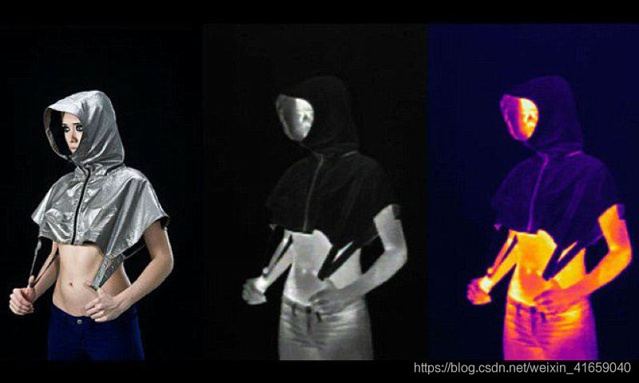
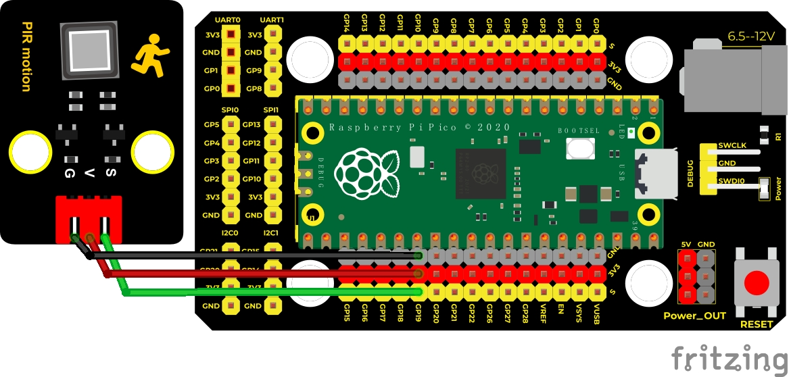
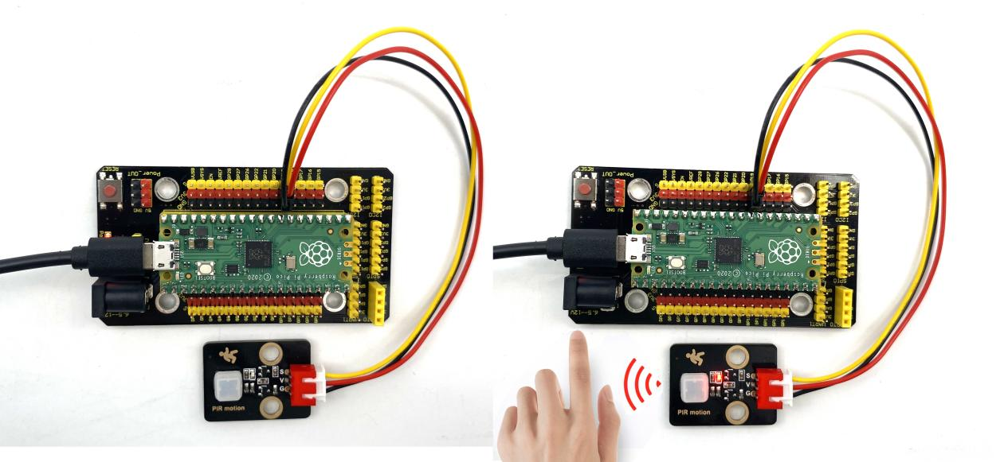

## 实验七 附近有人吗



### 🌟 项目简介  
本实验使用 **Keyes DIY电子积木人体红外热释传感器（PIR）**，来判断你身边是否有人在活动。它就像一个“小哨兵”，不用接触、不用拍照，只要有人走过它面前，它就能悄悄感知到——靠的是我们身体自然散发的微弱红外线！我们将用 Raspberry Pi Pico 读取它的信号，并在电脑屏幕上实时告诉你：“有人！”或“没人哦～”。

---

### 🔍 工作原理（小朋友也能懂版）  
这个传感器的核心是 **RE200B-P 热释电元件**，它特别敏感，能“感觉”到人体发出的热量（红外线）。  
为了让它看得更远、更准，模块前面还装了一个 **菲涅尔透镜**（像一排小凸透镜组成的放大镜），能把远处的红外信号“聚焦”到传感器上。

💡 小知识：人体会持续发出红外线（就像暖水袋会冒热气），而静止的墙壁、桌子不会“冒热气”，所以 PIR 主要检测 **有温度变化的运动物体**（比如走路的人），而不是拍张照看有没有人。

模块上有三个引脚：  
- **VCC → 接 3.3V 电源**（⚠️注意：不能接 5V！Pico 的 3.3V 刚刚好）  
- **GND → 接地**  
- **S（Signal）→ 接 Pico 的 GPIO19 引脚**，用来“听”传感器说的话  

当传感器“看到”有人动：  
✅ S 引脚输出 **高电平（1）** → 代码显示 “Some body is in this area!”  
✅ 模块上的小红灯 **会熄灭**（这是正常设计！别担心坏了 😊）

当周围安静没人动：  
✅ S 引脚输出 **低电平（0）** → 代码显示 “No one!”  
✅ 模块上的小红灯 **会亮起**（表示“我在待命中”）

> ⚠️ 补充说明：模块内部用了 MOS 管和上拉电阻，所以电平逻辑是“反着来的”——灯亮=没检测到人=低电平；灯灭=检测到人=高电平。我们不用管电路怎么实现，只要记住：**看屏幕文字 + 看灯亮灭，就能验证结果！**


---

### 🧰 所需材料  

|  |  |  |  |  |
|--------------------------------------------------------------------------|------------------------------------------------------------------|-------------------------------------------------------|----------------------------------------------------------------------|------------------------------------------------------|
| Raspberry Pi Pico 板 ×1                                                | Raspberry Pi Pico 扩展板 ×1                                      | Keyes 人体红外热释传感器 ×1                           | 防反插 3Pin 杜邦线（公对母）×3                                        | Micro USB 数据线 ×1                                 |

📌 小提示：扩展板让接线更整齐、更安全，推荐初学者使用！

---

### 🔌 接线图  

  

✅ 正确接法（请对照图检查）：  
- 传感器 **VCC** → 扩展板 **3V3**（不是 5V！）  
- 传感器 **GND** → 扩展板 **GND**  
- 传感器 **S** → 扩展板 **GP19**（即 Pico 的第 19 号 GPIO 引脚）  

🔧 如果没有扩展板，直接连 Pico 板：  
- VCC → Pico 的 **VBUS 或 3V3 引脚**（推荐用 **3V3**，更稳）  
- GND → Pico 的任意 **GND 引脚**  
- S → Pico 的 **GP19 引脚**（物理位置：板子右上角第 2 排第 5 个引脚）

---

### 💻 示例代码（MicroPython）  

 ```python
# Keyes Starter Kit for Raspberry Pi Pico
# 实验七：附近有人吗？——人体红外热释传感器实验
# 作者：Keyes 教育团队 | 适配：MicroPython v1.23+

from machine import Pin
import time

# 设置 GP19 引脚为输入模式，读取 PIR 传感器信号
PIR = Pin(19, Pin.IN)

print("🔍 PIR 传感器已启动！请慢慢在传感器前挥手～")
print("（等待约 1 秒初始化...）")
time.sleep(1)  # 给传感器一点稳定时间

while True:
    value = PIR.value()  # 读取当前信号：0 = 没人，1 = 有人
    
    # 在 Shell 中清晰显示结果
    if value == 1:
        print("✅ 有人！Some body is in this area!")
    else:
        print("💤 没人～ No one!")
    
    time.sleep(0.1)  # 每 0.1 秒检测一次，不卡顿也不太频繁
```

---

### 📖 代码解析（逐行看懂）  

| 代码行 | 说明 |
|--------|------|
| `from machine import Pin` | 导入 Pico 的“引脚控制工具”，才能让板子认识哪个针脚该干嘛 |
| `import time` | 导入“时间工具”，用来加等待、让程序不狂奔 |
| `PIR = Pin(19, Pin.IN)` | 把第 19 号引脚设为“耳朵”（输入模式），专门听传感器说话 |
| `value = PIR.value()` | “听”一下：现在是 0 还是 1？（就像问：“有人吗？”） |
| `if value == 1:` | 如果听到“1”，说明传感器说“有！” |
| `print("✅ 有人！...")` | 在电脑屏幕上开心地显示 ✅ 提示（更友好、更直观） |
| `else:` | 否则（就是 value 是 0），说明“没人” |
| `time.sleep(0.1)` | 每次检测完，休息 0.1 秒再测下一次，既省电又流畅 |

✅ 小技巧：第一次上电后，传感器需要约 **60 秒自校准时间**（期间可能误触发），耐心等一会儿再测试效果更准！

---

### 📺 实验现象  

运行代码后，打开 Thonny 或 Mu 编辑器下方的 **Shell（交互窗口）**，你会看到类似这样的滚动信息：

```
🔍 PIR 传感器已启动！请慢慢在传感器前挥手～
（等待约 1 秒初始化...）
💤 没人～ No one!
💤 没人～ No one!
✅ 有人！Some body is in this area!
✅ 有人！Some body is in this area!
💤 没人～ No one!
```

同时观察传感器模块：  
- 显示 “✅ 有人！” 时 → 小红灯 **熄灭**  
- 显示 “💤 没人～” 时 → 小红灯 **亮起**  

  


---

### ⚠️ 注意事项（安全 & 成功小贴士）  

🔹 **电压务必接 3.3V！** 接 5V 可能烧坏传感器（Pico 的 VBUS 是 5V，别误接！）  
🔹 **安装位置很重要**：  
　　✔️ 放在离地 0.8–1.5 米高，朝向门口/通道；  
　　❌ 避开空调出风口、暖气片、阳光直射窗边（热气流会干扰）；  
　　❌ 不要正对玻璃、镜子（红外线会被反射乱跑）。  
🔹 **首次通电请等待 60 秒**：传感器需要时间“适应环境温度”，这期间可能乱亮灯、乱打印，属正常现象。  
🔹 **检测距离约 3–5 米，角度约 110°**：挥手比站着不动更容易被发现哦！  
🔹 **如果一直不响应？** 检查：① 接线是否松动 ② 是否接了 3.3V 而非 5V ③ 传感器镜头是否被遮挡或蒙灰。

---

### 🧠 扩展思维  
在本课 PIR 传感器检测到人时点亮 LED 的基础上，如果想让它**检测到人时播放一段提示音（比如“叮咚，欢迎光临！”），该怎么做？**