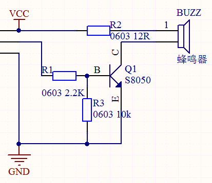
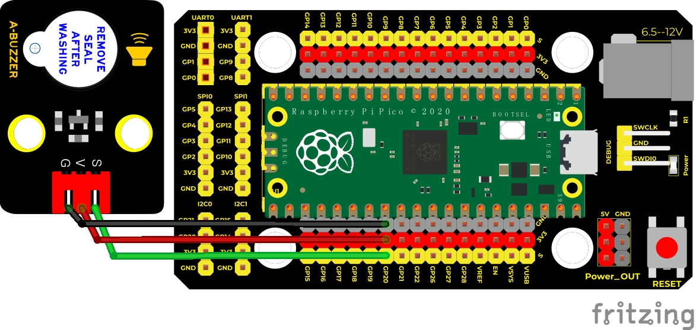
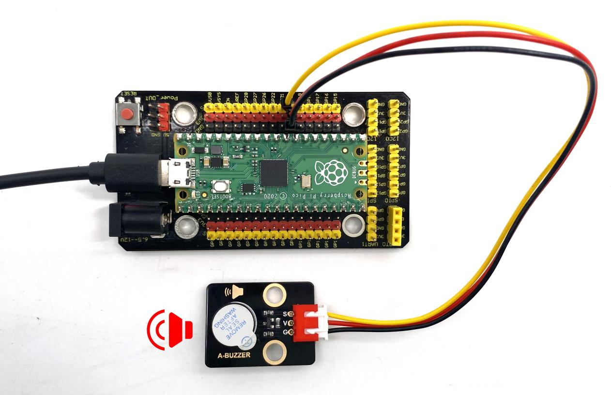

## 实验八 有源蜂鸣器模块播放声音


### 🌟 项目简介  
本实验带你用 Raspberry Pi Pico 控制一个「有源蜂鸣器模块」，让它发出规律的“嘀— 嘀—”声。就像闹钟的提示音一样，只要给它通电，它自己就能响！不需要你额外编写复杂频率代码，非常适合初学者迈出声音编程的第一步 ✅

---

### 🔍 工作原理（小朋友也能懂！）  
  
别被电路图吓到！我们来轻松理解👇  

这个蜂鸣器叫「有源」，意思是——它**自带“小闹钟芯片”**！你只需要告诉它：“现在开始响！”（给高电平），它就自动“嘀”一声；说“停！”（给低电平），它就安静下来。

电路里藏着一个“电子开关”（三极管 Q1）：  
- 当 Pico 的 GPIO20 输出 **高电平（1）** → 开关“啪”地闭合 → 蜂鸣器接通电源 → 发出声音 💡  
- 当 GPIO20 输出 **低电平（0）** → 开关断开 → 蜂鸣器断电 → 声音停止 🤫  
- 电阻 R3 是个“安心小卫士”，确保开关平时默认是断开的（不会误响）  

✅ 简单记：**Pin20 输出 1 → 响；输出 0 → 不响**

---

### 🧰 所需材料  
|  |  |  |  |  |
|--------------------------------------------------------------------------|------------------------------------------------------------------|-------------------------------------------------------|----------------------------------------------------------------------|------------------------------------------------------|
| Raspberry Pi Pico板 ×1                                                   | Raspberry Pi Pico扩展板 ×1                                       | Keyes 有源蜂鸣器模块 ×1                               | 防反插3Pin杜邦线（公对母）×1                                          | Micro USB 数据线 ×1                                  |

> 💡 小贴士：扩展板让接线更整齐、不怕插错，强烈推荐使用！

---

### ⚙️ 接线图（一目了然）  
****  
✅ 正确接法（请对照图检查）：  
- 蜂鸣器模块 **S（信号）引脚** → Pico 的 **GPIO20（引脚26）**  
- 蜂鸣器模块 **+（VCC）引脚** → 扩展板或Pico的 **3.3V 或 5V（推荐3.3V，更安全）**  
- 蜂鸣器模块 **–（GND）引脚** → 扩展板或Pico的 **GND（任意黑色GND引脚）**  

⚠️ 注意：  
- 有源蜂鸣器**不能接反**！认准模块上标着 “+”、“–”、“S” 的丝印  
- 如果用的是 5V 供电，请确认你的蜂鸣器模块支持 5V（本套件模块兼容 3.3V/5V，但 Pico 的 3.3V 更稳妥）

---

### 💻 示例代码（MicroPython）  
 ```python
# Keyes Starter Kit for Raspberry Pi Pico
# 实验八：有源蜂鸣器发声
# 作者：创客小课堂

from machine import Pin
import time

# 创建蜂鸣器控制对象：连接在 GPIO20（物理引脚26）
buzzer = Pin(20, Pin.OUT)

# 循环播放：响1秒 → 停1秒 → 再响...
while True:
    buzzer.value(1)   # 输出高电平 → 蜂鸣器响起
    time.sleep(1)     # 等待1秒钟
    buzzer.value(0)   # 输出低电平 → 蜂鸣器停止
    time.sleep(1)     # 再等待1秒钟
```

---

### 📝 代码解析（逐行看懂）  
| 代码行 | 中文意思 | 小知识卡片 |
|--------|----------|-------------|
| `from machine import Pin` | 导入「控制引脚」的工具包 | 就像打开遥控器的电池盖，准备操作硬件 |
| `import time` | 导入「时间管理」工具包 | 用来实现“等1秒”这种动作 |
| `buzzer = Pin(20, Pin.OUT)` | 把 GPIO20 设置为**输出模式**，起名叫 `buzzer` | 类似给遥控器按钮贴标签：“这是蜂鸣器开关” |
| `buzzer.value(1)` | 让 GPIO20 输出 **高电平（3.3V）** → 蜂鸣器响 | 相当于按下了“开”键 ✅ |
| `buzzer.value(0)` | 让 GPIO20 输出 **低电平（0V）** → 蜂鸣器停 | 相当于按下了“关”键 ❌ |
| `time.sleep(1)` | 暂停程序运行 **1秒钟**（单位：秒） | 不是“睡觉”，是让程序“数1秒再继续” ⏱️ |

---

### 🎯 实验现象  
✅ 接线无误 + 烧录成功后：  
- 上电瞬间，蜂鸣器会发出清晰、稳定的“嘀——”声（约1秒）  
- 然后安静1秒  
- 接着再次“嘀——”，如此循环不停  
- 声音清脆、节奏均匀，说明硬件和代码都工作正常！



---

### ⚠️ 注意事项（安全第一！）  
- 🔌 **务必先断电再接线/改线**！避免短路烧坏Pico或模块  
- 📏 **确认蜂鸣器模块型号是有源型（Active Buzzer）** —— 本套件模块正面印有“ACTIVE”或“有源”，切勿与无源蜂鸣器混淆（无源需要变频驱动，本实验不适用）  
- 🌡️ **Pico 的 3.3V 引脚可直接驱动本模块**，不建议长期使用 5V（虽兼容，但降低器件寿命）  
- 🐞 若没声音？请按顺序检查：  
  ① USB线是否插稳、Pico是否被电脑识别；  
  ② 是否已正确烧录 MicroPython 固件；  
  ③ 杜邦线是否松动、S/VCC/GND 是否接错位置；  
  ④ 代码中 `Pin(20)` 是否写成 `Pin(2)` 或 `Pin(0)` 等错误编号  

---

### 🧠 扩展思维  
如果想让蜂鸣器“嘀嘀嘀”连响三声（每声0.3秒，间隔0.2秒），而不是一直循环响，代码该怎么改？