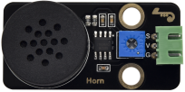
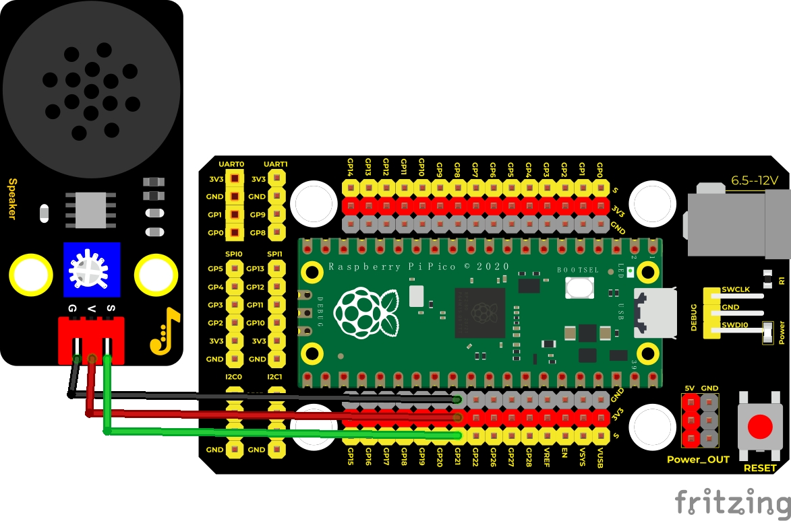
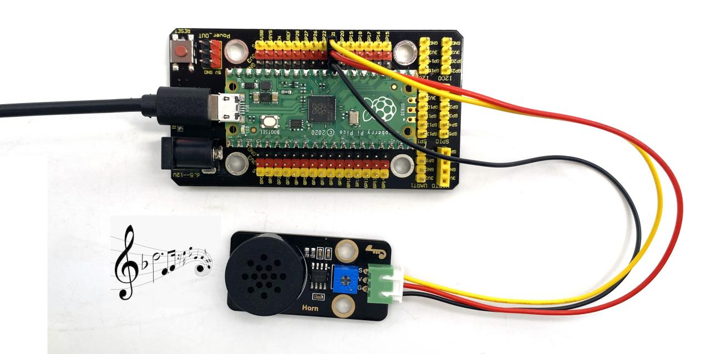

## 实验九 8002b功放 喇叭模块

****

### 🌟 项目简介  
本实验带你使用套件中的 **Keyes DIY电子积木 8002b功放 喇叭模块**，它不是普通蜂鸣器，而是一个“小音响系统”：内部集成了 **8002B音频放大芯片 + 可调电位器 + 小型喇叭**。它可以将微弱的音频信号（比如Pico输出的方波）放大约8.5倍，并通过喇叭清晰发声——不仅能响“嘀嘀嘀”，还能播放简谱音阶，甚至为后续音乐播放打下基础！

> 💡 小知识：有源蜂鸣器像“自带电池的手电筒”，通电就响；而本模块更像“需要你推一把的自行车”，必须输入不同频率的电信号，它才能发出不同音调的声音。

---

### 🔧 工作原理  
8002B是一款低电压、高保真音频功率放大芯片，工作电压仅2.5V–5.5V，非常适合Pico（3.3V供电）。模块通过**PWM信号模拟音频波形**，Pico的GP21引脚输出可变频率的方波 → 经8002B放大 → 推动喇叭振动 → 发出声音。

⚠️ 注意：这不是“数字开关式”发声，而是靠**精确控制频率**来决定音调高低（如523Hz = 中音Do），靠**占空比**控制音量大小（太大可能失真，太小听不见）。


---

### 📦 所需材料  

|  |  |  |  |  |
|--------------------------------------------------------------------------|------------------------------------------------------------------|-------------------------------------------------------|----------------------------------------------------------------------|------------------------------------------------------|
| Raspberry Pi Pico板 ×1                                                   | Raspberry Pi Pico扩展板 ×1                                       | Keyes 8002b功放喇叭模块 ×1                            | 防反插3Pin杜邦线（红/黑/黄）×1                                        | Micro USB数据线 ×1                                  |

✅ 模块接口说明（看模块背面丝印）：  
- **VCC** → 接3.3V（⚠️切勿接5V！会烧毁8002B芯片）  
- **GND** → 接GND  
- **IN** → 接Pico GP21（即PWM信号输入端）

---

### 🔌 接线图  

****  

📌 **关键接线口诀**（请务必对照图检查）：  
- 喇叭模块 **VCC** → 扩展板 **3V3**（不是VSYS或5V！）  
- 喇叭模块 **GND** → 扩展板 **GND**  
- 喇叭模块 **IN** → 扩展板 **GP21**（Pico第21号GPIO引脚）

💡 小提示：模块上的蓝色电位器可手动调节音量（顺时针增大），首次实验建议先调至中间位置。

---

### 💻 示例代码（MicroPython）

 ```python
# Keyes Starter Kit for Raspberry Pi Pico
# 实验九：8002b功放喇叭模块演奏音阶

from machine import Pin, PWM
from time import sleep

# 创建PWM对象，连接GP21引脚
buzzer = PWM(Pin(21))

# 设置初始音量（占空比）：1000 / 65535 ≈ 1.5%，柔和不刺耳
buzzer.duty_u16(1000)

# 演奏简谱音阶（中音区，单位：Hz）
# DO  RE  MI  FA  SO  LA  SI
notes = [523, 586, 658, 697, 783, 879, 987]

for freq in notes:
    buzzer.freq(freq)      # 设置当前音调频率
    sleep(0.5)             # 每个音持续0.5秒

# 演奏结束，关闭声音
buzzer.duty_u16(0)
```

---

### 📚 代码解析  

| 代码行 | 作用说明 |
|--------|----------|
| `buzzer = PWM(Pin(21))` | 创建一个PWM控制器，控制Pico的GP21引脚（支持硬件PWM，音准稳定） |
| `buzzer.duty_u16(1000)` | 设置“音量”：数值越大声音越响；0=静音；65535=最大（但易破音，推荐500~2000） |
| `buzzer.freq(523)` | 设置“音调”：523Hz对应标准钢琴中音Do（C4），其他频率查表可得 |
| `sleep(0.5)` | 让每个音持续半秒，形成清晰节拍 |

✅ 为什么用`duty_u16()`而不是`duty()`？  
→ Pico的MicroPython中，`duty_u16()`使用0–65535范围，精度更高、音效更稳，是推荐写法。

---

### 🎵 实验现象  

上传代码并运行后，你会听到喇叭清晰播放一串音阶：  
**Do（523Hz）→ Re（586Hz）→ Mi（658Hz）→ Fa（697Hz）→ So（783Hz）→ La（879Hz）→ Si（987Hz）**  
每个音持续0.5秒，节奏均匀，无杂音。若无声，请按以下顺序排查👇

---

### ⚠️ 注意事项（安全 & 成功率提升）  

1. **电压红线**：模块 **VCC只能接3.3V**！接5V或VSYS会永久损坏8002B芯片。  
2. **接线三查**：  
   - ✅ VCC是否误接到5V？  
   - ✅ IN是否松动/接触不良？（重点查黄线）  
   - ✅ GND是否共地？（Pico、扩展板、模块GND必须连通）  
3. **音量调节**：首次通电若无声，先逆时针旋松电位器再试；若失真，顺时针微调减小音量。  
4. **静音保护**：程序结尾务必加 `buzzer.duty_u16(0)`，避免断电后残留信号触发异响。  
5. **喇叭方向**：模块喇叭无正负极之分，但安装时请确保振膜朝外（有金属网一面），音效更佳。

****

---

### 🧠 扩展思维  
在本课用固定频率播放音阶的基础上，如果想让喇叭发出“由弱到强、再由强到弱”的渐变音效（类似呼吸灯），该怎样修改代码？