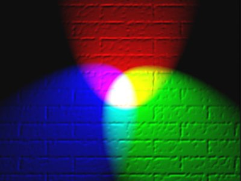
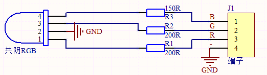
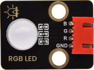
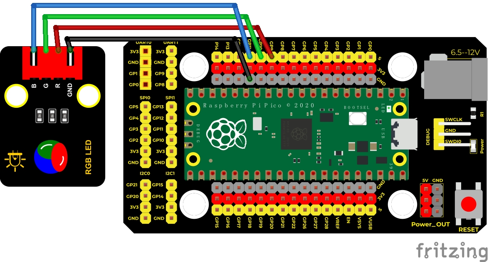
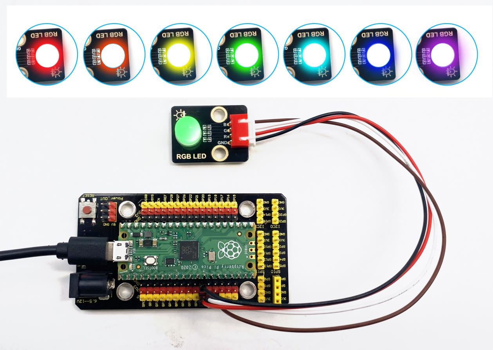

## 实验十 插件RGB模块调节LED颜色

****

### 🌟 项目简介  
本实验将使用 Raspberry Pi Pico 控制一个共阴极 RGB LED 模块，通过调节红（R）、绿（G）、蓝（B）三色LED的亮度比例，混合出丰富多彩的灯光效果。我们将分两步完成：先用最基础的“亮/灭”方式让RGB灯轮流显示红、绿、蓝；再进阶使用 PWM（脉宽调制）技术，实现平滑、细腻的多色渐变控制——比如橙色、紫色、青色等真实色彩。

---

### ⚙️ 工作原理  

RGB LED 由三个独立的小LED组成：红色、绿色和蓝色。它们像画家的三原色一样，按不同强度混合就能产生几乎任何颜色。  

- **共阴极（Common Cathode）**：模块上有一个公共接地脚（GND），其余 R、G、B 三脚分别接单片机的输出引脚。当某一脚输出高电平（3.3V），对应颜色LED就会点亮；输出低电平（0V）则熄灭。  
- **PWM 是什么？**  
  单片机的普通引脚只能输出“开”（3.3V）或“关”（0V）两种状态，但人眼有视觉暂留效应——就像电影每秒播放24帧画面，看起来就是连续的。PWM 就是利用这个原理：快速地在“开”和“关”之间切换，通过改变“开”的时间占比（叫**占空比**），让人眼感知到不同的亮度。  
  - 占空比 100% → 全亮（3.3V）  
  - 占空比 50% → 半亮（平均电压约1.65V）  
  - 占空比 0% → 全灭（0V）  
  MicroPython 中使用 `duty_u16()` 设置占空比，数值范围是 **0 ~ 65535**（即 16 位精度），数值越大，对应颜色越亮。

> ✅ 小贴士：本实验模块为**共阴极**，所以 R/G/B 引脚需接 Pico 的 GPIO 输出口，公共脚接 GND。如果是共阳极模块，则公共脚要接 VCC，R/G/B 接输出口并取反控制——本套件无需担心，直接按图接线即可！



---

### 🧰 所需材料  

|  |  |  |  |  |
| ------------------------------------------------------------ | ------------------------------------------------------------ | ----------------------------------------------------- | ------------------------------------------------------------ | ---------------------------------------------------- |
| Raspberry Pi Pico板 ×1                                       | Raspberry Pi Pico扩展板 ×1                                   | Keyes DIY电子积木 共阴RGB模块 ×1                      | 防反插4Pin杜邦线（公对母）×4                                 | MicroUSB数据线 ×1                                    |

---

### 🔌 接线图  

****  

✅ **正确接线说明（请务必对照图检查）：**  
- RGB模块的 **R 脚** → Pico GP9（物理引脚 12）  
- RGB模块的 **G 脚** → Pico GP10（物理引脚 14）  
- RGB模块的 **B 脚** → Pico GP11（物理引脚 15）  
- RGB模块的 **“-” 或 “GND” 脚** → Pico GND（任一标 GND 的引脚，如引脚 3 或 8）  

⚠️ 注意：模块上有丝印标注 R/G/B/-，请勿接反！若接错可能导致LED不亮或颜色异常。

---

### 💻 示例代码  

#### ▶️ 代码1：基础三色循环（亮/灭控制）  
```python
# * Keyes Starter Kit for Raspberry Pi Pico
# * lesson 10.1
# * RGB - 基础三色闪烁（红→绿→蓝）

from machine import Pin
from time import sleep

# 定义红、绿、蓝LED对应的引脚（GP9/GP10/GP11）
red = Pin(9, Pin.OUT)
green = Pin(10, Pin.OUT)
blue = Pin(11, Pin.OUT)

while True:
    # 红色亮，绿蓝灭
    red.value(1)
    green.value(0)
    blue.value(0)
    sleep(1)

    # 绿色亮，红蓝灭
    red.value(0)
    green.value(1)
    blue.value(0)
    sleep(1)

    # 蓝色亮，红绿灭
    red.value(0)
    green.value(0)
    blue.value(1)
    sleep(1)
```

#### ▶️ 代码2：PWM多色渐变（推荐使用）  
```python
# * Keyes Starter Kit for Raspberry Pi Pico
# * lesson 10.2
# * RGB - PWM调光实现多种颜色

from machine import Pin, PWM
from time import sleep

# 创建PWM对象，分别控制红、绿、蓝LED
pwm_r = PWM(Pin(9))
pwm_g = PWM(Pin(10))
pwm_b = PWM(Pin(11))

# 设置PWM频率为1000Hz（人眼无频闪感，且Pico支持）
pwm_r.freq(1000)
pwm_g.freq(1000)
pwm_b.freq(1000)

# 自定义函数：一键设置RGB亮度（0~65535）
def light(red_val, green_val, blue_val):
    pwm_r.duty_u16(red_val)
    pwm_g.duty_u16(green_val)
    pwm_b.duty_u16(blue_val)

# 循环显示7种常用颜色（每种停留1秒）
while True:
    light(65535, 0, 0)        # 红色（R最大，G/B为0）
    sleep(1)
    light(65535, 25088, 0)   # 橙色（R全亮 + G中等）
    sleep(1)
    light(65535, 65535, 0)   # 黄色（R+G全亮）
    sleep(1)
    light(0, 65535, 0)       # 绿色
    sleep(1)
    light(0, 0, 65535)       # 蓝色
    sleep(1)
    light(0, 65535, 65535)   # 青色（G+B全亮）
    sleep(1)
    light(41216, 8448, 61696)# 紫色（R中等 + B强 + G弱）
    sleep(1)
```

---

### 📝 代码解析  

🔹 **为什么代码1只能显示红/绿/蓝？**  
因为它是“全亮”或“全灭”，没有中间亮度。每个LED只有“开”或“关”两种状态，无法混合出橙、紫等过渡色。

🔹 **代码2的核心升级在哪？**  
- 使用 `PWM(Pin(x))` 创建可调亮度的输出通道；  
- `duty_u16(value)` 中的 `value` 表示占空比强度：  
  - `0` = 完全不亮  
  - `65535` = 最大亮度（100%）  
  - `32768` ≈ 50%亮度（半亮）  
- 例如橙色：红色全亮（65535），绿色设为约 38.3%（25088 ÷ 65535 ≈ 0.383），蓝色为0 → 视觉上就是温暖的橙光。

🔹 **关于颜色值换算小技巧：**  
表格中常见的 RGB 值是 0~255（8位），而 MicroPython 的 `duty_u16()` 是 0~65535（16位）。  
✅ 换算公式：`16位值 = 8位值 × 256`  
例如：黄色标准值 (255, 255, 0) → `(255×256, 255×256, 0)` = `(65535, 65535, 0)`

---

### 🌈 实验现象  

- 运行 **代码1**：RGB LED 会严格按「红→绿→蓝→红…」顺序，每种颜色亮1秒，循环不停。  
- 运行 **代码2**：LED 将依次显示：  
  🔴 红 → 🟠 橙 → 🟡 黄 → 🟢 绿 → 🔵 蓝 → 🌊 青 → 🟣 紫  
  每种颜色持续1秒，过渡自然、色彩饱满，明显区别于代码1的“硬切换”。



---

### ⚠️ 注意事项  

1. **务必确认模块类型**：本实验使用的是**共阴极（Common Cathode）RGB模块**，GND 脚必须接 Pico 的 GND；若误接成共阳极接法（VCC供电），LED将不工作甚至损坏。  
2. **引脚别接错**：R→GP9、G→GP10、B→GP11 是固定搭配，请严格对照接线图。  
3. **避免短路**：接线前断开 USB；插拔时轻拿轻放，防止杜邦线金属头同时触碰多个引脚。  
4. **首次运行无反应？**  
   - 检查 USB 是否连接成功（Pico 板载 LED 应微亮）；  
   - 检查 Thonny 是否选对端口（Port）和解释器（Interpreter → MicroPython (Raspberry Pi Pico)）；  
   - 检查代码是否完整复制，尤其注意英文标点（如冒号 `:`、括号 `()`）不可用中文符号替代。  
5. **颜色偏暗/发白？**  
   - 可能是模块为共阳极（本套件不是）；  
   - 或某一路接线松动/接触不良；  
   - 或 `duty_u16()` 值过小（如误写成 `duty_u16(255)`，实际应为 `255*256=65280`）。

---

### 🧠 扩展思维  
在本课 LED 闪烁的基础上，如果想让它渐亮渐暗（呼吸灯效果），该怎样修改代码2中的 `light()` 函数和主循环？

