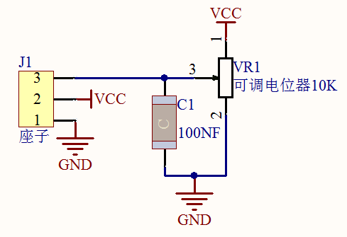
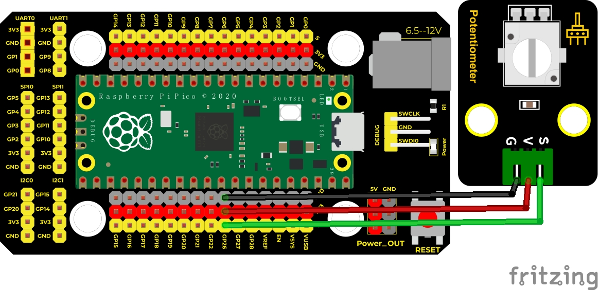
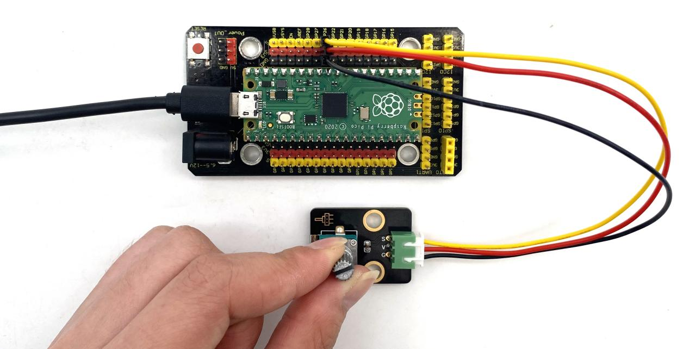
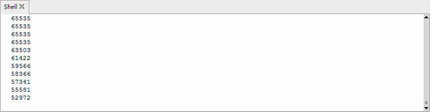

## 实验十一 读取旋转电位器传感器模拟值


### 🌟 项目简介  
本实验带你认识“模拟信号”——一种可以连续变化的电压值（比如 0V～3.3V 之间的任意电压），和之前学过的只有“开/关”两种状态的数字信号完全不同！我们用 Raspberry Pi Pico 上的 **ADC（模数转换器）** 来读取旋转电位器（也就是一个可调旋钮）的实时位置，并在 Thonny 的 Shell 窗口中看到不断变化的数字，直观感受“旋转→电压→数字”的全过程。

---

### ⚙️ 工作原理  
  

旋转电位器就像一个“可调水龙头”：  
- 它内部是一个 **10KΩ 的可变电阻**；  
- 旋转旋钮时，中间引脚（信号端 S）输出的电压会从 **0V 平滑变化到 3.3V**；  
- Pico 的 ADC 引脚（GP26/GP27/GP28）能“听懂”这个连续的电压，并把它转换成一个 **0～65535 的整数**（因为 MicroPython 将 12 位硬件 ADC 映射为 16 位范围，更方便使用）；  
- 比如：旋到最左 ≈ 0，旋到最右 ≈ 65535，旋到中间 ≈ 32768 —— 数字越接近 65535，说明电压越高，旋钮越靠右！

> ✅ 小知识：ADC 分辨率 = 3.3V ÷ 65536 ≈ 0.00005V，也就是说，它能分辨出约 **50 微伏** 的微小电压变化！

---

### 🧰 所需材料  

|  |  |  |  |  |
|--------------------------------------------------------------------------|------------------------------------------------------------------|-------------------------------------------------------|----------------------------------------------------------------------|------------------------------------------------------|
| Raspberry Pi Pico板 ×1                                                   | Raspberry Pi Pico扩展板 ×1                                       | Keyes DIY电子积木 旋转电位器传感器 ×1                 | 防反插3Pin杜邦线（母对母）×1                                         | Micro USB 数据线 ×1                                  |

---

### 🔌 接线图  

  

✅ 正确接法（三线对应）：  
- 旋转电位器 **VCC（红）→ Pico 的 3.3V 引脚**  
- **GND（黑）→ Pico 的 GND 引脚**  
- **S（黄/白）→ Pico 的 GP26 引脚**（即 ADC0 通道）  

⚠️ 注意：  
- 不要接错 VCC 和 GND，否则可能损坏传感器；  
- 务必使用 **防反插杜邦线**，避免插反导致短路；  
- GP26 是 Pico 唯一标注了 “ADC0” 的引脚，位置明确（见扩展板丝印或 Pico 底部引脚图）。

---

### 💻 示例代码（MicroPython）  

```python
# Keyes Starter Kit for Raspberry Pi Pico
# 实验11：读取旋转电位器模拟值
# 连接：电位器信号线 → GP26（ADC0）

import machine
import utime

# 创建ADC对象，使用GP26引脚（即ADC通道0）
potentiometer = machine.ADC(26)

print("【旋转电位器测试开始】")
print("顺时针旋转 → 数值增大；逆时针旋转 → 数值减小")
print("-" * 40)

while True:
    # 读取16位模拟值（0～65535）
    pot_value = potentiometer.read_u16()
    
    # 在Shell中打印数值，更清晰易读
    print("当前值：", pot_value)
    
    # 每0.1秒读取一次，避免刷屏太快
    utime.sleep(0.1)
```

---

### 📝 代码解析  

| 代码行 | 说明 |
|--------|------|
| `potentiometer = machine.ADC(26)` | 创建一个 ADC 对象，告诉 Pico：“我要用 GP26 引脚来读模拟电压！” |
| `pot_value = potentiometer.read_u16()` | 调用 `.read_u16()` 方法，一次性读出 **0～65535 的整数**（比 `read_u16()` 更常用，精度更高、兼容性更好） |
| `print("当前值：", pot_value)` | 把读到的数字清楚地显示在 Thonny 的 Shell 窗口里，方便你边看边转旋钮 |
| `utime.sleep(0.1)` | 暂停 0.1 秒，让数据显示节奏适中，不会疯狂滚动看不清 |

> 💡 小提示：`read_u16()` 返回的是 16 位无符号整数（0～65535），而 Pico 硬件 ADC 实际是 12 位（0～4095）。MicroPython 自动做了左移 4 位的映射（×16），所以结果更“饱满”，更适合初学者观察变化。

---

### 🌈 实验现象  

运行代码后，打开 Thonny 下方的 **Shell（交互窗口）**，你会看到类似这样的滚动数字：

```
【旋转电位器测试开始】
顺时针旋转 → 数值增大；逆时针旋转 → 数值减小
----------------------------------------
当前值： 1245
当前值： 1289
当前值： 2301
当前值： 4567
...
当前值： 65535
当前值： 65535
当前值： 54210
...
```

- ✅ **顺时针拧到底** → 数值稳定在 **65535** 左右  
- ✅ **逆时针拧到底** → 数值稳定在 **0** 左右  
- ✅ **慢慢旋转中间位置** → 数值平滑过渡，如 16384、32768、49152…  

  


---

### ⚠️ 注意事项  

- 🔌 **接线前务必断开 USB 线**：插拔杜邦线时先拔掉 Micro USB 线，防止短路；  
- 🧩 **确认电位器方向**：模块上标有 “VCC / GND / S”，请严格按颜色/丝印对应（红→3.3V，黑→GND，黄/白→GP26）；  
- 🐍 **代码保存与运行**：  
  - 保存为 `lesson11_pot.py`；  
  - 点击 Thonny 工具栏的 ▶️ **Run（运行）**，不要点 “Shell 中输入”，否则会报错；  
- 🌡️ **避免高温环境**：长时间通电+高负载可能导致 ADC 测量轻微漂移，属正常现象，不影响学习效果；  
- ❌ **不要用 GP23/GP24/GP25 等非 ADC 引脚**：只有 GP26、GP27、GP28 支持模拟输入，其他引脚无法读取电压！

---

### 🧠 扩展思维  
如果想让 LED 的亮度随着电位器旋转而**逐渐变亮或变暗**（而不是开关式闪烁），该怎样修改本课代码？