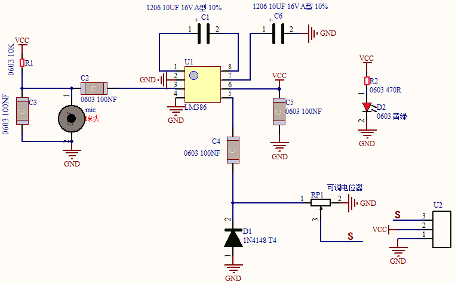
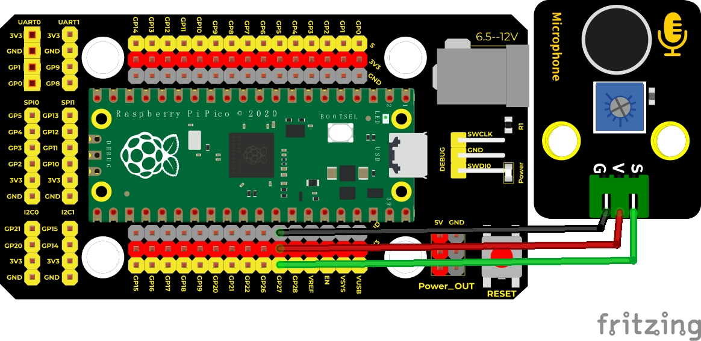
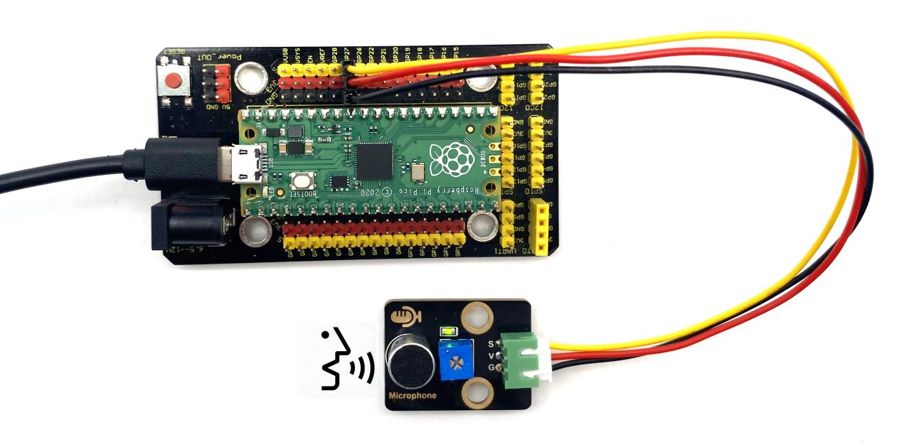
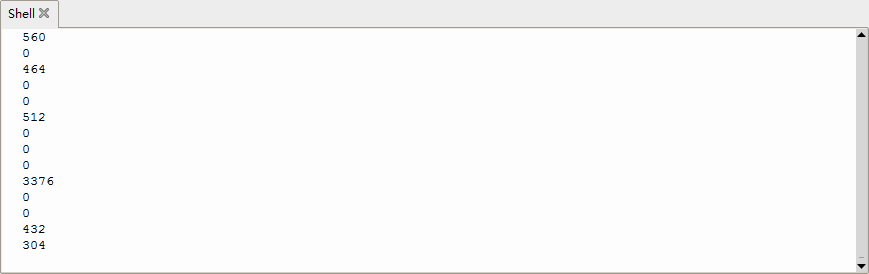

## 实验十二 声音传感器检测声量


### 🌟 项目简介  
本实验使用 Keyes DIY 电子积木声音传感器，配合 Raspberry Pi Pico 板，实时检测周围环境的声音强弱，并将声音对应的模拟电压值显示在 Thonny 的 Shell（串口监视器）中。声音越大，传感器输出的模拟值越高，我们就能直观地“看到”声音的大小！

---

### 🔍 工作原理  
  
声音传感器内部包含两个核心部件：  
✅ **高灵敏度驻极体麦克风**：能将空气中的声波振动转换成微弱的电信号；  
✅ **LM386 音频放大芯片**：把麦克风产生的微弱信号放大（最高可达200倍），便于Pico读取；  
🔧 传感器上有一个**蓝色小电位器（旋钮）**：顺时针旋转可增大放大倍数（声音更敏感），逆时针旋转则降低灵敏度，适合不同环境使用。

> 💡 小知识：Pico 的 ADC（模数转换器）只能读取电压值（0–3.3V），而声音传感器把声音“翻译”成了这个范围内的电压——声音越响，电压越高，ADC读出的数字就越大！

---

### 🧰 所需材料  

|  |  |  |  |  |
|--------------------------------------------------------------------------|------------------------------------------------------------------|-------------------------------------------------------|----------------------------------------------------------------------|------------------------------------------------------|
| Raspberry Pi Pico 板 ×1                                                  | Raspberry Pi Pico 扩展板 ×1                                      | Keyes 声音传感器模块 ×1                               | 防反插 3Pin 连接线（杜邦线）×1                                       | Micro USB 数据线 ×1                                 |

📌 **温馨提示**：请确认你的 Pico 已成功烧录 MicroPython 固件，并能通过 Thonny 正常连接与运行程序。

---

### ⚙️ 接线说明  

****  

| 声音传感器端子 | 连接到 Pico 引脚 | 说明              |
|----------------|------------------|-------------------|
| **VCC**        | **VSYS 或 3V3 OUT** | 供电（建议用 VSYS，更稳定） |
| **GND**        | **GND**          | 公共地线           |
| **AO（模拟输出）** | **GPIO27（ADC2）** | 模拟信号输入引脚（Pico 的 ADC2 通道） |

✅ **接线口诀**：红（VCC）→ VSYS，黑（GND）→ GND，黄（AO）→ GP27  
⚠️ 注意：不要接错 AO 和 DO（数字输出）引脚！本实验只用 **AO（模拟输出）**。

---

### 💻 示例代码（MicroPython）

```python
# Keyes Starter Kit for Raspberry Pi Pico
# 实验十二：声音传感器检测声量
# 使用 ADC2（GP27）读取声音模拟值

import machine
import utime

# 创建ADC对象，对应GP27引脚（ADC2通道）
mic = machine.ADC(27)

print("🎤 声音传感器已启动！")
print("👉 对着麦克风说话，观察数值变化～")
print("-" * 30)

while True:
    # 读取16位无符号整数（0–65535），对应0–3.3V电压
    value = mic.read_u16()
    
    # 在Shell中打印当前声量值（更清晰易读）
    print("当前声量值：", value)
    
    # 每0.1秒读取一次，避免刷屏太快
    utime.sleep(0.1)
```

---

### 📖 代码解析  

| 代码行 | 说明 |
|--------|------|
| `mic = machine.ADC(27)` | 创建一个ADC对象，监听 **GP27 引脚**（即 Pico 的 ADC2 通道） |
| `mic.read_u16()` | 以 **16位精度** 读取模拟电压值，返回范围是 **0 ~ 65535**（0V → 0，3.3V → 65535） |
| `print("当前声量值：", value)` | 把每次读到的数字显示在 Thonny 下方的 Shell 窗口中 |
| `utime.sleep(0.1)` | 暂停 0.1 秒，让数据显示节奏适中，也减轻Pico负担 |

🔍 **为什么用 `read_u16()` 而不是 `read_u16()`？**  
Pico 的 ADC 默认就是 12 位，但 `read_u16()` 会自动左移 4 位补零，输出 0–65535 的整数，数值更大、变化更明显，更适合初学者观察！

---

### 📈 实验现象  

运行程序后，在 Thonny 的 Shell 窗口中会持续滚动显示类似以下内容：

```
当前声量值： 210  
当前声量值： 215  
当前声量值： 380  
当前声量值： 1250  
当前声量值： 4200  
...
```

✅ **安静时**：数值较低（约 100–500）  
✅ **拍手/敲桌子**：数值瞬间跳升（可达 2000+）  
✅ **大声说话或吹气**：数值飙升（5000–15000+，取决于电位器调节）  

  


📌 **小技巧**：先调小电位器（逆时针转几圈），再慢慢顺时针调节，找到最适合你环境的灵敏度！

---

### ⚠️ 注意事项  

🔸 **电源选择**：优先将传感器 VCC 接 **VSYS 引脚**（非 3V3），因声音传感器在放大时可能瞬时电流较大，VSYS 更稳定；  
🔸 **防干扰**：连线尽量短，远离电机、LED灯带等干扰源；  
🔸 **勿接DO引脚**：本实验使用模拟检测，**只连 AO（模拟输出）**，DO（数字输出）暂不使用；  
🔸 **电位器保护**：不要用力拧断旋钮，调节时轻柔缓慢；  
🔸 **首次使用建议**：先不发声，观察基础数值范围，再逐步测试不同声音强度。

---

### 🧠 扩展思维  
在本课实时显示声量数值的基础上，如果想让 Pico **根据声音大小控制LED亮度（比如声音越大LED越亮）**，该添加哪些硬件和代码？