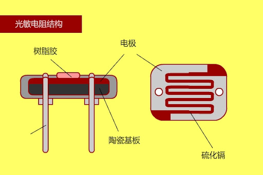
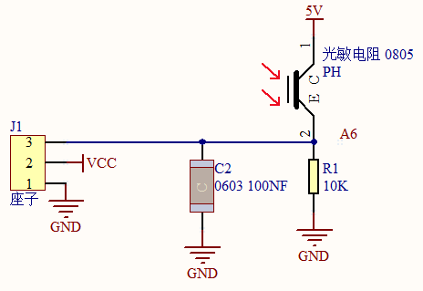
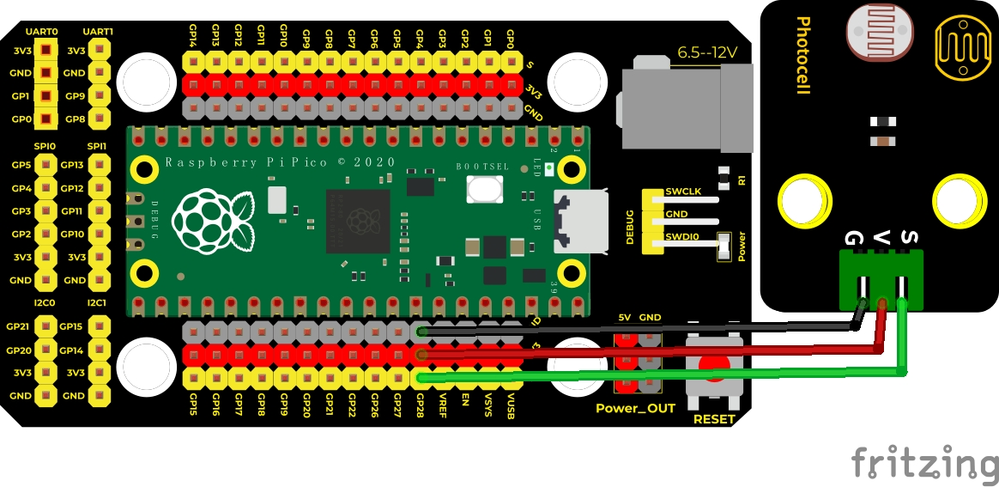
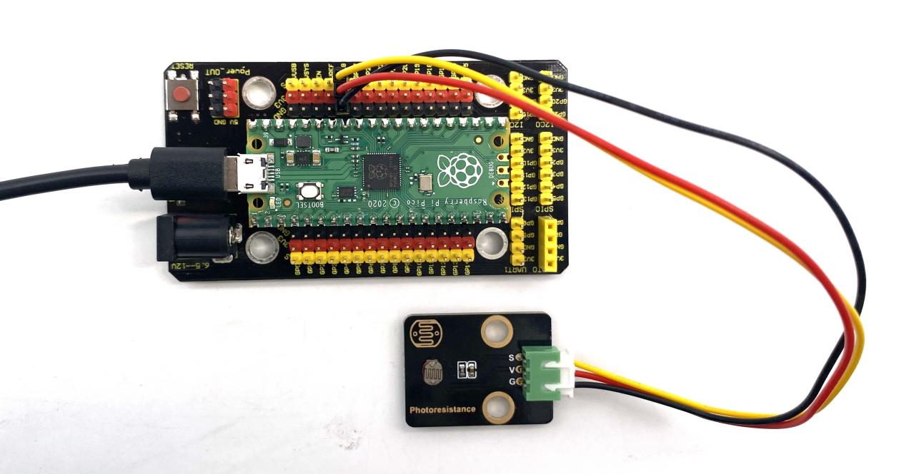
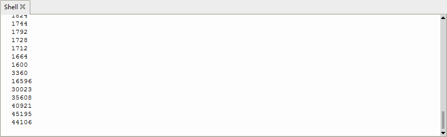

## 实验十三 光敏电阻传感器



### 🌟 项目简介  
本实验将带你认识一个“会感知光线的小帮手”——光敏电阻传感器！它就像我们的眼睛一样，能分辨环境是明亮还是黑暗。当光线变强时，它的“身体”（电阻值）会变小；光线变弱时，“身体”就会变大。我们用 Raspberry Pi Pico 把这种变化读出来，并在电脑屏幕上实时显示数字，让看不见的光变成看得见的数值！

---

### 🔍 工作原理  
光敏电阻是一种特殊材料做的电阻，它的阻值会随着光照强度**自动变化**：  
- 🌙 黑暗环境 → 电阻很大（约 200kΩ～2MΩ）→ 分压后信号端电压**较低** → ADC 读数**较小**  
- ☀️ 明亮环境 → 电阻变小（可低至几kΩ）→ 分压后信号端电压**升高** → ADC 读数**较大**  

⚠️ 注意：原说明中“光照越强，电压越来越小”有误！实际电路为分压结构（光敏电阻与固定电阻串联），光敏电阻阻值减小时，其两端电压降低，但**信号端（接Pico ADC引脚）采集的是另一端电压**——即固定电阻上的电压，因此**光照越强，ADC读数越大**。下图清楚展示了正确连接方式：



---

### 🧰 所需材料  

|  |  |  |  |  |
|--------------------------------------------------------------------------|------------------------------------------------------------------|-------------------------------------------------------|----------------------------------------------------------------------|------------------------------------------------------|
| Raspberry Pi Pico板 ×1                                                   | Raspberry Pi Pico扩展板 ×1                                       | Keyes DIY电子积木 光敏电阻传感器 ×1                   | 防反插3Pin杜邦线（公对母）×1                                          | MicroUSB数据线 ×1                                    |

✅ 小提示：扩展板让接线更整齐安全，新手强烈推荐使用！

---

### 🔌 接线说明  

请按以下方式连接（与接线图一致）：  
- 光敏电阻传感器 **“-” 端（GND）** → 扩展板或Pico的 **GND 引脚**  
- 光敏电阻传感器 **“+” 端（VCC）** → 扩展板或Pico的 **VSYS 或 3.3V 引脚**（建议用 VSYS，供电更稳）  
- 光敏电阻传感器 **“S” 端（信号）** → 扩展板或Pico的 **ADC2 引脚（即 GPIO28）**  

📌 关键提醒：Pico 的 ADC2 对应物理引脚是 **GPIO28**，MicroPython 中写作 `machine.ADC(28)`，这是唯一支持模拟输入的引脚之一（其他ADC通道在Pico上不可用或已被占用）。

****

---

### 💻 示例代码（MicroPython）

```python
# Keyes Starter Kit for Raspberry Pi Pico
# 实验13：光敏电阻传感器
# 功能：实时读取环境光强度，并在Shell中打印数值（0~65535）

import machine
import utime

# 创建ADC对象，使用GPIO28（即ADC2通道）
photoresistance = machine.ADC(28)

print("🌟 光敏电阻实验启动！")
print("💡 请观察Shell中的数值变化：")
print("   数值小 = 光线弱｜数值大 = 光线强")
print("-" * 40)

while True:
    value = photoresistance.read_u16()  # 读取16位ADC值（范围：0～65535）
    print("当前光强值：", value)
    utime.sleep(0.1)  # 每0.1秒刷新一次，避免刷屏太快
```

---

### 📚 代码解析  

| 代码行 | 说明 |
|--------|------|
| `machine.ADC(28)` | 告诉Pico：“我要用28号引脚来读模拟信号！”（注意：不是ADC(2)，Pico中直接写引脚编号） |
| `read_u16()` | 读取16位无符号整数，返回 **0～65535** 的数值，比旧版`read()`更精准、更常用 |
| `utime.sleep(0.1)` | 暂停0.1秒，让数据显示节奏舒服，也减轻Pico负担 |

✅ 小知识：`read_u16()` 返回的是原始ADC值，不经过校准，但已足够反映相对光照变化，非常适合初学者直观理解！

---

### ✅ 实验现象  

接好线路、烧录代码后，打开 Thonny 的 Shell（或串口监视器），你会看到类似这样的滚动数字：

```
🌟 光敏电阻实验启动！
💡 请观察Shell中的数值变化：
   数值小 = 光线弱｜数值大 = 光线强
----------------------------------------
当前光强值： 12045
当前光强值： 12051
当前光强值： 12048
...
```

- 🌙 用手遮住传感器 → 数值明显**变小**（如降到 5000 以下）  
- ☀️ 用手电筒照一下 → 数值**迅速变大**（可达 50000+）  
- 🪞 对着台灯/窗户 → 数值平稳在中间范围（如 20000～40000）





---

### ⚠️ 注意事项  

1. **别接错引脚！** S端必须接 GPIO28（ADC2），接错将无法读取有效数据；  
2. **VCC推荐接VSYS**（非3.3V）：因光敏电阻工作电流略大，VSYS供电更稳定，避免3.3V电源波动影响读数；  
3. **远离强干扰源**：如手机、开关电源、电机等，它们可能引入噪声，导致数值跳动；  
4. **传感器勿长时间暴晒**：高温可能影响元件寿命，实验结束后可收好；  
5. **首次运行前请确认：**  
   - Pico已通过USB接入电脑并被识别为“RPI-RP2”盘符；  
   - Thonny中解释器已选择“MicroPython (Raspberry Pi Pico)”；  
   - 代码已点击“运行”按钮（▶️）。

---

### 🧠 扩展思维  
在本课 LED 闪烁的基础上，如果想让它**随光线变亮变暗（呼吸灯效果）**，该怎么做？