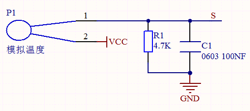
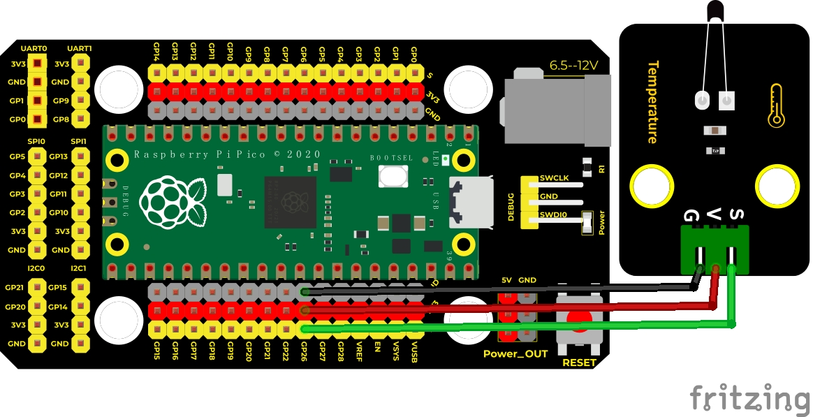
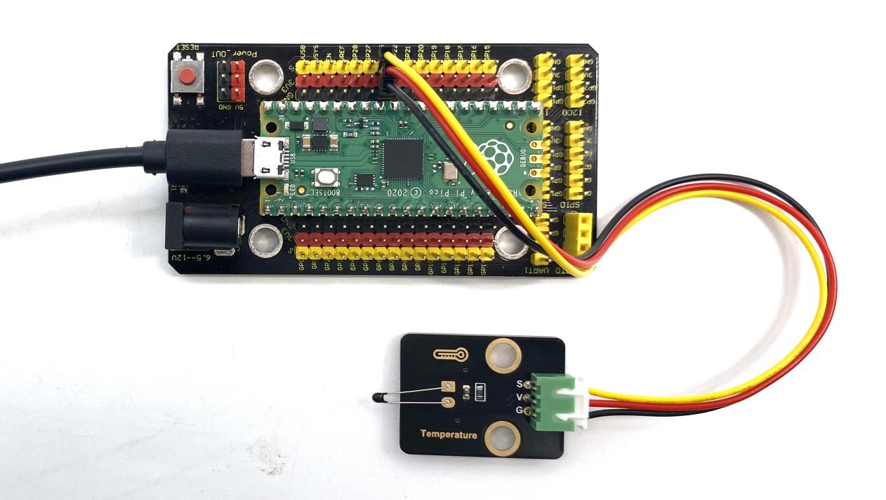
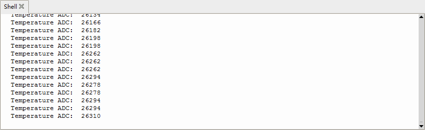

## 实验十四 NTC-MF52AT模拟温度传感器


### 🌟 项目简介  
本实验带你认识一种常见的温度感知元件——NTC热敏电阻（型号MF52AT）。它就像一个“怕热的电阻”：温度升高时，它的阻值会明显变小；温度降低时，阻值又会变大。我们将它接入树莓派Pico的模拟输入口，读取电压变化对应的数字值，直观感受环境温度的变化！不需要复杂公式，也能轻松“看见”冷热。

---

### 🔍 工作原理  
  
这个模块内部使用的是 **NTC-MF52AT 热敏电阻**，它和一个固定电阻组成简单的分压电路（如下图所示）：  

当温度上升 → 热敏电阻阻值下降 → 分压点（信号端S）电压升高 → Pico的ADC读数变大  
当温度下降 → 热敏电阻阻值上升 → 分压点电压降低 → Pico的ADC读数变小  

所以，我们虽然没直接显示“XX℃”，但通过观察ADC数值的升降，就能准确判断：现在是变热了，还是变凉了！

> 💡 小知识：NTC 是 “Negative Temperature Coefficient”（负温度系数）的缩写，意思是“温度越高，电阻越小”。

---

### 🧰 所需材料  

|  |  |  |  |  |
|--------------------------------------------------------------------------|------------------------------------------------------------------|-------------------------------------------------------|----------------------------------------------------------------------|------------------------------------------------------|
| Raspberry Pi Pico板 ×1                                                   | Raspberry Pi Pico扩展板 ×1                                       | Keyes DIY电子积木 NTC-MF52AT模拟温度传感器 ×1         | 防反插3Pin杜邦线（公对母）×3                                          | Micro USB数据线 ×1                                   |

✅ 提示：传感器模块背面印有 “+ - S”，分别对应电源正极、地、信号输出，请务必按标识接线！

---

### 🔌 接线说明  

****  

请按以下方式连接（以Pico引脚编号为准）：  
- 传感器 **“+” 引脚** → Pico 的 **VSYS 或 3V3（OUT）引脚**（推荐接 3V3，更稳定）  
- 传感器 **“–” 引脚** → Pico 的 **GND 引脚**  
- 传感器 **“S” 引脚** → Pico 的 **ADC0 引脚（即 GPIO26）**  

📌 注意：  
- Pico 的 ADC 只支持 **GPIO26、GPIO27、GPIO28** 三个引脚，本实验固定使用 **GPIO26（ADC0）**；  
- 不要接到其他GPIO，否则无法读取模拟值；  
- 所有GND必须共地（传感器GND、Pico GND连在一起）。

---

### 💻 示例代码（MicroPython）

```python
# Keyes Starter Kit for Raspberry Pi Pico
# 实验十四：NTC-MF52AT模拟温度传感器
# 功能：持续读取ADC值，并在Shell中打印

import machine
import utime

# 创建ADC对象，使用GPIO26（即ADC0）
sensor = machine.ADC(26)

print("【NTC温度传感器已启动】")
print("正在读取ADC值…（数值越大，表示温度越高）")
print("-" * 40)

while True:
    # 读取16位ADC原始值（范围：0 ~ 65535）
    adc_value = sensor.read_u16()
    
    # 打印结果，便于观察变化
    print("当前ADC值：", adc_value)
    
    # 每0.1秒读取一次，避免刷屏太快
    utime.sleep(0.1)
```

---

### 📝 代码解析  

| 代码行 | 说明 |
|--------|------|
| `sensor = machine.ADC(26)` | 告诉Pico：我要用 **GPIO26引脚** 当作模拟输入口来读电压 |
| `adc_value = sensor.read_u16()` | 从传感器获取一个 **0~65535之间的整数**，数值越大，说明S端电压越高，当前温度越高 |
| `print("当前ADC值：", adc_value)` | 把数字显示在Thonny下方的Shell窗口里，方便你实时观察 |
| `utime.sleep(0.1)` | 暂停0.1秒，让数据显示节奏合适，也减轻Pico负担 |

✅ 小技巧：用手捂住传感器几秒钟，再松开，观察ADC值是否先快速上升、再缓慢下降——这就是你在“亲手测量温度变化”！

---

### ✅ 实验现象  

运行代码后，在Thonny编辑器下方的 **Shell窗口** 中，你会看到类似这样的滚动数字：  
```
【NTC温度传感器已启动】  
正在读取ADC值…（数值越大，表示温度越高）  
----------------------------------------  
当前ADC值： 32410  
当前ADC值： 32415  
当前ADC值： 32422  
...
```

- ❗ 室温下（约25℃），典型ADC值在 **30000 ~ 35000** 之间（因批次和环境略有差异）；  
- 👐 用手握住传感器：数值会 **明显上升（+1000 ~ +3000）**；  
- ❄️ 把传感器靠近冰水或风扇口：数值会 **明显下降**；  
- 📈 数值连续、平滑变化，说明传感器工作正常！

  


---

### ⚠️ 注意事项  

1. **别接错电源！**  
   - 传感器标有“+”的引脚只能接 **3V3 或 VSYS**，**严禁接5V或VBUS**（Pico不支持5V模拟输入，可能损坏芯片）；  
2. **GND必须共地**：传感器“–”、Pico GND、扩展板GND三者要连通；  
3. **勿弯折传感器引脚**：NTC元件玻璃封装较脆，反复弯折易断裂；  
4. **远离高温源**：该传感器额定工作温度为 -40℃ ~ +125℃，但日常实验请勿靠近打火机、电烙铁等；  
5. **首次运行无反应？**  
   - 检查USB是否插稳、Thonny是否已正确选择Pico端口；  
   - 检查杜邦线是否松动，特别是“S”是否真的接到GPIO26（不是GPIO27或28）；  
   - 尝试重启Pico（拔插USB线）或点击Thonny的 ▶️ 运行按钮。

---

### 🧠 扩展思维  
在本课ADC值实时监测的基础上，如果想让板载LED（如GPIO25）在温度超过30℃时自动亮起，该怎样修改代码？